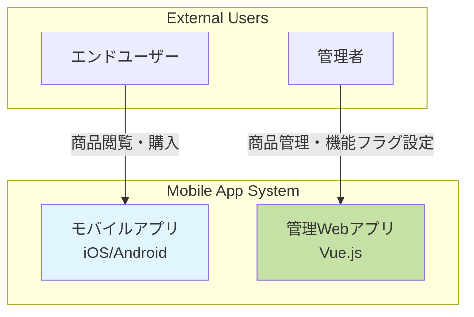
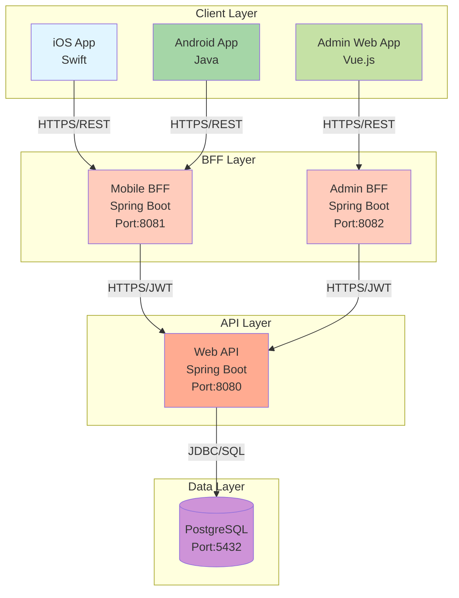
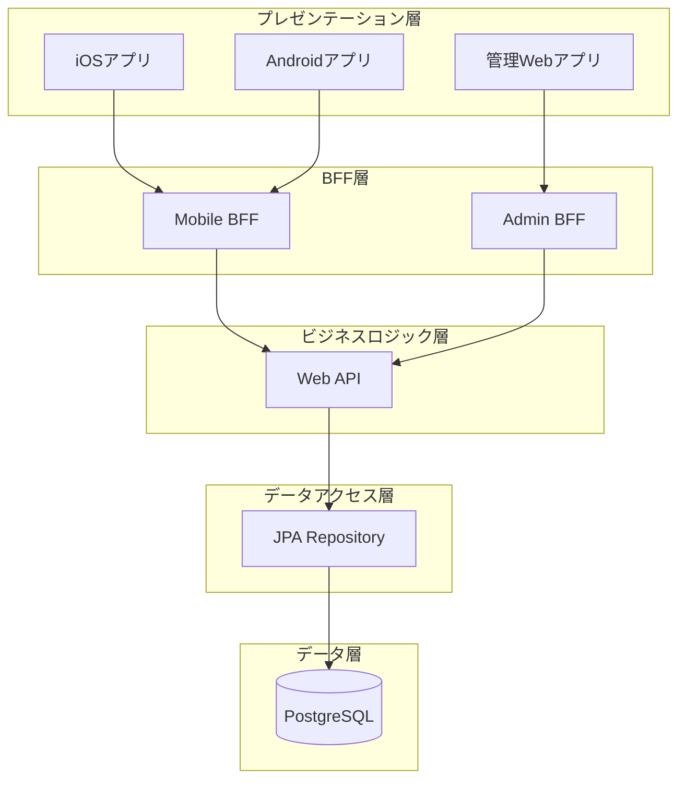
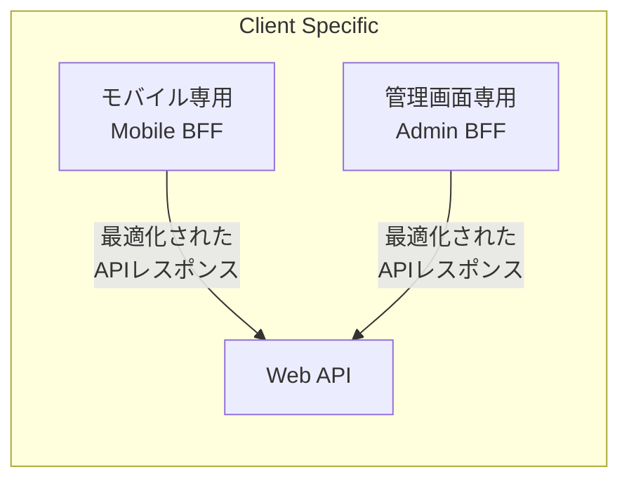
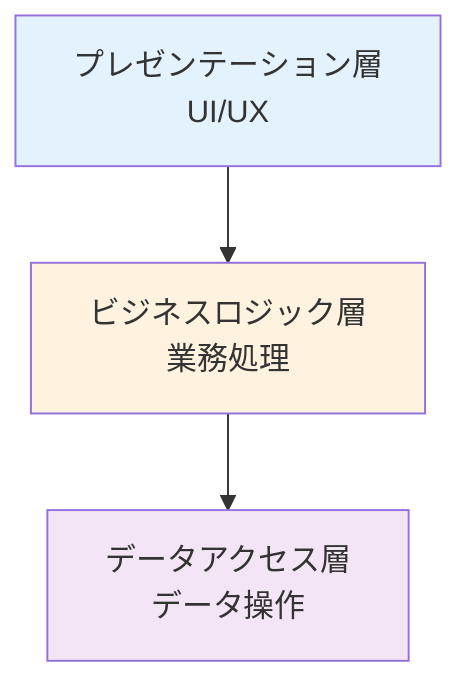
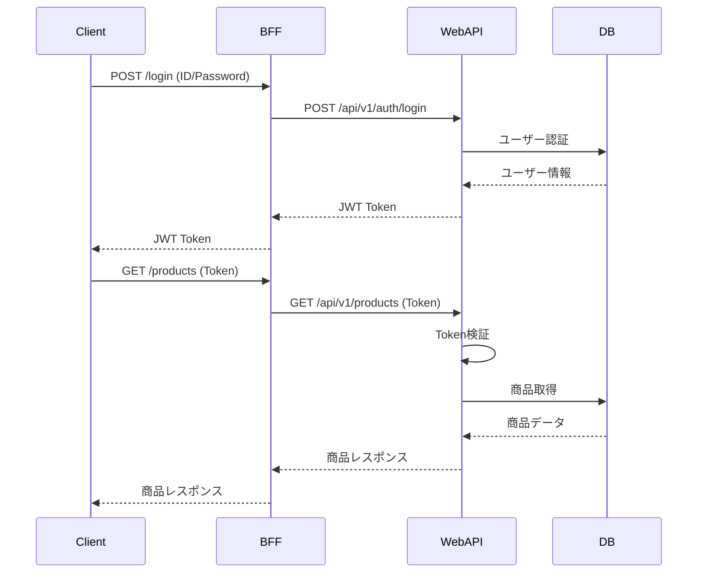
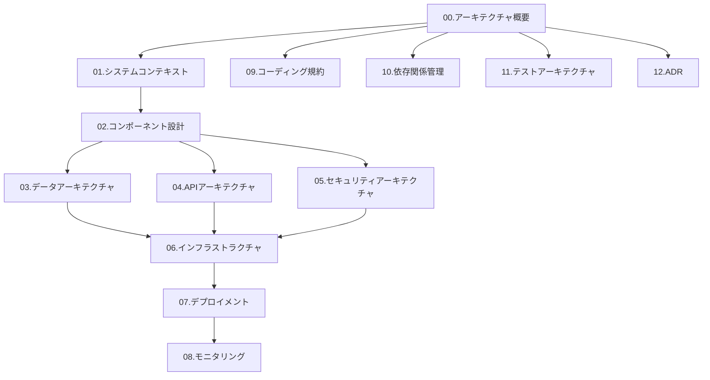

# アーキテクチャ概要

> 最終更新: 2025-01-08  
> ステータス: Draft  
> バージョン: 1.0

## 変更履歴

| バージョン | 日付 | 変更内容 | 関連機能 |
|-----------|------|---------|---------|
| 1.0 | 2025-01-08 | 初版作成 | mobile-app-system |

---

## 1. ドキュメント概要

本ドキュメントは、mobile-app-system のアーキテクチャ全体像を示すマスタードキュメントです。
システムの設計原則、技術スタック、主要コンポーネント、アーキテクチャパターンを定義します。

## 2. システム概要

### 2.1 システムの目的

mobile-app-system は、商品販売を行うネイティブモバイルアプリケーション（iOS/Android）と、そのアプリケーションを管理する管理者用Webアプリケーションから構成されるデモンストレーション用システムです。

**主要目的**:
- エンドユーザーが商品を検索・購入できるモバイルアプリケーションの提供
- 管理者が商品情報とアプリ機能を管理できるWebアプリケーションの提供
- BFFパターンとマイクロサービスアーキテクチャのベストプラクティスの実証
- 機能フラグによる段階的機能リリースの実現

### 2.2 システムの特徴

| 特徴 | 説明 |
|-----|------|
| **BFFパターン採用** | フロントエンド専用のバックエンドAPIを提供 |
| **マイクロサービス** | 疎結合なコンポーネント構成 |
| **JWT認証** | トークンベースの認証・認可 |
| **機能フラグ** | ユーザー単位での機能制御 |
| **デモ用途** | 実運用は想定しない |

## 3. アーキテクチャ全体像

### 3.1 システムコンテキスト図（C4モデル Level 1）

### 3.2 コンテナ図（C4モデル Level 2）

### 3.3 レイヤー構成

## 4. 技術スタック

### 4.1 技術スタックサマリー

| カテゴリ | 技術 | バージョン | 説明 |
|---------|------|----------|------|
| **モバイル（iOS）** | Swift | latest | iOSネイティブアプリ |
| **モバイル（Android）** | Java | latest | Androidネイティブアプリ |
| **モバイルBFF** | Java Spring Boot | latest | モバイル向けBFF |
| **管理Web（Frontend）** | Vue.js | latest | 管理画面SPA |
| **管理BFF** | Java Spring Boot | latest | 管理画面向けBFF |
| **Web API** | Java Spring Boot | latest | ビジネスロジック層 |
| **データベース** | PostgreSQL | latest | RDBMS |
| **認証** | JWT | - | トークンベース認証 |
| **開発環境（Web）** | DevContainer | - | Docker開発環境 |
| **IDE（iOS）** | Xcode | latest | iOS開発環境 |
| **IDE（Android）** | Android Studio | latest | Android開発環境 |

### 4.2 言語・フレームワークバージョン

#### Java（Spring Boot）
- **言語**: Java latest
- **フレームワーク**: Spring Boot latest
- **依存ライブラリ**:
  - Spring Web
  - Spring Data JPA
  - Spring Security
  - JWT Library (jjwt)
  - PostgreSQL JDBC Driver
  - Lombok（オプション）
  - Validation

#### Swift（iOS）
- **言語**: Swift latest
- **最小OS**: iOS 15.0
- **アーキテクチャ**: MVVM（推奨）
- **主要ライブラリ**:
  - Alamofire（HTTPクライアント）
  - KeychainSwift（セキュアストレージ）

#### Java（Android）
- **言語**: Java latest
- **最小API**: Android 10.0（API 29）
- **アーキテクチャ**: MVVM（推奨）
- **主要ライブラリ**:
  - Retrofit（HTTPクライアント）
  - OkHttp（HTTPクライアント基盤）
  - EncryptedSharedPreferences（セキュアストレージ）

#### Vue.js（管理Web）
- **言語**: JavaScript
- **フレームワーク**: Vue.js latest
- **主要ライブラリ**:
  - Vue Router（ルーティング）
  - Axios（HTTPクライアント）
  - Vuex または Pinia（状態管理）
  - ESLint（静的解析）

### 4.3 インフラストラクチャ

| コンポーネント | 技術 | 用途 |
|--------------|------|------|
| コンテナ | Docker | アプリケーション実行環境 |
| 開発環境 | DevContainer | Web開発環境 |
| データベース | Docker PostgreSQL | データ永続化 |
| ネットワーク | Docker Compose Network | コンテナ間通信 |

## 5. アーキテクチャパターン

### 5.1 BFF（Backend For Frontend）パターン

**BFFパターンの利点**:
- クライアントごとに最適化されたAPI提供
- フロントエンドとバックエンドの疎結合
- Web APIの変更がクライアントに直接影響しない
- クライアント固有のロジックをBFFに集約

**責務分離**:
- **BFF**: クライアント最適化、エラーハンドリング、リクエスト中継
- **Web API**: ビジネスロジック、データアクセス、認証・認可

### 5.2 3層アーキテクチャ

| 層 | 責務 | 実装 |
|---|-----|------|
| **プレゼンテーション層** | UI/UX、ユーザー入力受付 | iOS/Android/Vue.js |
| **ビジネスロジック層** | 業務ロジック、認証・認可 | Spring Boot Web API |
| **データアクセス層** | CRUD操作、トランザクション管理 | Spring Data JPA |

### 5.3 マイクロサービスアーキテクチャ

**サービス分割**:
- **Mobile BFF**: モバイルアプリ専用サービス（Port: 8081）
- **Admin BFF**: 管理Webアプリ専用サービス（Port: 8082）
- **Web API**: ビジネスロジック共通サービス（Port: 8080）

**サービス間通信**:
- プロトコル: HTTPS/REST
- データ形式: JSON
- 認証: JWT Bearer Token

### 5.4 JWT認証パターン

## 6. 設計原則

### 6.1 SOLID原則

| 原則 | 説明 | 適用例 |
|-----|------|-------|
| **S**ingle Responsibility | 単一責任の原則 | 各クラスは1つの責務のみを持つ |
| **O**pen/Closed | オープン・クローズドの原則 | 拡張に開いて、修正に閉じている |
| **L**iskov Substitution | リスコフの置換原則 | 派生クラスは基底クラスと置換可能 |
| **I**nterface Segregation | インターフェース分離の原則 | クライアントは不要なメソッドに依存しない |
| **D**ependency Inversion | 依存性逆転の原則 | 抽象に依存し、具象に依存しない |

### 6.2 DRY（Don't Repeat Yourself）

- コードの重複を避ける
- 共通処理はユーティリティクラスに集約
- ビジネスロジックの重複排除

### 6.3 疎結合・高凝集

- **疎結合**: コンポーネント間の依存を最小化
- **高凝集**: 関連する機能を1つのコンポーネントに集約

### 6.4 関心の分離（Separation of Concerns）

- プレゼンテーション、ビジネスロジック、データアクセスを分離
- 各層の責務を明確に定義
- 層をまたがる依存を最小化

## 7. アーキテクチャ上の制約

### 7.1 技術的制約

| ID | 制約 | 理由 | 影響 |
|----|-----|------|------|
| AC-001 | Spring Boot必須 | 標準化のため | Java最新版使用 |
| AC-002 | PostgreSQL単一DB | デモ用途 | スケーリング制限 |
| AC-003 | JWT認証必須 | セキュリティ要件 | セッション管理方式は使用不可 |
| AC-004 | BFFパターン必須 | アーキテクチャ要件 | クライアントから直接Web APIアクセス不可 |
| AC-005 | DevContainer（Web） | 開発環境統一 | Webコンポーネントのみ |

### 7.2 非機能的制約

| ID | 制約 | 理由 |
|----|-----|------|
| AC-010 | 同時接続100ユーザー以下 | デモ用途 |
| AC-011 | API応答時間3秒以内 | パフォーマンス要件 |
| AC-012 | ログ保持30日 | ストレージ制限 |
| AC-013 | 高可用性構成なし | デモ用途 |

## 8. アーキテクチャドキュメント構成

### 8.1 ドキュメント一覧

| No | ドキュメント | 概要 |
|----|------------|------|
| 00 | **アーキテクチャ概要**（本ドキュメント） | 全体像・設計原則 |
| 01 | システムコンテキスト | システムコンテキスト図・外部連携 |
| 02 | コンポーネント設計 | 各コンポーネントの詳細設計 |
| 03 | データアーキテクチャ | データモデル・DB設計 |
| 04 | APIアーキテクチャ | API設計・REST原則 |
| 05 | セキュリティアーキテクチャ | 認証・認可・セキュリティ対策 |
| 06 | インフラストラクチャ | DevContainer・Docker・DB環境 |
| 07 | デプロイメント | デプロイメント戦略 |
| 08 | モニタリング | ログ・監視・可観測性 |
| 09 | コーディング規約 | 言語別コーディング標準 |
| 10 | 依存関係管理 | ライブラリ・フレームワーク管理 |
| 11 | テストアーキテクチャ | テスト戦略・テストパターン |
| 12 | ADR | Architecture Decision Records |

### 8.2 ドキュメント読解順序

**推奨読解順序**:
1. **初学者**: 00 → 01 → 02 → 06 → 09
2. **開発者**: 00 → 02 → 03 → 04 → 09 → 10
3. **アーキテクト**: 全ドキュメント
4. **セキュリティ担当**: 00 → 05 → 08

## 9. アーキテクチャ品質属性

### 9.1 品質属性優先順位

| 品質属性 | 優先度 | 目標値 | 説明 |
|---------|-------|-------|------|
| **セキュリティ** | 高 | OWASP Top 10対策 | JWT認証、入力検証 |
| **保守性** | 高 | コード品質維持 | コーディング規約遵守 |
| **テスタビリティ** | 中 | テストパターン文書化 | 自動テスト不要 |
| **パフォーマンス** | 中 | API応答3秒以内 | デモ用途のため緩い基準 |
| **可用性** | 低 | 規定なし | デモ用途 |
| **スケーラビリティ** | 低 | 同時100ユーザー | デモ用途 |

### 9.2 アーキテクチャトレードオフ

| トレードオフ | 選択 | 理由 |
|------------|------|------|
| パフォーマンス vs 保守性 | **保守性** | デモ用途のため可読性重視 |
| スケーラビリティ vs シンプルさ | **シンプルさ** | 単一DB構成 |
| 柔軟性 vs 標準化 | **標準化** | Spring Boot統一 |
| 機能豊富 vs セキュリティ | **セキュリティ** | 最小限の機能に絞る |

## 10. 参照ドキュメント

### 10.1 内部ドキュメント

| ドキュメント | パス |
|------------|------|
| 機能仕様書 | `/docs/specs/mobile-app-system/` |
| 元仕様 | `/docs/init.md` |
| アーキテクチャドキュメント | `/docs/architecture/` |

### 10.2 外部参照

| 資料 | URL |
|------|-----|
| Spring Boot公式 | https://spring.io/projects/spring-boot |
| Vue.js公式 | https://vuejs.org/ |
| PostgreSQL公式 | https://www.postgresql.org/ |
| OWASP Top 10 | https://owasp.org/www-project-top-ten/ |
| C4モデル | https://c4model.com/ |

## 11. 用語集

| 用語 | 定義 |
|-----|------|
| **BFF** | Backend For Frontend - フロントエンド専用のバックエンドAPI |
| **JWT** | JSON Web Token - トークンベースの認証方式 |
| **DevContainer** | Docker上で動作する開発環境 |
| **機能フラグ** | Feature Flag - 特定機能のON/OFF制御機構 |
| **C4モデル** | コンテキスト、コンテナ、コンポーネント、コードの4層モデル |

詳細は `/docs/specs/mobile-app-system/09-glossary.md` を参照

---

**End of Document**
