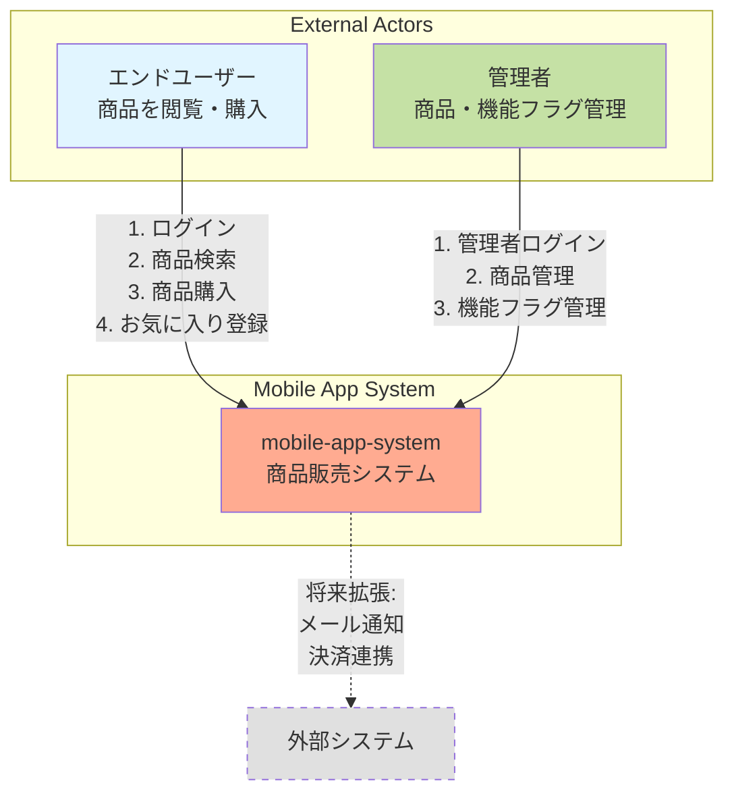
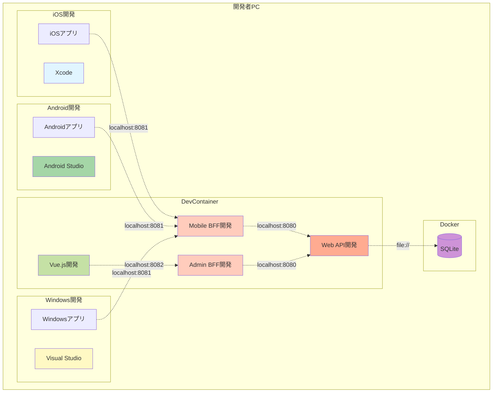
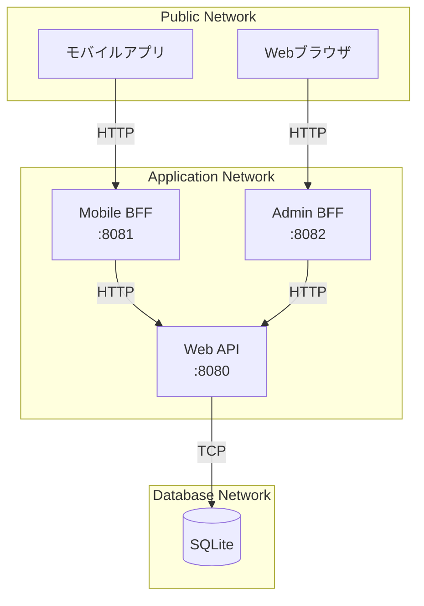
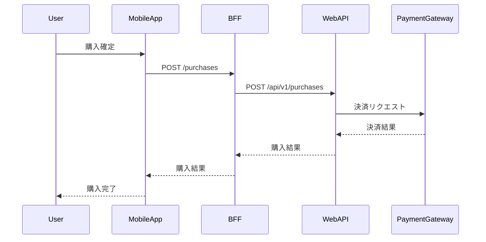
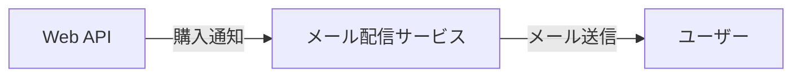
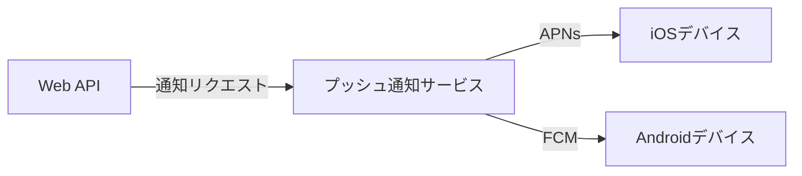
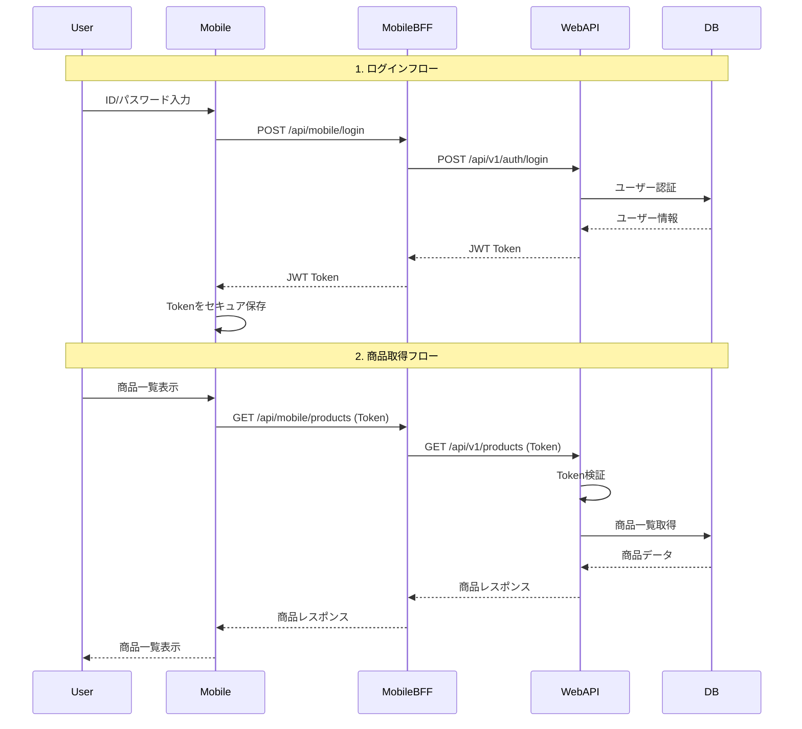
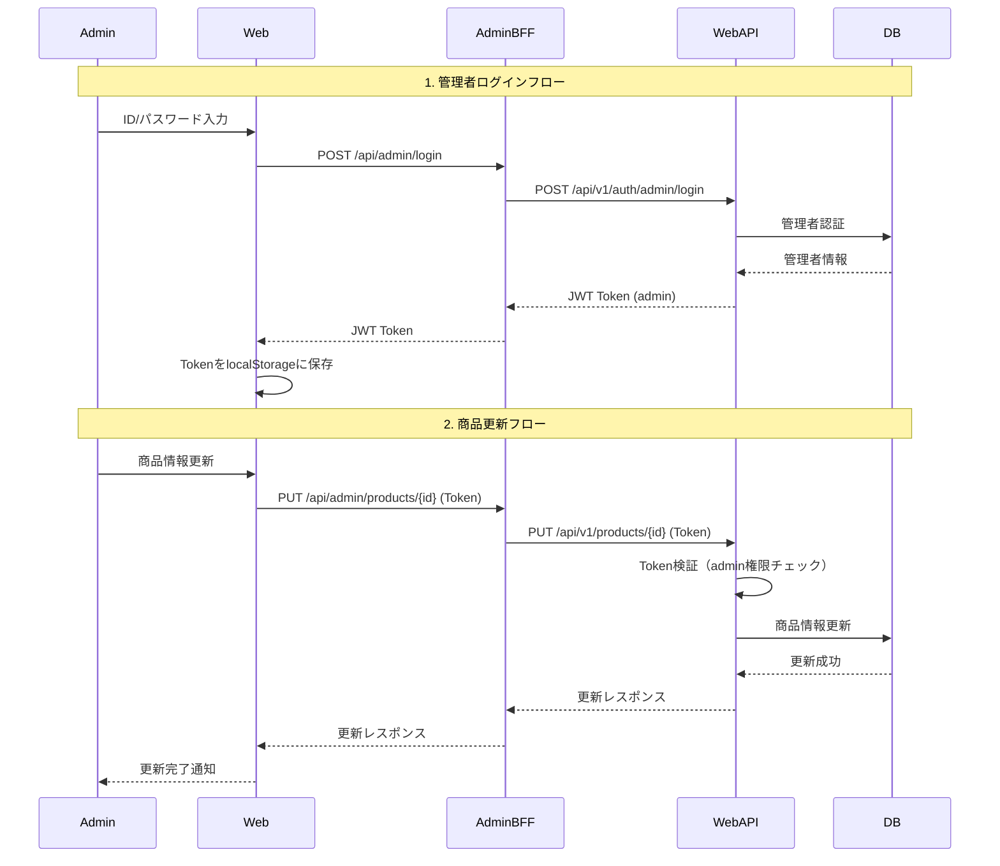
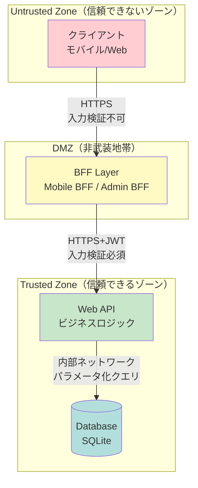
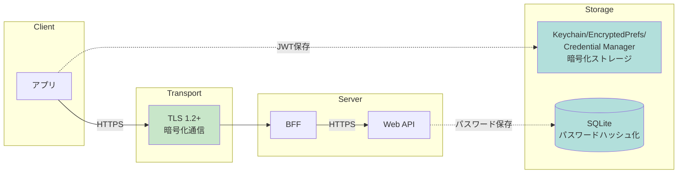

# システムコンテキスト

> 最終更新: 2025-01-08  
> ステータス: Draft  
> バージョン: 1.0

## 変更履歴

| バージョン | 日付 | 変更内容 | 関連機能 |
|-----------|------|---------|---------|
| 1.0 | 2025-01-08 | 初版作成 | mobile-app-system |

---

## 1. システムコンテキスト概要

本ドキュメントでは、mobile-app-system のシステムコンテキストを定義します。
システムの境界、外部アクター、外部システムとの連携を明確にします。

## 2. システムコンテキスト図（C4モデル Level 1）

### 2.1 全体コンテキスト図

### 2.2 システム境界

**システム内**（In Scope）:
- モバイルアプリ（iOS/Android/Windows）
- 管理Webアプリ（Vue.js）
- Mobile BFF（Spring Boot）
- Admin BFF（Spring Boot）
- Web API（Spring Boot）
- SQLiteデータベース

**システム外**（Out of Scope）:
- 決済システム
- メール配信システム
- プッシュ通知サービス
- 外部認証プロバイダ（OAuth等）

## 3. アクター定義

### 3.1 エンドユーザー

**役割**: 商品を検索・閲覧・購入するモバイルアプリ利用者

| 項目 | 詳細 |
|------|------|
| **ユーザー数** | 想定100ユーザー（デモ用途） |
| **利用デバイス** | iOS端末、Android端末、Windows PC |
| **認証方式** | ID/パスワード認証（JWT） |
| **権限** | 商品閲覧・購入・お気に入り機能のみ |
| **利用場所** | 任意（インターネット接続環境） |
| **利用時間** | 任意 |

**主要ユースケース**:
1. ログイン
2. 商品一覧表示
3. 商品検索
4. 商品詳細表示
5. 商品購入（100個単位）
6. お気に入り登録/解除（機能フラグでON/OFF）
7. お気に入り一覧表示

### 3.2 管理者

**役割**: 商品情報とアプリ機能を管理する管理者

| 項目 | 詳細 |
|------|------|
| **ユーザー数** | 想定1-5ユーザー |
| **利用デバイス** | PC（Webブラウザ） |
| **認証方式** | 管理者専用ID/パスワード認証（JWT） |
| **権限** | 商品管理・機能フラグ管理のみ |
| **利用場所** | オフィス（社内ネットワーク想定） |
| **利用時間** | 業務時間内 |

**主要ユースケース**:
1. 管理者ログイン
2. 商品一覧表示
3. 商品情報更新（名前・単価）
4. ユーザー一覧表示
5. ユーザー別機能フラグ設定

## 4. システム構成

### 4.1 物理配置図（開発環境）

### 4.2 ネットワーク構成

#### 開発環境ポート一覧

| コンポーネント | ホスト | ポート | プロトコル | アクセス元 |
|--------------|------|-------|----------|----------|
| SQLite | localhost | - | ファイルアクセス | Web API |
| Web API | localhost | 8080 | HTTP | BFF |
| Mobile BFF | localhost | 8081 | HTTP | モバイルアプリ / Windowsアプリ |
| Admin BFF | localhost | 8082 | HTTP | 管理Webアプリ |
| 管理Web（開発サーバー） | localhost | 3000 | HTTP | ブラウザ |

#### ネットワークセグメント

## 5. 外部連携

### 5.1 現在の外部連携（なし）

本システムは、現時点で外部システムとの連携はありません。
すべての機能は内部で完結します。

### 5.2 将来の外部連携候補（Out of Scope）

以下は将来拡張の可能性がある外部連携です（現在は実装しません）：

#### 5.2.1 決済システム連携

**連携候補**:
- Stripe
- PayPal
- Square

**理由**: デモ用途のため、決済連携は不要

---

#### 5.2.2 メール通知連携

**連携候補**:
- SendGrid
- Amazon SES
- Mailgun

**理由**: デモ用途のため、メール通知は不要

---

#### 5.2.3 プッシュ通知連携

**連携候補**:
- Firebase Cloud Messaging（FCM）
- Apple Push Notification service（APNs）

**理由**: デモ用途のため、プッシュ通知は不要

## 6. データフロー

### 6.1 エンドユーザーのデータフロー

### 6.2 管理者のデータフロー

## 7. セキュリティ境界

### 7.1 信頼境界

### 7.2 認証・認可の境界

| ゾーン | 認証 | 認可 | 検証 |
|-------|-----|------|------|
| **クライアント** | なし | なし | クライアント側バリデーション（UX向上） |
| **BFF** | JWT転送 | なし | エラーハンドリング |
| **Web API** | JWT検証 ✅ | ロールベース権限チェック ✅ | サーバー側バリデーション ✅ |
| **Database** | アプリケーション認証 | なし | DB制約チェック |

### 7.3 データ暗号化ポイント

## 8. 非機能要件の文脈

### 8.1 パフォーマンス要件

| 項目 | 要件 | 測定ポイント |
|------|------|------------|
| API応答時間 | 3秒以内 | BFF → Web API → DB |
| 画面表示時間 | 3秒以内 | クライアント → BFF → Web API |
| 同時接続ユーザー | 100ユーザー | Web API |
| DBコネクションプール | 1接続（SQLite） | Web API → DB |

### 8.2 スケーラビリティ制約

**水平スケーリング**: 非対応（デモ用途）
**垂直スケーリング**: 非対応（デモ用途）

**理由**: デモンストレーション用途のため、スケーリングは考慮しない

### 8.3 可用性制約

**稼働率**: 規定なし（デモ用途）
**冗長化**: なし
**バックアップ**: 手動

**理由**: デモンストレーション用途のため、高可用性構成は不要

## 9. システム間インターフェース

### 9.1 プロトコル一覧

| インターフェース | プロトコル | データ形式 | 認証 |
|---------------|----------|----------|------|
| モバイルアプリ / Windowsアプリ ↔ Mobile BFF | HTTPS/REST | JSON | JWT（ログイン後） |
| 管理Webアプリ ↔ Admin BFF | HTTPS/REST | JSON | JWT（ログイン後） |
| BFF ↔ Web API | HTTPS/REST | JSON | JWT転送 |
| Web API ↔ SQLite | JDBC/ファイル | SQL | 不要（ファイルベース） |

### 9.2 API バージョニング戦略

**現状**: バージョニングなし（v1固定）
**理由**: デモ用途のため、APIバージョン管理は不要

**将来拡張時の推奨**:
- URL パス方式: `/api/v1/products`, `/api/v2/products`
- ヘッダー方式: `Accept: application/vnd.api.v1+json`

## 10. 環境定義

### 10.1 環境一覧

| 環境 | 用途 | ホスティング | データベース |
|------|------|------------|------------|
| **開発環境（Local）** | 開発・デバッグ | localhost / DevContainer | SQLite（ファイルベース） |
| **本番環境** | デモ実行 | TBD（現在未定義） | TBD |

### 10.2 環境ごとの設定

#### 開発環境

| 項目 | 設定値 |
|------|-------|
| Web API | `http://localhost:8080` |
| Mobile BFF | `http://localhost:8081` |
| Admin BFF | `http://localhost:8082` |
| SQLite | `./data/mobile_app.db` |
| DB名 | `mobile_app_db` |
| ログレベル | DEBUG |

#### 本番環境（未定義）

| 項目 | 設定値 |
|------|-------|
| Web API | TBD |
| Mobile BFF | TBD |
| Admin BFF | TBD |
| SQLite | TBD |
| DB名 | TBD |
| ログレベル | INFO |

## 11. 参照ドキュメント

| ドキュメント | パス |
|------------|------|
| アーキテクチャ概要 | `00-overview.md` |
| コンポーネント設計 | `02-component-design.md` |
| セキュリティアーキテクチャ | `05-security-architecture.md` |
| 機能要件 | `/docs/specs/mobile-app-system/02-functional-requirements.md` |
| 非機能要件 | `/docs/specs/mobile-app-system/03-non-functional-requirements.md` |

---

**End of Document**
