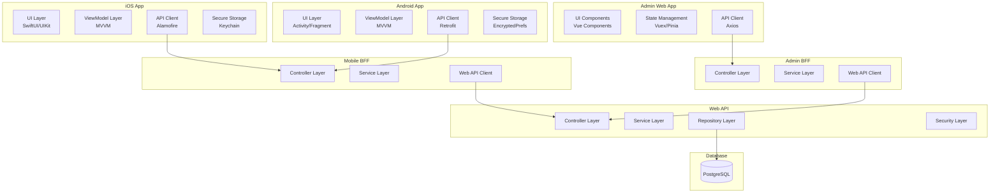
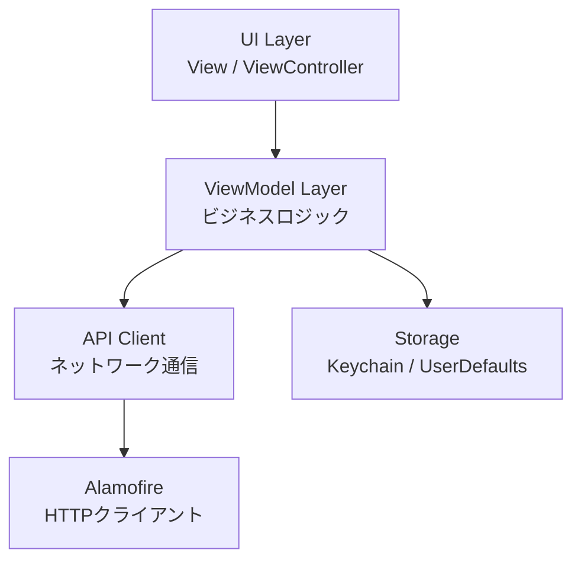
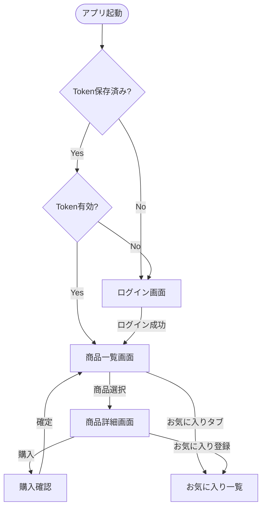
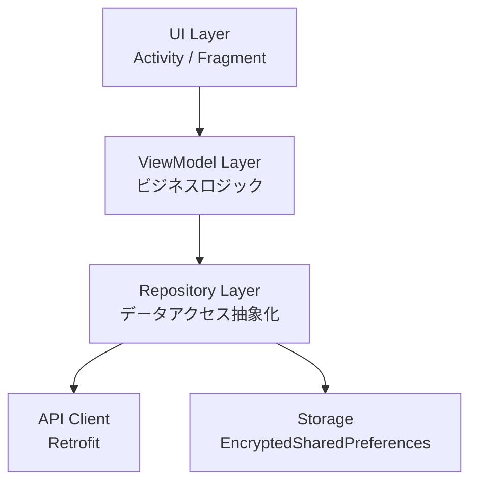
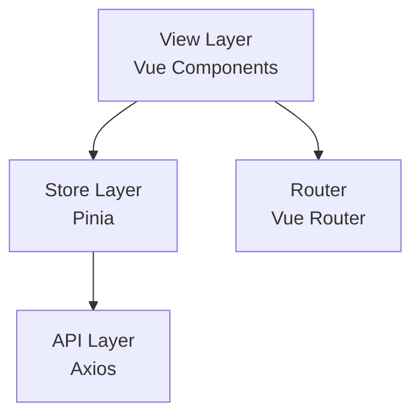
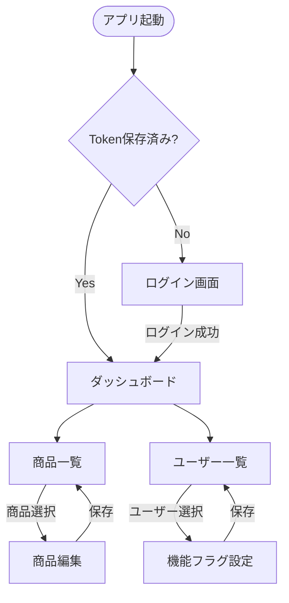

# クライアント層コンポーネント設計

> 最終更新: 2025-01-08  
> ステータス: Draft  
> バージョン: 1.0

## 変更履歴

| バージョン | 日付 | 変更内容 | 関連機能 |
|-----------|------|---------|---------|
| 1.0 | 2025-01-08 | 初版作成（02-component-design.mdから分割） | mobile-app-system |

---

## 1. クライアント層概要

本ドキュメントでは、mobile-app-system のクライアント層コンポーネントの詳細設計を定義します。
以下の3つのクライアントアプリケーションのコンポーネント設計を記載します：

- **iOS アプリ**（Swift / MVVM）
- **Android アプリ**（Java / MVVM）
- **管理 Web アプリ**（Vue.js / Pinia）

## 2. コンポーネント全体図（C4モデル Level 3）



---

## 3. iOS アプリコンポーネント

### 3.1 技術スタック

| 項目 | 技術 | バージョン |
|------|------|----------|
| 言語 | Swift | latest |
| 最小OS | iOS | 15.0以上 |
| アーキテクチャ | MVVM | - |
| UI Framework | SwiftUI / UIKit | 併用可 |
| HTTPクライアント | Alamofire | latest |
| セキュアストレージ | KeychainSwift | latest |
| JSON解析 | Codable | 標準 |

### 3.2 レイヤー構造



### 3.3 ディレクトリ構造

```
MobileApp/
├── App/
│   ├── AppDelegate.swift
│   └── SceneDelegate.swift
├── Models/
│   ├── User.swift
│   ├── Product.swift
│   ├── Purchase.swift
│   └── Favorite.swift
├── ViewModels/
│   ├── LoginViewModel.swift
│   ├── ProductListViewModel.swift
│   ├── ProductDetailViewModel.swift
│   └── FavoriteViewModel.swift
├── Views/
│   ├── Login/
│   │   └── LoginView.swift
│   ├── ProductList/
│   │   └── ProductListView.swift
│   ├── ProductDetail/
│   │   └── ProductDetailView.swift
│   └── Favorite/
│       └── FavoriteView.swift
├── Services/
│   ├── APIClient.swift
│   ├── AuthService.swift
│   ├── ProductService.swift
│   └── FavoriteService.swift
├── Utils/
│   ├── KeychainManager.swift
│   ├── NetworkMonitor.swift
│   └── Constants.swift
└── Resources/
    ├── Assets.xcassets
    └── Info.plist
```

### 3.4 主要クラス設計

#### APIClient（シングルトン）

```swift
class APIClient {
    static let shared = APIClient()
    private let baseURL = "http://localhost:8081/api/mobile"
    private let session: Session
    
    private init() {
        let configuration = URLSessionConfiguration.default
        configuration.timeoutIntervalForRequest = 10.0
        self.session = Session(configuration: configuration)
    }
    
    func request<T: Decodable>(
        _ endpoint: String,
        method: HTTPMethod,
        parameters: Parameters? = nil,
        headers: HTTPHeaders? = nil
    ) async throws -> T {
        // 実装
    }
}
```

#### KeychainManager

```swift
class KeychainManager {
    private let keychain = KeychainSwift()
    private let jwtTokenKey = "jwt_token"
    
    func saveToken(_ token: String) {
        keychain.set(token, forKey: jwtTokenKey)
    }
    
    func getToken() -> String? {
        return keychain.get(jwtTokenKey)
    }
    
    func deleteToken() {
        keychain.delete(jwtTokenKey)
    }
}
```

#### LoginViewModel

```swift
@MainActor
class LoginViewModel: ObservableObject {
    @Published var loginId: String = ""
    @Published var password: String = ""
    @Published var isLoading: Bool = false
    @Published var errorMessage: String?
    
    private let authService: AuthService
    private let keychainManager: KeychainManager
    
    init(authService: AuthService = AuthService(),
         keychainManager: KeychainManager = KeychainManager()) {
        self.authService = authService
        self.keychainManager = keychainManager
    }
    
    func login() async {
        isLoading = true
        errorMessage = nil
        
        do {
            let response = try await authService.login(
                loginId: loginId,
                password: password
            )
            keychainManager.saveToken(response.token)
            // 画面遷移処理
        } catch {
            errorMessage = "ログインに失敗しました"
        }
        
        isLoading = false
    }
}
```

#### ProductListViewModel

```swift
@MainActor
class ProductListViewModel: ObservableObject {
    @Published var products: [Product] = []
    @Published var isLoading: Bool = false
    @Published var errorMessage: String?
    
    private let productService: ProductService
    
    init(productService: ProductService = ProductService()) {
        self.productService = productService
    }
    
    func loadProducts() async {
        isLoading = true
        errorMessage = nil
        
        do {
            products = try await productService.fetchProducts()
        } catch {
            errorMessage = "商品の取得に失敗しました"
        }
        
        isLoading = false
    }
}
```

### 3.5 画面遷移図



### 3.6 エラーハンドリング

```swift
enum APIError: Error, LocalizedError {
    case networkError
    case unauthorized
    case notFound
    case serverError
    case decodingError
    
    var errorDescription: String? {
        switch self {
        case .networkError:
            return "ネットワークエラーが発生しました"
        case .unauthorized:
            return "認証に失敗しました"
        case .notFound:
            return "リソースが見つかりませんでした"
        case .serverError:
            return "サーバーエラーが発生しました"
        case .decodingError:
            return "データの解析に失敗しました"
        }
    }
}
```

---

## 4. Android アプリコンポーネント

### 4.1 技術スタック

| 項目 | 技術 | バージョン |
|------|------|----------|
| 言語 | Java | latest |
| 最小API | Android | 10.0（API 29）以上 |
| アーキテクチャ | MVVM | - |
| UI Framework | Activity / Fragment | 標準 |
| HTTPクライアント | Retrofit + OkHttp | latest |
| セキュアストレージ | EncryptedSharedPreferences | latest |
| JSON解析 | Gson / Moshi | latest |
| 非同期処理 | RxJava / Coroutines | latest |

### 4.2 レイヤー構造



### 4.3 ディレクトリ構造

```
app/
├── src/
│   └── main/
│       ├── java/com/example/mobileapp/
│       │   ├── ui/
│       │   │   ├── login/
│       │   │   │   ├── LoginActivity.java
│       │   │   │   └── LoginViewModel.java
│       │   │   ├── productlist/
│       │   │   │   ├── ProductListFragment.java
│       │   │   │   └── ProductListViewModel.java
│       │   │   ├── productdetail/
│       │   │   │   ├── ProductDetailActivity.java
│       │   │   │   └── ProductDetailViewModel.java
│       │   │   └── favorite/
│       │   │       ├── FavoriteFragment.java
│       │   │       └── FavoriteViewModel.java
│       │   ├── data/
│       │   │   ├── model/
│       │   │   │   ├── User.java
│       │   │   │   ├── Product.java
│       │   │   │   └── Favorite.java
│       │   │   ├── repository/
│       │   │   │   ├── AuthRepository.java
│       │   │   │   ├── ProductRepository.java
│       │   │   │   └── FavoriteRepository.java
│       │   │   └── api/
│       │   │       ├── ApiClient.java
│       │   │       ├── ApiService.java
│       │   │       └── AuthInterceptor.java
│       │   ├── util/
│       │   │   ├── SecureStorageManager.java
│       │   │   ├── NetworkMonitor.java
│       │   │   └── Constants.java
│       │   └── MobileApplication.java
│       └── res/
│           ├── layout/
│           ├── values/
│           └── drawable/
└── build.gradle
```

### 4.4 主要クラス設計

#### ApiClient（シングルトン）

```java
public class ApiClient {
    private static ApiClient instance;
    private static final String BASE_URL = "http://10.0.2.2:8081/api/mobile/";
    private Retrofit retrofit;
    
    private ApiClient() {
        OkHttpClient client = new OkHttpClient.Builder()
            .connectTimeout(10, TimeUnit.SECONDS)
            .readTimeout(10, TimeUnit.SECONDS)
            .addInterceptor(new AuthInterceptor())
            .build();
        
        retrofit = new Retrofit.Builder()
            .baseUrl(BASE_URL)
            .client(client)
            .addConverterFactory(GsonConverterFactory.create())
            .build();
    }
    
    public static synchronized ApiClient getInstance() {
        if (instance == null) {
            instance = new ApiClient();
        }
        return instance;
    }
    
    public ApiService getApiService() {
        return retrofit.create(ApiService.class);
    }
}
```

#### SecureStorageManager

```java
public class SecureStorageManager {
    private static final String PREFS_NAME = "secure_prefs";
    private static final String KEY_JWT_TOKEN = "jwt_token";
    private SharedPreferences sharedPreferences;
    
    public SecureStorageManager(Context context) {
        try {
            MasterKey masterKey = new MasterKey.Builder(context)
                .setKeyScheme(MasterKey.KeyScheme.AES256_GCM)
                .build();
            
            sharedPreferences = EncryptedSharedPreferences.create(
                context,
                PREFS_NAME,
                masterKey,
                EncryptedSharedPreferences.PrefKeyEncryptionScheme.AES256_SIV,
                EncryptedSharedPreferences.PrefValueEncryptionScheme.AES256_GCM
            );
        } catch (Exception e) {
            Log.e("SecureStorage", "Failed to initialize", e);
        }
    }
    
    public void saveToken(String token) {
        sharedPreferences.edit().putString(KEY_JWT_TOKEN, token).apply();
    }
    
    public String getToken() {
        return sharedPreferences.getString(KEY_JWT_TOKEN, null);
    }
    
    public void deleteToken() {
        sharedPreferences.edit().remove(KEY_JWT_TOKEN).apply();
    }
}
```

#### AuthRepository

```java
public class AuthRepository {
    private final ApiService apiService;
    private final SecureStorageManager storageManager;
    
    public AuthRepository(Context context) {
        this.apiService = ApiClient.getInstance().getApiService();
        this.storageManager = new SecureStorageManager(context);
    }
    
    public Single<LoginResponse> login(String loginId, String password) {
        LoginRequest request = new LoginRequest(loginId, password);
        return apiService.login(request)
            .doOnSuccess(response -> {
                storageManager.saveToken(response.getToken());
            });
    }
    
    public void logout() {
        storageManager.deleteToken();
    }
    
    public String getToken() {
        return storageManager.getToken();
    }
}
```

#### LoginViewModel

```java
public class LoginViewModel extends ViewModel {
    private final MutableLiveData<Boolean> isLoading = new MutableLiveData<>(false);
    private final MutableLiveData<String> errorMessage = new MutableLiveData<>();
    private final MutableLiveData<Boolean> loginSuccess = new MutableLiveData<>();
    
    private final AuthRepository authRepository;
    private final CompositeDisposable disposables = new CompositeDisposable();
    
    public LoginViewModel(AuthRepository authRepository) {
        this.authRepository = authRepository;
    }
    
    public void login(String loginId, String password) {
        isLoading.setValue(true);
        
        disposables.add(
            authRepository.login(loginId, password)
                .subscribeOn(Schedulers.io())
                .observeOn(AndroidSchedulers.mainThread())
                .subscribe(
                    response -> {
                        isLoading.setValue(false);
                        loginSuccess.setValue(true);
                    },
                    error -> {
                        isLoading.setValue(false);
                        errorMessage.setValue("ログインに失敗しました");
                    }
                )
        );
    }
    
    @Override
    protected void onCleared() {
        super.onCleared();
        disposables.clear();
    }
    
    // Getters for LiveData
    public LiveData<Boolean> getIsLoading() { return isLoading; }
    public LiveData<String> getErrorMessage() { return errorMessage; }
    public LiveData<Boolean> getLoginSuccess() { return loginSuccess; }
}
```

### 4.5 画面遷移図（iOSと同様）

Android版も iOS版と同様の画面遷移フローを実装します。

---

## 5. 管理Webアプリコンポーネント

### 5.1 技術スタック

| 項目 | 技術 | バージョン |
|------|------|----------|
| 言語 | JavaScript | ES6+ |
| フレームワーク | Vue.js | latest (3.x) |
| 状態管理 | Pinia | latest |
| ルーティング | Vue Router | latest |
| HTTPクライアント | Axios | latest |
| UIライブラリ | Element Plus / Vuetify | latest（選択可） |
| ビルドツール | Vite | latest |
| 静的解析 | ESLint | latest |

### 5.2 レイヤー構造



### 5.3 ディレクトリ構造

```
admin-web/
├── public/
│   └── index.html
├── src/
│   ├── main.js
│   ├── App.vue
│   ├── router/
│   │   └── index.js
│   ├── stores/
│   │   ├── auth.js
│   │   ├── product.js
│   │   └── user.js
│   ├── views/
│   │   ├── Login.vue
│   │   ├── ProductList.vue
│   │   ├── ProductEdit.vue
│   │   ├── UserList.vue
│   │   └── FeatureFlagManagement.vue
│   ├── components/
│   │   ├── common/
│   │   │   ├── Header.vue
│   │   │   ├── Sidebar.vue
│   │   │   └── Loading.vue
│   │   └── product/
│   │       ├── ProductTable.vue
│   │       └── ProductForm.vue
│   ├── api/
│   │   ├── client.js
│   │   ├── auth.js
│   │   ├── product.js
│   │   └── user.js
│   ├── utils/
│   │   ├── constants.js
│   │   ├── validator.js
│   │   └── formatter.js
│   └── assets/
│       ├── styles/
│       └── images/
├── package.json
├── vite.config.js
└── .eslintrc.js
```

### 5.4 主要モジュール設計

#### API Client（api/client.js）

```javascript
import axios from 'axios';

const apiClient = axios.create({
  baseURL: 'http://localhost:8082/api/admin',
  timeout: 10000,
  headers: {
    'Content-Type': 'application/json',
  },
});

// リクエストインターセプター
apiClient.interceptors.request.use(
  (config) => {
    const token = localStorage.getItem('jwt_token');
    if (token) {
      config.headers.Authorization = `Bearer ${token}`;
    }
    return config;
  },
  (error) => {
    return Promise.reject(error);
  }
);

// レスポンスインターセプター
apiClient.interceptors.response.use(
  (response) => {
    return response;
  },
  (error) => {
    if (error.response && error.response.status === 401) {
      // 認証エラー時はログイン画面へリダイレクト
      localStorage.removeItem('jwt_token');
      window.location.href = '/login';
    }
    return Promise.reject(error);
  }
);

export default apiClient;
```

#### Auth Store（stores/auth.js）

```javascript
import { defineStore } from 'pinia';
import { login } from '@/api/auth';

export const useAuthStore = defineStore('auth', {
  state: () => ({
    token: localStorage.getItem('jwt_token') || null,
    user: null,
    isAuthenticated: false,
  }),
  
  actions: {
    async login(loginId, password) {
      try {
        const response = await login(loginId, password);
        this.token = response.data.token;
        this.isAuthenticated = true;
        localStorage.setItem('jwt_token', this.token);
        return true;
      } catch (error) {
        console.error('Login failed:', error);
        return false;
      }
    },
    
    logout() {
      this.token = null;
      this.user = null;
      this.isAuthenticated = false;
      localStorage.removeItem('jwt_token');
    },
  },
});
```

#### Product Store（stores/product.js）

```javascript
import { defineStore } from 'pinia';
import { getProducts, updateProduct } from '@/api/product';

export const useProductStore = defineStore('product', {
  state: () => ({
    products: [],
    currentProduct: null,
    isLoading: false,
    error: null,
  }),
  
  actions: {
    async fetchProducts() {
      this.isLoading = true;
      this.error = null;
      
      try {
        const response = await getProducts();
        this.products = response.data;
      } catch (error) {
        this.error = '商品の取得に失敗しました';
        console.error('Failed to fetch products:', error);
      } finally {
        this.isLoading = false;
      }
    },
    
    async updateProduct(id, productData) {
      this.isLoading = true;
      this.error = null;
      
      try {
        const response = await updateProduct(id, productData);
        // 商品リストを更新
        const index = this.products.findIndex(p => p.productId === id);
        if (index !== -1) {
          this.products[index] = response.data;
        }
        return true;
      } catch (error) {
        this.error = '商品の更新に失敗しました';
        console.error('Failed to update product:', error);
        return false;
      } finally {
        this.isLoading = false;
      }
    },
  },
  
  getters: {
    getProductById: (state) => (id) => {
      return state.products.find(p => p.productId === id);
    },
  },
});
```

#### Router設定（router/index.js）

```javascript
import { createRouter, createWebHistory } from 'vue-router';
import Login from '@/views/Login.vue';
import ProductList from '@/views/ProductList.vue';
import ProductEdit from '@/views/ProductEdit.vue';
import UserList from '@/views/UserList.vue';
import FeatureFlagManagement from '@/views/FeatureFlagManagement.vue';

const routes = [
  {
    path: '/login',
    name: 'Login',
    component: Login,
    meta: { requiresAuth: false },
  },
  {
    path: '/',
    redirect: '/products',
  },
  {
    path: '/products',
    name: 'ProductList',
    component: ProductList,
    meta: { requiresAuth: true },
  },
  {
    path: '/products/:id/edit',
    name: 'ProductEdit',
    component: ProductEdit,
    meta: { requiresAuth: true },
  },
  {
    path: '/users',
    name: 'UserList',
    component: UserList,
    meta: { requiresAuth: true },
  },
  {
    path: '/users/:id/feature-flags',
    name: 'FeatureFlagManagement',
    component: FeatureFlagManagement,
    meta: { requiresAuth: true },
  },
];

const router = createRouter({
  history: createWebHistory(),
  routes,
});

// ナビゲーションガード
router.beforeEach((to, from, next) => {
  const token = localStorage.getItem('jwt_token');
  
  if (to.meta.requiresAuth && !token) {
    next('/login');
  } else if (to.path === '/login' && token) {
    next('/');
  } else {
    next();
  }
});

export default router;
```

### 5.5 画面遷移図



### 5.6 コンポーネント設計例

#### Login.vue

```vue
<template>
  <div class="login-container">
    <h1>管理者ログイン</h1>
    <form @submit.prevent="handleLogin">
      <div class="form-group">
        <label for="loginId">ログインID</label>
        <input
          id="loginId"
          v-model="loginId"
          type="text"
          required
        />
      </div>
      
      <div class="form-group">
        <label for="password">パスワード</label>
        <input
          id="password"
          v-model="password"
          type="password"
          required
        />
      </div>
      
      <button type="submit" :disabled="isLoading">
        {{ isLoading ? 'ログイン中...' : 'ログイン' }}
      </button>
      
      <div v-if="errorMessage" class="error">
        {{ errorMessage }}
      </div>
    </form>
  </div>
</template>

<script setup>
import { ref } from 'vue';
import { useRouter } from 'vue-router';
import { useAuthStore } from '@/stores/auth';

const router = useRouter();
const authStore = useAuthStore();

const loginId = ref('');
const password = ref('');
const isLoading = ref(false);
const errorMessage = ref('');

const handleLogin = async () => {
  isLoading.value = true;
  errorMessage.value = '';
  
  const success = await authStore.login(loginId.value, password.value);
  
  if (success) {
    router.push('/');
  } else {
    errorMessage.value = 'ログインに失敗しました';
  }
  
  isLoading.value = false;
};
</script>

<style scoped>
.login-container {
  max-width: 400px;
  margin: 100px auto;
  padding: 20px;
}

.form-group {
  margin-bottom: 15px;
}

.error {
  color: red;
  margin-top: 10px;
}
</style>
```

---

## 6. 参照ドキュメント

| ドキュメント | パス |
|------------|------|
| アーキテクチャ概要 | `00-overview.md` |
| システムコンテキスト | `01-system-context.md` |
| BFF層コンポーネント | `02-02-bff-components.md` |
| API層コンポーネント | `02-03-api-components.md` |
| APIアーキテクチャ | `04-api-architecture.md` |
| セキュリティアーキテクチャ | `05-security-architecture.md` |
| コーディング規約 | `09-coding-standards.md` |

---

**End of Document**
