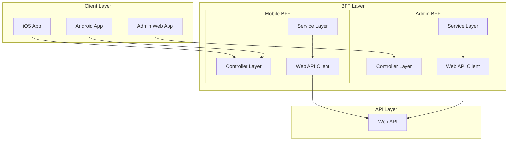
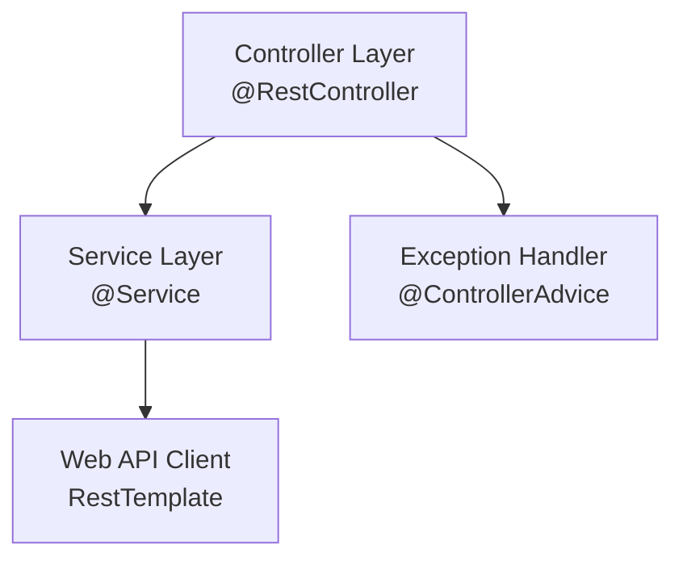

# BFF層コンポーネント設計

> 最終更新: 2025-01-08  
> ステータス: Draft  
> バージョン: 1.0

## 変更履歴

| バージョン | 日付 | 変更内容 | 関連機能 |
|-----------|------|---------|---------|
| 1.0 | 2025-01-08 | 初版作成（02-component-design.mdから分割） | mobile-app-system |

---

## 1. BFF層概要

本ドキュメントでは、mobile-app-system のBFF（Backend For Frontend）層コンポーネントの詳細設計を定義します。
以下の2つのBFFアプリケーションのコンポーネント設計を記載します：

- **Mobile BFF**（Spring Boot）- iOS/Android アプリ向け
- **Admin BFF**（Spring Boot）- 管理Webアプリ向け

## 2. BFF層の責務

BFF層は以下の責務を持ちます：

- **プロトコル変換**: クライアントとWeb API間のプロトコル変換
- **データ集約**: 複数のWeb APIエンドポイントからのデータ集約
- **認証トークン転送**: クライアントから受け取ったJWTトークンをWeb APIに転送
- **レスポンス整形**: クライアント向けにレスポンスを最適化
- **エラーハンドリング**: Web APIエラーをクライアント向けに変換

## 3. コンポーネント全体図



---

## 4. Mobile BFF コンポーネント

### 4.1 技術スタック

| 項目 | 技術 | バージョン |
|------|------|----------|
| 言語 | Java | latest |
| フレームワーク | Spring Boot | latest |
| ビルドツール | Maven / Gradle | latest |
| HTTPクライアント | RestTemplate / WebClient | Spring標準 |
| ログ | SLF4J + Logback | Spring標準 |
| バリデーション | Hibernate Validator | Spring標準 |

### 4.2 レイヤー構造



### 4.3 パッケージ構造

```
mobile-bff/
├── src/
│   ├── main/
│   │   ├── java/com/example/mobilebff/
│   │   │   ├── MobileBffApplication.java
│   │   │   ├── controller/
│   │   │   │   ├── AuthController.java
│   │   │   │   ├── ProductController.java
│   │   │   │   ├── PurchaseController.java
│   │   │   │   └── FavoriteController.java
│   │   │   ├── service/
│   │   │   │   ├── AuthService.java
│   │   │   │   ├── ProductService.java
│   │   │   │   ├── PurchaseService.java
│   │   │   │   └── FavoriteService.java
│   │   │   ├── client/
│   │   │   │   └── WebApiClient.java
│   │   │   ├── dto/
│   │   │   │   ├── request/
│   │   │   │   │   ├── LoginRequest.java
│   │   │   │   │   ├── PurchaseRequest.java
│   │   │   │   │   └── FavoriteRequest.java
│   │   │   │   └── response/
│   │   │   │       ├── LoginResponse.java
│   │   │   │       ├── ProductResponse.java
│   │   │   │       ├── PurchaseResponse.java
│   │   │   │       └── ApiResponse.java
│   │   │   ├── exception/
│   │   │   │   ├── GlobalExceptionHandler.java
│   │   │   │   ├── BffException.java
│   │   │   │   └── WebApiException.java
│   │   │   └── config/
│   │   │       ├── RestTemplateConfig.java
│   │   │       └── CorsConfig.java
│   │   └── resources/
│   │       ├── application.yml
│   │       └── logback-spring.xml
│   └── test/
│       └── java/com/example/mobilebff/
│           ├── controller/
│           └── service/
└── pom.xml
```

### 4.4 設定ファイル（application.yml）

```yaml
server:
  port: 8081
  servlet:
    context-path: /

spring:
  application:
    name: mobile-bff

# Web API接続設定
webapi:
  base-url: http://localhost:8080/api
  timeout:
    connect: 5000
    read: 10000

# ログ設定
logging:
  level:
    com.example.mobilebff: DEBUG
    org.springframework.web: INFO
  pattern:
    console: "%d{yyyy-MM-dd HH:mm:ss} - %msg%n"

# CORS設定
cors:
  allowed-origins:
    - "http://localhost:3000"
    - "http://10.0.2.2:8081"
  allowed-methods:
    - GET
    - POST
    - PUT
    - DELETE
  allowed-headers:
    - "*"
```

### 4.5 主要クラス設計

#### MobileBffApplication.java

```java
@SpringBootApplication
public class MobileBffApplication {
    public static void main(String[] args) {
        SpringApplication.run(MobileBffApplication.class, args);
    }
}
```

#### ProductController.java

```java
@RestController
@RequestMapping("/api/mobile/products")
@RequiredArgsConstructor
@Slf4j
public class ProductController {
    private final ProductService productService;
    
    /**
     * 商品一覧取得
     */
    @GetMapping
    public ResponseEntity<ApiResponse<List<ProductResponse>>> getProducts(
        @RequestHeader("Authorization") String token
    ) {
        log.info("商品一覧取得リクエスト");
        List<ProductResponse> products = productService.getProducts(token);
        return ResponseEntity.ok(ApiResponse.success(products));
    }
    
    /**
     * 商品詳細取得
     */
    @GetMapping("/{id}")
    public ResponseEntity<ApiResponse<ProductResponse>> getProduct(
        @PathVariable Long id,
        @RequestHeader("Authorization") String token
    ) {
        log.info("商品詳細取得リクエスト: id={}", id);
        ProductResponse product = productService.getProduct(id, token);
        return ResponseEntity.ok(ApiResponse.success(product));
    }
}
```

#### ProductService.java

```java
@Service
@RequiredArgsConstructor
@Slf4j
public class ProductService {
    private final WebApiClient webApiClient;
    
    /**
     * Web APIから商品一覧を取得
     */
    public List<ProductResponse> getProducts(String token) {
        try {
            ProductResponse[] products = webApiClient.get(
                "/products",
                token,
                ProductResponse[].class
            );
            return Arrays.asList(products);
        } catch (WebApiException e) {
            log.error("商品一覧取得失敗", e);
            throw new BffException("商品一覧の取得に失敗しました", e);
        }
    }
    
    /**
     * Web APIから商品詳細を取得
     */
    public ProductResponse getProduct(Long id, String token) {
        try {
            return webApiClient.get(
                "/products/" + id,
                token,
                ProductResponse.class
            );
        } catch (WebApiException e) {
            log.error("商品詳細取得失敗: id={}", id, e);
            throw new BffException("商品詳細の取得に失敗しました", e);
        }
    }
}
```

#### WebApiClient.java

```java
@Component
@RequiredArgsConstructor
@Slf4j
public class WebApiClient {
    private final RestTemplate restTemplate;
    
    @Value("${webapi.base-url}")
    private String webApiBaseUrl;
    
    /**
     * GETリクエスト実行
     */
    public <T> T get(String endpoint, String token, Class<T> responseType) {
        HttpHeaders headers = new HttpHeaders();
        headers.set("Authorization", token);
        HttpEntity<Void> entity = new HttpEntity<>(headers);
        
        String url = webApiBaseUrl + endpoint;
        log.debug("Web API GET: {}", url);
        
        try {
            ResponseEntity<T> response = restTemplate.exchange(
                url,
                HttpMethod.GET,
                entity,
                responseType
            );
            return response.getBody();
        } catch (HttpClientErrorException e) {
            log.error("Web API呼び出しエラー（4xx）: status={}, url={}", e.getStatusCode(), url);
            throw new WebApiException("Web API呼び出しエラー", e);
        } catch (HttpServerErrorException e) {
            log.error("Web API呼び出しエラー（5xx）: status={}, url={}", e.getStatusCode(), url);
            throw new WebApiException("Web APIサーバーエラー", e);
        } catch (ResourceAccessException e) {
            log.error("Web API接続エラー: url={}", url, e);
            throw new WebApiException("Web APIに接続できません", e);
        }
    }
    
    /**
     * POSTリクエスト実行
     */
    public <T, R> R post(String endpoint, String token, T requestBody, Class<R> responseType) {
        HttpHeaders headers = new HttpHeaders();
        headers.set("Authorization", token);
        headers.setContentType(MediaType.APPLICATION_JSON);
        HttpEntity<T> entity = new HttpEntity<>(requestBody, headers);
        
        String url = webApiBaseUrl + endpoint;
        log.debug("Web API POST: {}", url);
        
        try {
            ResponseEntity<R> response = restTemplate.exchange(
                url,
                HttpMethod.POST,
                entity,
                responseType
            );
            return response.getBody();
        } catch (HttpClientErrorException | HttpServerErrorException e) {
            log.error("Web API呼び出しエラー: status={}, url={}", e.getStatusCode(), url);
            throw new WebApiException("Web API呼び出しエラー", e);
        } catch (ResourceAccessException e) {
            log.error("Web API接続エラー: url={}", url, e);
            throw new WebApiException("Web APIに接続できません", e);
        }
    }
}
```

#### GlobalExceptionHandler.java

```java
@RestControllerAdvice
@Slf4j
public class GlobalExceptionHandler {
    
    /**
     * BFF例外ハンドラ
     */
    @ExceptionHandler(BffException.class)
    public ResponseEntity<ApiResponse<Void>> handleBffException(BffException e) {
        log.error("BFF例外発生", e);
        return ResponseEntity
            .status(HttpStatus.INTERNAL_SERVER_ERROR)
            .body(ApiResponse.error("BFF_ERROR", e.getMessage()));
    }
    
    /**
     * Web API例外ハンドラ
     */
    @ExceptionHandler(WebApiException.class)
    public ResponseEntity<ApiResponse<Void>> handleWebApiException(WebApiException e) {
        log.error("Web API例外発生", e);
        return ResponseEntity
            .status(HttpStatus.BAD_GATEWAY)
            .body(ApiResponse.error("WEBAPI_ERROR", e.getMessage()));
    }
    
    /**
     * バリデーション例外ハンドラ
     */
    @ExceptionHandler(MethodArgumentNotValidException.class)
    public ResponseEntity<ApiResponse<Void>> handleValidationException(
        MethodArgumentNotValidException e
    ) {
        log.warn("バリデーションエラー", e);
        String message = e.getBindingResult()
            .getAllErrors()
            .stream()
            .map(ObjectError::getDefaultMessage)
            .collect(Collectors.joining(", "));
        
        return ResponseEntity
            .status(HttpStatus.BAD_REQUEST)
            .body(ApiResponse.error("VALIDATION_ERROR", message));
    }
    
    /**
     * その他の例外ハンドラ
     */
    @ExceptionHandler(Exception.class)
    public ResponseEntity<ApiResponse<Void>> handleGenericException(Exception e) {
        log.error("予期しないエラー", e);
        return ResponseEntity
            .status(HttpStatus.INTERNAL_SERVER_ERROR)
            .body(ApiResponse.error("INTERNAL_ERROR", "内部エラーが発生しました"));
    }
}
```

#### RestTemplateConfig.java

```java
@Configuration
public class RestTemplateConfig {
    
    @Value("${webapi.timeout.connect}")
    private int connectTimeout;
    
    @Value("${webapi.timeout.read}")
    private int readTimeout;
    
    @Bean
    public RestTemplate restTemplate() {
        HttpComponentsClientHttpRequestFactory factory = 
            new HttpComponentsClientHttpRequestFactory();
        factory.setConnectTimeout(connectTimeout);
        factory.setReadTimeout(readTimeout);
        
        RestTemplate restTemplate = new RestTemplate(factory);
        
        // エラーハンドラーを設定しない（デフォルトの例外をスロー）
        return restTemplate;
    }
}
```

---

## 5. Admin BFF コンポーネント

### 5.1 技術スタック

Mobile BFFと同様の技術スタックを使用します。

### 5.2 パッケージ構造

```
admin-bff/
├── src/
│   ├── main/
│   │   ├── java/com/example/adminbff/
│   │   │   ├── AdminBffApplication.java
│   │   │   ├── controller/
│   │   │   │   ├── AuthController.java
│   │   │   │   ├── ProductController.java
│   │   │   │   ├── UserController.java
│   │   │   │   └── FeatureFlagController.java
│   │   │   ├── service/
│   │   │   │   ├── AuthService.java
│   │   │   │   ├── ProductService.java
│   │   │   │   ├── UserService.java
│   │   │   │   └── FeatureFlagService.java
│   │   │   ├── client/
│   │   │   │   └── WebApiClient.java
│   │   │   ├── dto/
│   │   │   │   ├── request/
│   │   │   │   └── response/
│   │   │   ├── exception/
│   │   │   │   ├── GlobalExceptionHandler.java
│   │   │   │   ├── BffException.java
│   │   │   │   └── WebApiException.java
│   │   │   └── config/
│   │   │       ├── RestTemplateConfig.java
│   │   │       └── CorsConfig.java
│   │   └── resources/
│   │       ├── application.yml
│   │       └── logback-spring.xml
│   └── test/
└── pom.xml
```

### 5.3 設定ファイル（application.yml）

```yaml
server:
  port: 8082
  servlet:
    context-path: /

spring:
  application:
    name: admin-bff

# Web API接続設定
webapi:
  base-url: http://localhost:8080/api
  timeout:
    connect: 5000
    read: 10000

# ログ設定
logging:
  level:
    com.example.adminbff: DEBUG
    org.springframework.web: INFO

# CORS設定
cors:
  allowed-origins:
    - "http://localhost:8080"
  allowed-methods:
    - GET
    - POST
    - PUT
    - DELETE
  allowed-headers:
    - "*"
```

### 5.4 主要クラス設計

#### ProductController.java（Admin BFF版）

```java
@RestController
@RequestMapping("/api/admin/products")
@RequiredArgsConstructor
@Slf4j
public class ProductController {
    private final ProductService productService;
    
    /**
     * 商品一覧取得（管理者向け）
     */
    @GetMapping
    public ResponseEntity<ApiResponse<List<ProductResponse>>> getProducts(
        @RequestHeader("Authorization") String token
    ) {
        log.info("商品一覧取得リクエスト（管理者）");
        List<ProductResponse> products = productService.getAllProducts(token);
        return ResponseEntity.ok(ApiResponse.success(products));
    }
    
    /**
     * 商品更新
     */
    @PutMapping("/{id}")
    public ResponseEntity<ApiResponse<ProductResponse>> updateProduct(
        @PathVariable Long id,
        @RequestBody @Valid ProductUpdateRequest request,
        @RequestHeader("Authorization") String token
    ) {
        log.info("商品更新リクエスト: id={}", id);
        ProductResponse product = productService.updateProduct(id, request, token);
        return ResponseEntity.ok(ApiResponse.success(product));
    }
}
```

#### FeatureFlagController.java

```java
@RestController
@RequestMapping("/api/admin/feature-flags")
@RequiredArgsConstructor
@Slf4j
public class FeatureFlagController {
    private final FeatureFlagService featureFlagService;
    
    /**
     * ユーザーの機能フラグ一覧取得
     */
    @GetMapping("/users/{userId}")
    public ResponseEntity<ApiResponse<List<FeatureFlagResponse>>> getUserFeatureFlags(
        @PathVariable Long userId,
        @RequestHeader("Authorization") String token
    ) {
        log.info("ユーザー機能フラグ取得: userId={}", userId);
        List<FeatureFlagResponse> flags = featureFlagService.getUserFeatureFlags(userId, token);
        return ResponseEntity.ok(ApiResponse.success(flags));
    }
    
    /**
     * ユーザーの機能フラグ更新
     */
    @PutMapping("/users/{userId}")
    public ResponseEntity<ApiResponse<Void>> updateUserFeatureFlags(
        @PathVariable Long userId,
        @RequestBody @Valid FeatureFlagUpdateRequest request,
        @RequestHeader("Authorization") String token
    ) {
        log.info("ユーザー機能フラグ更新: userId={}", userId);
        featureFlagService.updateUserFeatureFlags(userId, request, token);
        return ResponseEntity.ok(ApiResponse.success(null));
    }
}
```

#### FeatureFlagService.java

<!-- Added for mobile-app-system -->
```java
@Service
@RequiredArgsConstructor
@Slf4j
public class FeatureFlagService {
    private final WebApiClient webApiClient;
    
    /**
     * ユーザーの機能フラグ一覧を取得
     */
    public List<FeatureFlagResponse> getUserFeatureFlags(Long userId, String token) {
        try {
            FeatureFlagResponse[] flags = webApiClient.get(
                "/admin/users/" + userId + "/feature-flags",
                token,
                FeatureFlagResponse[].class
            );
            return Arrays.asList(flags);
        } catch (WebApiException e) {
            log.error("機能フラグ取得失敗: userId={}", userId, e);
            throw new BffException("機能フラグの取得に失敗しました", e);
        }
    }
    
    /**
     * ユーザーの機能フラグを更新
     */
    public void updateUserFeatureFlags(
        Long userId,
        FeatureFlagUpdateRequest request,
        String token
    ) {
        try {
            webApiClient.put(
                "/admin/users/" + userId + "/feature-flags",
                token,
                request,
                Void.class
            );
        } catch (WebApiException e) {
            log.error("機能フラグ更新失敗: userId={}", userId, e);
            throw new BffException("機能フラグの更新に失敗しました", e);
        }
    }
}
```
<!-- End: mobile-app-system -->

---

## 6. DTOクラス設計

### 6.1 ApiResponse（共通レスポンス）

```java
@Data
@Builder
@NoArgsConstructor
@AllArgsConstructor
public class ApiResponse<T> {
    private boolean success;
    private T data;
    private ErrorInfo error;
    
    public static <T> ApiResponse<T> success(T data) {
        return ApiResponse.<T>builder()
            .success(true)
            .data(data)
            .build();
    }
    
    public static <T> ApiResponse<T> error(String code, String message) {
        return ApiResponse.<T>builder()
            .success(false)
            .error(new ErrorInfo(code, message))
            .build();
    }
    
    @Data
    @AllArgsConstructor
    public static class ErrorInfo {
        private String code;
        private String message;
    }
}
```

### 6.2 ProductResponse

```java
@Data
@NoArgsConstructor
@AllArgsConstructor
public class ProductResponse {
    private Long productId;
    private String productName;
    private Integer unitPrice;
    private Integer stockQuantity;
}
```

### 6.3 FeatureFlagResponse

<!-- Added for mobile-app-system -->
```java
@Data
@NoArgsConstructor
@AllArgsConstructor
public class FeatureFlagResponse {
    private Long flagId;
    private String flagKey;
    private String flagName;
    private String description;
    private Boolean isEnabled;
}
```
<!-- End: mobile-app-system -->

---

## 7. エラーハンドリング

### 7.1 例外クラス階層

```
Exception
  └── RuntimeException
      └── BffException（BFF層の基底例外）
          ├── WebApiException（Web API呼び出し例外）
          └── ValidationException（バリデーション例外）
```

### 7.2 BffException.java

```java
public class BffException extends RuntimeException {
    public BffException(String message) {
        super(message);
    }
    
    public BffException(String message, Throwable cause) {
        super(message, cause);
    }
}
```

### 7.3 WebApiException.java

```java
public class WebApiException extends BffException {
    public WebApiException(String message) {
        super(message);
    }
    
    public WebApiException(String message, Throwable cause) {
        super(message, cause);
    }
}
```

---

## 8. ロギング戦略

### 8.1 ログレベル

| レベル | 用途 | 例 |
|-------|------|---|
| ERROR | エラー発生時 | Web API呼び出し失敗、例外発生 |
| WARN | 警告 | バリデーションエラー |
| INFO | 重要な処理 | リクエスト受信、レスポンス返却 |
| DEBUG | 詳細情報 | Web API URL、パラメータ |

### 8.2 ログフォーマット

```
[日時] [ログレベル] [スレッド名] [クラス名] - メッセージ
2025-01-08 12:00:00 INFO [http-nio-8081-exec-1] ProductController - 商品一覧取得リクエスト
```

---

## 9. テスト戦略

### 9.1 単体テスト

- **対象**: Service層、WebApiClient
- **ツール**: JUnit 5, Mockito
- **モック**: RestTemplateをモック化

#### ProductServiceTest.java

```java
@ExtendWith(MockitoExtension.class)
class ProductServiceTest {
    
    @Mock
    private WebApiClient webApiClient;
    
    @InjectMocks
    private ProductService productService;
    
    @Test
    void testGetProducts_Success() {
        // Given
        String token = "Bearer test-token";
        ProductResponse[] mockProducts = {
            new ProductResponse(1L, "商品A", 1000, 10),
            new ProductResponse(2L, "商品B", 2000, 20)
        };
        
        when(webApiClient.get(anyString(), eq(token), eq(ProductResponse[].class)))
            .thenReturn(mockProducts);
        
        // When
        List<ProductResponse> result = productService.getProducts(token);
        
        // Then
        assertEquals(2, result.size());
        assertEquals("商品A", result.get(0).getProductName());
        verify(webApiClient).get("/products", token, ProductResponse[].class);
    }
    
    @Test
    void testGetProducts_WebApiException() {
        // Given
        String token = "Bearer test-token";
        when(webApiClient.get(anyString(), eq(token), eq(ProductResponse[].class)))
            .thenThrow(new WebApiException("Web API呼び出し失敗"));
        
        // When & Then
        assertThrows(BffException.class, () -> {
            productService.getProducts(token);
        });
    }
}
```

### 9.2 統合テスト

- **対象**: Controller → Service → WebApiClient
- **ツール**: Spring Boot Test, MockMvc, WireMock
- **モック**: Web APIエンドポイントをWireMockでモック化

---

## 10. 参照ドキュメント

| ドキュメント | パス |
|------------|------|
| アーキテクチャ概要 | `00-overview.md` |
| クライアント層コンポーネント | `02-01-client-components.md` |
| API層コンポーネント | `02-03-api-components.md` |
| APIアーキテクチャ | `04-api-architecture.md` |
| セキュリティアーキテクチャ | `05-security-architecture.md` |
| コーディング規約 | `09-coding-standards.md` |

---

**End of Document**
