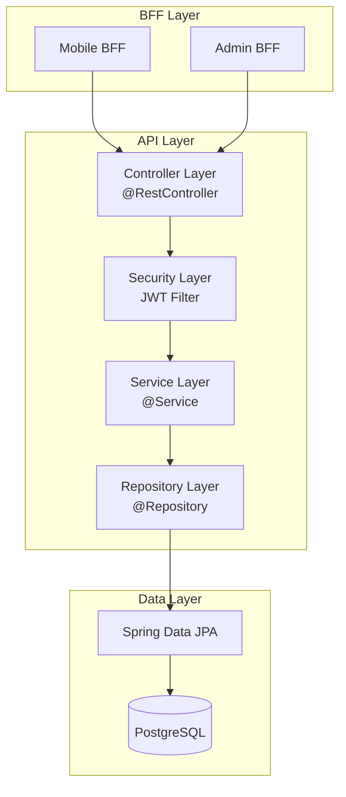
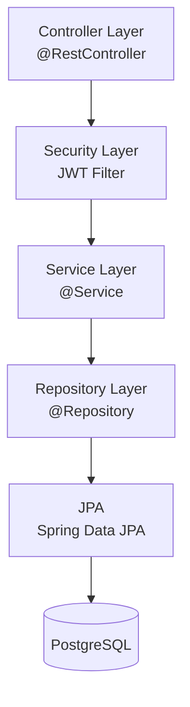

# API層コンポーネント設計

> 最終更新: 2025-01-08  
> ステータス: Draft  
> バージョン: 1.0

## 変更履歴

| バージョン | 日付 | 変更内容 | 関連機能 |
|-----------|------|---------|---------|
| 1.0 | 2025-01-08 | 初版作成（02-component-design.mdから分割） | mobile-app-system |

---

## 1. API層概要

本ドキュメントでは、mobile-app-system のAPI層（Web API）コンポーネントの詳細設計を定義します。
Web APIは以下の責務を持ちます：

- **ビジネスロジックの実装**: 商品管理、購入処理、お気に入り管理、機能フラグ管理
- **認証・認可**: JWTトークン検証、ユーザー種別による権限制御
- **データアクセス**: PostgreSQLデータベースへのCRUD操作
- **トランザクション管理**: データ整合性の保証

## 2. コンポーネント全体図



---

## 3. Web API コンポーネント

### 3.1 技術スタック

| 項目 | 技術 | バージョン |
|------|------|----------|
| 言語 | Java | latest |
| フレームワーク | Spring Boot | latest |
| セキュリティ | Spring Security | latest |
| データアクセス | Spring Data JPA | latest |
| JWT | jjwt | latest |
| バリデーション | Hibernate Validator | Spring標準 |
| データベース | PostgreSQL | 16.x |
| コネクションプール | HikariCP | Spring標準 |

### 3.2 レイヤー構造



### 3.3 パッケージ構造

```
web-api/
├── src/
│   ├── main/
│   │   ├── java/com/example/webapi/
│   │   │   ├── WebApiApplication.java
│   │   │   ├── controller/
│   │   │   │   ├── AuthController.java
│   │   │   │   ├── ProductController.java
│   │   │   │   ├── PurchaseController.java
│   │   │   │   ├── FavoriteController.java
│   │   │   │   └── AdminController.java
│   │   │   ├── service/
│   │   │   │   ├── AuthService.java
│   │   │   │   ├── ProductService.java
│   │   │   │   ├── PurchaseService.java
│   │   │   │   ├── FavoriteService.java
│   │   │   │   └── FeatureFlagService.java
│   │   │   ├── repository/
│   │   │   │   ├── UserRepository.java
│   │   │   │   ├── ProductRepository.java
│   │   │   │   ├── PurchaseRepository.java
│   │   │   │   ├── FavoriteRepository.java
│   │   │   │   ├── FeatureFlagRepository.java
│   │   │   │   └── UserFeatureFlagRepository.java
│   │   │   ├── entity/
│   │   │   │   ├── User.java
│   │   │   │   ├── Product.java
│   │   │   │   ├── Purchase.java
│   │   │   │   ├── Favorite.java
│   │   │   │   ├── FeatureFlag.java
│   │   │   │   └── UserFeatureFlag.java
│   │   │   ├── dto/
│   │   │   │   ├── request/
│   │   │   │   │   ├── LoginRequest.java
│   │   │   │   │   ├── ProductUpdateRequest.java
│   │   │   │   │   ├── PurchaseRequest.java
│   │   │   │   │   └── FeatureFlagUpdateRequest.java
│   │   │   │   └── response/
│   │   │   │       ├── LoginResponse.java
│   │   │   │       ├── ProductResponse.java
│   │   │   │       ├── PurchaseResponse.java
│   │   │   │       └── FeatureFlagResponse.java
│   │   │   ├── security/
│   │   │   │   ├── JwtTokenProvider.java
│   │   │   │   ├── JwtAuthenticationFilter.java
│   │   │   │   └── SecurityConfig.java
│   │   │   ├── exception/
│   │   │   │   ├── GlobalExceptionHandler.java
│   │   │   │   ├── CustomException.java
│   │   │   │   ├── ResourceNotFoundException.java
│   │   │   │   └── UnauthorizedException.java
│   │   │   └── config/
│   │   │       └── JpaConfig.java
│   │   └── resources/
│   │       ├── application.yml
│   │       ├── application-dev.yml
│   │       ├── application-prod.yml
│   │       └── logback-spring.xml
│   └── test/
│       └── java/com/example/webapi/
│           ├── controller/
│           ├── service/
│           └── repository/
└── pom.xml
```

### 3.4 設定ファイル（application.yml）

```yaml
server:
  port: 8080
  servlet:
    context-path: /

spring:
  application:
    name: web-api
  
  # データベース設定
  datasource:
    url: jdbc:postgresql://localhost:5432/mobile_app_db
    username: app_user
    password: ${DB_PASSWORD:password}
    driver-class-name: org.postgresql.Driver
    hikari:
      maximum-pool-size: 10
      minimum-idle: 5
      connection-timeout: 30000
      idle-timeout: 600000
      max-lifetime: 1800000
  
  # JPA設定
  jpa:
    database-platform: org.hibernate.dialect.PostgreSQLDialect
    hibernate:
      ddl-auto: validate
    show-sql: false
    properties:
      hibernate:
        format_sql: true
        use_sql_comments: true

# JWT設定
jwt:
  secret: ${JWT_SECRET:your-256-bit-secret-key-change-this-in-production}
  expiration: 86400000  # 24時間（ミリ秒）

# ログ設定
logging:
  level:
    com.example.webapi: DEBUG
    org.springframework.web: INFO
    org.hibernate.SQL: DEBUG
    org.hibernate.type.descriptor.sql.BasicBinder: TRACE
```

### 3.5 主要クラス設計

#### ProductController.java

```java
@RestController
@RequestMapping("/api/products")
@RequiredArgsConstructor
@Slf4j
public class ProductController {
    private final ProductService productService;
    
    /**
     * 商品一覧取得
     */
    @GetMapping
    public ResponseEntity<List<ProductResponse>> getAllProducts() {
        log.info("商品一覧取得");
        List<Product> products = productService.getAllProducts();
        List<ProductResponse> response = products.stream()
            .map(this::toResponse)
            .collect(Collectors.toList());
        return ResponseEntity.ok(response);
    }
    
    /**
     * 商品詳細取得
     */
    @GetMapping("/{id}")
    public ResponseEntity<ProductResponse> getProduct(@PathVariable Long id) {
        log.info("商品詳細取得: id={}", id);
        Product product = productService.getProductById(id);
        return ResponseEntity.ok(toResponse(product));
    }
    
    /**
     * 商品更新（管理者のみ）
     */
    @PutMapping("/{id}")
    @PreAuthorize("hasRole('ADMIN')")
    public ResponseEntity<ProductResponse> updateProduct(
        @PathVariable Long id,
        @RequestBody @Valid ProductUpdateRequest request
    ) {
        log.info("商品更新: id={}", id);
        Product product = productService.updateProduct(id, request);
        return ResponseEntity.ok(toResponse(product));
    }
    
    private ProductResponse toResponse(Product product) {
        return new ProductResponse(
            product.getProductId(),
            product.getProductName(),
            product.getUnitPrice(),
            product.getStockQuantity()
        );
    }
}
```

#### ProductService.java

```java
@Service
@RequiredArgsConstructor
@Transactional
@Slf4j
public class ProductService {
    private final ProductRepository productRepository;
    
    /**
     * 商品一覧取得
     */
    @Transactional(readOnly = true)
    public List<Product> getAllProducts() {
        return productRepository.findAll();
    }
    
    /**
     * 商品詳細取得
     */
    @Transactional(readOnly = true)
    public Product getProductById(Long id) {
        return productRepository.findById(id)
            .orElseThrow(() -> new ResourceNotFoundException("商品が見つかりません: id=" + id));
    }
    
    /**
     * 商品更新
     */
    public Product updateProduct(Long id, ProductUpdateRequest request) {
        Product product = getProductById(id);
        
        // 商品情報を更新
        if (request.getProductName() != null) {
            product.setProductName(request.getProductName());
        }
        if (request.getUnitPrice() != null) {
            product.setUnitPrice(request.getUnitPrice());
        }
        if (request.getStockQuantity() != null) {
            product.setStockQuantity(request.getStockQuantity());
        }
        
        return productRepository.save(product);
    }
}
```

#### FavoriteController.java

```java
@RestController
@RequestMapping("/api/favorites")
@RequiredArgsConstructor
@Slf4j
public class FavoriteController {
    private final FavoriteService favoriteService;
    
    /**
     * お気に入り一覧取得
     */
    @GetMapping
    public ResponseEntity<List<FavoriteResponse>> getUserFavorites(
        @AuthenticationPrincipal UserDetails userDetails
    ) {
        Long userId = Long.parseLong(userDetails.getUsername());
        log.info("お気に入り一覧取得: userId={}", userId);
        
        List<Favorite> favorites = favoriteService.getUserFavorites(userId);
        List<FavoriteResponse> response = favorites.stream()
            .map(this::toResponse)
            .collect(Collectors.toList());
        
        return ResponseEntity.ok(response);
    }
    
    /**
     * お気に入り登録
     */
    @PostMapping
    public ResponseEntity<FavoriteResponse> addFavorite(
        @AuthenticationPrincipal UserDetails userDetails,
        @RequestBody @Valid FavoriteRequest request
    ) {
        Long userId = Long.parseLong(userDetails.getUsername());
        log.info("お気に入り登録: userId={}, productId={}", userId, request.getProductId());
        
        Favorite favorite = favoriteService.addFavorite(userId, request.getProductId());
        return ResponseEntity.ok(toResponse(favorite));
    }
    
    /**
     * お気に入り削除
     */
    @DeleteMapping("/{favoriteId}")
    public ResponseEntity<Void> deleteFavorite(
        @AuthenticationPrincipal UserDetails userDetails,
        @PathVariable Long favoriteId
    ) {
        Long userId = Long.parseLong(userDetails.getUsername());
        log.info("お気に入り削除: userId={}, favoriteId={}", userId, favoriteId);
        
        favoriteService.deleteFavorite(userId, favoriteId);
        return ResponseEntity.noContent().build();
    }
    
    private FavoriteResponse toResponse(Favorite favorite) {
        return new FavoriteResponse(
            favorite.getFavoriteId(),
            favorite.getProduct().getProductId(),
            favorite.getProduct().getProductName(),
            favorite.getProduct().getUnitPrice()
        );
    }
}
```

#### FeatureFlagController.java（管理者向け）

<!-- Added for mobile-app-system -->
```java
@RestController
@RequestMapping("/api/admin/users/{userId}/feature-flags")
@RequiredArgsConstructor
@Slf4j
@PreAuthorize("hasRole('ADMIN')")
public class FeatureFlagController {
    private final FeatureFlagService featureFlagService;
    
    /**
     * ユーザーの機能フラグ一覧取得
     */
    @GetMapping
    public ResponseEntity<List<FeatureFlagResponse>> getUserFeatureFlags(
        @PathVariable Long userId
    ) {
        log.info("機能フラグ一覧取得: userId={}", userId);
        List<FeatureFlag> flags = featureFlagService.getAllFeatureFlags();
        List<Boolean> userFlags = featureFlagService.getUserFeatureFlagStatus(userId);
        
        List<FeatureFlagResponse> response = new ArrayList<>();
        for (int i = 0; i < flags.size(); i++) {
            FeatureFlag flag = flags.get(i);
            response.add(new FeatureFlagResponse(
                flag.getFlagId(),
                flag.getFlagKey(),
                flag.getFlagName(),
                flag.getDescription(),
                userFlags.get(i)
            ));
        }
        
        return ResponseEntity.ok(response);
    }
    
    /**
     * ユーザーの機能フラグ更新
     */
    @PutMapping
    public ResponseEntity<Void> updateUserFeatureFlags(
        @PathVariable Long userId,
        @RequestBody @Valid FeatureFlagUpdateRequest request
    ) {
        log.info("機能フラグ更新: userId={}, flags={}", userId, request.getFlagSettings());
        featureFlagService.updateUserFeatureFlags(userId, request.getFlagSettings());
        return ResponseEntity.ok().build();
    }
}
```
<!-- End: mobile-app-system -->

#### FeatureFlagService.java

<!-- Added for mobile-app-system -->
```java
@Service
@RequiredArgsConstructor
@Transactional
@Slf4j
public class FeatureFlagService {
    private final FeatureFlagRepository featureFlagRepository;
    private final UserFeatureFlagRepository userFeatureFlagRepository;
    private final UserRepository userRepository;
    
    /**
     * すべての機能フラグを取得
     */
    @Transactional(readOnly = true)
    public List<FeatureFlag> getAllFeatureFlags() {
        return featureFlagRepository.findAll();
    }
    
    /**
     * ユーザーの機能フラグ有効状態を取得
     */
    @Transactional(readOnly = true)
    public List<Boolean> getUserFeatureFlagStatus(Long userId) {
        User user = userRepository.findById(userId)
            .orElseThrow(() -> new ResourceNotFoundException("ユーザーが見つかりません"));
        
        List<FeatureFlag> allFlags = getAllFeatureFlags();
        List<UserFeatureFlag> userFlags = userFeatureFlagRepository.findByUser(user);
        
        Map<Long, Boolean> userFlagMap = userFlags.stream()
            .collect(Collectors.toMap(
                uf -> uf.getFeatureFlag().getFlagId(),
                UserFeatureFlag::getIsEnabled
            ));
        
        return allFlags.stream()
            .map(flag -> userFlagMap.getOrDefault(flag.getFlagId(), false))
            .collect(Collectors.toList());
    }
    
    /**
     * ユーザーの機能フラグを更新
     */
    public void updateUserFeatureFlags(Long userId, Map<Long, Boolean> flagSettings) {
        User user = userRepository.findById(userId)
            .orElseThrow(() -> new ResourceNotFoundException("ユーザーが見つかりません"));
        
        // 既存の設定を削除
        userFeatureFlagRepository.deleteByUser(user);
        
        // 新しい設定を登録
        flagSettings.forEach((flagId, isEnabled) -> {
            FeatureFlag flag = featureFlagRepository.findById(flagId)
                .orElseThrow(() -> new ResourceNotFoundException("機能フラグが見つかりません"));
            
            UserFeatureFlag userFlag = new UserFeatureFlag();
            userFlag.setUser(user);
            userFlag.setFeatureFlag(flag);
            userFlag.setIsEnabled(isEnabled);
            
            userFeatureFlagRepository.save(userFlag);
        });
    }
    
    /**
     * ユーザーの特定機能フラグが有効かチェック
     */
    @Transactional(readOnly = true)
    public boolean isFeatureEnabled(Long userId, String flagKey) {
        User user = userRepository.findById(userId)
            .orElseThrow(() -> new ResourceNotFoundException("ユーザーが見つかりません"));
        
        FeatureFlag flag = featureFlagRepository.findByFlagKey(flagKey)
            .orElseThrow(() -> new ResourceNotFoundException("機能フラグが見つかりません"));
        
        return userFeatureFlagRepository
            .findByUserAndFeatureFlag(user, flag)
            .map(UserFeatureFlag::getIsEnabled)
            .orElse(false);
    }
}
```
<!-- End: mobile-app-system -->

---

## 4. セキュリティ層

### 4.1 JwtTokenProvider.java

```java
@Component
public class JwtTokenProvider {
    
    @Value("${jwt.secret}")
    private String secretKey;
    
    @Value("${jwt.expiration}")
    private long validityInMilliseconds;
    
    /**
     * JWTトークン生成
     */
    public String createToken(User user) {
        Claims claims = Jwts.claims().setSubject(user.getUserId().toString());
        claims.put("loginId", user.getLoginId());
        claims.put("userType", user.getUserType());
        
        Date now = new Date();
        Date validity = new Date(now.getTime() + validityInMilliseconds);
        
        return Jwts.builder()
            .setClaims(claims)
            .setIssuedAt(now)
            .setExpiration(validity)
            .signWith(SignatureAlgorithm.HS256, secretKey)
            .compact();
    }
    
    /**
     * トークンの検証
     */
    public boolean validateToken(String token) {
        try {
            Jws<Claims> claims = Jwts.parser()
                .setSigningKey(secretKey)
                .parseClaimsJws(token);
            
            return !claims.getBody().getExpiration().before(new Date());
        } catch (JwtException | IllegalArgumentException e) {
            return false;
        }
    }
    
    /**
     * トークンからユーザーIDを取得
     */
    public String getUserId(String token) {
        return Jwts.parser()
            .setSigningKey(secretKey)
            .parseClaimsJws(token)
            .getBody()
            .getSubject();
    }
    
    /**
     * トークンからユーザー種別を取得
     */
    public String getUserType(String token) {
        return Jwts.parser()
            .setSigningKey(secretKey)
            .parseClaimsJws(token)
            .getBody()
            .get("userType", String.class);
    }
}
```

### 4.2 JwtAuthenticationFilter.java

```java
@Component
@RequiredArgsConstructor
public class JwtAuthenticationFilter extends OncePerRequestFilter {
    
    private final JwtTokenProvider jwtTokenProvider;
    
    @Override
    protected void doFilterInternal(
        HttpServletRequest request,
        HttpServletResponse response,
        FilterChain filterChain
    ) throws ServletException, IOException {
        
        String token = resolveToken(request);
        
        if (token != null && jwtTokenProvider.validateToken(token)) {
            String userId = jwtTokenProvider.getUserId(token);
            String userType = jwtTokenProvider.getUserType(token);
            
            // 権限を設定
            List<SimpleGrantedAuthority> authorities = new ArrayList<>();
            authorities.add(new SimpleGrantedAuthority("ROLE_" + userType));
            
            UsernamePasswordAuthenticationToken authentication = 
                new UsernamePasswordAuthenticationToken(userId, null, authorities);
            
            SecurityContextHolder.getContext().setAuthentication(authentication);
        }
        
        filterChain.doFilter(request, response);
    }
    
    /**
     * リクエストヘッダーからトークンを取得
     */
    private String resolveToken(HttpServletRequest request) {
        String bearerToken = request.getHeader("Authorization");
        if (bearerToken != null && bearerToken.startsWith("Bearer ")) {
            return bearerToken.substring(7);
        }
        return null;
    }
}
```

### 4.3 SecurityConfig.java

```java
@Configuration
@EnableWebSecurity
@EnableMethodSecurity
@RequiredArgsConstructor
public class SecurityConfig {
    
    private final JwtAuthenticationFilter jwtAuthenticationFilter;
    
    @Bean
    public SecurityFilterChain securityFilterChain(HttpSecurity http) throws Exception {
        http
            .csrf(csrf -> csrf.disable())
            .sessionManagement(session -> 
                session.sessionCreationPolicy(SessionCreationPolicy.STATELESS)
            )
            .authorizeHttpRequests(auth -> auth
                .requestMatchers("/api/auth/login").permitAll()
                .requestMatchers("/api/admin/**").hasRole("ADMIN")
                .anyRequest().authenticated()
            )
            .addFilterBefore(jwtAuthenticationFilter, UsernamePasswordAuthenticationFilter.class);
        
        return http.build();
    }
    
    @Bean
    public PasswordEncoder passwordEncoder() {
        return new BCryptPasswordEncoder();
    }
}
```

---

## 5. エンティティ設計

### 5.1 Product.java

```java
@Entity
@Table(name = "products")
@Data
@NoArgsConstructor
@AllArgsConstructor
public class Product {
    
    @Id
    @GeneratedValue(strategy = GenerationType.IDENTITY)
    @Column(name = "product_id")
    private Long productId;
    
    @Column(name = "product_name", nullable = false, length = 200)
    private String productName;
    
    @Column(name = "unit_price", nullable = false)
    private Integer unitPrice;
    
    @Column(name = "stock_quantity", nullable = false)
    private Integer stockQuantity;
}
```

### 5.2 Favorite.java

```java
@Entity
@Table(name = "favorites")
@Data
@NoArgsConstructor
@AllArgsConstructor
public class Favorite {
    
    @Id
    @GeneratedValue(strategy = GenerationType.IDENTITY)
    @Column(name = "favorite_id")
    private Long favoriteId;
    
    @ManyToOne(fetch = FetchType.LAZY)
    @JoinColumn(name = "user_id", nullable = false)
    private User user;
    
    @ManyToOne(fetch = FetchType.EAGER)
    @JoinColumn(name = "product_id", nullable = false)
    private Product product;
    
    @Column(name = "created_at", nullable = false)
    private LocalDateTime createdAt;
    
    @PrePersist
    protected void onCreate() {
        createdAt = LocalDateTime.now();
    }
}
```

### 5.3 FeatureFlag.java

<!-- Added for mobile-app-system -->
```java
@Entity
@Table(name = "feature_flags")
@Data
@NoArgsConstructor
@AllArgsConstructor
public class FeatureFlag {
    
    @Id
    @GeneratedValue(strategy = GenerationType.IDENTITY)
    @Column(name = "flag_id")
    private Long flagId;
    
    @Column(name = "flag_key", nullable = false, unique = true, length = 100)
    private String flagKey;
    
    @Column(name = "flag_name", nullable = false, length = 200)
    private String flagName;
    
    @Column(name = "description", length = 500)
    private String description;
}
```
<!-- End: mobile-app-system -->

### 5.4 UserFeatureFlag.java

<!-- Added for mobile-app-system -->
```java
@Entity
@Table(name = "user_feature_flags")
@Data
@NoArgsConstructor
@AllArgsConstructor
public class UserFeatureFlag {
    
    @Id
    @GeneratedValue(strategy = GenerationType.IDENTITY)
    @Column(name = "user_feature_flag_id")
    private Long userFeatureFlagId;
    
    @ManyToOne(fetch = FetchType.LAZY)
    @JoinColumn(name = "user_id", nullable = false)
    private User user;
    
    @ManyToOne(fetch = FetchType.EAGER)
    @JoinColumn(name = "flag_id", nullable = false)
    private FeatureFlag featureFlag;
    
    @Column(name = "is_enabled", nullable = false)
    private Boolean isEnabled;
    
    @Column(name = "updated_at", nullable = false)
    private LocalDateTime updatedAt;
    
    @PrePersist
    @PreUpdate
    protected void onUpdate() {
        updatedAt = LocalDateTime.now();
    }
}
```
<!-- End: mobile-app-system -->

---

## 6. 参照ドキュメント

| ドキュメント | パス |
|------------|------|
| アーキテクチャ概要 | `00-overview.md` |
| クライアント層コンポーネント | `02-01-client-components.md` |
| BFF層コンポーネント | `02-02-bff-components.md` |
| API層データレイヤー | `02-04-api-data-layer.md` |
| データアーキテクチャ | `03-data-architecture.md` |
| APIアーキテクチャ | `04-api-architecture.md` |
| セキュリティアーキテクチャ | `05-security-architecture.md` |
| コーディング規約 | `09-coding-standards.md` |
| 依存関係管理 | `10-dependency-management.md` |

---

**End of Document**
