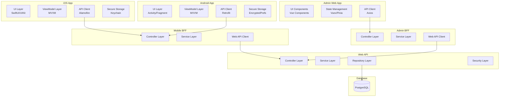
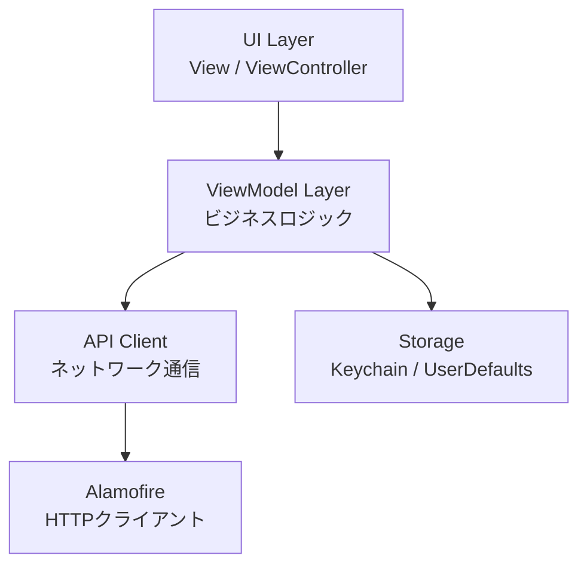
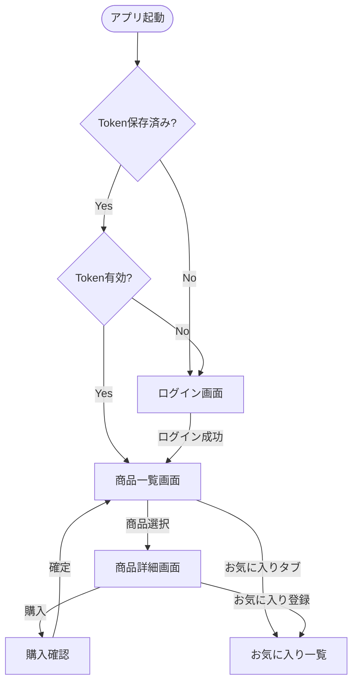
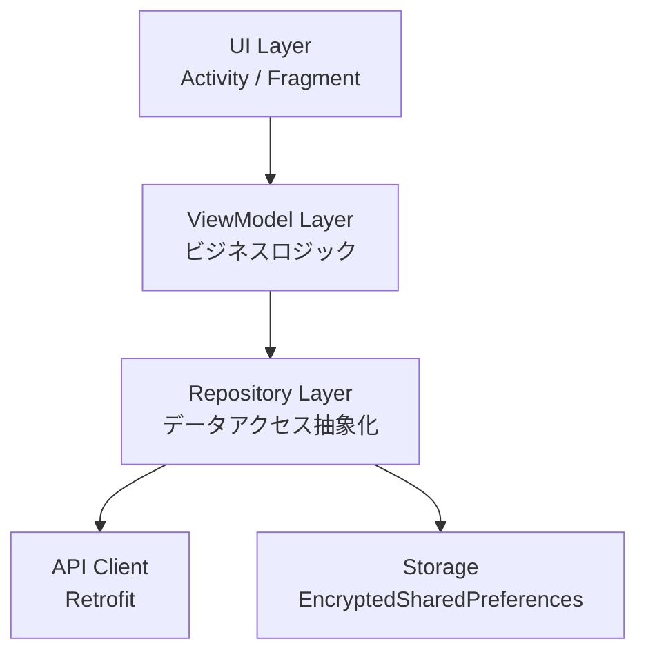
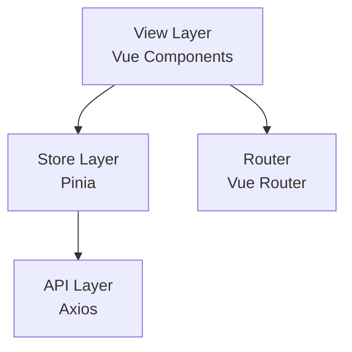
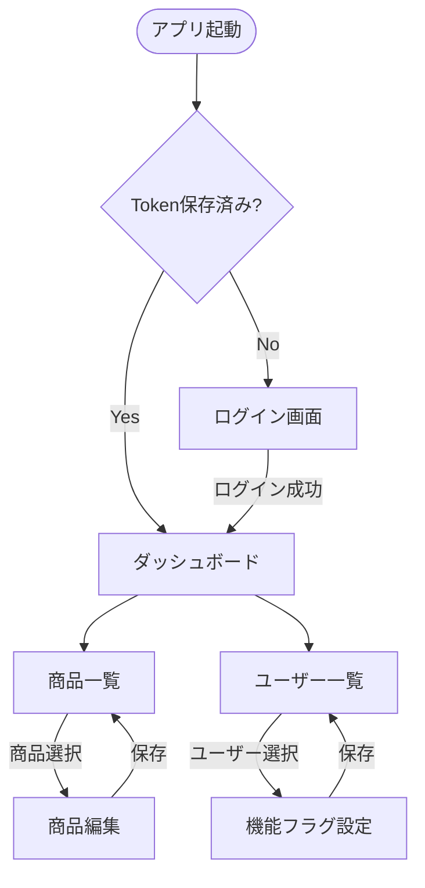
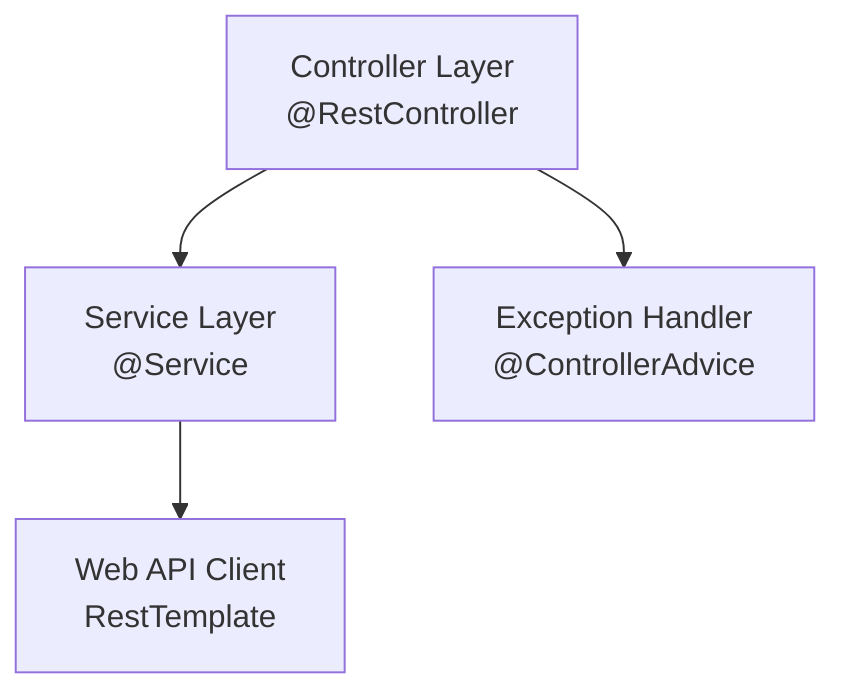
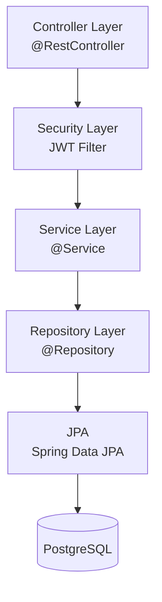

# [削除予定] コンポーネント設計

> **このファイルは削除予定です**
>
> 内容は以下のファイルに分割されました：
> - `02-01-client-components.md` - クライアント層コンポーネント（944行）
> - `02-02-bff-components.md` - BFF層コンポーネント（864行）
> - `02-03-api-components.md` - API層コンポーネント（827行）
> - `02-04-api-data-layer.md` - API層データレイヤー（1066行）
>
> **レビュー完了後に`git rm docs/architecture/02-component-design.md`コマンドで削除してください。**

---

**End of Document**

## 2. コンポーネント全体図（C4モデル Level 3）



## 3. iOS アプリコンポーネント

### 3.1 技術スタック

| 項目 | 技術 | バージョン |
|------|------|----------|
| 言語 | Swift | latest |
| 最小OS | iOS | 15.0以上 |
| アーキテクチャ | MVVM | - |
| UI Framework | SwiftUI / UIKit | 併用可 |
| HTTPクライアント | Alamofire | latest |
| セキュアストレージ | KeychainSwift | latest |
| JSON解析 | Codable | 標準 |

### 3.2 レイヤー構造



### 3.3 ディレクトリ構造

```
MobileApp/
├── App/
│   ├── AppDelegate.swift
│   └── SceneDelegate.swift
├── Models/
│   ├── User.swift
│   ├── Product.swift
│   ├── Purchase.swift
│   └── Favorite.swift
├── ViewModels/
│   ├── LoginViewModel.swift
│   ├── ProductListViewModel.swift
│   ├── ProductDetailViewModel.swift
│   └── FavoriteViewModel.swift
├── Views/
│   ├── Login/
│   │   └── LoginView.swift
│   ├── ProductList/
│   │   └── ProductListView.swift
│   ├── ProductDetail/
│   │   └── ProductDetailView.swift
│   └── Favorite/
│       └── FavoriteView.swift
├── Services/
│   ├── APIClient.swift
│   ├── AuthService.swift
│   ├── ProductService.swift
│   └── FavoriteService.swift
├── Utils/
│   ├── KeychainManager.swift
│   ├── NetworkMonitor.swift
│   └── Constants.swift
└── Resources/
    ├── Assets.xcassets
    └── Info.plist
```

### 3.4 主要クラス設計

#### APIClient（シングルトン）

```swift
class APIClient {
    static let shared = APIClient()
    private let baseURL = "http://localhost:8081/api/mobile"
    private let session: Session
    
    private init() {
        let configuration = URLSessionConfiguration.default
        configuration.timeoutIntervalForRequest = 10.0
        self.session = Session(configuration: configuration)
    }
    
    func request<T: Decodable>(
        _ endpoint: String,
        method: HTTPMethod,
        parameters: Parameters? = nil,
        headers: HTTPHeaders? = nil
    ) async throws -> T {
        // 実装
    }
}
```

#### KeychainManager

```swift
class KeychainManager {
    private let keychain = KeychainSwift()
    private let jwtTokenKey = "jwt_token"
    
    func saveToken(_ token: String) {
        keychain.set(token, forKey: jwtTokenKey)
    }
    
    func getToken() -> String? {
        return keychain.get(jwtTokenKey)
    }
    
    func deleteToken() {
        keychain.delete(jwtTokenKey)
    }
}
```

### 3.5 画面遷移図



## 4. Android アプリコンポーネント

### 4.1 技術スタック

| 項目 | 技術 | バージョン |
|------|------|----------|
| 言語 | Java | latest |
| 最小API | Android | 10.0（API 29）以上 |
| アーキテクチャ | MVVM | - |
| UI Framework | Activity / Fragment | 標準 |
| HTTPクライアント | Retrofit + OkHttp | latest |
| セキュアストレージ | EncryptedSharedPreferences | latest |
| JSON解析 | Gson / Moshi | latest |
| 非同期処理 | RxJava / Coroutines | latest |

### 4.2 レイヤー構造



### 4.3 ディレクトリ構造

```
app/
├── src/
│   └── main/
│       ├── java/com/example/mobileapp/
│       │   ├── ui/
│       │   │   ├── login/
│       │   │   │   ├── LoginActivity.java
│       │   │   │   └── LoginViewModel.java
│       │   │   ├── productlist/
│       │   │   │   ├── ProductListFragment.java
│       │   │   │   └── ProductListViewModel.java
│       │   │   ├── productdetail/
│       │   │   │   ├── ProductDetailActivity.java
│       │   │   │   └── ProductDetailViewModel.java
│       │   │   └── favorite/
│       │   │       ├── FavoriteFragment.java
│       │   │       └── FavoriteViewModel.java
│       │   ├── data/
│       │   │   ├── model/
│       │   │   │   ├── User.java
│       │   │   │   ├── Product.java
│       │   │   │   └── Favorite.java
│       │   │   ├── repository/
│       │   │   │   ├── AuthRepository.java
│       │   │   │   ├── ProductRepository.java
│       │   │   │   └── FavoriteRepository.java
│       │   │   └── api/
│       │   │       ├── ApiClient.java
│       │   │       ├── ApiService.java
│       │   │       └── AuthInterceptor.java
│       │   ├── util/
│       │   │   ├── SecureStorageManager.java
│       │   │   ├── NetworkMonitor.java
│       │   │   └── Constants.java
│       │   └── MobileApplication.java
│       └── res/
│           ├── layout/
│           ├── values/
│           └── drawable/
└── build.gradle
```

### 4.4 主要クラス設計

#### ApiClient（シングルトン）

```java
public class ApiClient {
    private static ApiClient instance;
    private static final String BASE_URL = "http://10.0.2.2:8081/api/mobile/";
    private Retrofit retrofit;
    
    private ApiClient() {
        OkHttpClient client = new OkHttpClient.Builder()
            .connectTimeout(10, TimeUnit.SECONDS)
            .readTimeout(10, TimeUnit.SECONDS)
            .addInterceptor(new AuthInterceptor())
            .build();
        
        retrofit = new Retrofit.Builder()
            .baseUrl(BASE_URL)
            .client(client)
            .addConverterFactory(GsonConverterFactory.create())
            .build();
    }
    
    public static synchronized ApiClient getInstance() {
        if (instance == null) {
            instance = new ApiClient();
        }
        return instance;
    }
    
    public ApiService getApiService() {
        return retrofit.create(ApiService.class);
    }
}
```

#### SecureStorageManager

```java
public class SecureStorageManager {
    private static final String PREFS_NAME = "secure_prefs";
    private static final String KEY_JWT_TOKEN = "jwt_token";
    private SharedPreferences sharedPreferences;
    
    public SecureStorageManager(Context context) {
        try {
            MasterKey masterKey = new MasterKey.Builder(context)
                .setKeyScheme(MasterKey.KeyScheme.AES256_GCM)
                .build();
            
            sharedPreferences = EncryptedSharedPreferences.create(
                context,
                PREFS_NAME,
                masterKey,
                EncryptedSharedPreferences.PrefKeyEncryptionScheme.AES256_SIV,
                EncryptedSharedPreferences.PrefValueEncryptionScheme.AES256_GCM
            );
        } catch (Exception e) {
            Log.e("SecureStorage", "Failed to initialize", e);
        }
    }
    
    public void saveToken(String token) {
        sharedPreferences.edit().putString(KEY_JWT_TOKEN, token).apply();
    }
    
    public String getToken() {
        return sharedPreferences.getString(KEY_JWT_TOKEN, null);
    }
    
    public void deleteToken() {
        sharedPreferences.edit().remove(KEY_JWT_TOKEN).apply();
    }
}
```

## 5. 管理Webアプリコンポーネント

### 5.1 技術スタック

| 項目 | 技術 | バージョン |
|------|------|----------|
| 言語 | JavaScript | ES6+ |
| フレームワーク | Vue.js | latest (3.x) |
| 状態管理 | Pinia | latest |
| ルーティング | Vue Router | latest |
| HTTPクライアント | Axios | latest |
| UIライブラリ | Element Plus / Vuetify | latest（選択可） |
| ビルドツール | Vite | latest |
| 静的解析 | ESLint | latest |

### 5.2 レイヤー構造



### 5.3 ディレクトリ構造

```
admin-web/
├── public/
│   └── index.html
├── src/
│   ├── main.js
│   ├── App.vue
│   ├── router/
│   │   └── index.js
│   ├── stores/
│   │   ├── auth.js
│   │   ├── product.js
│   │   └── user.js
│   ├── views/
│   │   ├── Login.vue
│   │   ├── ProductList.vue
│   │   ├── ProductEdit.vue
│   │   ├── UserList.vue
│   │   └── FeatureFlagManagement.vue
│   ├── components/
│   │   ├── common/
│   │   │   ├── Header.vue
│   │   │   ├── Sidebar.vue
│   │   │   └── Loading.vue
│   │   └── product/
│   │       ├── ProductTable.vue
│   │       └── ProductForm.vue
│   ├── api/
│   │   ├── client.js
│   │   ├── auth.js
│   │   ├── product.js
│   │   └── user.js
│   ├── utils/
│   │   ├── constants.js
│   │   ├── validator.js
│   │   └── formatter.js
│   └── assets/
│       ├── styles/
│       └── images/
├── package.json
├── vite.config.js
└── .eslintrc.js
```

### 5.4 主要モジュール設計

#### API Client（api/client.js）

```javascript
import axios from 'axios';

const apiClient = axios.create({
  baseURL: 'http://localhost:8082/api/admin',
  timeout: 10000,
  headers: {
    'Content-Type': 'application/json',
  },
});

// リクエストインターセプター
apiClient.interceptors.request.use(
  (config) => {
    const token = localStorage.getItem('jwt_token');
    if (token) {
      config.headers.Authorization = `Bearer ${token}`;
    }
    return config;
  },
  (error) => {
    return Promise.reject(error);
  }
);

// レスポンスインターセプター
apiClient.interceptors.response.use(
  (response) => {
    return response;
  },
  (error) => {
    if (error.response && error.response.status === 401) {
      // 認証エラー時はログイン画面へリダイレクト
      localStorage.removeItem('jwt_token');
      window.location.href = '/login';
    }
    return Promise.reject(error);
  }
);

export default apiClient;
```

#### Auth Store（stores/auth.js）

```javascript
import { defineStore } from 'pinia';
import { login } from '@/api/auth';

export const useAuthStore = defineStore('auth', {
  state: () => ({
    token: localStorage.getItem('jwt_token') || null,
    user: null,
    isAuthenticated: false,
  }),
  
  actions: {
    async login(loginId, password) {
      try {
        const response = await login(loginId, password);
        this.token = response.data.token;
        this.isAuthenticated = true;
        localStorage.setItem('jwt_token', this.token);
        return true;
      } catch (error) {
        console.error('Login failed:', error);
        return false;
      }
    },
    
    logout() {
      this.token = null;
      this.user = null;
      this.isAuthenticated = false;
      localStorage.removeItem('jwt_token');
    },
  },
});
```

### 5.5 画面遷移図



## 6. Mobile BFF コンポーネント

### 6.1 技術スタック

| 項目 | 技術 | バージョン |
|------|------|----------|
| 言語 | Java | latest |
| フレームワーク | Spring Boot | latest |
| ビルドツール | Maven / Gradle | latest |
| HTTPクライアント | RestTemplate / WebClient | Spring標準 |
| ログ | SLF4J + Logback | Spring標準 |

### 6.2 レイヤー構造



### 6.3 パッケージ構造

```
mobile-bff/
├── src/
│   ├── main/
│   │   ├── java/com/example/mobilebff/
│   │   │   ├── MobileBffApplication.java
│   │   │   ├── controller/
│   │   │   │   ├── AuthController.java
│   │   │   │   ├── ProductController.java
│   │   │   │   ├── PurchaseController.java
│   │   │   │   └── FavoriteController.java
│   │   │   ├── service/
│   │   │   │   ├── AuthService.java
│   │   │   │   ├── ProductService.java
│   │   │   │   ├── PurchaseService.java
│   │   │   │   └── FavoriteService.java
│   │   │   ├── client/
│   │   │   │   └── WebApiClient.java
│   │   │   ├── dto/
│   │   │   │   ├── request/
│   │   │   │   └── response/
│   │   │   ├── exception/
│   │   │   │   ├── GlobalExceptionHandler.java
│   │   │   │   └── BffException.java
│   │   │   └── config/
│   │   │       ├── RestTemplateConfig.java
│   │   │       └── CorsConfig.java
│   │   └── resources/
│   │       ├── application.yml
│   │       └── logback-spring.xml
│   └── test/
└── pom.xml
```

### 6.4 主要クラス設計

#### ProductController

```java
@RestController
@RequestMapping("/api/mobile/products")
@RequiredArgsConstructor
public class ProductController {
    private final ProductService productService;
    
    @GetMapping
    public ResponseEntity<ApiResponse<List<ProductDto>>> getProducts(
        @RequestHeader("Authorization") String token
    ) {
        List<ProductDto> products = productService.getProducts(token);
        return ResponseEntity.ok(ApiResponse.success(products));
    }
    
    @GetMapping("/{id}")
    public ResponseEntity<ApiResponse<ProductDto>> getProduct(
        @PathVariable Long id,
        @RequestHeader("Authorization") String token
    ) {
        ProductDto product = productService.getProduct(id, token);
        return ResponseEntity.ok(ApiResponse.success(product));
    }
}
```

#### WebApiClient

```java
@Component
@RequiredArgsConstructor
public class WebApiClient {
    private final RestTemplate restTemplate;
    
    @Value("${webapi.base-url}")
    private String webApiBaseUrl;
    
    public <T> T get(String endpoint, String token, Class<T> responseType) {
        HttpHeaders headers = new HttpHeaders();
        headers.set("Authorization", token);
        HttpEntity<Void> entity = new HttpEntity<>(headers);
        
        try {
            ResponseEntity<T> response = restTemplate.exchange(
                webApiBaseUrl + endpoint,
                HttpMethod.GET,
                entity,
                responseType
            );
            return response.getBody();
        } catch (HttpClientErrorException | HttpServerErrorException e) {
            throw new BffException("Web API呼び出し失敗", e);
        }
    }
}
```

## 7. Admin BFF コンポーネント

### 7.1 技術スタック

Mobile BFFと同様の技術スタックを使用

### 7.2 パッケージ構造

```
admin-bff/
├── src/
│   ├── main/
│   │   ├── java/com/example/adminbff/
│   │   │   ├── AdminBffApplication.java
│   │   │   ├── controller/
│   │   │   │   ├── AuthController.java
│   │   │   │   ├── ProductController.java
│   │   │   │   └── UserController.java
│   │   │   ├── service/
│   │   │   │   ├── AuthService.java
│   │   │   │   ├── ProductService.java
│   │   │   │   └── UserService.java
│   │   │   ├── client/
│   │   │   │   └── WebApiClient.java
│   │   │   ├── dto/
│   │   │   ├── exception/
│   │   │   └── config/
│   │   └── resources/
│   │       └── application.yml
│   └── test/
└── pom.xml
```

## 8. Web API コンポーネント

### 8.1 技術スタック

| 項目 | 技術 | バージョン |
|------|------|----------|
| 言語 | Java | latest |
| フレームワーク | Spring Boot | latest |
| セキュリティ | Spring Security | latest |
| データアクセス | Spring Data JPA | latest |
| JWT | jjwt | latest |
| バリデーション | Hibernate Validator | Spring標準 |

### 8.2 レイヤー構造



### 8.3 パッケージ構造

```
web-api/
├── src/
│   ├── main/
│   │   ├── java/com/example/webapi/
│   │   │   ├── WebApiApplication.java
│   │   │   ├── controller/
│   │   │   │   ├── AuthController.java
│   │   │   │   ├── ProductController.java
│   │   │   │   ├── PurchaseController.java
│   │   │   │   ├── FavoriteController.java
│   │   │   │   └── AdminController.java
│   │   │   ├── service/
│   │   │   │   ├── AuthService.java
│   │   │   │   ├── ProductService.java
│   │   │   │   ├── PurchaseService.java
│   │   │   │   ├── FavoriteService.java
│   │   │   │   └── FeatureFlagService.java
│   │   │   ├── repository/
│   │   │   │   ├── UserRepository.java
│   │   │   │   ├── ProductRepository.java
│   │   │   │   ├── PurchaseRepository.java
│   │   │   │   ├── FavoriteRepository.java
│   │   │   │   ├── FeatureFlagRepository.java
│   │   │   │   └── UserFeatureFlagRepository.java
│   │   │   ├── entity/
│   │   │   │   ├── User.java
│   │   │   │   ├── Product.java
│   │   │   │   ├── Purchase.java
│   │   │   │   ├── Favorite.java
│   │   │   │   ├── FeatureFlag.java
│   │   │   │   └── UserFeatureFlag.java
│   │   │   ├── dto/
│   │   │   │   ├── request/
│   │   │   │   └── response/
│   │   │   ├── security/
│   │   │   │   ├── JwtTokenProvider.java
│   │   │   │   ├── JwtAuthenticationFilter.java
│   │   │   │   └── SecurityConfig.java
│   │   │   ├── exception/
│   │   │   │   ├── GlobalExceptionHandler.java
│   │   │   │   └── CustomException.java
│   │   │   └── config/
│   │   │       └── JpaConfig.java
│   │   └── resources/
│   │       ├── application.yml
│   │       └── logback-spring.xml
│   └── test/
└── pom.xml
```

### 8.4 主要クラス設計

#### ProductService

```java
@Service
@RequiredArgsConstructor
@Transactional
public class ProductService {
    private final ProductRepository productRepository;
    
    @Transactional(readOnly = true)
    public List<Product> getAllProducts() {
        return productRepository.findAll();
    }
    
    @Transactional(readOnly = true)
    public Product getProductById(Long id) {
        return productRepository.findById(id)
            .orElseThrow(() -> new ResourceNotFoundException("商品が見つかりません"));
    }
    
    public Product updateProduct(Long id, ProductRequest request) {
        Product product = getProductById(id);
        product.setProductName(request.getProductName());
        product.setUnitPrice(request.getUnitPrice());
        return productRepository.save(product);
    }
}
```

#### JwtTokenProvider

```java
@Component
public class JwtTokenProvider {
    @Value("${jwt.secret}")
    private String secretKey;
    
    @Value("${jwt.expiration}")
    private long validityInMilliseconds = 86400000; // 24時間
    
    public String createToken(User user) {
        Claims claims = Jwts.claims().setSubject(user.getUserId().toString());
        claims.put("loginId", user.getLoginId());
        claims.put("userType", user.getUserType());
        
        Date now = new Date();
        Date validity = new Date(now.getTime() + validityInMilliseconds);
        
        return Jwts.builder()
            .setClaims(claims)
            .setIssuedAt(now)
            .setExpiration(validity)
            .signWith(SignatureAlgorithm.HS256, secretKey)
            .compact();
    }
    
    public boolean validateToken(String token) {
        try {
            Jws<Claims> claims = Jwts.parser()
                .setSigningKey(secretKey)
                .parseClaimsJws(token);
            return !claims.getBody().getExpiration().before(new Date());
        } catch (JwtException | IllegalArgumentException e) {
            return false;
        }
    }
}
```

## 9. コンポーネント間通信

### 9.1 通信プロトコル

| 送信元 | 送信先 | プロトコル | 認証 |
|-------|-------|----------|------|
| iOS/Android | Mobile BFF | HTTPS/REST | JWT（ログイン後） |
| Vue.js | Admin BFF | HTTPS/REST | JWT（ログイン後） |
| Mobile BFF | Web API | HTTP/REST | JWT転送 |
| Admin BFF | Web API | HTTP/REST | JWT転送 |
| Web API | PostgreSQL | JDBC | DB認証 |

### 9.2 データ形式

**JSON形式統一**:
- Content-Type: application/json
- Accept: application/json
- 文字コード: UTF-8

## 10. 共通ライブラリ・ユーティリティ

### 10.1 Java共通ライブラリ

| ライブラリ | 用途 | 使用コンポーネント |
|-----------|------|----------------|
| Lombok | ボイラープレートコード削減 | 全Javaコンポーネント |
| MapStruct | DTO/Entityマッピング | Web API |
| Apache Commons | 汎用ユーティリティ | 全Javaコンポーネント |

### 10.2 エラーハンドリング統一

全コンポーネントで統一されたエラーレスポンス形式を使用:

```json
{
  "error": {
    "code": "ERROR_CODE",
    "message": "エラーメッセージ",
    "details": "詳細情報（オプション）"
  },
  "timestamp": "2025-01-08T12:00:00Z"
}
```

## 11. 参照ドキュメント

| ドキュメント | パス |
|------------|------|
| アーキテクチャ概要 | `00-overview.md` |
| APIアーキテクチャ | `04-api-architecture.md` |
| セキュリティアーキテクチャ | `05-security-architecture.md` |
| コーディング規約 | `09-coding-standards.md` |
| 依存関係管理 | `10-dependency-management.md` |

---

**End of Document**
