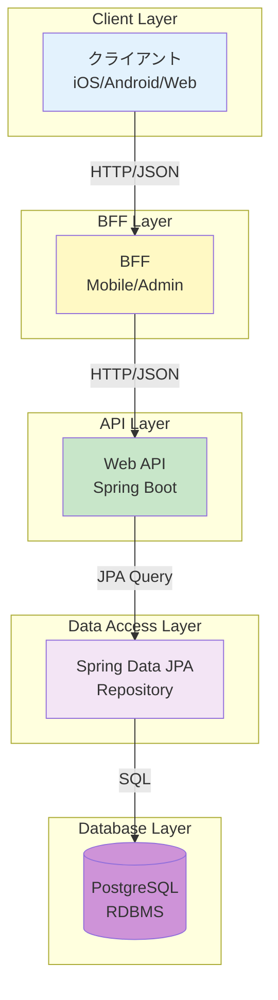
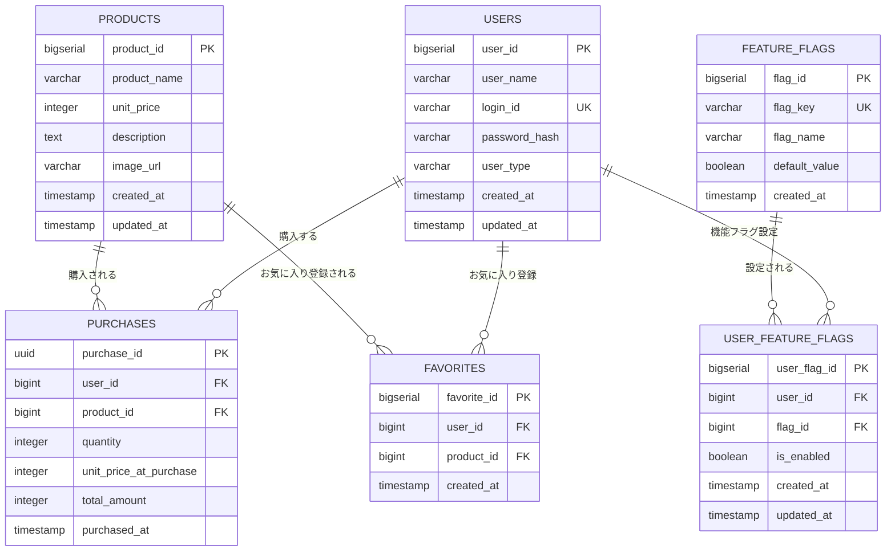
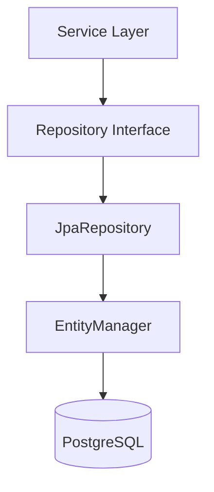
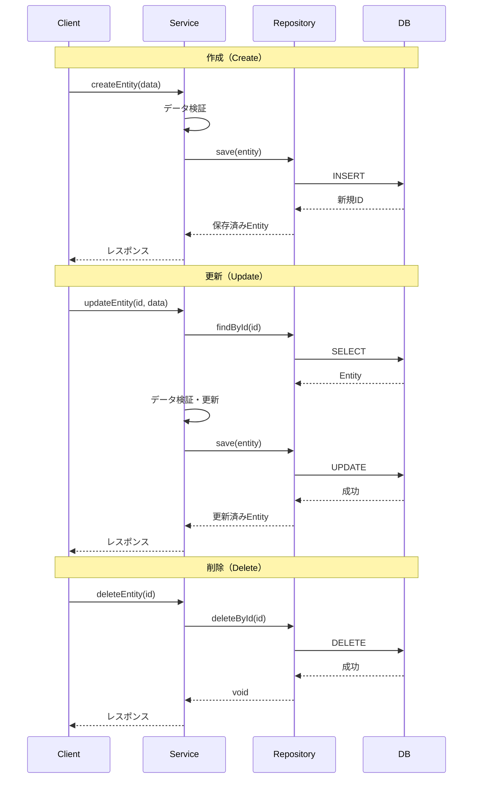

# データアーキテクチャ

> 最終更新: 2025-01-08  
> ステータス: Draft  
> バージョン: 1.0

## 変更履歴

| バージョン | 日付 | 変更内容 | 関連機能 |
|-----------|------|---------|---------|
| 1.0 | 2025-01-08 | 初版作成 | mobile-app-system |

---

## 1. データアーキテクチャ概要

本ドキュメントでは、mobile-app-system のデータアーキテクチャを定義します。
データモデル、データアクセスパターン、データライフサイクルを明確にします。

## 2. データアーキテクチャ戦略

### 2.1 データストア戦略

| 層 | データストア | 用途 |
|---|------------|------|
| **永続層** | PostgreSQL | マスターデータ、トランザクションデータ |
| **キャッシュ層** | なし | デモ用途のため不要 |
| **クライアント層** | Keychain/EncryptedPrefs/localStorage | JWT Token保存 |

### 2.2 データアクセスパターン



### 2.3 トランザクション戦略

| トランザクション種別 | 分離レベル | 説明 |
|-----------------|----------|------|
| **読み取り専用** | READ COMMITTED | SELECT クエリ |
| **更新トランザクション** | READ COMMITTED | INSERT, UPDATE, DELETE |
| **購入トランザクション** | READ COMMITTED | 購入履歴登録 |

**デモ用途のため以下は実装しない**:
- 分散トランザクション
- 2相コミット
- SAGA パターン

## 3. データモデル

### 3.1 ER図（エンティティ関連図）



### 3.2 テーブル一覧

| テーブル名 | 論理名 | 行数（想定） | 説明 |
|-----------|-------|------------|------|
| users | ユーザー | 100 | エンドユーザーと管理者 |
| products | 商品 | 100 | 商品マスタ |
| purchases | 購入履歴 | 10,000 | 商品購入トランザクション |
| favorites | お気に入り | 1,000 | ユーザーのお気に入り商品 |
| feature_flags | 機能フラグマスタ | 10 | 機能フラグ定義 |
| user_feature_flags | ユーザー別機能フラグ | 1,000 | ユーザーごとの機能設定 |

### 3.3 エンティティ設計

#### User Entity

```java
@Entity
@Table(name = "users")
@Data
@NoArgsConstructor
@AllArgsConstructor
public class User {
    @Id
    @GeneratedValue(strategy = GenerationType.IDENTITY)
    @Column(name = "user_id")
    private Long userId;
    
    @Column(name = "user_name", nullable = false, length = 100)
    private String userName;
    
    @Column(name = "login_id", nullable = false, unique = true, length = 50)
    private String loginId;
    
    @Column(name = "password_hash", nullable = false, length = 255)
    private String passwordHash;
    
    @Column(name = "user_type", nullable = false, length = 20)
    @Enumerated(EnumType.STRING)
    private UserType userType;
    
    @Column(name = "created_at", nullable = false, updatable = false)
    @CreationTimestamp
    private LocalDateTime createdAt;
    
    @Column(name = "updated_at", nullable = false)
    @UpdateTimestamp
    private LocalDateTime updatedAt;
    
    @OneToMany(mappedBy = "user", cascade = CascadeType.ALL)
    private List<Purchase> purchases;
    
    @OneToMany(mappedBy = "user", cascade = CascadeType.ALL)
    private List<Favorite> favorites;
}

public enum UserType {
    USER,
    ADMIN
}
```

#### Product Entity

```java
@Entity
@Table(name = "products")
@Data
@NoArgsConstructor
@AllArgsConstructor
public class Product {
    @Id
    @GeneratedValue(strategy = GenerationType.IDENTITY)
    @Column(name = "product_id")
    private Long productId;
    
    @Column(name = "product_name", nullable = false, length = 100)
    private String productName;
    
    @Column(name = "unit_price", nullable = false)
    private Integer unitPrice;
    
    @Column(name = "description", columnDefinition = "TEXT")
    private String description;
    
    @Column(name = "image_url", length = 500)
    private String imageUrl;
    
    @Column(name = "created_at", nullable = false, updatable = false)
    @CreationTimestamp
    private LocalDateTime createdAt;
    
    @Column(name = "updated_at", nullable = false)
    @UpdateTimestamp
    private LocalDateTime updatedAt;
}
```

#### Purchase Entity

```java
@Entity
@Table(name = "purchases")
@Data
@NoArgsConstructor
@AllArgsConstructor
public class Purchase {
    @Id
    @GeneratedValue(strategy = GenerationType.AUTO)
    @Column(name = "purchase_id", columnDefinition = "UUID")
    private UUID purchaseId;
    
    @ManyToOne(fetch = FetchType.LAZY)
    @JoinColumn(name = "user_id", nullable = false)
    private User user;
    
    @ManyToOne(fetch = FetchType.LAZY)
    @JoinColumn(name = "product_id", nullable = false)
    private Product product;
    
    @Column(name = "quantity", nullable = false)
    private Integer quantity;
    
    @Column(name = "unit_price_at_purchase", nullable = false)
    private Integer unitPriceAtPurchase;
    
    @Column(name = "total_amount", nullable = false)
    private Integer totalAmount;
    
    @Column(name = "purchased_at", nullable = false)
    @CreationTimestamp
    private LocalDateTime purchasedAt;
}
```

## 4. データアクセス層

### 4.1 Repository パターン



### 4.2 Repository インターフェース設計

#### UserRepository

```java
@Repository
public interface UserRepository extends JpaRepository<User, Long> {
    
    /**
     * ログインIDでユーザーを検索
     */
    Optional<User> findByLoginId(String loginId);
    
    /**
     * ユーザー種別でユーザーを検索
     */
    List<User> findByUserType(UserType userType);
    
    /**
     * ログインIDの存在チェック
     */
    boolean existsByLoginId(String loginId);
}
```

#### ProductRepository

```java
@Repository
public interface ProductRepository extends JpaRepository<Product, Long> {
    
    /**
     * 商品名で部分一致検索（大文字小文字区別なし）
     */
    @Query("SELECT p FROM Product p WHERE LOWER(p.productName) LIKE LOWER(CONCAT('%', :keyword, '%'))")
    List<Product> searchByKeyword(@Param("keyword") String keyword);
    
    /**
     * 価格範囲で検索
     */
    List<Product> findByUnitPriceBetween(Integer minPrice, Integer maxPrice);
    
    /**
     * 作成日時の降順で全商品取得
     */
    List<Product> findAllByOrderByCreatedAtDesc();
}
```

#### PurchaseRepository

```java
@Repository
public interface PurchaseRepository extends JpaRepository<Purchase, UUID> {
    
    /**
     * ユーザーIDで購入履歴を取得（購入日時降順）
     */
    List<Purchase> findByUserUserIdOrderByPurchasedAtDesc(Long userId);
    
    /**
     * 商品IDで購入履歴を取得
     */
    List<Purchase> findByProductProductId(Long productId);
    
    /**
     * 特定期間の購入履歴を取得
     */
    @Query("SELECT p FROM Purchase p WHERE p.purchasedAt BETWEEN :startDate AND :endDate")
    List<Purchase> findByPurchasedAtBetween(
        @Param("startDate") LocalDateTime startDate,
        @Param("endDate") LocalDateTime endDate
    );
}
```

#### FavoriteRepository

```java
@Repository
public interface FavoriteRepository extends JpaRepository<Favorite, Long> {
    
    /**
     * ユーザーIDでお気に入り一覧を取得
     */
    List<Favorite> findByUserUserId(Long userId);
    
    /**
     * ユーザーと商品の組み合わせで検索
     */
    Optional<Favorite> findByUserUserIdAndProductProductId(Long userId, Long productId);
    
    /**
     * ユーザーと商品の組み合わせの存在チェック
     */
    boolean existsByUserUserIdAndProductProductId(Long userId, Long productId);
    
    /**
     * ユーザーと商品の組み合わせで削除
     */
    void deleteByUserUserIdAndProductProductId(Long userId, Long productId);
}
```

### 4.3 カスタムクエリ戦略

| クエリ種別 | 実装方法 | 使用ケース |
|----------|---------|-----------|
| **シンプルなクエリ** | メソッド名規約 | `findByLoginId` |
| **複雑な検索** | @Query アノテーション | LIKE検索、範囲検索 |
| **集計クエリ** | @Query + ネイティブSQL | 統計情報取得（将来拡張） |
| **動的クエリ** | Specification | 将来拡張時 |

## 5. データライフサイクル

### 5.1 データの作成・更新・削除



### 5.2 データ整合性管理

#### タイムスタンプ管理

全テーブルに以下のタイムスタンプカラムを持つ:

```java
@Column(name = "created_at", nullable = false, updatable = false)
@CreationTimestamp
private LocalDateTime createdAt;

@Column(name = "updated_at", nullable = false)
@UpdateTimestamp
private LocalDateTime updatedAt;
```

**例外**: `purchases` テーブルは履歴データのため `updated_at` なし

#### 楽観的ロック（将来拡張）

```java
@Version
@Column(name = "version")
private Long version;
```

**注意**: デモ用途のため、現時点では実装しない

## 6. データ移行・初期化

### 6.1 初期化スクリプト構成

```
docker/postgres/init/
├── 01_create_database.sql     -- データベース作成
├── 02_create_tables.sql       -- テーブル作成
├── 03_create_indexes.sql      -- インデックス作成
├── 04_insert_master_data.sql  -- マスタデータ投入
└── 05_insert_sample_data.sql  -- サンプルデータ投入
```

### 6.2 初期データ要件

| データ種別 | 件数 | 内容 |
|-----------|------|------|
| 管理者ユーザー | 1件 | `admin001` / `password123` |
| エンドユーザー | 10件 | `user001-010` / `password123` |
| 商品 | 20件 | 商品A-T、単価1000-20000円 |
| 機能フラグ | 1件 | お気に入り機能フラグ |
| お気に入り | 5件 | サンプルお気に入りデータ |
| 購入履歴 | 10件 | サンプル購入データ |

### 6.3 サンプルデータ投入スクリプト

#### ユーザーデータ

```sql
-- 管理者ユーザー
INSERT INTO users (user_name, login_id, password_hash, user_type) 
VALUES 
    ('管理者', 'admin001', '$2a$10$...', 'admin');

-- エンドユーザー
INSERT INTO users (user_name, login_id, password_hash, user_type) 
VALUES 
    ('山田太郎', 'user001', '$2a$10$...', 'user'),
    ('佐藤花子', 'user002', '$2a$10$...', 'user'),
    ('鈴木一郎', 'user003', '$2a$10$...', 'user'),
    ('田中次郎', 'user004', '$2a$10$...', 'user'),
    ('伊藤三郎', 'user005', '$2a$10$...', 'user'),
    ('渡辺四郎', 'user006', '$2a$10$...', 'user'),
    ('高橋五郎', 'user007', '$2a$10$...', 'user'),
    ('小林六郎', 'user008', '$2a$10$...', 'user'),
    ('中村七郎', 'user009', '$2a$10$...', 'user'),
    ('加藤八郎', 'user010', '$2a$10$...', 'user');
```

#### 商品データ

```sql
INSERT INTO products (product_name, unit_price, description, image_url) 
VALUES 
    ('商品A', 1000, '商品Aの説明文です', 'https://example.com/images/product_a.jpg'),
    ('商品B', 1500, '商品Bの説明文です', 'https://example.com/images/product_b.jpg'),
    ('商品C', 2000, '商品Cの説明文です', 'https://example.com/images/product_c.jpg'),
    ('商品D', 2500, '商品Dの説明文です', 'https://example.com/images/product_d.jpg'),
    ('商品E', 3000, '商品Eの説明文です', 'https://example.com/images/product_e.jpg'),
    -- 以下略（商品F-T）
    ('商品T', 20000, '商品Tの説明文です', 'https://example.com/images/product_t.jpg');
```

## 7. データベース最適化

### 7.1 インデックス戦略

#### プライマリインデックス

全テーブルに主キーインデックスを作成（自動生成）

#### セカンダリインデックス

```sql
-- ユーザーテーブル
CREATE UNIQUE INDEX idx_users_login_id ON users(login_id);
CREATE INDEX idx_users_user_type ON users(user_type);

-- 商品テーブル
CREATE INDEX idx_products_product_name ON products(product_name);

-- 購入履歴テーブル
CREATE INDEX idx_purchases_user_id ON purchases(user_id);
CREATE INDEX idx_purchases_product_id ON purchases(product_id);
CREATE INDEX idx_purchases_purchased_at ON purchases(purchased_at);

-- お気に入りテーブル
CREATE UNIQUE INDEX idx_favorites_user_product ON favorites(user_id, product_id);

-- 機能フラグマスタ
CREATE UNIQUE INDEX idx_feature_flags_flag_key ON feature_flags(flag_key);

-- ユーザー別機能フラグ
CREATE UNIQUE INDEX idx_user_feature_flags_user_flag ON user_feature_flags(user_id, flag_id);
```

### 7.2 クエリパフォーマンス

| クエリ | インデックス使用 | 推定実行時間 |
|-------|---------------|------------|
| ログイン（login_id検索） | UNIQUE INDEX | < 10ms |
| 商品一覧取得 | PRIMARY KEY | < 50ms |
| 商品検索（LIKE） | INDEX | < 100ms |
| 購入履歴取得（user_id） | INDEX | < 50ms |
| お気に入り存在チェック | UNIQUE INDEX | < 10ms |

**注意**: デモ用途のため、パフォーマンスチューニングは最小限

## 8. データバックアップ・リカバリ

### 8.1 バックアップ戦略（デモ用途）

| 項目 | 戦略 |
|------|------|
| バックアップ頻度 | 手動（必要に応じて） |
| バックアップ方式 | pg_dump |
| 保存場所 | ローカルディスク |
| 保持期間 | 規定なし |

### 8.2 バックアップコマンド

```bash
# データベース全体のバックアップ
pg_dump -U postgres -h localhost -p 5432 mobile_app_db > backup_$(date +%Y%m%d).sql

# リストア
psql -U postgres -h localhost -p 5432 mobile_app_db < backup_20250108.sql
```

**注意**: デモ用途のため、自動バックアップは実装しない

## 9. データセキュリティ

### 9.1 データ暗号化

| データ種別 | 暗号化 | 方式 |
|-----------|-------|------|
| パスワード | ✅ | bcrypt |
| 通信データ | ✅ | TLS/HTTPS |
| DB内データ | ❌ | 平文（デモ用途） |

### 9.2 アクセス制御

```sql
-- データベースユーザー作成
CREATE USER app_user WITH PASSWORD 'app_password';

-- 権限付与
GRANT SELECT, INSERT, UPDATE, DELETE ON ALL TABLES IN SCHEMA public TO app_user;
GRANT USAGE, SELECT ON ALL SEQUENCES IN SCHEMA public TO app_user;
```

### 9.3 データ監査（将来拡張）

**現時点では実装しない**:
- 監査ログテーブル
- データ変更履歴
- アクセスログ

## 10. データ品質管理

### 10.1 データバリデーション

#### DB制約

```sql
-- ユーザーテーブル
ALTER TABLE users ADD CONSTRAINT chk_user_type CHECK (user_type IN ('user', 'admin'));
ALTER TABLE users ADD CONSTRAINT chk_login_id_length CHECK (LENGTH(login_id) BETWEEN 4 AND 20);

-- 商品テーブル
ALTER TABLE products ADD CONSTRAINT chk_unit_price_positive CHECK (unit_price >= 1);

-- 購入履歴テーブル
ALTER TABLE purchases ADD CONSTRAINT chk_quantity_positive CHECK (quantity > 0);
ALTER TABLE purchases ADD CONSTRAINT chk_quantity_multiple_100 CHECK (quantity % 100 = 0);
ALTER TABLE purchases ADD CONSTRAINT chk_total_amount CHECK (total_amount = unit_price_at_purchase * quantity);
```

#### アプリケーションレベルバリデーション

```java
@Entity
@Table(name = "products")
public class Product {
    @NotNull(message = "商品名は必須です")
    @Size(min = 1, max = 100, message = "商品名は1文字以上100文字以内です")
    @Column(name = "product_name")
    private String productName;
    
    @NotNull(message = "単価は必須です")
    @Min(value = 1, message = "単価は1円以上です")
    @Column(name = "unit_price")
    private Integer unitPrice;
}
```

### 10.2 参照整合性

```sql
-- 外部キー制約
ALTER TABLE purchases 
    ADD CONSTRAINT fk_purchases_user 
    FOREIGN KEY (user_id) REFERENCES users(user_id) ON DELETE RESTRICT;

ALTER TABLE purchases 
    ADD CONSTRAINT fk_purchases_product 
    FOREIGN KEY (product_id) REFERENCES products(product_id) ON DELETE RESTRICT;

ALTER TABLE favorites 
    ADD CONSTRAINT fk_favorites_user 
    FOREIGN KEY (user_id) REFERENCES users(user_id) ON DELETE CASCADE;

ALTER TABLE favorites 
    ADD CONSTRAINT fk_favorites_product 
    FOREIGN KEY (product_id) REFERENCES products(product_id) ON DELETE CASCADE;
```

## 11. データ移行戦略（将来拡張）

**現時点では不要**:
- スキーママイグレーションツール（Flyway/Liquibase）
- データバージョニング
- ロールバック戦略

**理由**: デモ用途のため、初期化スクリプトを直接修正

## 12. 参照ドキュメント

| ドキュメント | パス |
|------------|------|
| データモデル詳細 | `/docs/specs/mobile-app-system/04-data-model.md` |
| API仕様 | `/docs/specs/mobile-app-system/05-api-spec.md` |
| セキュリティ要件 | `/docs/specs/mobile-app-system/08-security.md` |
| コンポーネント設計 | `02-component-design.md` |
| インフラストラクチャ | `06-infrastructure.md` |

---

**End of Document**
