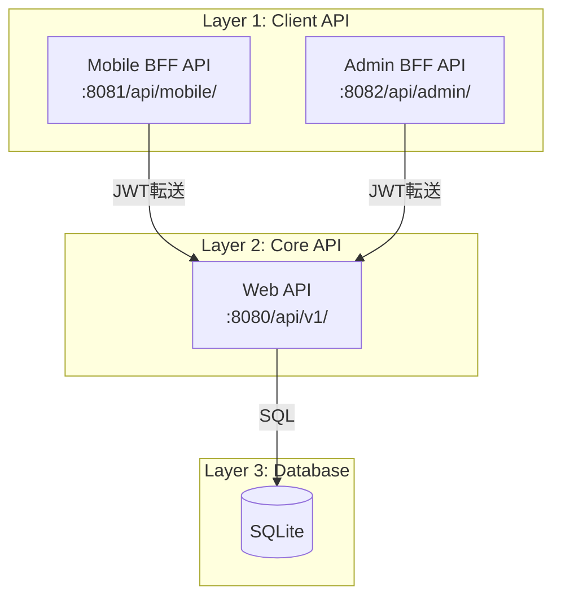
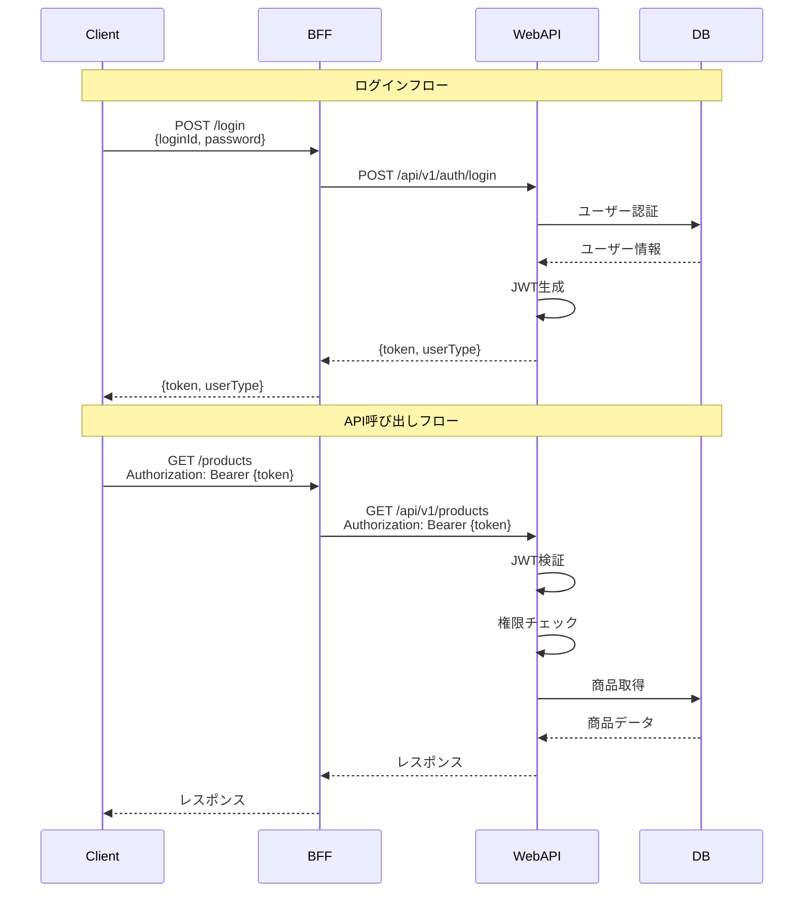

# APIアーキテクチャ

> 最終更新: 2025-01-08  
> ステータス: Draft  
> バージョン: 1.0

## 変更履歴

| バージョン | 日付 | 変更内容 | 関連機能 |
|-----------|------|---------|---------|
| 1.0 | 2025-01-08 | 初版作成 | mobile-app-system |

---

## 1. APIアーキテクチャ概要

本ドキュメントでは、mobile-app-system のAPIアーキテクチャを定義します。
REST API設計原則、エンドポイント構成、リクエスト/レスポンス仕様を明確にします。

## 2. API設計原則

### 2.1 REST原則の適用

| 原則 | 適用 | 説明 |
|-----|------|------|
| **Stateless** | ✅ | サーバーはクライアント状態を保持しない（JWT使用） |
| **Client-Server** | ✅ | クライアントとサーバーの分離 |
| **Cacheable** | ❌ | デモ用途のためキャッシュ未実装 |
| **Uniform Interface** | ✅ | 統一されたインターフェース |
| **Layered System** | ✅ | BFF層とAPI層の分離 |

### 2.2 HTTPメソッドの使用

| メソッド | 用途 | 冪等性 | 安全性 |
|---------|------|-------|-------|
| **GET** | リソース取得 | ✅ | ✅ |
| **POST** | リソース作成 | ❌ | ❌ |
| **PUT** | リソース更新（全体） | ✅ | ❌ |
| **PATCH** | リソース更新（部分） | ❌ | ❌ |
| **DELETE** | リソース削除 | ✅ | ❌ |

**本システムでの使用**: GET, POST, PUT, DELETE のみ使用

### 2.3 HTTPステータスコード

| コード | 意味 | 使用ケース |
|-------|------|-----------|
| **200 OK** | 成功 | GET, PUT, DELETE 成功 |
| **201 Created** | 作成成功 | POST 成功 |
| **400 Bad Request** | リクエスト不正 | バリデーションエラー |
| **401 Unauthorized** | 認証失敗 | トークンなし、不正、期限切れ |
| **403 Forbidden** | 権限不足 | 権限のないAPIへのアクセス |
| **404 Not Found** | リソース不存在 | 存在しないID指定 |
| **500 Internal Server Error** | サーバーエラー | 予期しないエラー |
| **503 Service Unavailable** | サービス利用不可 | BFF: Web API接続エラー |
| **504 Gateway Timeout** | タイムアウト | BFF: Web APIタイムアウト |

## 3. API階層構造

### 3.1 3層API構造



### 3.2 APIエンドポイント構成

#### Mobile BFF API（:8081）

| エンドポイント | 役割 | 転送先 |
|-------------|------|--------|
| `/api/mobile/login` | ログイン | `/api/v1/auth/login` |
| `/api/mobile/products` | 商品操作 | `/api/v1/products` |
| `/api/mobile/purchases` | 購入操作 | `/api/v1/purchases` |
| `/api/mobile/favorites` | お気に入り操作 | `/api/v1/favorites` |
| `/api/mobile/feature-flags` | 機能フラグ取得 | `/api/v1/feature-flags` |

#### Admin BFF API（:8082）

| エンドポイント | 役割 | 転送先 |
|-------------|------|--------|
| `/api/admin/login` | 管理者ログイン | `/api/v1/auth/admin/login` |
| `/api/admin/products` | 商品管理 | `/api/v1/products` |
| `/api/admin/users` | ユーザー管理 | `/api/v1/admin/users` |
| `/api/admin/users/{id}/flags/{key}` | 機能フラグ管理 | `/api/v1/admin/users/{id}/feature-flags/{key}` |

#### Web API（:8080）

| エンドポイントグループ | 説明 |
|--------------------|------|
| `/api/v1/auth/` | 認証関連 |
| `/api/v1/products/` | 商品関連 |
| `/api/v1/purchases/` | 購入関連 |
| `/api/v1/favorites/` | お気に入り関連 |
| `/api/v1/feature-flags/` | 機能フラグ関連 |
| `/api/v1/admin/` | 管理機能関連 |

## 4. リクエスト/レスポンス仕様

### 4.1 共通ヘッダー

#### リクエストヘッダー

```http
Content-Type: application/json; charset=utf-8
Accept: application/json
Authorization: Bearer {JWT_TOKEN}  # ログイン後必須
```

#### レスポンスヘッダー

```http
Content-Type: application/json; charset=utf-8
```

### 4.2 成功レスポンス形式

```json
{
  "data": {
    // レスポンスデータ
  },
  "timestamp": "2025-01-08T12:00:00Z"
}
```

**例: 商品一覧取得**

```json
{
  "data": {
    "products": [
      {
        "productId": 1,
        "productName": "商品A",
        "unitPrice": 1000,
        "description": "商品Aの説明",
        "imageUrl": "https://example.com/images/product_a.jpg"
      }
    ]
  },
  "timestamp": "2025-01-08T12:00:00Z"
}
```

### 4.3 エラーレスポンス形式

```json
{
  "error": {
    "code": "ERROR_CODE",
    "message": "エラーメッセージ",
    "details": "詳細情報（オプション）"
  },
  "timestamp": "2025-01-08T12:00:00Z"
}
```

**例: 認証エラー**

```json
{
  "error": {
    "code": "AUTH_001",
    "message": "認証トークンが無効です",
    "details": "トークンの有効期限が切れているか、形式が不正です"
  },
  "timestamp": "2025-01-08T12:00:00Z"
}
```

### 4.4 エラーコード一覧

#### 認証エラー（AUTH_xxx）

| コード | HTTPステータス | メッセージ |
|-------|--------------|-----------|
| AUTH_001 | 401 | 認証トークンが無効です |
| AUTH_002 | 401 | トークンが不正です |
| AUTH_003 | 401 | ログインIDまたはパスワードが間違っています |
| AUTH_004 | 401 | トークンの有効期限が切れています |
| AUTH_005 | 403 | この操作を実行する権限がありません |

#### バリデーションエラー（VAL_xxx）

| コード | HTTPステータス | メッセージ |
|-------|--------------|-----------|
| VAL_001 | 400 | 必須項目が入力されていません |
| VAL_002 | 400 | 入力値の形式が不正です |
| VAL_003 | 400 | 入力値が範囲外です |
| VAL_004 | 400 | 購入個数は100個単位で指定してください |

#### リソースエラー（RES_xxx）

| コード | HTTPステータス | メッセージ |
|-------|--------------|-----------|
| RES_001 | 404 | 指定されたリソースが見つかりません |
| RES_002 | 409 | リソースが既に存在します |
| RES_003 | 409 | リソースが既に削除されています |

#### システムエラー（SYS_xxx）

| コード | HTTPステータス | メッセージ |
|-------|--------------|-----------|
| SYS_001 | 500 | システムエラーが発生しました |
| SYS_002 | 503 | サービスが一時的に利用できません |
| SYS_003 | 504 | タイムアウトが発生しました |

詳細は `/docs/specs/mobile-app-system/07-error-handling.md` を参照

## 5. 認証・認可フロー

### 5.1 JWT認証フロー



### 5.2 JWT構造

#### ヘッダー

```json
{
  "alg": "HS256",
  "typ": "JWT"
}
```

#### ペイロード

```json
{
  "sub": "1",                    // ユーザーID
  "loginId": "user001",          // ログインID
  "userType": "user",            // ユーザー種別（user/admin）
  "iat": 1704700800,             // 発行日時（Unix timestamp）
  "exp": 1704787200              // 有効期限（Unix timestamp: 24時間後）
}
```

#### 署名

```
HMACSHA256(
  base64UrlEncode(header) + "." +
  base64UrlEncode(payload),
  secret
)
```

## 6. Web API エンドポイント詳細

### 6.1 認証API

#### POST /api/v1/auth/login（エンドユーザーログイン）

**リクエスト**:
```json
{
  "loginId": "user001",
  "password": "password123"
}
```

**レスポンス（200 OK）**:
```json
{
  "data": {
    "token": "eyJhbGciOiJIUzI1NiIsInR5cCI6IkpXVCJ9...",
    "userType": "user",
    "userId": 1,
    "userName": "山田太郎"
  },
  "timestamp": "2025-01-08T12:00:00Z"
}
```

---

#### POST /api/v1/auth/admin/login（管理者ログイン）

**リクエスト**:
```json
{
  "loginId": "admin001",
  "password": "adminpass123"
}
```

**レスポンス（200 OK）**:
```json
{
  "data": {
    "token": "eyJhbGciOiJIUzI1NiIsInR5cCI6IkpXVCJ9...",
    "userType": "admin",
    "userId": 101,
    "userName": "管理者"
  },
  "timestamp": "2025-01-08T12:00:00Z"
}
```

### 6.2 商品API

#### GET /api/v1/products（商品一覧取得）

**認証**: 必須（user/admin）

**レスポンス（200 OK）**:
```json
{
  "data": {
    "products": [
      {
        "productId": 1,
        "productName": "商品A",
        "unitPrice": 1000,
        "description": "商品Aの説明",
        "imageUrl": "https://example.com/images/product_a.jpg"
      }
    ]
  },
  "timestamp": "2025-01-08T12:00:00Z"
}
```

---

#### GET /api/v1/products/search?keyword={keyword}（商品検索）

**認証**: 必須（user/admin）

**クエリパラメータ**:
- `keyword`: 検索キーワード（商品名で部分一致）

**レスポンス（200 OK）**:
```json
{
  "data": {
    "products": [
      {
        "productId": 1,
        "productName": "商品A",
        "unitPrice": 1000,
        "description": "商品Aの説明",
        "imageUrl": "https://example.com/images/product_a.jpg"
      }
    ],
    "keyword": "商品A"
  },
  "timestamp": "2025-01-08T12:00:00Z"
}
```

---

#### GET /api/v1/products/{id}（商品詳細取得）

**認証**: 必須（user/admin）

**パスパラメータ**:
- `id`: 商品ID

**レスポンス（200 OK）**:
```json
{
  "data": {
    "productId": 1,
    "productName": "商品A",
    "unitPrice": 1000,
    "description": "商品Aの説明",
    "imageUrl": "https://example.com/images/product_a.jpg",
    "createdAt": "2025-01-01T00:00:00Z",
    "updatedAt": "2025-01-08T12:00:00Z"
  },
  "timestamp": "2025-01-08T12:00:00Z"
}
```

---

#### PUT /api/v1/products/{id}（商品更新）

**認証**: 必須（admin のみ）

**パスパラメータ**:
- `id`: 商品ID

**リクエスト**:
```json
{
  "productName": "商品A（改訂版）",
  "unitPrice": 1200,
  "description": "新しい説明",
  "imageUrl": "https://example.com/images/product_a_v2.jpg"
}
```

**レスポンス（200 OK）**:
```json
{
  "data": {
    "productId": 1,
    "productName": "商品A（改訂版）",
    "unitPrice": 1200,
    "description": "新しい説明",
    "imageUrl": "https://example.com/images/product_a_v2.jpg",
    "updatedAt": "2025-01-08T12:00:00Z"
  },
  "timestamp": "2025-01-08T12:00:00Z"
}
```

### 6.3 購入API

#### POST /api/v1/purchases（商品購入）

**認証**: 必須（user のみ）

**リクエスト**:
```json
{
  "productId": 1,
  "quantity": 100  // 100の倍数のみ
}
```

**バリデーション**:
- `quantity`: 100の倍数であること
- `productId`: 存在する商品ID

**レスポンス（201 Created）**:
```json
{
  "data": {
    "purchaseId": "550e8400-e29b-41d4-a716-446655440000",
    "userId": 1,
    "productId": 1,
    "productName": "商品A",
    "quantity": 100,
    "unitPrice": 1000,
    "totalAmount": 100000,
    "purchasedAt": "2025-01-08T12:00:00Z"
  },
  "timestamp": "2025-01-08T12:00:00Z"
}
```

---

#### GET /api/v1/purchases（購入履歴取得）

**認証**: 必須（user のみ）

**レスポンス（200 OK）**:
```json
{
  "data": {
    "purchases": [
      {
        "purchaseId": "550e8400-e29b-41d4-a716-446655440000",
        "productId": 1,
        "productName": "商品A",
        "quantity": 100,
        "unitPrice": 1000,
        "totalAmount": 100000,
        "purchasedAt": "2025-01-08T12:00:00Z"
      }
    ]
  },
  "timestamp": "2025-01-08T12:00:00Z"
}
```

### 6.4 お気に入りAPI

#### POST /api/v1/favorites（お気に入り登録）

**認証**: 必須（user のみ）

**リクエスト**:
```json
{
  "productId": 1
}
```

**レスポンス（201 Created）**:
```json
{
  "data": {
    "favoriteId": 1,
    "userId": 1,
    "productId": 1,
    "productName": "商品A",
    "createdAt": "2025-01-08T12:00:00Z"
  },
  "timestamp": "2025-01-08T12:00:00Z"
}
```

---

#### DELETE /api/v1/favorites/{id}（お気に入り解除）

**認証**: 必須（user のみ）

**パスパラメータ**:
- `id`: お気に入りID

**レスポンス（200 OK）**:
```json
{
  "data": {
    "message": "お気に入りを解除しました"
  },
  "timestamp": "2025-01-08T12:00:00Z"
}
```

---

#### GET /api/v1/favorites（お気に入り一覧取得）

**認証**: 必須（user のみ）

**レスポンス（200 OK）**:
```json
{
  "data": {
    "favorites": [
      {
        "favoriteId": 1,
        "productId": 1,
        "productName": "商品A",
        "unitPrice": 1000,
        "imageUrl": "https://example.com/images/product_a.jpg",
        "createdAt": "2025-01-08T12:00:00Z"
      }
    ]
  },
  "timestamp": "2025-01-08T12:00:00Z"
}
```

### 6.5 機能フラグAPI

#### GET /api/v1/feature-flags（機能フラグ取得）

**認証**: 必須（user のみ）

**レスポンス（200 OK）**:
```json
{
  "data": {
    "flags": {
      "favorite_feature": true
    }
  },
  "timestamp": "2025-01-08T12:00:00Z"
}
```

### 6.6 管理API

#### GET /api/v1/admin/users（ユーザー一覧取得）

**認証**: 必須（admin のみ）

**レスポンス（200 OK）**:
```json
{
  "data": {
    "users": [
      {
        "userId": 1,
        "userName": "山田太郎",
        "loginId": "user001",
        "userType": "user",
        "createdAt": "2025-01-01T00:00:00Z"
      }
    ]
  },
  "timestamp": "2025-01-08T12:00:00Z"
}
```

---

#### PUT /api/v1/admin/users/{userId}/feature-flags/{flagKey}（機能フラグ変更）

**認証**: 必須（admin のみ）

**パスパラメータ**:
- `userId`: ユーザーID
- `flagKey`: フラグキー（例: `favorite_feature`）

**リクエスト**:
```json
{
  "isEnabled": true
}
```

**レスポンス（200 OK）**:
```json
{
  "data": {
    "userId": 1,
    "flagKey": "favorite_feature",
    "isEnabled": true,
    "updatedAt": "2025-01-08T12:00:00Z"
  },
  "timestamp": "2025-01-08T12:00:00Z"
}
```

## 7. API バージョニング

### 7.1 現在のバージョン

**v1（固定）**: `/api/v1/`

### 7.2 バージョニング戦略

**現状**: バージョニングなし（v1固定）

**理由**: デモ用途のため、APIバージョン管理は不要

**将来拡張時の推奨**:
- URL パス方式: `/api/v2/products`
- ヘッダー方式: `Accept: application/vnd.api.v2+json`

## 8. API ドキュメント

### 8.1 OpenAPI仕様

**将来実装推奨**:
- OpenAPI 3.0 仕様書
- Swagger UI による API ドキュメント

**現時点**: 本ドキュメントおよび `/docs/specs/mobile-app-system/05-api-spec.md` を参照

### 8.2 APIテストツール

**推奨ツール**:
- Postman
- cURL
- HTTPie

## 9. パフォーマンス最適化

### 9.1 レスポンスサイズ最適化

| 対策 | 実装状況 |
|------|---------|
| 必要なフィールドのみ返却 | ✅ |
| ページネーション | ❌（デモ用途） |
| gzip圧縮 | ❌（デモ用途） |

### 9.2 キャッシング

| 対策 | 実装状況 |
|------|---------|
| HTTPキャッシュヘッダー | ❌（デモ用途） |
| CDN | ❌（デモ用途） |
| アプリケーションキャッシュ | ❌（デモ用途） |

**理由**: デモ用途のため、キャッシングは実装しない

## 10. API セキュリティ

### 10.1 認証・認可

- JWT Bearer Token 認証
- ロールベースアクセス制御（RBAC）
- トークン有効期限: 24時間

詳細は `05-security-architecture.md` を参照

### 10.2 入力バリデーション

- サーバー側バリデーション必須
- SQL インジェクション対策
- XSS 対策

### 10.3 レート制限

**現状**: 実装なし（デモ用途）

**将来実装推奨**: リクエスト数制限（例: 100リクエスト/分）

## 11. 参照ドキュメント

| ドキュメント | パス |
|------------|------|
| API仕様詳細 | `/docs/specs/mobile-app-system/05-api-spec.md` |
| BFF API仕様 | `/docs/specs/mobile-app-system/05-05-bff-api.md` |
| エラーハンドリング | `/docs/specs/mobile-app-system/07-error-handling.md` |
| セキュリティアーキテクチャ | `05-security-architecture.md` |
| コンポーネント設計 | `02-component-design.md` |

---

**End of Document**
