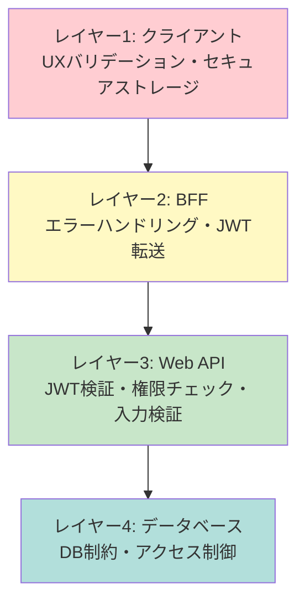
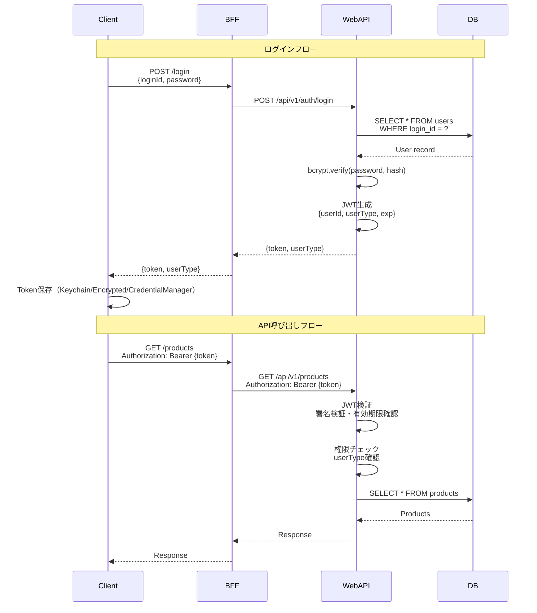
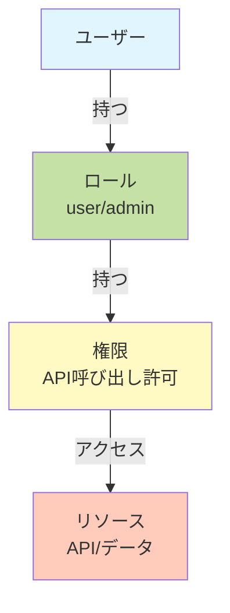
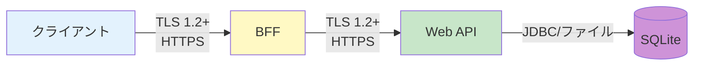
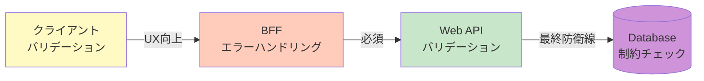

# セキュリティアーキテクチャ

> 最終更新: 2025-01-08  
> ステータス: Draft  
> バージョン: 1.0

## 変更履歴

| バージョン | 日付 | 変更内容 | 関連機能 |
|-----------|------|---------|---------|
| 1.0 | 2025-01-08 | 初版作成 | mobile-app-system |

---

## 1. セキュリティアーキテクチャ概要

本ドキュメントでは、mobile-app-system のセキュリティアーキテクチャを定義します。
認証・認可メカニズム、データ保護、セキュリティ対策を明確にします。

## 2. セキュリティ戦略

### 2.1 多層防御（Defense in Depth）



### 2.2 セキュリティ原則

| 原則 | 適用 | 説明 |
|-----|------|------|
| **最小権限の原則** | ✅ | ユーザーは必要最小限の権限のみ |
| **深層防御** | ✅ | 複数のセキュリティ層を実装 |
| **セキュアバイデフォルト** | ✅ | デフォルトで安全な設定 |
| **フェイルセーフ** | ✅ | 障害時は安全側に倒れる |
| **継続的な検証** | ✅ | 各層で検証を実施 |

## 3. 認証アーキテクチャ

### 3.1 JWT認証フロー



### 3.2 JWT構造と検証

#### JWT生成（Web API）

```java
@Component
public class JwtTokenProvider {
    @Value("${jwt.secret}")
    private String secretKey;
    
    private static final long VALIDITY_IN_MS = 86400000; // 24時間
    
    public String createToken(User user) {
        Claims claims = Jwts.claims().setSubject(user.getUserId().toString());
        claims.put("loginId", user.getLoginId());
        claims.put("userType", user.getUserType().name());
        
        Date now = new Date();
        Date validity = new Date(now.getTime() + VALIDITY_IN_MS);
        
        return Jwts.builder()
            .setClaims(claims)
            .setIssuedAt(now)
            .setExpiration(validity)
            .signWith(SignatureAlgorithm.HS256, secretKey)
            .compact();
    }
}
```

#### JWT検証（Web API）

```java
@Component
public class JwtAuthenticationFilter extends OncePerRequestFilter {
    
    @Autowired
    private JwtTokenProvider jwtTokenProvider;
    
    @Override
    protected void doFilterInternal(
        HttpServletRequest request,
        HttpServletResponse response,
        FilterChain filterChain
    ) throws ServletException, IOException {
        
        String token = resolveToken(request);
        
        if (token != null && jwtTokenProvider.validateToken(token)) {
            Authentication auth = jwtTokenProvider.getAuthentication(token);
            SecurityContextHolder.getContext().setAuthentication(auth);
        }
        
        filterChain.doFilter(request, response);
    }
    
    private String resolveToken(HttpServletRequest request) {
        String bearerToken = request.getHeader("Authorization");
        if (bearerToken != null && bearerToken.startsWith("Bearer ")) {
            return bearerToken.substring(7);
        }
        return null;
    }
}
```

### 3.3 トークン保存（クライアント）

#### iOS（Keychain）

```swift
class KeychainManager {
    private let keychain = KeychainSwift()
    private let jwtTokenKey = "jwt_token"
    
    // 暗号化保存
    func saveToken(_ token: String) {
        keychain.set(token, forKey: jwtTokenKey)
    }
    
    // 取得
    func getToken() -> String? {
        return keychain.get(jwtTokenKey)
    }
    
    // 削除
    func deleteToken() {
        keychain.delete(jwtTokenKey)
    }
}
```

#### Android（EncryptedSharedPreferences）

```java
public class SecureStorageManager {
    private SharedPreferences sharedPreferences;
    
    public SecureStorageManager(Context context) throws Exception {
        MasterKey masterKey = new MasterKey.Builder(context)
            .setKeyScheme(MasterKey.KeyScheme.AES256_GCM)
            .build();
        
        sharedPreferences = EncryptedSharedPreferences.create(
            context,
            "secure_prefs",
            masterKey,
            EncryptedSharedPreferences.PrefKeyEncryptionScheme.AES256_SIV,
            EncryptedSharedPreferences.PrefValueEncryptionScheme.AES256_GCM
        );
    }
    
    public void saveToken(String token) {
        sharedPreferences.edit().putString("jwt_token", token).apply();
    }
    
    public String getToken() {
        return sharedPreferences.getString("jwt_token", null);
    }
}
```

#### Windows（Credential Manager）

```cpp
#pragma once

#include <windows.h>
#include <wincred.h>
#include <string>
#include <optional>

#pragma comment(lib, "advapi32.lib")

namespace ws::utils
{

class CredentialManager
{
public:
	// 暗号化保存（DPAPI）
	static bool SaveToken(const std::wstring& token)
	{
		CREDENTIALW cred = {};
		cred.Type = CRED_TYPE_GENERIC;
		cred.TargetName = const_cast<LPWSTR>(L"WsDemoMobileApp/jwt_token");
		cred.CredentialBlobSize = static_cast<DWORD>(token.size() * sizeof(wchar_t));
		cred.CredentialBlob = reinterpret_cast<LPBYTE>(const_cast<wchar_t*>(token.data()));
		cred.Persist = CRED_PERSIST_LOCAL_MACHINE;
		return CredWriteW(&cred, 0) == TRUE;
	}

	// 取得
	[[nodiscard]]
	static std::optional<std::wstring> GetToken()
	{
		PCREDENTIALW pCred = nullptr;
		if (CredReadW(L"WsDemoMobileApp/jwt_token", CRED_TYPE_GENERIC, 0, &pCred) == TRUE)
		{
			std::wstring token(
				reinterpret_cast<wchar_t*>(pCred->CredentialBlob),
				pCred->CredentialBlobSize / sizeof(wchar_t));
			CredFree(pCred);
			return token;
		}
		return std::nullopt;
	}

	// 削除
	static bool DeleteToken()
	{
		return CredDeleteW(L"WsDemoMobileApp/jwt_token", CRED_TYPE_GENERIC, 0) == TRUE;
	}
};

} // namespace ws::utils
```

#### 管理Web（localStorage）

```javascript
// JWT保存（注意: XSSリスクあり）
localStorage.setItem('jwt_token', token);

// JWT取得
const token = localStorage.getItem('jwt_token');

// JWT削除
localStorage.removeItem('jwt_token');
```

**注意**: 本番環境ではHttpOnly Cookieの使用を推奨

## 4. 認可アーキテクチャ

### 4.1 ロールベースアクセス制御（RBAC）



### 4.2 権限マトリクス

| API | user | admin | 実装方法 |
|-----|------|-------|---------|
| `POST /api/v1/auth/login` | ✅ | ❌ | エンドポイント分離 |
| `POST /api/v1/auth/admin/login` | ❌ | ✅ | エンドポイント分離 |
| `GET /api/v1/products` | ✅ | ✅ | @PreAuthorize("hasAnyRole('USER','ADMIN')") |
| `PUT /api/v1/products/{id}` | ❌ | ✅ | @PreAuthorize("hasRole('ADMIN')") |
| `POST /api/v1/purchases` | ✅ | ❌ | @PreAuthorize("hasRole('USER')") |
| `GET /api/v1/favorites` | ✅ | ❌ | @PreAuthorize("hasRole('USER')") |
| `GET /api/v1/admin/users` | ❌ | ✅ | @PreAuthorize("hasRole('ADMIN')") |

### 4.3 Spring Security設定

```java
@Configuration
@EnableWebSecurity
@EnableGlobalMethodSecurity(prePostEnabled = true)
public class SecurityConfig {
    
    @Bean
    public SecurityFilterChain filterChain(HttpSecurity http) throws Exception {
        http
            .csrf().disable()  // JWT使用のためCSRF無効
            .sessionManagement()
                .sessionCreationPolicy(SessionCreationPolicy.STATELESS)  // ステートレス
            .and()
            .authorizeRequests()
                .antMatchers("/api/v1/auth/**").permitAll()  // ログインは認証不要
                .antMatchers("/api/v1/**").authenticated()   // その他は認証必要
            .and()
            .addFilterBefore(
                jwtAuthenticationFilter(),
                UsernamePasswordAuthenticationFilter.class
            );
        
        return http.build();
    }
}
```

### 4.4 リソース所有権チェック

```java
@Service
public class PurchaseService {
    
    public List<Purchase> getUserPurchases(Long userId) {
        // JWTから取得した現在のユーザーID
        Long currentUserId = SecurityContextHolder.getContext()
            .getAuthentication()
            .getPrincipal();
        
        // 自分の購入履歴のみ取得可能
        if (!currentUserId.equals(userId)) {
            throw new ForbiddenException("他のユーザーの購入履歴は閲覧できません");
        }
        
        return purchaseRepository.findByUserUserId(userId);
    }
}
```

## 5. データ保護

### 5.1 通信の暗号化



#### TLS設定（本番環境）

```yaml
server:
  ssl:
    enabled: true
    key-store: classpath:keystore.p12
    key-store-password: ${SSL_KEY_STORE_PASSWORD}
    key-store-type: PKCS12
    key-alias: tomcat
  port: 8443
```

**注意**: 開発環境ではHTTPを使用（localhost）

#### Windows クライアントのTLS

WindowsアプリではWinHTTPがOSレベルでTLS通信を処理します。Windows証明書ストアを利用してサーバー証明書の検証が自動的に行われます。

### 5.2 データ保存の暗号化

| データ種別 | 保存場所 | 暗号化 | 方式 |
|-----------|---------|-------|------|
| **パスワード** | SQLite | ✅ | bcrypt (cost=10) |
| **JWT Token（モバイル）** | Keychain/EncryptedPrefs | ✅ | AES-256 |
| **JWT Token（Windows）** | Credential Manager | ✅ | DPAPI |
| **JWT Token（Web）** | localStorage | ❌ | 平文（XSSリスク） |
| **商品情報** | SQLite | ❌ | 平文（デモ用途） |
| **購入情報** | SQLite | ❌ | 平文（デモ用途） |

#### パスワードハッシュ化（bcrypt）

```java
@Service
public class PasswordService {
    
    private static final int BCRYPT_COST = 10;
    
    // パスワードハッシュ化
    public String hashPassword(String plainPassword) {
        return BCrypt.hashpw(plainPassword, BCrypt.gensalt(BCRYPT_COST));
    }
    
    // パスワード検証
    public boolean verifyPassword(String plainPassword, String hashedPassword) {
        return BCrypt.checkpw(plainPassword, hashedPassword);
    }
}
```

## 6. 入力検証

### 6.1 バリデーション戦略



### 6.2 サーバー側バリデーション（必須）

```java
@RestController
@RequestMapping("/api/v1/products")
public class ProductController {
    
    @PutMapping("/{id}")
    public ResponseEntity<ApiResponse<ProductDto>> updateProduct(
        @PathVariable Long id,
        @Valid @RequestBody ProductUpdateRequest request  // @Valid で検証
    ) {
        ProductDto product = productService.updateProduct(id, request);
        return ResponseEntity.ok(ApiResponse.success(product));
    }
}

// リクエストDTO
public class ProductUpdateRequest {
    
    @NotNull(message = "商品名は必須です")
    @Size(min = 1, max = 100, message = "商品名は1文字以上100文字以内です")
    private String productName;
    
    @NotNull(message = "単価は必須です")
    @Min(value = 1, message = "単価は1円以上です")
    @Max(value = 1000000, message = "単価は100万円以下です")
    private Integer unitPrice;
    
    @Size(max = 500, message = "説明は500文字以内です")
    private String description;
    
    @Pattern(regexp = "^https?://.*", message = "画像URLの形式が不正です")
    @Size(max = 500, message = "画像URLは500文字以内です")
    private String imageUrl;
}
```

### 6.3 SQLインジェクション対策

#### 安全な実装（JPA/PreparedStatement）

```java
// JPA（安全）
@Repository
public interface ProductRepository extends JpaRepository<Product, Long> {
    
    @Query("SELECT p FROM Product p WHERE p.productName LIKE %:keyword%")
    List<Product> searchByKeyword(@Param("keyword") String keyword);
}

// JDBC PreparedStatement（安全）
String sql = "SELECT * FROM products WHERE product_name LIKE ?";
PreparedStatement pstmt = connection.prepareStatement(sql);
pstmt.setString(1, "%" + keyword + "%");
ResultSet rs = pstmt.executeQuery();
```

#### 危険な実装（禁止）

```java
// 文字列連結（危険 - 使用禁止）
String sql = "SELECT * FROM products WHERE product_name LIKE '%" + keyword + "%'";
Statement stmt = connection.createStatement();
ResultSet rs = stmt.executeQuery(sql);
```

### 6.4 XSS（クロスサイトスクリプティング）対策

#### モバイルアプリ

- iOS: 標準UIコンポーネント使用（自動エスケープ）
- Android: 標準Viewコンポーネント使用（自動エスケープ）
- Windows: Win32標準コントロール使用（自動エスケープ）

#### 管理Webアプリ（Vue.js）

```vue
<!-- 安全（自動エスケープ） -->
<div>{{ productName }}</div>

<!-- 危険（v-htmlは使用禁止） -->
<div v-html="userInput"></div>  <!-- 禁止 -->
```

#### Spring Boot（Thymeleaf使用時）

```html
<!-- 安全（自動エスケープ） -->
<div th:text="${productName}"></div>

<!-- 危険（th:utextは使用禁止） -->
<div th:utext="${userInput}"></div>  <!-- 禁止 -->
```

## 7. OWASP Top 10 対策

### 7.1 対策一覧

| OWASP Top 10 | 対策 | 実装状況 |
|-------------|------|---------|
| **A01: アクセス制御の不備** | JWT認証、RBAC、リソース所有権チェック | ✅ |
| **A02: 暗号化の失敗** | TLS、bcrypt、セキュアストレージ | ✅ |
| **A03: インジェクション** | JPA/PreparedStatement、バリデーション | ✅ |
| **A04: 安全でない設計** | 多層防御、最小権限の原則 | ✅ |
| **A05: セキュリティ設定ミス** | セキュアなデフォルト設定 | ✅ |
| **A06: 脆弱性のある古いコンポーネント** | 最新ライブラリ使用 | ✅ |
| **A07: 識別と認証の失敗** | JWT、bcrypt、トークン有効期限 | ✅ |
| **A08: ソフトウェアとデータの整合性** | バリデーション、DB制約 | ✅ |
| **A09: ログとモニタリングの失敗** | ログ出力（最小限） | ⚠️ |
| **A10: SSRF** | 外部URL呼び出しなし | N/A |

### 7.2 セキュリティヘッダー

```java
@Configuration
public class SecurityHeadersConfig {
    
    @Bean
    public SecurityFilterChain securityHeaders(HttpSecurity http) throws Exception {
        http.headers()
            // XSS対策
            .contentTypeOptions()
            .and()
            .xssProtection().block(true)
            .and()
            .frameOptions().deny()
            // CSP
            .and()
            .contentSecurityPolicy("default-src 'self'")
            // HSTS（本番環境のみ）
            .and()
            .httpStrictTransportSecurity()
                .maxAgeInSeconds(31536000)
                .includeSubDomains(true);
        
        return http.build();
    }
}
```

## 8. セキュリティログ

### 8.1 ログ出力イベント

| イベント | ログレベル | 記録内容 |
|---------|----------|---------|
| ログイン成功 | INFO | userId, loginId, timestamp, IP |
| ログイン失敗 | WARN | loginId, reason, timestamp, IP |
| JWT検証失敗 | WARN | reason, timestamp, IP |
| 権限エラー | WARN | userId, endpoint, timestamp |
| APIエラー | ERROR | userId, endpoint, error, stacktrace |

### 8.2 ログ出力例

```java
@Slf4j
@Service
public class AuthService {
    
    public LoginResponse login(LoginRequest request) {
        try {
            User user = userRepository.findByLoginId(request.getLoginId())
                .orElseThrow(() -> new AuthenticationException("ユーザーが見つかりません"));
            
            if (!passwordService.verifyPassword(request.getPassword(), user.getPasswordHash())) {
                log.warn("ログイン失敗: loginId={}, reason=パスワード不一致", request.getLoginId());
                throw new AuthenticationException("ログインIDまたはパスワードが間違っています");
            }
            
            String token = jwtTokenProvider.createToken(user);
            log.info("ログイン成功: userId={}, loginId={}", user.getUserId(), user.getLoginId());
            
            return new LoginResponse(token, user.getUserType());
        } catch (Exception e) {
            log.error("ログインエラー: loginId={}, error={}", request.getLoginId(), e.getMessage(), e);
            throw e;
        }
    }
}
```

## 9. セキュリティテスト

### 9.1 テストケース

| テストケース | 期待結果 |
|------------|---------|
| トークンなしでAPI呼び出し | 401 Unauthorized |
| 不正なトークンでAPI呼び出し | 401 Unauthorized |
| 期限切れトークンでAPI呼び出し | 401 Unauthorized |
| user権限でadmin APIへアクセス | 403 Forbidden |
| admin権限でuser APIへアクセス | 403 Forbidden |
| 他人の購入履歴を取得 | 403 Forbidden |
| SQLインジェクション試行 | エスケープ済み・エラー |
| XSS試行 | エスケープ済み表示 |
| 不正な入力値 | 400 Bad Request |
| パスワード8文字未満 | 400 Bad Request |
| 購入個数が100の倍数でない | 400 Bad Request |

詳細は `/docs/specs/mobile-app-system/12-testing-strategy.md` を参照

## 10. セキュリティチェックリスト

### 10.1 開発時チェックリスト

- [ ] パスワードをハードコーディングしていない
- [ ] シークレットキーを環境変数で管理
- [ ] .gitignoreに機密情報ファイルを追加
- [ ] SQLクエリはJPA/PreparedStatementを使用
- [ ] 全API呼び出しにJWT認証を適用（ログイン除く）
- [ ] ユーザー種別による権限制御を実装
- [ ] 入力バリデーションを実装（サーバー側必須）
- [ ] エラーメッセージでセンシティブ情報を漏らさない
- [ ] TLS/HTTPS通信（本番環境）
- [ ] セキュリティヘッダーを設定
- [ ] bcryptでパスワードハッシュ化
- [ ] JWTをセキュアストレージに保存（モバイル）

### 10.2 デプロイ時チェックリスト

- [ ] 環境変数が正しく設定されている
- [ ] デフォルトパスワードを変更
- [ ] 不要なエンドポイントを無効化
- [ ] ログレベルを適切に設定（本番: INFO）
- [ ] TLS証明書が有効
- [ ] データベースアクセス権限が適切

## 11. 既知の制限事項（デモ用途）

以下のセキュリティ対策は、デモ用途のため実装しない:

| 項目 | 本番推奨 | デモ実装 |
|------|---------|---------|
| パスワード複雑性要件 | 必須 | なし |
| 2要素認証 | 推奨 | なし |
| レート制限 | 必須 | なし |
| IPホワイトリスト | 推奨 | なし |
| DB暗号化（TDE） | 推奨 | なし |
| 監視・アラート | 必須 | なし |
| 脆弱性スキャン | 必須 | なし |
| ペネトレーションテスト | 推奨 | なし |
| CORS厳密設定 | 必須 | 緩い設定 |
| JWTトークンリフレッシュ | 推奨 | なし |

## 12. 参照ドキュメント

| ドキュメント | パス |
|------------|------|
| セキュリティ要件詳細 | `/docs/specs/mobile-app-system/08-security.md` |
| APIアーキテクチャ | `04-api-architecture.md` |
| エラーハンドリング | `/docs/specs/mobile-app-system/07-error-handling.md` |
| テスト戦略 | `/docs/specs/mobile-app-system/12-testing-strategy.md` |
| OWASP Top 10 | https://owasp.org/www-project-top-ten/ |

---

**End of Document**
