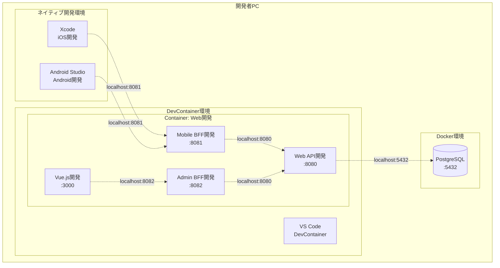
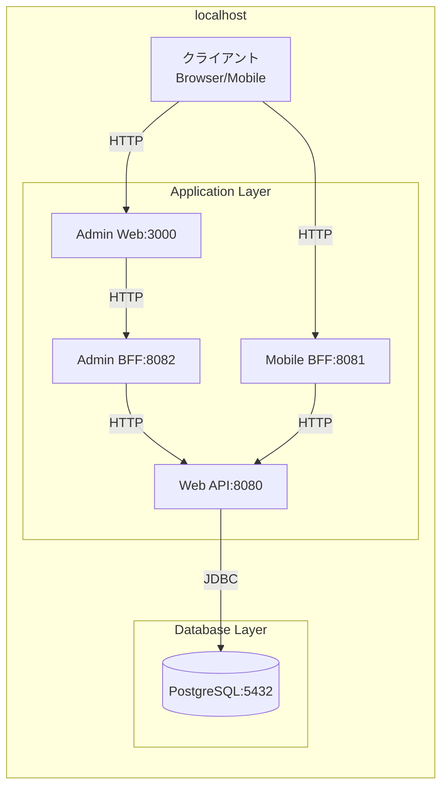
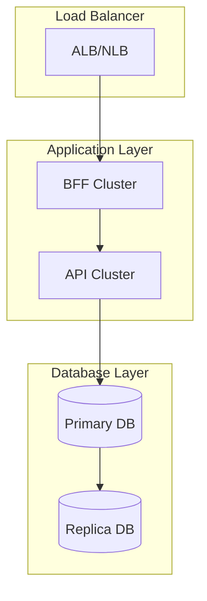

# インフラストラクチャ

> 最終更新: 2025-01-08  
> ステータス: Draft  
> バージョン: 1.0

## 変更履歴

| バージョン | 日付 | 変更内容 | 関連機能 |
|-----------|------|---------|---------|
| 1.0 | 2025-01-08 | 初版作成 | mobile-app-system |

---

## 1. インフラストラクチャ概要

本ドキュメントでは、mobile-app-system のインフラストラクチャ構成を定義します。
開発環境、コンテナ構成、データベース環境、ネットワーク構成を明確にします。

## 2. 開発環境構成

### 2.1 全体構成図



### 2.2 開発環境要件

| 環境 | 要件 | 備考 |
|------|------|------|
| **iOS開発** | macOS、Xcode latest | Xcodeのみ |
| **Android開発** | Windows/macOS/Linux、Android Studio latest | - |
| **Web開発** | Windows/macOS/Linux、VS Code、Docker | DevContainer使用 |
| **PostgreSQL** | Docker環境 | 全開発者共通 |

## 3. DevContainer構成

### 3.1 DevContainer概要

DevContainerは、Docker上で動作する開発環境です。
Web関連の開発（Vue.js、Spring Boot）はDevContainer内で行います。

**メリット**:
- 環境構築の自動化
- 開発環境の統一
- ホストOSに依存しない

### 3.2 DevContainer設定

#### .devcontainer/devcontainer.json

```json
{
  "name": "Mobile App System - Web Development",
  "dockerComposeFile": "docker-compose.yml",
  "service": "dev-environment",
  "workspaceFolder": "/workspace",
  "features": {
    "ghcr.io/devcontainers/features/java:1": {
      "version": "latest",
      "installMaven": true,
      "installGradle": true
    },
    "ghcr.io/devcontainers/features/node:1": {
      "version": "latest"
    }
  },
  "customizations": {
    "vscode": {
      "extensions": [
        "vscjava.vscode-java-pack",
        "Vue.volar",
        "esbenp.prettier-vscode",
        "dbaeumer.vscode-eslint"
      ],
      "settings": {
        "java.configuration.runtimes": [
          {
            "name": "JavaSE-17",
            "path": "/usr/local/sdkman/candidates/java/current"
          }
        ]
      }
    }
  },
  "forwardPorts": [3000, 8080, 8081, 8082, 5432],
  "postCreateCommand": "echo 'DevContainer ready!'"
}
```

#### .devcontainer/docker-compose.yml

```yaml
version: '3.8'

services:
  dev-environment:
    build:
      context: .
      dockerfile: Dockerfile
    volumes:
      - ../..:/workspace:cached
      - maven-cache:/root/.m2
      - node-modules:/workspace/admin-web/node_modules
    command: sleep infinity
    network_mode: host

volumes:
  maven-cache:
  node-modules:
```

#### .devcontainer/Dockerfile

```dockerfile
FROM mcr.microsoft.com/devcontainers/base:ubuntu

# Java環境
RUN apt-get update && apt-get install -y \
    openjdk-17-jdk \
    maven \
    gradle

# Node.js環境
RUN curl -fsSL https://deb.nodesource.com/setup_20.x | bash - \
    && apt-get install -y nodejs

# PostgreSQL クライアント
RUN apt-get install -y postgresql-client

# クリーンアップ
RUN apt-get clean && rm -rf /var/lib/apt/lists/*
```

## 4. Docker構成

### 4.1 PostgreSQL コンテナ

#### docker/postgres/docker-compose.yml

```yaml
version: '3.8'

services:
  postgres:
    image: postgres:latest
    container_name: mobile-app-postgres
    environment:
      POSTGRES_DB: mobile_app_db
      POSTGRES_USER: postgres
      POSTGRES_PASSWORD: postgres
      TZ: Asia/Tokyo
    ports:
      - "5432:5432"
    volumes:
      - postgres-data:/var/lib/postgresql/data
      - ./init:/docker-entrypoint-initdb.d:ro
    restart: unless-stopped
    healthcheck:
      test: ["CMD-SHELL", "pg_isready -U postgres"]
      interval: 10s
      timeout: 5s
      retries: 5

volumes:
  postgres-data:
    driver: local
```

### 4.2 初期化スクリプト

```
docker/postgres/init/
├── 01_create_database.sql      # データベース作成
├── 02_create_tables.sql        # テーブル作成
├── 03_create_indexes.sql       # インデックス作成
├── 04_insert_master_data.sql   # マスタデータ投入
└── 05_insert_sample_data.sql   # サンプルデータ投入
```

#### 01_create_database.sql

```sql
-- データベースは既にdocker-compose.ymlで作成済み
-- 追加の設定があればここに記述

-- 拡張機能の有効化
CREATE EXTENSION IF NOT EXISTS "uuid-ossp";

-- タイムゾーン設定
SET timezone = 'Asia/Tokyo';
```

#### 02_create_tables.sql

```sql
-- ユーザーテーブル
CREATE TABLE users (
    user_id BIGSERIAL PRIMARY KEY,
    user_name VARCHAR(100) NOT NULL,
    login_id VARCHAR(50) NOT NULL UNIQUE,
    password_hash VARCHAR(255) NOT NULL,
    user_type VARCHAR(20) NOT NULL CHECK (user_type IN ('user', 'admin')),
    created_at TIMESTAMP NOT NULL DEFAULT CURRENT_TIMESTAMP,
    updated_at TIMESTAMP NOT NULL DEFAULT CURRENT_TIMESTAMP
);

-- 商品テーブル
CREATE TABLE products (
    product_id BIGSERIAL PRIMARY KEY,
    product_name VARCHAR(100) NOT NULL,
    unit_price INTEGER NOT NULL CHECK (unit_price >= 1),
    description TEXT,
    image_url VARCHAR(500),
    created_at TIMESTAMP NOT NULL DEFAULT CURRENT_TIMESTAMP,
    updated_at TIMESTAMP NOT NULL DEFAULT CURRENT_TIMESTAMP
);

-- 購入履歴テーブル
CREATE TABLE purchases (
    purchase_id UUID PRIMARY KEY DEFAULT uuid_generate_v4(),
    user_id BIGINT NOT NULL,
    product_id BIGINT NOT NULL,
    quantity INTEGER NOT NULL CHECK (quantity > 0 AND quantity % 100 = 0),
    unit_price_at_purchase INTEGER NOT NULL CHECK (unit_price_at_purchase >= 1),
    total_amount INTEGER NOT NULL CHECK (total_amount >= 1),
    purchased_at TIMESTAMP NOT NULL DEFAULT CURRENT_TIMESTAMP,
    CONSTRAINT fk_purchases_user FOREIGN KEY (user_id) REFERENCES users(user_id) ON DELETE RESTRICT,
    CONSTRAINT fk_purchases_product FOREIGN KEY (product_id) REFERENCES products(product_id) ON DELETE RESTRICT,
    CONSTRAINT chk_total_amount CHECK (total_amount = unit_price_at_purchase * quantity)
);

-- お気に入りテーブル
CREATE TABLE favorites (
    favorite_id BIGSERIAL PRIMARY KEY,
    user_id BIGINT NOT NULL,
    product_id BIGINT NOT NULL,
    created_at TIMESTAMP NOT NULL DEFAULT CURRENT_TIMESTAMP,
    CONSTRAINT fk_favorites_user FOREIGN KEY (user_id) REFERENCES users(user_id) ON DELETE CASCADE,
    CONSTRAINT fk_favorites_product FOREIGN KEY (product_id) REFERENCES products(product_id) ON DELETE CASCADE,
    UNIQUE (user_id, product_id)
);

-- 機能フラグマスタ
CREATE TABLE feature_flags (
    flag_id BIGSERIAL PRIMARY KEY,
    flag_key VARCHAR(50) NOT NULL UNIQUE,
    flag_name VARCHAR(100) NOT NULL,
    default_value BOOLEAN NOT NULL DEFAULT FALSE,
    created_at TIMESTAMP NOT NULL DEFAULT CURRENT_TIMESTAMP
);

-- ユーザー別機能フラグ
CREATE TABLE user_feature_flags (
    user_flag_id BIGSERIAL PRIMARY KEY,
    user_id BIGINT NOT NULL,
    flag_id BIGINT NOT NULL,
    is_enabled BOOLEAN NOT NULL DEFAULT FALSE,
    created_at TIMESTAMP NOT NULL DEFAULT CURRENT_TIMESTAMP,
    updated_at TIMESTAMP NOT NULL DEFAULT CURRENT_TIMESTAMP,
    CONSTRAINT fk_user_feature_flags_user FOREIGN KEY (user_id) REFERENCES users(user_id) ON DELETE CASCADE,
    CONSTRAINT fk_user_feature_flags_flag FOREIGN KEY (flag_id) REFERENCES feature_flags(flag_id) ON DELETE CASCADE,
    UNIQUE (user_id, flag_id)
);
```

#### 03_create_indexes.sql

```sql
-- ユーザーテーブル
CREATE INDEX idx_users_user_type ON users(user_type);

-- 商品テーブル
CREATE INDEX idx_products_product_name ON products(product_name);

-- 購入履歴テーブル
CREATE INDEX idx_purchases_user_id ON purchases(user_id);
CREATE INDEX idx_purchases_product_id ON purchases(product_id);
CREATE INDEX idx_purchases_purchased_at ON purchases(purchased_at);
```

## 5. ネットワーク構成

### 5.1 ポート割り当て

| サービス | ポート | プロトコル | 用途 |
|---------|-------|----------|------|
| PostgreSQL | 5432 | TCP | データベース |
| Web API | 8080 | HTTP | ビジネスロジックAPI |
| Mobile BFF | 8081 | HTTP | モバイルアプリ向けBFF |
| Admin BFF | 8082 | HTTP | 管理Webアプリ向けBFF |
| 管理Web（開発サーバー） | 3000 | HTTP | Vue.js開発サーバー |

### 5.2 ネットワーク構成図



## 6. 環境変数管理

### 6.1 環境変数一覧

#### Web API（application.yml）

```yaml
spring:
  datasource:
    url: jdbc:postgresql://${DB_HOST:localhost}:${DB_PORT:5432}/${DB_NAME:mobile_app_db}
    username: ${DB_USER:postgres}
    password: ${DB_PASSWORD:postgres}
  jpa:
    hibernate:
      ddl-auto: validate
    show-sql: ${SHOW_SQL:false}

jwt:
  secret: ${JWT_SECRET_KEY:your-secret-key-at-least-32-characters-long}
  expiration: ${JWT_EXPIRATION:86400000}  # 24時間

logging:
  level:
    root: ${LOG_LEVEL:INFO}
    com.example: ${LOG_LEVEL:DEBUG}
```

#### Mobile BFF（application.yml）

```yaml
server:
  port: 8081

webapi:
  base-url: ${WEBAPI_BASE_URL:http://localhost:8080}
  timeout: ${WEBAPI_TIMEOUT:10000}

logging:
  level:
    root: ${LOG_LEVEL:INFO}
```

#### Admin BFF（application.yml）

```yaml
server:
  port: 8082

webapi:
  base-url: ${WEBAPI_BASE_URL:http://localhost:8080}
  timeout: ${WEBAPI_TIMEOUT:10000}

logging:
  level:
    root: ${LOG_LEVEL:INFO}
```

### 6.2 環境変数ファイル（.env）

```env
# Database
DB_HOST=localhost
DB_PORT=5432
DB_NAME=mobile_app_db
DB_USER=postgres
DB_PASSWORD=postgres

# JWT
JWT_SECRET_KEY=your-secret-key-at-least-32-characters-long
JWT_EXPIRATION=86400000

# Web API
WEBAPI_BASE_URL=http://localhost:8080
WEBAPI_TIMEOUT=10000

# Logging
LOG_LEVEL=INFO
SHOW_SQL=false
```

**重要**: `.env`ファイルは`.gitignore`に追加し、Gitにコミットしない

### 6.3 .gitignore設定

```gitignore
# Environment variables
.env
.env.local
.env.*.local

# IDE
.vscode/
.idea/
*.iml

# Build artifacts
target/
build/
dist/
node_modules/

# Logs
*.log
logs/

# OS
.DS_Store
Thumbs.db

# Secrets
keystore.p12
*.key
*.pem
```

## 7. データベース管理

### 7.1 データベース起動・停止

```bash
# 起動
cd docker/postgres
docker-compose up -d

# 停止
docker-compose down

# ログ確認
docker-compose logs -f

# データボリューム削除（注意: データが消えます）
docker-compose down -v
```

### 7.2 データベース接続

```bash
# psqlでの接続
psql -h localhost -p 5432 -U postgres -d mobile_app_db

# パスワード: postgres
```

### 7.3 バックアップ・リストア

```bash
# バックアップ
pg_dump -h localhost -p 5432 -U postgres mobile_app_db > backup_$(date +%Y%m%d).sql

# リストア
psql -h localhost -p 5432 -U postgres mobile_app_db < backup_20250108.sql
```

## 8. アプリケーション起動手順

### 8.1 Web API起動

```bash
cd web-api
mvn clean install
mvn spring-boot:run

# または
java -jar target/web-api-1.0.0.jar
```

### 8.2 Mobile BFF起動

```bash
cd mobile-bff
mvn clean install
mvn spring-boot:run
```

### 8.3 Admin BFF起動

```bash
cd admin-bff
mvn clean install
mvn spring-boot:run
```

### 8.4 管理Webアプリ起動

```bash
cd admin-web
npm install
npm run dev

# ブラウザで http://localhost:3000 にアクセス
```

## 9. ヘルスチェック

### 9.1 ヘルスチェックエンドポイント

| サービス | エンドポイント | 期待レスポンス |
|---------|-------------|-------------|
| Web API | http://localhost:8080/actuator/health | `{"status":"UP"}` |
| Mobile BFF | http://localhost:8081/actuator/health | `{"status":"UP"}` |
| Admin BFF | http://localhost:8082/actuator/health | `{"status":"UP"}` |
| PostgreSQL | `pg_isready -h localhost -p 5432` | `localhost:5432 - accepting connections` |

### 9.2 Spring Boot Actuator設定

```yaml
management:
  endpoints:
    web:
      exposure:
        include: health,info
  endpoint:
    health:
      show-details: when-authorized
```

## 10. トラブルシューティング

### 10.1 よくある問題

#### PostgreSQLに接続できない

```bash
# コンテナが起動しているか確認
docker ps

# ログを確認
docker logs mobile-app-postgres

# ポートが使用中の場合
lsof -i :5432  # macOS/Linux
netstat -ano | findstr :5432  # Windows
```

#### BFFからWeb APIに接続できない

```bash
# Web APIが起動しているか確認
curl http://localhost:8080/actuator/health

# ファイアウォール設定を確認
```

#### DevContainerが起動しない

```bash
# Dockerが起動しているか確認
docker --version

# VS Code拡張機能をインストール
code --install-extension ms-vscode-remote.remote-containers
```

## 11. 本番環境構成（参考）

**注意**: 本システムはデモ用途のため、本番環境構成は定義しません。
以下は将来の参考情報です。

### 11.1 推奨構成



### 11.2 推奨インフラ

- **コンピュート**: AWS ECS / Kubernetes
- **データベース**: AWS RDS PostgreSQL（Multi-AZ）
- **ロードバランサー**: AWS ALB
- **シークレット管理**: AWS Secrets Manager
- **ログ**: CloudWatch Logs / ELK Stack
- **監視**: CloudWatch / Prometheus + Grafana

## 12. 参照ドキュメント

| ドキュメント | パス |
|------------|------|
| データアーキテクチャ | `03-data-architecture.md` |
| デプロイメント | `07-deployment.md` |
| モニタリング | `08-monitoring.md` |
| データモデル | `/docs/specs/mobile-app-system/04-data-model.md` |

---

**End of Document**
