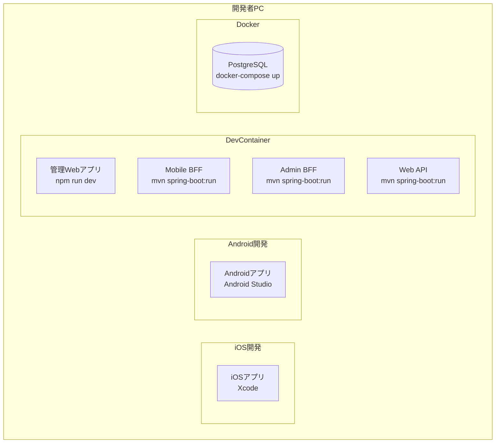
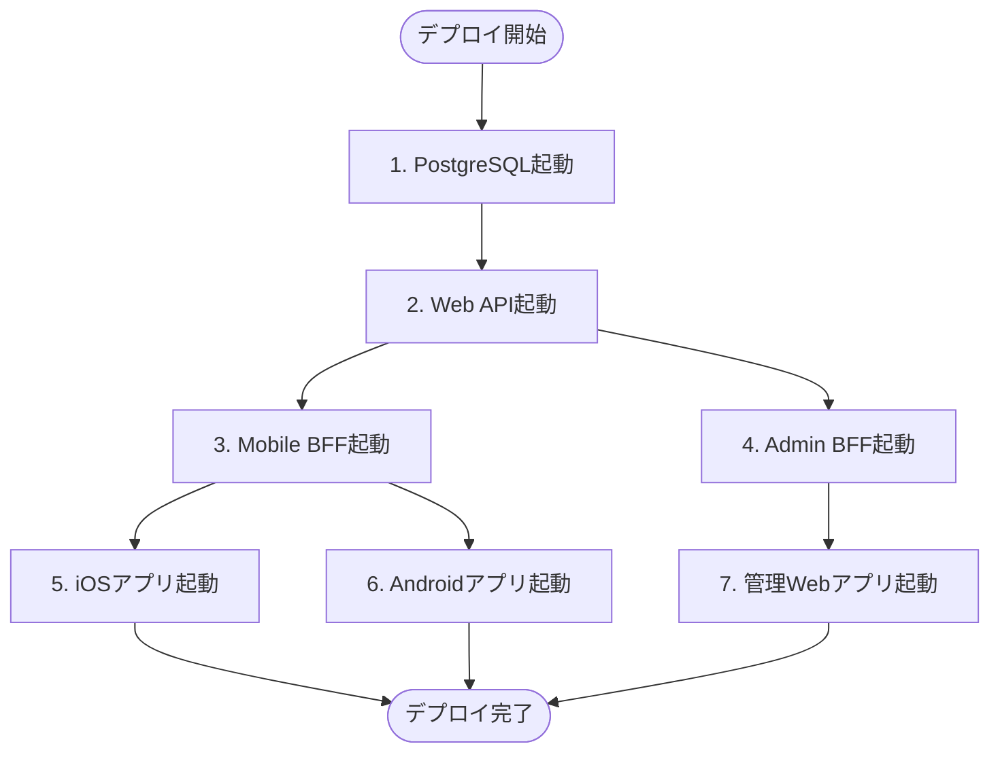

# デプロイメント戦略

> 最終更新: 2025-01-08  
> ステータス: Draft  
> バージョン: 1.0

## 変更履歴

| バージョン | 日付 | 変更内容 | 関連機能 |
|-----------|------|---------|---------|
| 1.0 | 2025-01-08 | 初版作成 | mobile-app-system |

---

## 1. デプロイメント戦略概要

本ドキュメントでは、mobile-app-system のデプロイメント戦略を定義します。
デモンストレーション用途のため、開発環境デプロイメントに焦点を当てます。

## 2. デプロイメント環境

### 2.1 環境定義

| 環境 | 用途 | ホスティング | 現状 |
|------|------|------------|------|
| **開発環境** | 開発・デバッグ | localhost | 定義済み ✅ |
| **本番環境** | デモ実行 | 未定義 | TBD |

**注意**: 本システムはデモ用途のため、本番環境の詳細は定義しません。

### 2.2 開発環境構成



## 3. ビルド戦略

### 3.1 Java（Spring Boot）ビルド

#### Maven ビルド

```bash
# クリーンビルド
mvn clean install

# テストスキップビルド（デモ用途）
mvn clean install -DskipTests

# 実行可能JARの生成
mvn package

# 成果物: target/{artifact-name}-{version}.jar
```

#### Gradle ビルド（代替案）

```bash
# クリーンビルド
./gradlew clean build

# テストスキップビルド
./gradlew clean build -x test

# 成果物: build/libs/{artifact-name}-{version}.jar
```

### 3.2 Vue.js ビルド

```bash
# 開発サーバー起動
npm run dev

# 本番ビルド
npm run build

# 成果物: dist/
```

### 3.3 iOS ビルド

```bash
# Xcodeでビルド
xcodebuild -workspace MobileApp.xcworkspace \
  -scheme MobileApp \
  -configuration Debug \
  -sdk iphonesimulator

# または Xcode GUI から
# Product > Build (⌘B)
```

### 3.4 Android ビルド

```bash
# Gradle経由でビルド
cd android
./gradlew assembleDebug

# 成果物: app/build/outputs/apk/debug/app-debug.apk

# または Android Studio GUI から
# Build > Make Project (⌘F9)
```

## 4. デプロイメント手順

### 4.1 PostgreSQL デプロイ

```bash
# 1. PostgreSQLコンテナ起動
cd docker/postgres
docker-compose up -d

# 2. 初期化確認
docker logs mobile-app-postgres

# 3. 接続テスト
psql -h localhost -p 5432 -U postgres -d mobile_app_db
```

### 4.2 Web API デプロイ

```bash
# 1. ビルド
cd src/web-api
mvn clean package

# 2. 起動
java -jar target/web-api-1.0.0.jar

# または
mvn spring-boot:run

# 3. ヘルスチェック
curl http://localhost:8080/actuator/health
```

### 4.3 Mobile BFF デプロイ

```bash
# 1. ビルド
cd src/mobile-bff
mvn clean package

# 2. 起動
java -jar target/mobile-bff-1.0.0.jar

# 3. ヘルスチェック
curl http://localhost:8081/actuator/health
```

### 4.4 Admin BFF デプロイ

```bash
# 1. ビルド
cd src/admin-bff
mvn clean package

# 2. 起動
java -jar target/admin-bff-1.0.0.jar

# 3. ヘルスチェック
curl http://localhost:8082/actuator/health
```

### 4.5 管理Webアプリ デプロイ

```bash
# 1. 依存関係インストール
cd src/admin-web
npm install

# 2. 開発サーバー起動
npm run dev

# 3. ブラウザでアクセス
# http://localhost:3000
```

## 5. デプロイメント順序

### 5.1 推奨起動順序



### 5.2 起動スクリプト（一括起動）

#### start-all.sh（macOS/Linux）

```bash
#!/bin/bash

echo "Starting Mobile App System..."

# 1. PostgreSQL起動
echo "1. Starting PostgreSQL..."
cd docker/postgres
docker-compose up -d
cd ../..
sleep 5

# 2. Web API起動
echo "2. Starting Web API..."
cd src/web-api
mvn spring-boot:run &
cd ..
sleep 10

# 3. Mobile BFF起動
echo "3. Starting Mobile BFF..."
cd src/mobile-bff
mvn spring-boot:run &
cd ..
sleep 5

# 4. Admin BFF起動
echo "4. Starting Admin BFF..."
cd src/admin-bff
mvn spring-boot:run &
cd ..
sleep 5

# 5. 管理Webアプリ起動
echo "5. Starting Admin Web..."
cd src/admin-web
npm run dev &
cd ..

echo "All services started!"
echo "Web API: http://localhost:8080"
echo "Mobile BFF: http://localhost:8081"
echo "Admin BFF: http://localhost:8082"
echo "Admin Web: http://localhost:3000"
```

#### stop-all.sh（macOS/Linux）

```bash
#!/bin/bash

echo "Stopping Mobile App System..."

# プロセス終了
pkill -f "spring-boot:run"
pkill -f "npm run dev"

# PostgreSQL停止
cd docker/postgres
docker-compose down
cd ../..

echo "All services stopped!"
```

## 6. 設定管理

### 6.1 環境別設定ファイル

#### Spring Boot

```
web-api/src/main/resources/
├── application.yml              # 共通設定
├── application-dev.yml          # 開発環境
└── application-prod.yml         # 本番環境（参考）
```

**起動時にプロファイル指定**:
```bash
# 開発環境
java -jar web-api.jar --spring.profiles.active=dev

# 本番環境
java -jar web-api.jar --spring.profiles.active=prod
```

#### Vue.js

```
admin-web/
├── .env                # ローカル開発用
├── .env.development    # 開発環境
├── .env.production     # 本番環境
└── .env.local          # ローカル上書き（Gitignore）
```

### 6.2 環境変数注入

```bash
# 環境変数ファイル読み込み
export $(cat .env | xargs)

# またはdocker-compose.ymlで定義
version: '3.8'
services:
  web-api:
    env_file:
      - .env
```

## 7. Docker化（将来拡張）

### 7.1 Dockerfile例（Web API）

```dockerfile
FROM openjdk:17-jdk-slim

WORKDIR /app

COPY target/web-api-1.0.0.jar app.jar

EXPOSE 8080

ENTRYPOINT ["java", "-jar", "app.jar"]
```

### 7.2 docker-compose.yml例（全サービス）

```yaml
version: '3.8'

services:
  postgres:
    image: postgres:latest
    environment:
      POSTGRES_DB: mobile_app_db
      POSTGRES_USER: postgres
      POSTGRES_PASSWORD: postgres
    ports:
      - "5432:5432"
    volumes:
      - postgres-data:/var/lib/postgresql/data

  web-api:
    build: ./src/web-api
    ports:
      - "8080:8080"
    environment:
      DB_HOST: postgres
      DB_PORT: 5432
    depends_on:
      - postgres

  mobile-bff:
    build: ./src/mobile-bff
    ports:
      - "8081:8081"
    environment:
      WEBAPI_BASE_URL: http://web-api:8080
    depends_on:
      - web-api

  admin-bff:
    build: ./src/admin-bff
    ports:
      - "8082:8082"
    environment:
      WEBAPI_BASE_URL: http://web-api:8080
    depends_on:
      - web-api

  admin-web:
    build: ./src/admin-web
    ports:
      - "3000:3000"
    environment:
      VITE_API_BASE_URL: http://localhost:8082
    depends_on:
      - admin-bff

volumes:
  postgres-data:
```

**注意**: デモ用途のため、現時点では実装しない

## 8. CI/CD（将来拡張）

### 8.1 推奨CI/CDツール

- GitHub Actions
- GitLab CI/CD
- Jenkins

### 8.2 CI/CDパイプライン例

```yaml
# .github/workflows/build.yml
name: Build and Test

on:
  push:
    branches: [ main, develop ]
  pull_request:
    branches: [ main ]

jobs:
  build-web-api:
    runs-on: ubuntu-latest
    steps:
      - uses: actions/checkout@v2
      - name: Set up JDK 17
        uses: actions/setup-java@v2
        with:
          java-version: '17'
          distribution: 'temurin'
      - name: Build with Maven
        run: |
          cd src/web-api
          mvn clean install -DskipTests
      - name: Run tests
        run: |
          cd src/web-api
          mvn test

  build-admin-web:
    runs-on: ubuntu-latest
    steps:
      - uses: actions/checkout@v2
      - name: Set up Node.js
        uses: actions/setup-node@v2
        with:
          node-version: '20'
      - name: Install dependencies
        run: |
          cd src/admin-web
          npm ci
      - name: Build
        run: |
          cd src/admin-web
          npm run build
```

**注意**: デモ用途のため、CI/CDは実装しない

## 9. ロールバック戦略

### 9.1 開発環境ロールバック

```bash
# 1. プロセス停止
pkill -f "spring-boot:run"

# 2. 前バージョンのJAR起動
cd src/web-api
java -jar target/web-api-0.9.0.jar

# 3. データベースロールバック（必要に応じて）
psql -h localhost -U postgres -d mobile_app_db < backup_20250107.sql
```

### 9.2 本番環境ロールバック（参考）

**Blue-Green Deployment**:
1. Green環境（新バージョン）デプロイ
2. トラフィックをGreenに切り替え
3. 問題があればBlue（旧バージョン）に戻す

**注意**: デモ用途のため、実装しない

## 10. デプロイメントチェックリスト

### 10.1 デプロイ前チェック

- [ ] コードがビルドできる
- [ ] 環境変数が設定されている
- [ ] データベースが起動している
- [ ] ポートが空いている（8080, 8081, 8082, 5432, 3000）
- [ ] 依存関係がインストールされている

### 10.2 デプロイ後チェック

- [ ] ヘルスチェックが成功する
- [ ] ログにエラーがない
- [ ] データベース接続が成功している
- [ ] APIが応答する
- [ ] 管理Webアプリが表示される
- [ ] モバイルアプリからBFFに接続できる

## 11. トラブルシューティング

### 11.1 よくある問題

| 問題 | 原因 | 解決方法 |
|------|------|---------|
| ポートが使用中 | 既にプロセスが起動 | `lsof -i :8080` でプロセス確認、kill |
| DB接続エラー | PostgreSQL未起動 | `docker-compose up -d` で起動 |
| ビルドエラー | 依存関係不足 | `mvn clean install` または `npm install` |
| 環境変数エラー | .envファイル未設定 | .envファイルを作成・設定 |

### 11.2 ログ確認方法

```bash
# Spring Bootアプリケーションログ
tail -f logs/application.log

# Docker PostgreSQLログ
docker logs mobile-app-postgres

# Vue.js開発サーバーログ
# コンソール出力を確認
```

## 12. 参照ドキュメント

| ドキュメント | パス |
|------------|------|
| インフラストラクチャ | `06-infrastructure.md` |
| モニタリング | `08-monitoring.md` |
| コンポーネント設計 | `02-component-design.md` |

---

**End of Document**
