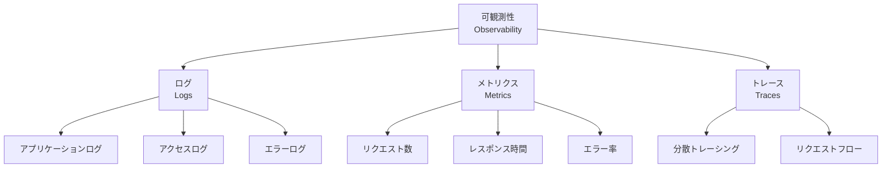

# モニタリング・可観測性

> 最終更新: 2025-01-08  
> ステータス: Draft  
> バージョン: 1.0

## 変更履歴

| バージョン | 日付 | 変更内容 | 関連機能 |
|-----------|------|---------|---------|
| 1.0 | 2025-01-08 | 初版作成 | mobile-app-system |

---

## 1. モニタリング・可観測性概要

本ドキュメントでは、mobile-app-system のモニタリングとロギング戦略を定義します。
デモンストレーション用途のため、最小限のログ出力に焦点を当てます。

## 2. 可観測性の3本柱



**本システムの実装範囲**:
- ✅ ログ（Logs）: 実装
- ❌ メトリクス（Metrics）: 未実装（デモ用途）
- ❌ トレース（Traces）: 未実装（デモ用途）

## 3. ログ戦略

### 3.1 ログレベル定義

| レベル | 用途 | 出力先 | 開発環境 | 本番環境 |
|-------|------|-------|---------|---------|
| **TRACE** | 詳細なデバッグ情報 | ファイル | ❌ | ❌ |
| **DEBUG** | デバッグ情報 | ファイル、コンソール | ✅ | ❌ |
| **INFO** | 一般的な情報 | ファイル、コンソール | ✅ | ✅ |
| **WARN** | 警告情報 | ファイル、コンソール | ✅ | ✅ |
| **ERROR** | エラー情報 | ファイル、コンソール | ✅ | ✅ |

### 3.2 ログ出力イベント

#### 認証関連

| イベント | ログレベル | 記録内容 |
|---------|----------|---------|
| ログイン成功 | INFO | `userId`, `loginId`, `userType`, `timestamp`, `IP` |
| ログイン失敗 | WARN | `loginId`, `reason`, `timestamp`, `IP` |
| JWT検証失敗 | WARN | `reason`, `endpoint`, `timestamp`, `IP` |
| 権限エラー | WARN | `userId`, `endpoint`, `userType`, `timestamp` |

#### API関連

| イベント | ログレベル | 記録内容 |
|---------|----------|---------|
| APIリクエスト | DEBUG | `method`, `endpoint`, `userId`, `timestamp` |
| APIレスポンス | DEBUG | `method`, `endpoint`, `status`, `responseTime` |
| APIエラー | ERROR | `method`, `endpoint`, `error`, `stackTrace` |

#### ビジネスロジック関連

| イベント | ログレベル | 記録内容 |
|---------|----------|---------|
| 商品購入 | INFO | `userId`, `productId`, `quantity`, `totalAmount`, `timestamp` |
| 商品更新 | INFO | `adminId`, `productId`, `changes`, `timestamp` |
| 機能フラグ変更 | INFO | `adminId`, `userId`, `flagKey`, `isEnabled`, `timestamp` |
| お気に入り登録 | DEBUG | `userId`, `productId`, `timestamp` |

### 3.3 ログフォーマット

#### Spring Boot（Logback）

```xml
<!-- logback-spring.xml -->
<configuration>
    <property name="LOG_PATTERN" 
              value="%d{yyyy-MM-dd HH:mm:ss.SSS} [%thread] %-5level %logger{36} - %msg%n"/>
    
    <appender name="CONSOLE" class="ch.qos.logback.core.ConsoleAppender">
        <encoder>
            <pattern>${LOG_PATTERN}</pattern>
        </encoder>
    </appender>
    
    <appender name="FILE" class="ch.qos.logback.core.rolling.RollingFileAppender">
        <file>logs/application.log</file>
        <encoder>
            <pattern>${LOG_PATTERN}</pattern>
        </encoder>
        <rollingPolicy class="ch.qos.logback.core.rolling.TimeBasedRollingPolicy">
            <fileNamePattern>logs/application-%d{yyyy-MM-dd}.log</fileNamePattern>
            <maxHistory>30</maxHistory>
            <totalSizeCap>1GB</totalSizeCap>
        </rollingPolicy>
    </appender>
    
    <root level="INFO">
        <appender-ref ref="CONSOLE" />
        <appender-ref ref="FILE" />
    </root>
    
    <logger name="com.example" level="DEBUG" />
</configuration>
```

#### ログ出力例

```
2025-01-08 12:00:00.123 [http-nio-8080-exec-1] INFO  c.e.w.s.AuthService - ログイン成功: userId=1, loginId=user001, userType=USER
2025-01-08 12:00:05.456 [http-nio-8080-exec-2] WARN  c.e.w.s.AuthService - ログイン失敗: loginId=user002, reason=パスワード不一致
2025-01-08 12:00:10.789 [http-nio-8080-exec-3] ERROR c.e.w.c.ProductController - 商品取得エラー: productId=999, error=Product not found
```

### 3.4 構造化ログ（JSON形式）- 将来拡張

```json
{
  "timestamp": "2025-01-08T12:00:00.123Z",
  "level": "INFO",
  "logger": "com.example.webapi.service.AuthService",
  "message": "ログイン成功",
  "userId": 1,
  "loginId": "user001",
  "userType": "USER",
  "ipAddress": "192.168.1.100"
}
```

**注意**: デモ用途のため、現時点では実装しない

## 4. ログ実装例

### 4.1 Java（Spring Boot）

```java
@Slf4j
@Service
public class AuthService {
    
    public LoginResponse login(LoginRequest request, String ipAddress) {
        try {
            User user = userRepository.findByLoginId(request.getLoginId())
                .orElseThrow(() -> new AuthenticationException("ユーザーが見つかりません"));
            
            if (!passwordService.verifyPassword(request.getPassword(), user.getPasswordHash())) {
                log.warn("ログイン失敗: loginId={}, reason=パスワード不一致, ip={}", 
                    request.getLoginId(), ipAddress);
                throw new AuthenticationException("ログインIDまたはパスワードが間違っています");
            }
            
            String token = jwtTokenProvider.createToken(user);
            log.info("ログイン成功: userId={}, loginId={}, userType={}, ip={}", 
                user.getUserId(), user.getLoginId(), user.getUserType(), ipAddress);
            
            return new LoginResponse(token, user.getUserType());
        } catch (Exception e) {
            log.error("ログインエラー: loginId={}, error={}, ip={}", 
                request.getLoginId(), e.getMessage(), ipAddress, e);
            throw e;
        }
    }
}
```

### 4.2 Swift（iOS）

```swift
import os.log

class Logger {
    private static let subsystem = "com.example.mobileapp"
    
    static func info(_ message: String, category: String = "general") {
        let log = OSLog(subsystem: subsystem, category: category)
        os_log("%{public}@", log: log, type: .info, message)
    }
    
    static func error(_ message: String, category: String = "general") {
        let log = OSLog(subsystem: subsystem, category: category)
        os_log("%{public}@", log: log, type: .error, message)
    }
}

// 使用例
Logger.info("ログイン成功: userId=\(userId)", category: "auth")
Logger.error("API呼び出しエラー: \(error.localizedDescription)", category: "network")
```

### 4.3 Java（Android）

```java
import android.util.Log;

public class AppLogger {
    private static final String TAG = "MobileApp";
    
    public static void info(String message) {
        Log.i(TAG, message);
    }
    
    public static void error(String message, Throwable throwable) {
        Log.e(TAG, message, throwable);
    }
}

// 使用例
AppLogger.info("ログイン成功: userId=" + userId);
AppLogger.error("API呼び出しエラー", exception);
```

### 4.4 JavaScript（Vue.js）

```javascript
// logger.js
const logger = {
  info(message, data = {}) {
    console.log(`[INFO] ${message}`, data);
  },
  
  warn(message, data = {}) {
    console.warn(`[WARN] ${message}`, data);
  },
  
  error(message, error = null) {
    console.error(`[ERROR] ${message}`, error);
  }
};

export default logger;

// 使用例
import logger from '@/utils/logger';

logger.info('ログイン成功', { userId: 1 });
logger.error('API呼び出しエラー', error);
```

## 5. ログローテーション

### 5.1 ローテーション設定

| 項目 | 設定値 | 理由 |
|------|-------|------|
| **ローテーション方式** | 日次 | 日ごとにファイル分割 |
| **ファイル名** | `application-YYYY-MM-DD.log` | 日付で識別 |
| **保持期間** | 30日 | 1ヶ月分のログ保持 |
| **最大サイズ** | 100MB/ファイル | ディスク容量考慮 |
| **総サイズ上限** | 1GB | ディスク圧迫防止 |

### 5.1 Logback設定例

```xml
<rollingPolicy class="ch.qos.logback.core.rolling.TimeBasedRollingPolicy">
    <!-- 日次ローテーション -->
    <fileNamePattern>logs/application-%d{yyyy-MM-dd}.log</fileNamePattern>
    
    <!-- 30日保持 -->
    <maxHistory>30</maxHistory>
    
    <!-- 総サイズ1GB -->
    <totalSizeCap>1GB</totalSizeCap>
</rollingPolicy>
```

## 6. モニタリング（最小限実装）

### 6.1 ヘルスチェック

#### Spring Boot Actuator

```yaml
# application.yml
management:
  endpoints:
    web:
      exposure:
        include: health,info
  endpoint:
    health:
      show-details: when-authorized
```

**エンドポイント**:
- `GET /actuator/health`
- `GET /actuator/info`

**レスポンス例**:
```json
{
  "status": "UP",
  "components": {
    "db": {
      "status": "UP",
      "details": {
        "database": "PostgreSQL",
        "validationQuery": "isValid()"
      }
    },
    "diskSpace": {
      "status": "UP",
      "details": {
        "total": 500000000000,
        "free": 300000000000,
        "threshold": 10485760,
        "exists": true
      }
    }
  }
}
```

### 6.2 システムリソース監視（開発環境）

```bash
# CPU・メモリ使用率
top

# ディスク使用量
df -h

# ネットワーク接続
netstat -an | grep LISTEN

# Dockerコンテナ状態
docker ps
docker stats
```

## 7. アラート（将来拡張）

**現時点では実装しない**（デモ用途）

### 7.1 アラート条件例（参考）

| アラート | 条件 | 対応 |
|---------|------|------|
| API応答時間超過 | 平均応答時間 > 3秒 | 調査・最適化 |
| エラー率上昇 | エラー率 > 5% | 原因調査 |
| DB接続プール枯渇 | 使用率 > 90% | スケールアップ |
| ディスク容量不足 | 空き容量 < 10% | クリーンアップ |

## 8. パフォーマンスメトリクス（将来拡張）

**現時点では実装しない**（デモ用途）

### 8.1 収集すべきメトリクス例（参考）

| カテゴリ | メトリクス | 説明 |
|---------|----------|------|
| **API** | リクエスト数/秒 | スループット |
| **API** | レスポンス時間（P50, P95, P99） | レイテンシ |
| **API** | エラー率 | 信頼性 |
| **DB** | クエリ実行時間 | DB性能 |
| **DB** | コネクションプール使用率 | リソース使用 |
| **システム** | CPU使用率 | リソース使用 |
| **システム** | メモリ使用率 | リソース使用 |

### 8.2 推奨ツール（参考）

- **Prometheus**: メトリクス収集
- **Grafana**: ダッシュボード可視化
- **ELK Stack**: ログ収集・分析
- **Jaeger**: 分散トレーシング

## 9. ログ分析

### 9.1 基本的なログ分析コマンド

```bash
# エラーログの抽出
grep "ERROR" logs/application.log

# 特定ユーザーのログ抽出
grep "userId=1" logs/application.log

# ログイン失敗の集計
grep "ログイン失敗" logs/application.log | wc -l

# 日時範囲でログ抽出
sed -n '/2025-01-08 12:00/,/2025-01-08 13:00/p' logs/application.log
```

### 9.2 ログ分析ツール（将来拡張）

**推奨ツール**:
- **ELK Stack** (Elasticsearch + Logstash + Kibana)
- **Splunk**
- **Datadog**

**注意**: デモ用途のため、現時点では実装しない

## 10. セキュリティログ

### 10.1 セキュリティイベントログ

| イベント | ログレベル | 記録内容 |
|---------|----------|---------|
| 不正なトークン | WARN | `token`, `reason`, `endpoint`, `IP` |
| 権限不足 | WARN | `userId`, `endpoint`, `requiredRole` |
| 連続ログイン失敗 | WARN | `loginId`, `failCount`, `IP` |
| SQLインジェクション試行 | ERROR | `query`, `IP`, `timestamp` |

### 10.2 センシティブ情報のマスキング

```java
@Slf4j
public class SecurityLogger {
    
    // パスワードをマスキング
    public static String maskPassword(String password) {
        return "****";
    }
    
    // トークンを一部マスキング
    public static String maskToken(String token) {
        if (token == null || token.length() < 10) {
            return "****";
        }
        return token.substring(0, 10) + "...";
    }
    
    // 使用例
    log.info("ログイン試行: loginId={}, password={}", 
        loginId, maskPassword(password));
}
```

## 11. ログ保存先

### 11.1 開発環境

| コンポーネント | ログ保存先 |
|--------------|----------|
| Web API | `web-api/logs/application.log` |
| Mobile BFF | `mobile-bff/logs/application.log` |
| Admin BFF | `admin-bff/logs/application.log` |
| PostgreSQL | Docker logs（`docker logs mobile-app-postgres`） |
| 管理Webアプリ | ブラウザコンソール |

### 11.2 本番環境（参考）

**推奨**:
- 集中ログ管理（CloudWatch Logs、ELK Stack等）
- ログアーカイブ（S3等）
- ログ暗号化

## 12. 監査ログ（将来拡張）

**現時点では実装しない**（デモ用途）

### 12.1 監査対象イベント例（参考）

| イベント | 記録内容 |
|---------|---------|
| 商品価格変更 | 変更前価格、変更後価格、変更者 |
| 機能フラグ変更 | 変更前設定、変更後設定、変更者 |
| ユーザー削除 | 削除ユーザー、削除者 |
| 管理者権限付与 | 対象ユーザー、付与者 |

## 13. 参照ドキュメント

| ドキュメント | パス |
|------------|------|
| セキュリティアーキテクチャ | `05-security-architecture.md` |
| インフラストラクチャ | `06-infrastructure.md` |
| デプロイメント | `07-deployment.md` |
| 非機能要件 | `/docs/specs/mobile-app-system/03-non-functional-requirements.md` |

---

**End of Document**
