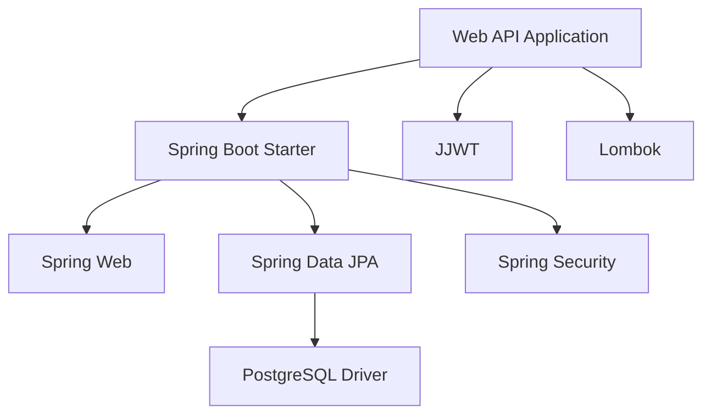

# 依存関係管理

> 最終更新: 2025-01-08  
> ステータス: Draft  
> バージョン: 1.0

## 変更履歴

| バージョン | 日付 | 変更内容 | 関連機能 |
|-----------|------|---------|---------|
| 1.0 | 2025-01-08 | 初版作成 | mobile-app-system |

---

## 1. 依存関係管理概要

本ドキュメントでは、mobile-app-system のライブラリ・フレームワーク依存関係を定義します。
プロジェクトで使用する外部ライブラリとそのバージョン管理戦略を明確にします。

## 2. バージョニング戦略

### 2.1 セマンティックバージョニング

**MAJOR.MINOR.PATCH** (例: 1.2.3)

| 区分 | 意味 | 例 |
|-----|------|-----|
| **MAJOR** | 互換性のない変更 | 1.x.x → 2.0.0 |
| **MINOR** | 後方互換性のある機能追加 | 1.1.x → 1.2.0 |
| **PATCH** | 後方互換性のあるバグ修正 | 1.1.1 → 1.1.2 |

### 2.2 更新ポリシー

| ポリシー | 説明 | 適用 |
|---------|------|------|
| **latest** | 常に最新版 | 開発環境のみ |
| **固定バージョン** | バージョン明示 | 本番環境推奨 |
| **バージョン範囲** | `^1.2.3`（MINOR/PATCH更新可） | npm/yarn |

## 3. Java（Spring Boot）依存関係

### 3.1 pom.xml（Maven）

```xml
<?xml version="1.0" encoding="UTF-8"?>
<project xmlns="http://maven.apache.org/POM/4.0.0"
         xmlns:xsi="http://www.w3.org/2001/XMLSchema-instance"
         xsi:schemaLocation="http://maven.apache.org/POM/4.0.0
         https://maven.apache.org/xsd/maven-4.0.0.xsd">
    <modelVersion>4.0.0</modelVersion>
    
    <parent>
        <groupId>org.springframework.boot</groupId>
        <artifactId>spring-boot-starter-parent</artifactId>
        <version>3.2.0</version>
        <relativePath/>
    </parent>
    
    <groupId>com.example</groupId>
    <artifactId>web-api</artifactId>
    <version>1.0.0</version>
    <packaging>jar</packaging>
    
    <properties>
        <java.version>17</java.version>
        <lombok.version>1.18.30</lombok.version>
        <jjwt.version>0.12.3</jjwt.version>
    </properties>
    
    <dependencies>
        <!-- Spring Boot Starters -->
        <dependency>
            <groupId>org.springframework.boot</groupId>
            <artifactId>spring-boot-starter-web</artifactId>
        </dependency>
        
        <dependency>
            <groupId>org.springframework.boot</groupId>
            <artifactId>spring-boot-starter-data-jpa</artifactId>
        </dependency>
        
        <dependency>
            <groupId>org.springframework.boot</groupId>
            <artifactId>spring-boot-starter-security</artifactId>
        </dependency>
        
        <dependency>
            <groupId>org.springframework.boot</groupId>
            <artifactId>spring-boot-starter-validation</artifactId>
        </dependency>
        
        <dependency>
            <groupId>org.springframework.boot</groupId>
            <artifactId>spring-boot-starter-actuator</artifactId>
        </dependency>
        
        <!-- Database -->
        <dependency>
            <groupId>org.postgresql</groupId>
            <artifactId>postgresql</artifactId>
            <scope>runtime</scope>
        </dependency>
        
        <!-- JWT -->
        <dependency>
            <groupId>io.jsonwebtoken</groupId>
            <artifactId>jjwt-api</artifactId>
            <version>${jjwt.version}</version>
        </dependency>
        <dependency>
            <groupId>io.jsonwebtoken</groupId>
            <artifactId>jjwt-impl</artifactId>
            <version>${jjwt.version}</version>
            <scope>runtime</scope>
        </dependency>
        <dependency>
            <groupId>io.jsonwebtoken</groupId>
            <artifactId>jjwt-jackson</artifactId>
            <version>${jjwt.version}</version>
            <scope>runtime</scope>
        </dependency>
        
        <!-- Lombok -->
        <dependency>
            <groupId>org.projectlombok</groupId>
            <artifactId>lombok</artifactId>
            <version>${lombok.version}</version>
            <scope>provided</scope>
        </dependency>
        
        <!-- Apache Commons -->
        <dependency>
            <groupId>org.apache.commons</groupId>
            <artifactId>commons-lang3</artifactId>
        </dependency>
        
        <!-- Test -->
        <dependency>
            <groupId>org.springframework.boot</groupId>
            <artifactId>spring-boot-starter-test</artifactId>
            <scope>test</scope>
        </dependency>
    </dependencies>
</project>
```

### 3.2 主要ライブラリ

| ライブラリ | バージョン | 用途 |
|-----------|----------|------|
| Spring Boot | 3.2.x | フレームワーク |
| Spring Data JPA | 3.2.x | データアクセス |
| Spring Security | 6.2.x | セキュリティ |
| PostgreSQL Driver | latest | DBドライバ |
| JJWT | 0.12.x | JWT処理 |
| Lombok | 1.18.x | ボイラープレート削減 |

## 4. iOS（Swift）依存関係

### 4.1 Package.swift（Swift Package Manager）

```swift
// swift-tools-version:5.9
import PackageDescription

let package = Package(
    name: "MobileApp",
    platforms: [
        .iOS(.v15)
    ],
    dependencies: [
        // HTTP Client
        .package(url: "https://github.com/Alamofire/Alamofire.git", from: "5.8.0"),
        
        // Keychain
        .package(url: "https://github.com/evgenyneu/keychain-swift.git", from: "20.0.0")
    ],
    targets: [
        .target(
            name: "MobileApp",
            dependencies: [
                "Alamofire",
                .product(name: "KeychainSwift", package: "keychain-swift")
            ]
        )
    ]
)
```

### 4.2 主要ライブラリ

| ライブラリ | バージョン | 用途 |
|-----------|----------|------|
| Alamofire | 5.8.x | HTTPクライアント |
| KeychainSwift | 20.x | セキュアストレージ |

### 4.3 Podfile（CocoaPods代替案）

```ruby
platform :ios, '15.0'

target 'MobileApp' do
  use_frameworks!
  
  # HTTP Client
  pod 'Alamofire', '~> 5.8'
  
  # Keychain
  pod 'KeychainSwift', '~> 20.0'
end
```

## 5. Android（Java）依存関係

### 5.1 build.gradle（Gradle）

```gradle
plugins {
    id 'com.android.application'
}

android {
    namespace 'com.example.mobileapp'
    compileSdk 34
    
    defaultConfig {
        applicationId "com.example.mobileapp"
        minSdk 29
        targetSdk 34
        versionCode 1
        versionName "1.0"
    }
    
    compileOptions {
        sourceCompatibility JavaVersion.VERSION_17
        targetCompatibility JavaVersion.VERSION_17
    }
}

dependencies {
    // AndroidX
    implementation 'androidx.appcompat:appcompat:1.6.1'
    implementation 'androidx.constraintlayout:constraintlayout:2.1.4'
    implementation 'androidx.lifecycle:lifecycle-viewmodel:2.7.0'
    implementation 'androidx.lifecycle:lifecycle-livedata:2.7.0'
    
    // Material Design
    implementation 'com.google.android.material:material:1.11.0'
    
    // HTTP Client
    implementation 'com.squareup.retrofit2:retrofit:2.9.0'
    implementation 'com.squareup.retrofit2:converter-gson:2.9.0'
    implementation 'com.squareup.okhttp3:okhttp:4.12.0'
    implementation 'com.squareup.okhttp3:logging-interceptor:4.12.0'
    
    // Encrypted SharedPreferences
    implementation 'androidx.security:security-crypto:1.1.0-alpha06'
    
    // RxJava (Optional)
    implementation 'io.reactivex.rxjava3:rxjava:3.1.8'
    implementation 'io.reactivex.rxjava3:rxandroid:3.0.2'
    
    // Test
    testImplementation 'junit:junit:4.13.2'
    androidTestImplementation 'androidx.test.ext:junit:1.1.5'
    androidTestImplementation 'androidx.test.espresso:espresso-core:3.5.1'
}
```

### 5.2 主要ライブラリ

| ライブラリ | バージョン | 用途 |
|-----------|----------|------|
| AndroidX AppCompat | 1.6.x | 互換性 |
| Retrofit | 2.9.x | HTTPクライアント |
| OkHttp | 4.12.x | HTTP基盤 |
| Gson | 2.10.x | JSON解析 |
| Security Crypto | 1.1.x | 暗号化 |

## 6. Vue.js（JavaScript）依存関係

### 6.1 package.json（npm/yarn）

```json
{
  "name": "admin-web",
  "version": "1.0.0",
  "type": "module",
  "scripts": {
    "dev": "vite",
    "build": "vite build",
    "preview": "vite preview",
    "lint": "eslint . --ext .vue,.js,.jsx,.cjs,.mjs --fix"
  },
  "dependencies": {
    "vue": "^3.4.0",
    "vue-router": "^4.2.5",
    "pinia": "^2.1.7",
    "axios": "^1.6.2"
  },
  "devDependencies": {
    "@vitejs/plugin-vue": "^5.0.0",
    "vite": "^5.0.0",
    "eslint": "^8.55.0",
    "eslint-plugin-vue": "^9.19.2",
    "@vue/eslint-config-standard": "^8.0.1"
  }
}
```

### 6.2 主要ライブラリ

| ライブラリ | バージョン | 用途 |
|-----------|----------|------|
| Vue.js | 3.4.x | フロントエンドフレームワーク |
| Vue Router | 4.2.x | ルーティング |
| Pinia | 2.1.x | 状態管理 |
| Axios | 1.6.x | HTTPクライアント |
| Vite | 5.0.x | ビルドツール |
| ESLint | 8.x | 静的解析 |

## 7. 依存関係更新戦略

### 7.1 更新頻度

| 種別 | 頻度 | タイミング |
|-----|------|----------|
| **セキュリティパッチ** | 即座 | 脆弱性発見時 |
| **PATCH更新** | 月次 | 月末 |
| **MINOR更新** | 四半期 | 四半期末 |
| **MAJOR更新** | 慎重に | 検証後 |

### 7.2 更新手順

```bash
# 1. 古い依存関係の確認
npm outdated  # Node.js
mvn versions:display-dependency-updates  # Maven

# 2. 更新可能なバージョンの確認
npm update --dry-run
mvn versions:display-dependency-updates

# 3. 更新実行
npm update
mvn versions:use-latest-releases

# 4. テスト実行
npm test
mvn test

# 5. ビルド確認
npm run build
mvn clean package
```

## 8. セキュリティ脆弱性チェック

### 8.1 Java

```bash
# OWASP Dependency Check
mvn org.owasp:dependency-check-maven:check

# Snyk（オプション）
snyk test
```

### 8.2 JavaScript

```bash
# npm audit
npm audit

# 自動修正
npm audit fix

# Snyk（オプション）
npm install -g snyk
snyk test
```

## 9. ライセンス管理

### 9.1 許可されるライセンス

| ライセンス | 使用可否 | 備考 |
|-----------|---------|------|
| MIT | ✅ | 制限なし |
| Apache 2.0 | ✅ | 制限なし |
| BSD | ✅ | 制限なし |
| LGPL | ⚠️ | 要確認 |
| GPL | ❌ | 使用禁止 |

### 9.2 ライセンスチェック

```bash
# Maven
mvn license:add-third-party

# npm
npx license-checker --summary
```

## 10. 依存関係図

### 10.1 Spring Boot依存関係



## 11. 依存関係チェックリスト

### 11.1 新規ライブラリ導入時

- [ ] 必要性が明確か
- [ ] ライセンスが適切か
- [ ] メンテナンスされているか
- [ ] 既存ライブラリと競合しないか
- [ ] セキュリティ脆弱性がないか
- [ ] ドキュメントが充実しているか
- [ ] 代替ライブラリと比較検討したか

## 12. 参照ドキュメント

| ドキュメント | URL |
|------------|-----|
| Maven Repository | https://mvnrepository.com/ |
| npm Registry | https://www.npmjs.com/ |
| CocoaPods | https://cocoapods.org/ |
| Swift Package Index | https://swiftpackageindex.com/ |

---

**End of Document**
