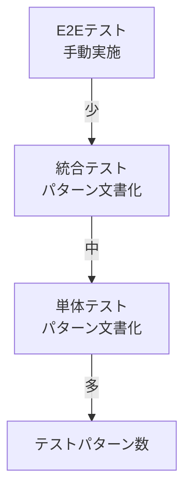

# テストアーキテクチャ

> 最終更新: 2025-01-08  
> ステータス: Draft  
> バージョン: 1.0

## 変更履歴

| バージョン | 日付 | 変更内容 | 関連機能 |
|-----------|------|---------|---------|
| 1.0 | 2025-01-08 | 初版作成 | mobile-app-system |

---

## 1. テストアーキテクチャ概要

本ドキュメントでは、mobile-app-system のテストアーキテクチャを定義します。

**重要**: デモンストレーション用途のため、自動テストコードは実装しませんが、
テストパターンと戦略はドキュメント化します。

## 2. テスト戦略

### 2.1 テストピラミッド



### 2.2 テストレベル

| テストレベル | 実装 | ドキュメント | 実施方法 |
|------------|------|------------|---------|
| **単体テスト** | ❌ | ✅ | パターン定義のみ |
| **統合テスト** | ❌ | ✅ | パターン定義のみ |
| **システムテスト** | ❌ | ✅ | 手動テスト |
| **E2Eテスト** | ❌ | ✅ | 手動テスト |

## 3. 単体テストパターン

### 3.1 テスト対象

- Service層のビジネスロジック
- Repository層のデータアクセス
- Utility クラス
- バリデーションロジック

### 3.2 単体テストパターン例（Java）

#### PasswordService テスト

```java
// 実装なし（パターン定義のみ）
// 以下は実装時のテンプレート

/**
 * PasswordServiceのテストパターン
 */
public class PasswordServiceTest {
    
    private PasswordService passwordService;
    
    /**
     * 【正常系】パスワードハッシュ化
     * - 入力: "password123"
     * - 期待: bcryptハッシュが返される
     * - 期待: 同じパスワードでも異なるハッシュ（ソルト効果）
     */
    @Test
    public void testHashPassword_Success() {
        // テストパターン定義
    }
    
    /**
     * 【異常系】null パスワード
     * - 入力: null
     * - 期待: IllegalArgumentException
     */
    @Test
    public void testHashPassword_NullPassword() {
        // テストパターン定義
    }
    
    /**
     * 【正常系】パスワード検証
     * - 入力: 正しいパスワード、正しいハッシュ
     * - 期待: true
     */
    @Test
    public void testVerifyPassword_Success() {
        // テストパターン定義
    }
    
    /**
     * 【異常系】誤ったパスワード
     * - 入力: 誤ったパスワード、正しいハッシュ
     * - 期待: false
     */
    @Test
    public void testVerifyPassword_WrongPassword() {
        // テストパターン定義
    }
}
```

### 3.3 テストフレームワーク

| 言語 | フレームワーク | 用途 |
|-----|-------------|------|
| Java | JUnit 5 | 単体テスト |
| Java | Mockito | モック |
| Swift | XCTest | 単体テスト |
| JavaScript | Jest / Vitest | 単体テスト |

## 4. 統合テストパターン

### 4.1 テスト対象

- Controller層とService層の連携
- Service層とRepository層の連携
- データベースとの連携

### 4.2 統合テストパターン例（Java）

```java
/**
 * ProductServiceの統合テストパターン
 */
@SpringBootTest
@Transactional
public class ProductServiceIntegrationTest {
    
    @Autowired
    private ProductService productService;
    
    @Autowired
    private ProductRepository productRepository;
    
    /**
     * 【正常系】商品取得
     * - 事前条件: 商品ID=1がDBに存在
     * - 実行: productService.getProductById(1L)
     * - 期待: 商品情報が返される
     */
    @Test
    public void testGetProductById_Success() {
        // テストパターン定義
    }
    
    /**
     * 【異常系】存在しない商品
     * - 事前条件: 商品ID=999がDBに存在しない
     * - 実行: productService.getProductById(999L)
     * - 期待: ResourceNotFoundException
     */
    @Test
    public void testGetProductById_NotFound() {
        // テストパターン定義
    }
    
    /**
     * 【正常系】商品更新
     * - 事前条件: 商品ID=1がDBに存在
     * - 実行: productService.updateProduct(1L, request)
     * - 期待: 商品が更新される
     * - 期待: updated_atが更新される
     */
    @Test
    public void testUpdateProduct_Success() {
        // テストパターン定義
    }
}
```

## 5. E2Eテストパターン

### 5.1 テストシナリオ

#### シナリオ1: ユーザー購入フロー

```gherkin
Feature: 商品購入
  
  Scenario: ユーザーが商品を購入する
    Given ユーザー "user001" がログインしている
    When 商品一覧画面を表示する
    And 商品 "商品A" を選択する
    And 購入個数 "100" を入力する
    And "購入確定" ボタンをクリックする
    Then 購入完了メッセージが表示される
    And 購入履歴に反映される
```

#### シナリオ2: 管理者商品更新フロー

```gherkin
Feature: 商品管理
  
  Scenario: 管理者が商品価格を変更する
    Given 管理者 "admin001" がログインしている
    When 商品一覧画面を表示する
    And 商品 "商品A" の編集ボタンをクリックする
    And 単価を "1000" から "1200" に変更する
    And "保存" ボタンをクリックする
    Then 更新完了メッセージが表示される
    And 商品一覧に反映される
```

### 5.2 手動テストチェックリスト

#### モバイルアプリ

- [ ] ログイン成功（正しいID/パスワード）
- [ ] ログイン失敗（誤ったパスワード）
- [ ] 商品一覧表示
- [ ] 商品検索
- [ ] 商品詳細表示
- [ ] 商品購入（100個）
- [ ] 商品購入（200個）
- [ ] 商品購入失敗（99個: バリデーションエラー）
- [ ] お気に入り登録（機能フラグON）
- [ ] お気に入り解除
- [ ] お気に入り一覧表示
- [ ] トークン期限切れ後の挙動

#### 管理Webアプリ

- [ ] 管理者ログイン成功
- [ ] 管理者ログイン失敗
- [ ] 商品一覧表示
- [ ] 商品編集（名前変更）
- [ ] 商品編集（価格変更）
- [ ] ユーザー一覧表示
- [ ] 機能フラグON
- [ ] 機能フラグOFF
- [ ] トークン期限切れ後の挙動

## 6. セキュリティテストパターン

### 6.1 認証テスト

| テストケース | 入力 | 期待結果 |
|------------|------|---------|
| トークンなし | Authorization ヘッダーなし | 401 Unauthorized |
| 不正なトークン | 改ざんされたトークン | 401 Unauthorized |
| 期限切れトークン | 24時間以上前のトークン | 401 Unauthorized |
| 正常なトークン | 有効なトークン | 200 OK |

### 6.2 認可テスト

| テストケース | ユーザー | API | 期待結果 |
|------------|---------|-----|---------|
| user権限でadmin API | user | PUT /api/v1/products/{id} | 403 Forbidden |
| admin権限でuser API | admin | POST /api/v1/purchases | 403 Forbidden |
| リソース所有権チェック | user001 | GET /api/v1/purchases?userId=2 | 403 Forbidden |

### 6.3 インジェクションテスト

| テストケース | 入力 | 期待結果 |
|------------|------|---------|
| SQLインジェクション | `' OR '1'='1` | エスケープ済み・エラー |
| XSS | `<script>alert('XSS')</script>` | エスケープ済み表示 |

## 7. パフォーマンステストパターン

**注意**: デモ用途のため実装しないが、本番環境では以下を検討

### 7.1 負荷テストシナリオ

| シナリオ | 負荷 | 測定項目 |
|---------|------|---------|
| 通常負荷 | 10ユーザー | レスポンス時間、エラー率 |
| ピーク負荷 | 50ユーザー | レスポンス時間、エラー率 |
| ストレステスト | 100ユーザー以上 | システム限界 |

### 7.2 性能目標

| API | 目標応答時間 | 最大許容時間 |
|-----|------------|-------------|
| ログイン | 1秒以内 | 2秒 |
| 商品一覧 | 2秒以内 | 3秒 |
| 商品検索 | 1秒以内 | 2秒 |
| 商品購入 | 3秒以内 | 5秒 |

## 8. テストデータ管理

### 8.1 テストデータセット

```sql
-- テスト用ユーザー
INSERT INTO users (user_name, login_id, password_hash, user_type) VALUES
('テストユーザー1', 'testuser001', '$2a$10$...', 'user'),
('テストユーザー2', 'testuser002', '$2a$10$...', 'user'),
('テスト管理者', 'testadmin001', '$2a$10$...', 'admin');

-- テスト用商品
INSERT INTO products (product_name, unit_price, description) VALUES
('テスト商品A', 1000, 'テスト用商品A'),
('テスト商品B', 1500, 'テスト用商品B'),
('テスト商品C', 2000, 'テスト用商品C');
```

### 8.2 テストデータクリーンアップ

```sql
-- テストデータ削除
DELETE FROM purchases WHERE user_id IN (SELECT user_id FROM users WHERE login_id LIKE 'test%');
DELETE FROM favorites WHERE user_id IN (SELECT user_id FROM users WHERE login_id LIKE 'test%');
DELETE FROM users WHERE login_id LIKE 'test%';
DELETE FROM products WHERE product_name LIKE 'テスト%';
```

## 9. テストツール

### 9.1 推奨ツール

| カテゴリ | ツール | 用途 |
|---------|-------|------|
| **API テスト** | Postman | 手動APIテスト |
| **API テスト** | cURL | コマンドラインAPIテスト |
| **負荷テスト** | JMeter | 負荷テスト（将来） |
| **セキュリティ** | OWASP ZAP | セキュリティテスト（将来） |

### 9.2 Postman コレクション例

```json
{
  "info": {
    "name": "Mobile App API Tests",
    "schema": "https://schema.getpostman.com/json/collection/v2.1.0/collection.json"
  },
  "item": [
    {
      "name": "ログイン",
      "request": {
        "method": "POST",
        "url": "{{base_url}}/api/v1/auth/login",
        "body": {
          "mode": "raw",
          "raw": "{\n  \"loginId\": \"user001\",\n  \"password\": \"password123\"\n}"
        }
      }
    },
    {
      "name": "商品一覧取得",
      "request": {
        "method": "GET",
        "url": "{{base_url}}/api/v1/products",
        "header": [
          {
            "key": "Authorization",
            "value": "Bearer {{token}}"
          }
        ]
      }
    }
  ]
}
```

## 10. テストドキュメント構成

### 10.1 詳細テスト仕様

詳細なテストパターンは `/docs/specs/mobile-app-system/12-testing-strategy.md` を参照

### 10.2 テストケース管理

**推奨ツール**（将来拡張）:
- TestRail
- Zephyr
- Excel/Google Sheets（シンプル）

## 11. 参照ドキュメント

| ドキュメント | パス |
|------------|------|
| テスト戦略詳細 | `/docs/specs/mobile-app-system/12-testing-strategy.md` |
| セキュリティ要件 | `/docs/specs/mobile-app-system/08-security.md` |
| API仕様 | `/docs/specs/mobile-app-system/05-api-spec.md` |

---

**End of Document**
