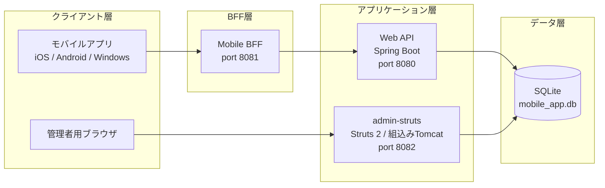

# 1. システム概要

> 本ドキュメントは ISO/IEC/IEEE 29148:2018（要件工学）に準拠した構成で admin-struts アプリケーションのシステム要件・ビジネス要件を記述する。

## 1.1 ドキュメント構成

| #   | ドキュメント           | 概要                                                 |
| --- | ---------------------- | ---------------------------------------------------- |
| 01  | 概要（本書）           | システムの目的・スコープ・ステークホルダー・用語定義 |
| 02  | ビジネス要件           | 業務目的・ユースケース・ビジネスルール               |
| 03  | システム要件           | 機能要件・非機能要件（ISO/IEC 25010 品質モデル準拠） |
| 04  | システムアーキテクチャ | レイヤー構成・コンポーネント・配備構成               |
| 05  | データベース設計       | テーブル定義・制約・トリガー・ER図                   |
| 06  | セキュリティ要件       | 認証・認可・データ保護                               |
| 07  | API仕様                | REST API エンドポイント・リクエスト/レスポンス仕様   |

## 1.2 システムの目的

admin-struts は、商品販売システムにおける **管理者用 Web アプリケーション** である。管理者が商品マスタデータ、ユーザー情報、フィーチャーフラグを一元管理するための Web UI および REST API を提供する。

## 1.3 システムスコープ

### スコープ内

- 管理画面（Struts 2 Web UI）
- REST API エンドポイント（JSON）
- 認証・認可（セッション / JWT）
- 商品管理（CRUD）
- ユーザー管理（参照）
- フィーチャーフラグ管理

### スコープ外

- モバイルアプリ本体（iOS / Android / Windows）
- Mobile BFF
- Web API（Spring Boot）
- 決済・課金処理
- メール通知

## 1.4 ステークホルダー

| ステークホルダー | 役割                               | 関心事                         |
| ---------------- | ---------------------------------- | ------------------------------ |
| システム管理者   | 商品・ユーザー・フラグの管理操作   | 業務効率・操作性・データ整合性 |
| エンドユーザー   | モバイルアプリ経由の商品購入・閲覧 | API の安定性・レスポンス速度   |
| 開発チーム       | 機能開発・保守                     | 保守性・拡張性・テスト容易性   |
| 運用チーム       | システム監視・障害対応             | 可用性・ログ・ヘルスチェック   |

## 1.5 用語定義

| 用語               | 定義                                                             |
| ------------------ | ---------------------------------------------------------------- |
| admin-struts       | Struts 2 フレームワークで構築された管理者用 Web アプリケーション |
| BFF                | Backend for Frontend。クライアント専用のバックエンドゲートウェイ |
| フィーチャーフラグ | ユーザー単位で機能の有効/無効を動的に制御する仕組み              |
| JWT                | JSON Web Token。API 認証に使用するトークン方式                   |
| シードデータ       | 初期投入されるマスタデータおよびテストデータ                     |

## 1.6 技術スタック

| カテゴリ                 | 技術                                  | バージョン     |
| ------------------------ | ------------------------------------- | -------------- |
| 言語                     | Java                                  | 7              |
| フレームワーク           | Apache Struts 2                       | 2.3.37         |
| DI コンテナ              | Spring Framework                      | 3.2.18.RELEASE |
| データベース             | SQLite                                | 3.x            |
| JDBC ユーティリティ      | Apache Commons DbUtils                | 1.6            |
| JSON 処理                | Jackson                               | 2.4.6          |
| JWT                      | JJWT                                  | 0.6.0          |
| パスワードハッシュ       | jBCrypt                               | 0.4            |
| ビルドツール             | Apache Maven                          | 3.x            |
| アプリケーションサーバー | 組込み Tomcat（tomcat7-maven-plugin） | 2.2            |
| テスト                   | JUnit 4 / Mockito                     | 4.12 / 1.10.19 |

## 1.7 参照規格

| 規格                    | 適用範囲                                     |
| ----------------------- | -------------------------------------------- |
| ISO/IEC/IEEE 29148:2018 | 要件工学プロセスおよびドキュメント構成       |
| ISO/IEC 25010:2011      | ソフトウェア品質モデル（非機能要件の分類）   |
| ISO/IEC 27001           | 情報セキュリティ管理（認証・認可の設計根拠） |
| OWASP Top 10            | Web アプリケーションセキュリティ（実装指針） |
