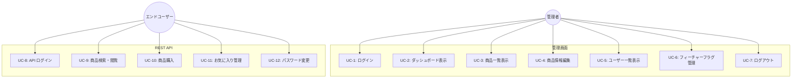
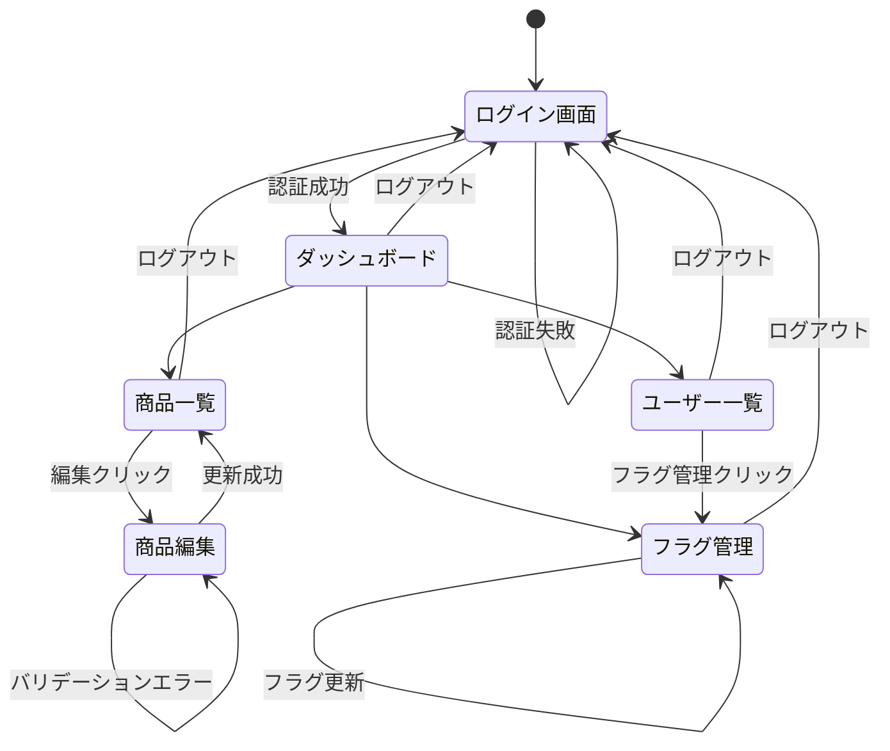

# 2. ビジネス要件

> ISO/IEC/IEEE 29148:2018 — ビジネス要件仕様（BRS）に準拠

## 2.1 ビジネス目的

商品販売システムの運用において、管理者が以下の業務を **Web ブラウザ上で一元的に** 実施できる環境を提供する。

| #    | 目的                          | 詳細                                                                       |
| ---- | ----------------------------- | -------------------------------------------------------------------------- |
| BO-1 | 商品マスタの集中管理          | 商品情報（名称・価格・説明・画像）の参照・更新を Web UI で実施可能にする   |
| BO-2 | ユーザー状況の可視化          | 登録ユーザーの一覧確認により利用状況を把握する                             |
| BO-3 | 機能リリースの動的制御        | フィーチャーフラグにより特定ユーザーへの機能提供を段階的に制御する         |
| BO-4 | モバイルアプリ向け API の提供 | 商品・購入・お気に入り等の機能を REST API として外部クライアントに公開する |

## 2.2 ユースケース図

## 2.3 ユースケース詳細

### UC-1: ログイン

| 項目       | 内容                                                                                                                            |
| ---------- | ------------------------------------------------------------------------------------------------------------------------------- |
| アクター   | 管理者                                                                                                                          |
| 事前条件   | 管理者アカウント（`user_type='admin'`）が登録済み                                                                               |
| 基本フロー | 1. ログイン画面にアクセスする 2. ログイン ID とパスワードを入力する 3. 認証に成功し、ダッシュボードにリダイレクトされる |
| 代替フロー | 3a. 認証失敗 → エラーメッセージ表示、ログイン画面に戻る 3b. 一般ユーザーでログイン → エラーメッセージ表示                   |
| 事後条件   | セッションにユーザー情報が格納される                                                                                            |

### UC-2: ダッシュボード表示

| 項目       | 内容                                                                                                  |
| ---------- | ----------------------------------------------------------------------------------------------------- |
| アクター   | 管理者                                                                                                |
| 事前条件   | ログイン済み                                                                                          |
| 基本フロー | 1. ダッシュボードページを表示する 2. 商品管理・ユーザー管理・フラグ管理へのリンクカードを確認する |
| 事後条件   | なし                                                                                                  |

### UC-3: 商品一覧表示

| 項目       | 内容                                                                                                                                                  |
| ---------- | ----------------------------------------------------------------------------------------------------------------------------------------------------- |
| アクター   | 管理者                                                                                                                                                |
| 事前条件   | ログイン済み                                                                                                                                          |
| 基本フロー | 1. 商品一覧ページにアクセスする 2. 全商品がテーブル形式で表示される（ID・名前・単価・説明） 3. 各商品の「編集」リンクから編集画面に遷移できる |
| 事後条件   | なし                                                                                                                                                  |

### UC-4: 商品情報編集

| 項目           | 内容                                                                                                                                                                                                   |
| -------------- | ------------------------------------------------------------------------------------------------------------------------------------------------------------------------------------------------------ |
| アクター       | 管理者                                                                                                                                                                                                 |
| 事前条件       | ログイン済み、対象商品が存在する                                                                                                                                                                       |
| 基本フロー     | 1. 商品一覧から「編集」をクリックする 2. 編集フォームに現在の商品情報が表示される 3. 商品名・単価・説明・画像 URL を変更する 4. 更新ボタンを押下する 5. 更新成功メッセージが表示される |
| 代替フロー     | 4a. バリデーションエラー → エラーメッセージ表示、フォームに戻る                                                                                                                                        |
| ビジネスルール | BR-1: 単価変更時、価格履歴が DB トリガーにより自動記録される                                                                                                                                           |
| 事後条件       | 商品情報が更新される                                                                                                                                                                                   |

### UC-5: ユーザー一覧表示

| 項目       | 内容                                                                                                                                                                                         |
| ---------- | -------------------------------------------------------------------------------------------------------------------------------------------------------------------------------------------- |
| アクター   | 管理者                                                                                                                                                                                       |
| 事前条件   | ログイン済み                                                                                                                                                                                 |
| 基本フロー | 1. ユーザー一覧ページにアクセスする 2. 全ユーザーがテーブル形式で表示される（ID・ログイン ID・名前・種別・作成日） 3. 各ユーザーの「フラグ管理」リンクからフラグ設定画面に遷移できる |
| 事後条件   | なし                                                                                                                                                                                         |

### UC-6: フィーチャーフラグ管理

| 項目       | 内容                                                                                                                                                                                                         |
| ---------- | ------------------------------------------------------------------------------------------------------------------------------------------------------------------------------------------------------------ |
| アクター   | 管理者                                                                                                                                                                                                       |
| 事前条件   | ログイン済み、対象ユーザーが存在する                                                                                                                                                                         |
| 基本フロー | 1. ユーザー一覧から「フラグ管理」をクリック、またはフラグ管理画面でユーザーを選択する 2. 対象ユーザーのフラグ一覧が表示される 3. フラグの有効/無効を切り替える 4. 更新成功メッセージが表示される |
| 事後条件   | フラグ設定が更新される（UPSERT）                                                                                                                                                                             |

### UC-7: ログアウト

| 項目       | 内容                                                                                                    |
| ---------- | ------------------------------------------------------------------------------------------------------- |
| アクター   | 管理者                                                                                                  |
| 事前条件   | ログイン済み                                                                                            |
| 基本フロー | 1. ログアウトボタンをクリックする 2. セッションが破棄される 3. ログイン画面にリダイレクトされる |
| 事後条件   | セッション情報が削除される                                                                              |

### UC-8: API ログイン

| 項目       | 内容                                                                                     |
| ---------- | ---------------------------------------------------------------------------------------- |
| アクター   | エンドユーザー / 管理者                                                                  |
| 事前条件   | アカウントが登録済み                                                                     |
| 基本フロー | 1. ログイン ID とパスワードを JSON で送信する 2. 認証成功 → JWT トークンが返却される |
| 代替フロー | 2a. 認証失敗 → エラーレスポンス（AUTH_001）                                              |
| 事後条件   | JWT トークンが発行される（有効期限 24 時間）                                             |

### UC-9: 商品検索・閲覧

| 項目       | 内容                                                                                                            |
| ---------- | --------------------------------------------------------------------------------------------------------------- |
| アクター   | エンドユーザー                                                                                                  |
| 事前条件   | API 認証済み（JWT 必須）                                                                                        |
| 基本フロー | 1. 商品一覧を取得する 2. キーワードで商品を検索する 3. 商品詳細情報を取得する 4. 価格履歴を取得する |
| 事後条件   | なし                                                                                                            |

### UC-10: 商品購入

| 項目           | 内容                                                                        |
| -------------- | --------------------------------------------------------------------------- |
| アクター       | エンドユーザー                                                              |
| 事前条件       | API 認証済み、対象商品が存在する                                            |
| 基本フロー     | 1. 商品 ID と数量を指定して購入リクエストを送信する 2. 購入が記録される |
| ビジネスルール | BR-2: 数量は 100 の倍数でなければならない                                   |
| 事後条件       | 購入履歴が作成される（購入時点の単価が記録される）                          |

### UC-11: お気に入り管理

| 項目           | 内容                                                                                              |
| -------------- | ------------------------------------------------------------------------------------------------- |
| アクター       | エンドユーザー                                                                                    |
| 事前条件       | API 認証済み、お気に入り機能フラグが有効                                                          |
| 基本フロー     | 1. お気に入り一覧を取得する 2. 商品をお気に入りに追加する 3. 商品をお気に入りから削除する |
| ビジネスルール | BR-3: フィーチャーフラグ `favorite_feature` が有効なユーザーのみ利用可能                          |
| 代替フロー     | 1a. フラグ無効 → エラーレスポンス（FEATURE_001） 2a. 重複追加 → エラーレスポンス（FAV_002）   |
| 事後条件       | お気に入りデータが更新される                                                                      |

### UC-12: パスワード変更

| 項目       | 内容                                                                                                              |
| ---------- | ----------------------------------------------------------------------------------------------------------------- |
| アクター   | エンドユーザー / 管理者                                                                                           |
| 事前条件   | API 認証済み                                                                                                      |
| 基本フロー | 1. 現在のパスワードと新しいパスワードを送信する 2. 現在のパスワードが検証される 3. パスワードが更新される |
| 代替フロー | 2a. 現在のパスワード不一致 → エラーレスポンス（AUTH_007）                                                         |
| 事後条件   | パスワードハッシュが更新される                                                                                    |

## 2.4 ビジネスルール

| ID   | ルール                                                                             | 適用箇所                                            |
| ---- | ---------------------------------------------------------------------------------- | --------------------------------------------------- |
| BR-1 | 商品の単価が変更された場合、変更前後の価格が自動的に履歴として記録される           | 商品更新（DB トリガー）                             |
| BR-2 | 購入数量は 100 の正の倍数でなければならない                                        | 購入処理（Service 層バリデーション）                |
| BR-3 | お気に入り機能は、該当ユーザーの `favorite_feature` フラグが有効な場合のみ利用可能 | お気に入り API                                      |
| BR-4 | 管理画面へのアクセスは `user_type='admin'` のユーザーのみ許可する                  | 認証（AuthInterceptor）                             |
| BR-5 | 同一ユーザーが同一商品を重複してお気に入りに追加することはできない                 | お気に入り追加（DB UNIQUE 制約 + Service チェック） |
| BR-6 | パスワードは BCrypt（strength=10）でハッシュ化して保存する                         | ユーザー認証・パスワード変更                        |

## 2.5 画面遷移図

