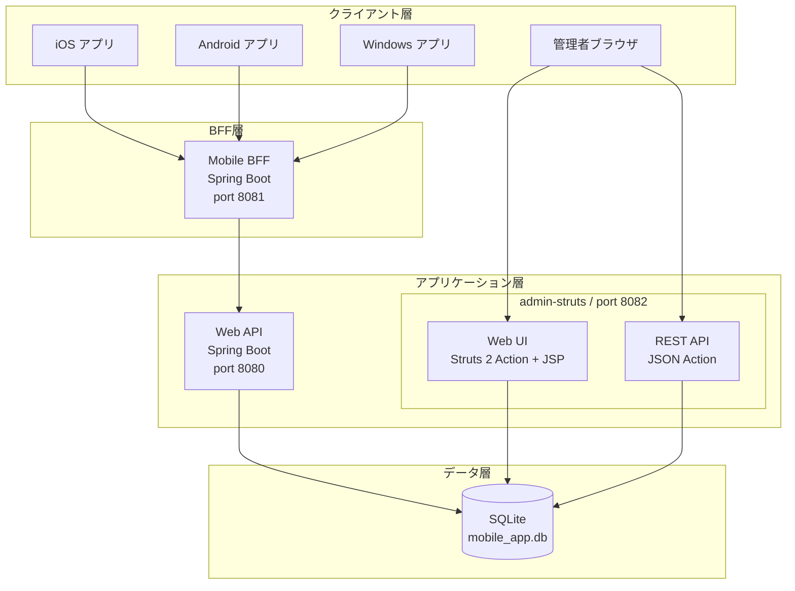
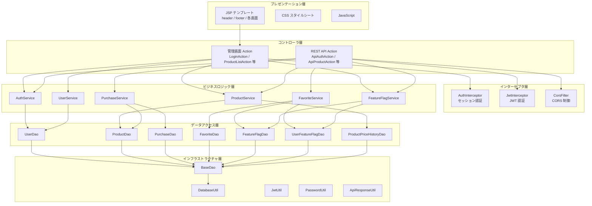
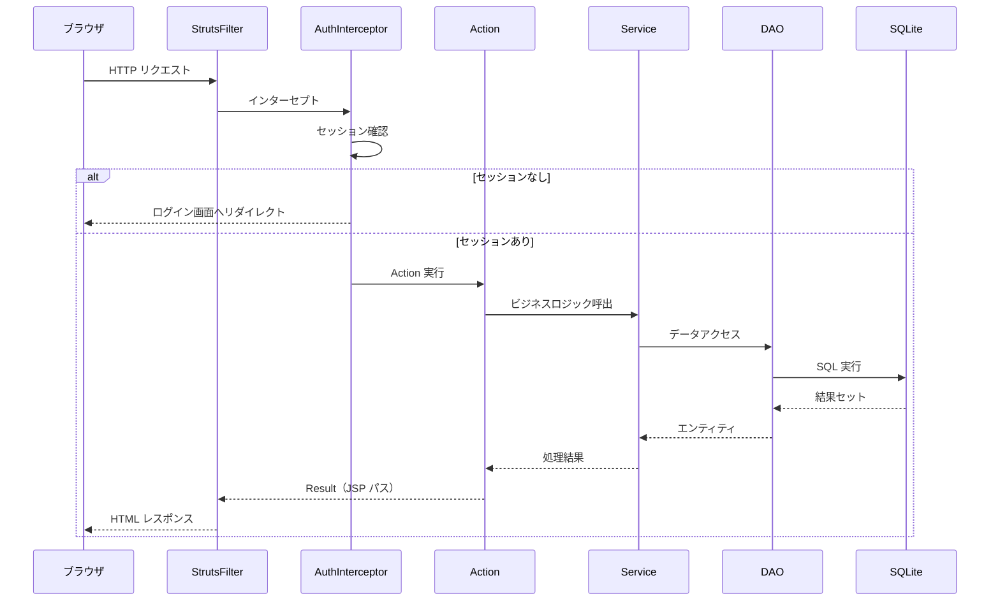
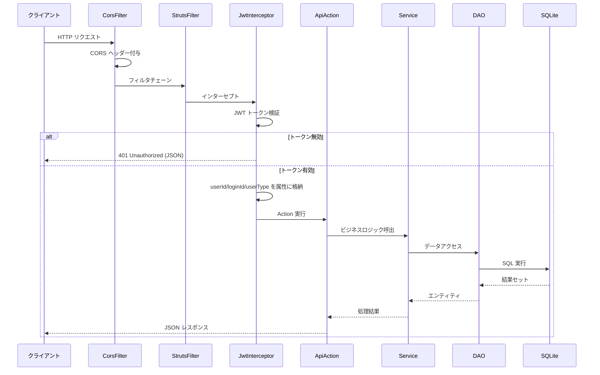
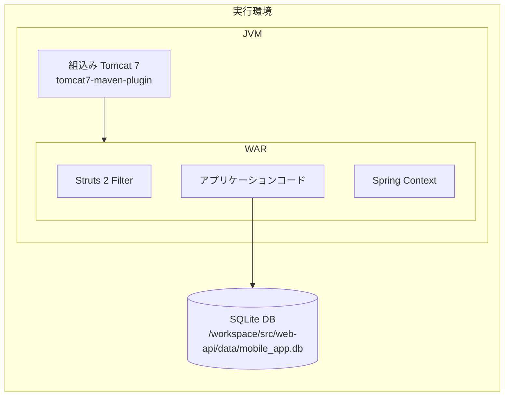
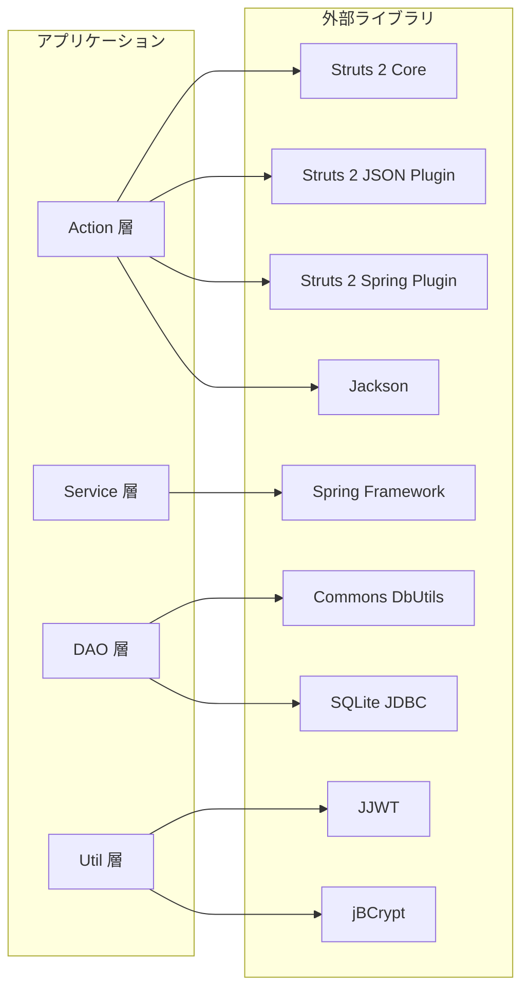

# 4. システムアーキテクチャ

## 4.1 全体構成図



## 4.2 レイヤードアーキテクチャ



## 4.3 パッケージ構成

```
com.example.admin
├── action/                    # Struts 2 管理画面アクション
│   ├── auth/                  #   認証（Login / Logout）
│   ├── product/               #   商品管理（List / Detail / Update）
│   ├── user/                  #   ユーザー管理（List）
│   ├── featureflag/           #   フラグ管理（List / Update）
│   └── DashboardAction        #   ダッシュボード
├── api/                       # REST API アクション
│   ├── auth/                  #   認証 API
│   ├── product/               #   商品 API
│   ├── purchase/              #   購入 API
│   ├── favorite/              #   お気に入り API
│   ├── featureflag/           #   フラグ API
│   └── health/                #   ヘルスチェック
├── service/                   # ビジネスロジック
├── dao/                       # データアクセス
├── entity/                    # エンティティ
├── dto/                       # データ転送オブジェクト
├── interceptor/               # Struts インターセプタ
├── filter/                    # サーブレットフィルタ
└── util/                      # ユーティリティ
```

## 4.4 リクエスト処理フロー

### 管理画面リクエスト



### REST API リクエスト



## 4.5 配備構成



| 項目                   | 値                                          |
| ---------------------- | ------------------------------------------- |
| リスニングポート       | 8082                                        |
| コンテキストパス       | `/admin-struts`                             |
| データベースパス       | `/workspace/src/web-api/data/mobile_app.db` |
| ログ出力               | コンソール（SLF4J + Log4j）                 |
| セッションタイムアウト | 30 分                                       |

## 4.6 コンポーネント依存関係


