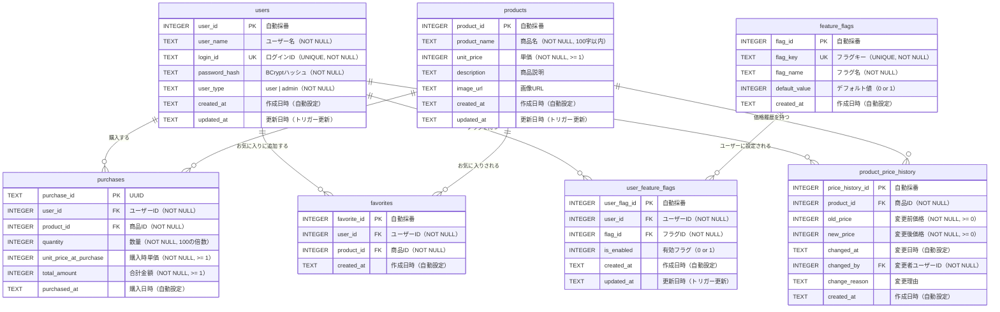

# 5. データベース設計

## 5.1 ER 図

## 5.2 テーブル定義

### 5.2.1 users（ユーザー）

| カラム        | 型      | 制約                            | 説明                         |
| ------------- | ------- | ------------------------------- | ---------------------------- |
| user_id       | INTEGER | PK, AUTOINCREMENT               | ユーザー ID                  |
| user_name     | TEXT    | NOT NULL                        | ユーザー名                   |
| login_id      | TEXT    | NOT NULL, UNIQUE                | ログイン ID                  |
| password_hash | TEXT    | NOT NULL                        | パスワードハッシュ（BCrypt） |
| user_type     | TEXT    | NOT NULL, CHECK('user','admin') | ユーザー種別                 |
| created_at    | TEXT    | DEFAULT CURRENT_TIMESTAMP       | 作成日時                     |
| updated_at    | TEXT    | DEFAULT CURRENT_TIMESTAMP       | 更新日時                     |

### 5.2.2 products（商品）

| カラム       | 型      | 制約                      | 説明       |
| ------------ | ------- | ------------------------- | ---------- |
| product_id   | INTEGER | PK, AUTOINCREMENT         | 商品 ID    |
| product_name | TEXT    | NOT NULL, LENGTH <= 100   | 商品名     |
| unit_price   | INTEGER | NOT NULL, >= 1            | 単価（円） |
| description  | TEXT    | -                         | 商品説明   |
| image_url    | TEXT    | -                         | 画像 URL   |
| created_at   | TEXT    | DEFAULT CURRENT_TIMESTAMP | 作成日時   |
| updated_at   | TEXT    | DEFAULT CURRENT_TIMESTAMP | 更新日時   |

### 5.2.3 purchases（購入履歴）

| カラム                 | 型      | 制約                      | 説明            |
| ---------------------- | ------- | ------------------------- | --------------- |
| purchase_id            | TEXT    | PK                        | 購入 ID（UUID） |
| user_id                | INTEGER | FK → users, NOT NULL      | 購入ユーザー    |
| product_id             | INTEGER | FK → products, NOT NULL   | 購入商品        |
| quantity               | INTEGER | NOT NULL, 100 の倍数      | 数量            |
| unit_price_at_purchase | INTEGER | NOT NULL, >= 1            | 購入時単価      |
| total_amount           | INTEGER | NOT NULL, >= 1            | 合計金額        |
| purchased_at           | TEXT    | DEFAULT CURRENT_TIMESTAMP | 購入日時        |

### 5.2.4 favorites（お気に入り）

| カラム      | 型      | 制約                              | 説明          |
| ----------- | ------- | --------------------------------- | ------------- |
| favorite_id | INTEGER | PK, AUTOINCREMENT                 | お気に入り ID |
| user_id     | INTEGER | FK → users (CASCADE), NOT NULL    | ユーザー      |
| product_id  | INTEGER | FK → products (CASCADE), NOT NULL | 商品          |
| created_at  | TEXT    | DEFAULT CURRENT_TIMESTAMP         | 作成日時      |

UNIQUE 制約: `(user_id, product_id)`

### 5.2.5 feature_flags（フィーチャーフラグ定義）

| カラム        | 型      | 制約                      | 説明               |
| ------------- | ------- | ------------------------- | ------------------ |
| flag_id       | INTEGER | PK, AUTOINCREMENT         | フラグ ID          |
| flag_key      | TEXT    | NOT NULL, UNIQUE          | フラグキー         |
| flag_name     | TEXT    | NOT NULL                  | フラグ名（表示用） |
| default_value | INTEGER | DEFAULT 0, CHECK(0,1)     | デフォルト値       |
| created_at    | TEXT    | DEFAULT CURRENT_TIMESTAMP | 作成日時           |

### 5.2.6 user_feature_flags（ユーザー別フラグ設定）

| カラム       | 型      | 制約                                   | 説明              |
| ------------ | ------- | -------------------------------------- | ----------------- |
| user_flag_id | INTEGER | PK, AUTOINCREMENT                      | ユーザーフラグ ID |
| user_id      | INTEGER | FK → users (CASCADE), NOT NULL         | ユーザー          |
| flag_id      | INTEGER | FK → feature_flags (CASCADE), NOT NULL | フラグ            |
| is_enabled   | INTEGER | NOT NULL, CHECK(0,1)                   | 有効フラグ        |
| created_at   | TEXT    | DEFAULT CURRENT_TIMESTAMP              | 作成日時          |
| updated_at   | TEXT    | DEFAULT CURRENT_TIMESTAMP              | 更新日時          |

UNIQUE 制約: `(user_id, flag_id)`

### 5.2.7 product_price_history（価格変更履歴）

| カラム           | 型      | 制約                               | 説明       |
| ---------------- | ------- | ---------------------------------- | ---------- |
| price_history_id | INTEGER | PK, AUTOINCREMENT                  | 履歴 ID    |
| product_id       | INTEGER | FK → products (RESTRICT), NOT NULL | 商品       |
| old_price        | INTEGER | NOT NULL, >= 0                     | 変更前価格 |
| new_price        | INTEGER | NOT NULL, >= 0                     | 変更後価格 |
| changed_at       | TEXT    | DEFAULT CURRENT_TIMESTAMP          | 変更日時   |
| changed_by       | INTEGER | FK → users (RESTRICT), NOT NULL    | 変更者     |
| change_reason    | TEXT    | -                                  | 変更理由   |
| created_at       | TEXT    | DEFAULT CURRENT_TIMESTAMP          | 作成日時   |

CHECK 制約: `old_price <> new_price`

## 5.3 トリガー

| トリガー名                             | 対象テーブル       | イベント     | 処理内容                                                                                           |
| -------------------------------------- | ------------------ | ------------ | -------------------------------------------------------------------------------------------------- |
| `update_users_updated_at`              | users              | AFTER UPDATE | `updated_at` を現在時刻に更新                                                                      |
| `update_products_updated_at`           | products           | AFTER UPDATE | `updated_at` を現在時刻に更新                                                                      |
| `update_user_feature_flags_updated_at` | user_feature_flags | AFTER UPDATE | `updated_at` を現在時刻に更新                                                                      |
| `trg_record_price_history`             | products           | AFTER UPDATE | `unit_price` 変更時に `product_price_history` へ自動挿入（changed_by=0, change_reason='自動記録'） |

## 5.4 インデックス

| インデックス名                   | テーブル              | カラム                 | 目的                     |
| -------------------------------- | --------------------- | ---------------------- | ------------------------ |
| `idx_users_user_type`            | users                 | user_type              | ユーザー種別による検索   |
| `idx_products_product_name`      | products              | product_name           | 商品名による検索         |
| `idx_purchases_user_id`          | purchases             | user_id                | ユーザー別購入履歴取得   |
| `idx_purchases_product_id`       | purchases             | product_id             | 商品別購入履歴取得       |
| `idx_purchases_purchased_at`     | purchases             | purchased_at           | 購入日時による検索       |
| `idx_favorites_user_id`          | favorites             | user_id                | ユーザー別お気に入り取得 |
| `idx_favorites_product_id`       | favorites             | product_id             | 商品別お気に入り取得     |
| `idx_user_feature_flags_user_id` | user_feature_flags    | user_id                | ユーザー別フラグ取得     |
| `idx_user_feature_flags_flag_id` | user_feature_flags    | flag_id                | フラグ別設定取得         |
| `idx_price_hist_product_id`      | product_price_history | product_id             | 商品別価格履歴取得       |
| `idx_price_hist_changed_at`      | product_price_history | changed_at             | 変更日時による検索       |
| `idx_price_hist_prod_changed`    | product_price_history | product_id, changed_at | 複合インデックス         |

## 5.5 外部キー制約の削除ポリシー

| 参照元テーブル        | 参照先テーブル | 削除アクション |
| --------------------- | -------------- | -------------- |
| purchases             | users          | （制約なし）   |
| purchases             | products       | （制約なし）   |
| favorites             | users          | CASCADE        |
| favorites             | products       | CASCADE        |
| user_feature_flags    | users          | CASCADE        |
| user_feature_flags    | feature_flags  | CASCADE        |
| product_price_history | products       | RESTRICT       |
| product_price_history | users          | RESTRICT       |

## 5.6 初期データ概要

| テーブル              | レコード数 | 概要                                        |
| --------------------- | ---------- | ------------------------------------------- |
| users                 | 11         | 管理者 1 名（admin001）+ 一般ユーザー 10 名 |
| products              | 20         | プレミアム食品（¥1,000 〜 ¥10,500）         |
| feature_flags         | 1          | `favorite_feature`（デフォルト OFF）        |
| user_feature_flags    | 2          | user001・user002 で ON                      |
| favorites             | 5          | サンプルお気に入りデータ                    |
| purchases             | 8          | サンプル購入履歴                            |
| product_price_history | 4          | サンプル価格変更履歴                        |
