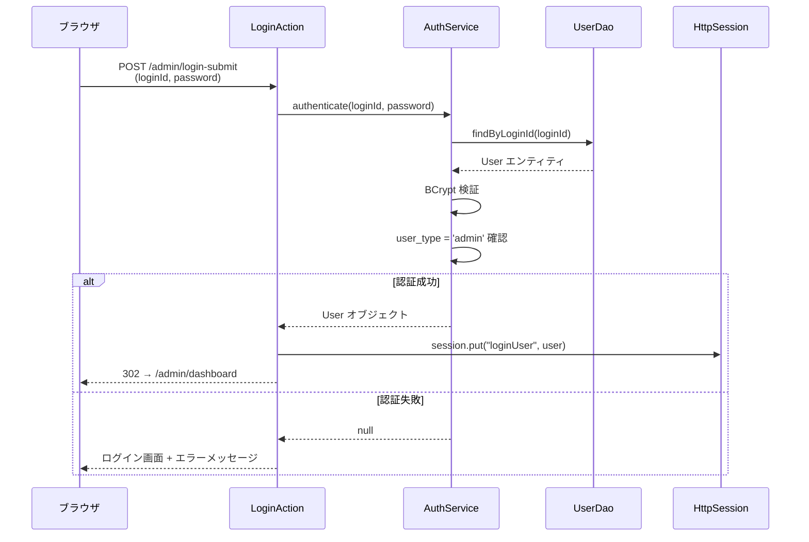
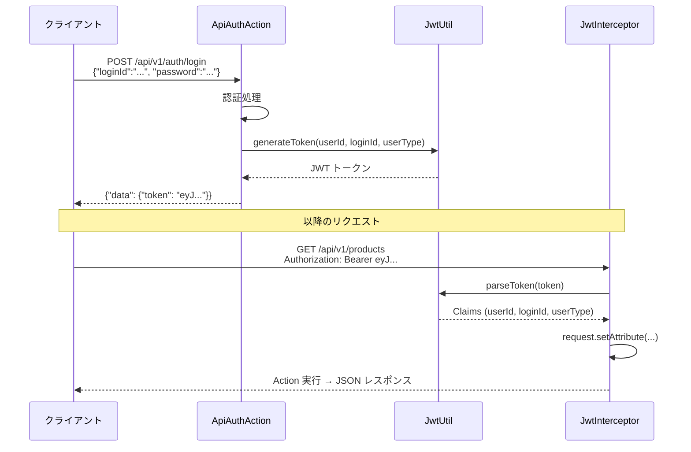
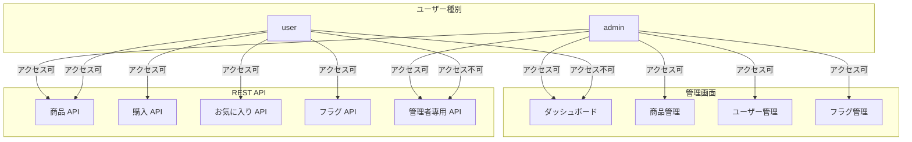

# 6. セキュリティ要件

> ISO/IEC 27001 情報セキュリティ管理および OWASP Top 10 に基づく

## 6.1 認証方式

本システムは 2 つの認証方式を提供する。

### 6.1.1 管理画面：セッションベース認証

| 項目                   | 仕様                                    |
| ---------------------- | --------------------------------------- |
| 認証方式               | セッションベース                        |
| セッションタイムアウト | 30 分（web.xml）                        |
| 認証チェック           | AuthInterceptor（全管理画面アクション） |
| 許可ユーザー           | `user_type='admin'` のユーザーのみ      |

### 6.1.2 REST API：JWT トークン認証

| 項目             | 仕様                                      |
| ---------------- | ----------------------------------------- |
| 認証方式         | JWT（JSON Web Token）                     |
| 署名アルゴリズム | HS256（HMAC-SHA256）                      |
| 有効期限         | 24 時間                                   |
| トークン配置     | `Authorization: Bearer <token>` ヘッダー  |
| ペイロード       | subject=userId, claims: loginId, userType |
| リフレッシュ     | `/api/v1/auth/refresh` エンドポイント     |

## 6.2 認可制御

### 6.2.1 管理画面の認可

| 対象                 | 制御方式        | 詳細                                                                    |
| -------------------- | --------------- | ----------------------------------------------------------------------- |
| 全管理画面アクション | AuthInterceptor | セッションに `loginUser` が存在しない場合はログインページへリダイレクト |
| ログイン/ログアウト  | ゲストスタック  | 認証チェックなし（公開アクション）                                      |

### 6.2.2 REST API の認可

| 対象           | 制御方式          | 詳細                                       |
| -------------- | ----------------- | ------------------------------------------ |
| 公開 API       | apiPublicStack    | 認証不要（ログイン、ヘルスチェック）       |
| 一般 API       | apiSecuredStack   | JWT 認証必須                               |
| 管理者専用 API | Action 内チェック | `userType == "admin"` を検証、不一致は 403 |

### 6.2.3 ロールベースアクセス制御

## 6.3 パスワード保護

| 項目                 | 仕様                                 |
| -------------------- | ------------------------------------ |
| ハッシュアルゴリズム | BCrypt                               |
| ストレングス         | 10（2^10 = 1,024 ラウンド）          |
| 実装                 | jBCrypt ライブラリ（`PasswordUtil`） |
| 互換性               | Spring Security の BCrypt 形式と互換 |

## 6.4 CORS（Cross-Origin Resource Sharing）

| 項目                         | 設定値                               |
| ---------------------------- | ------------------------------------ |
| 適用パス                     | `/api/*`                             |
| Access-Control-Allow-Origin  | `*`                                  |
| Access-Control-Allow-Methods | `GET, POST, PUT, DELETE, OPTIONS`    |
| Access-Control-Allow-Headers | `Content-Type, Authorization`        |
| OPTIONS プリフライト         | ステータス 200 で即応答              |
| 実装                         | `CorsFilter`（サーブレットフィルタ） |

## 6.5 データ保護

| 対策                     | 実装                                                |
| ------------------------ | --------------------------------------------------- |
| パスワードの平文保存禁止 | BCrypt ハッシュで保存                               |
| SQL インジェクション対策 | パラメータバインド（Commons DbUtils `QueryRunner`） |
| 外部キー制約             | CASCADE / RESTRICT による参照整合性保証             |
| 入力バリデーション       | Action 層および Service 層での検証                  |
| CHECK 制約               | DB レベルでのデータ整合性チェック                   |

## 6.6 エラーハンドリング

### 管理画面

| エラー種別           | 対応                                 |
| -------------------- | ------------------------------------ |
| 認証エラー           | ログイン画面にエラーメッセージを表示 |
| バリデーションエラー | 入力フォームにエラーメッセージを表示 |
| システムエラー       | エラーページ（`error.jsp`）に遷移    |

### REST API

| HTTP ステータス | エラーコード                     | 状況                     |
| --------------- | -------------------------------- | ------------------------ |
| 400             | 各種 \_001 系                    | リクエストパラメータ不正 |
| 401             | AUTH_001, AUTH_003, AUTH_004     | 認証失敗・トークン無効   |
| 403             | PROD_003, ADMIN_001, FEATURE_001 | アクセス権限不足         |
| 404             | AUTH_006, PROD_002, FLAG_003     | リソース未検出           |
| 409             | FAV_002                          | リソース競合（重複）     |
| 500             | SYS_001                          | 内部サーバーエラー       |
