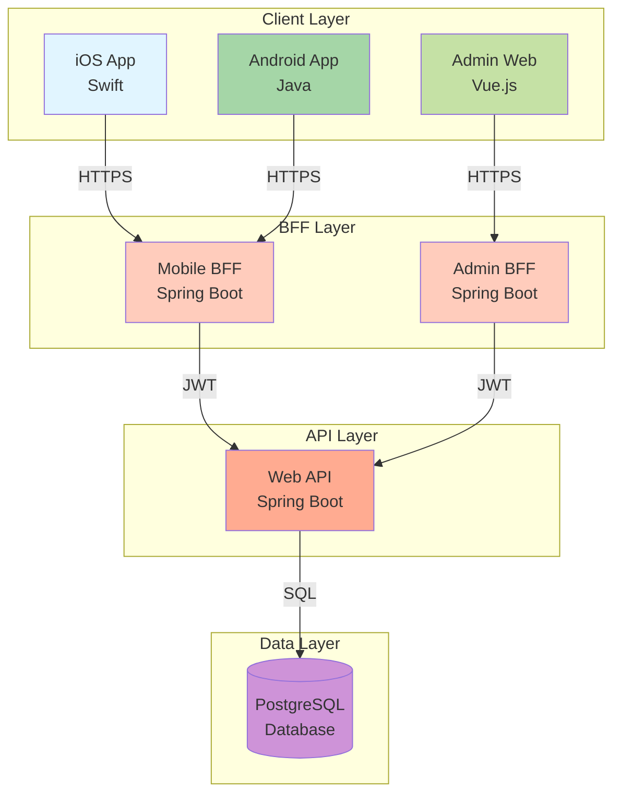
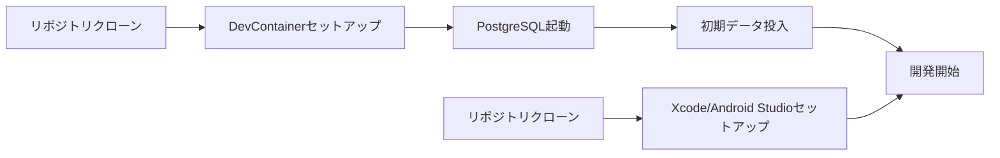

# mobile-app-system - 概要

> 最終更新: 2025-01-08
> ステータス: Draft
> バージョン: 1.0

## 変更履歴

| バージョン | 日付 | 変更内容 | 著者 |
|-----------|------|---------|------|
| 1.0 | 2025-01-08 | 初版作成 | AI Agent |

---

## 1. プロジェクト概要

### 1.1 プロジェクト名
**mobile-app-system（モバイルアプリケーションシステム）**

### 1.2 プロジェクト目的

本プロジェクトは、商品販売を行うネイティブモバイルアプリケーション（iOS/Android）と、そのアプリケーションを管理する管理者用Webアプリケーションから構成されるデモンストレーション用システムです。

主な目的：
- ユーザーが商品を検索・購入できるモバイルアプリケーションの提供
- 管理者が商品情報とアプリ機能を管理できるWebアプリケーションの提供
- BFFパターンとマイクロサービスアーキテクチャのベストプラクティスの実証
- 機能フラグによる段階的機能リリースの実現

### 1.3 対象ユーザー

#### 1.3.1 エンドユーザー（モバイルアプリ利用者）
- **役割**: 商品を検索・閲覧・購入するユーザー
- **利用デバイス**: iOS端末またはAndroid端末
- **想定スキルレベル**: 一般的なスマートフォン操作が可能な方

#### 1.3.2 管理者ユーザー（管理Webアプリ利用者）
- **役割**: 商品情報の管理、機能フラグの制御を行う管理者
- **利用デバイス**: PC（Webブラウザ）
- **想定スキルレベル**: システム管理の基本的な知識を持つ方

## 2. システム構成

### 2.1 アーキテクチャ概要

本システムは以下の4つの主要コンポーネントで構成されます：

### 2.2 コンポーネント詳細

| コンポーネント | 技術スタック | 役割 | 特記事項 |
|--------------|------------|------|---------|
| **iOS App** | Swift (latest) | iOSネイティブアプリ | Xcode開発 |
| **Android App** | Java (latest) | Androidネイティブアプリ | Android Studio開発 |
| **Mobile BFF** | Java Spring Boot (latest) | モバイルアプリ用BFF | WebAPIのファサード |
| **Admin Web** | Vue.js (latest) | 管理者用Webアプリ | SPA構成 |
| **Admin BFF** | Java Spring Boot (latest) | 管理Web用BFF | WebAPIのファサード |
| **Web API** | Java Spring Boot (latest) | ビジネスロジック層 | JWT認証保護 |
| **PostgreSQL** | PostgreSQL (latest) | データ永続化層 | Docker構築 |

## 3. 主要機能概要

### 3.1 モバイルアプリ機能

| 機能ID | 機能名 | 概要 | 優先度 |
|-------|-------|------|--------|
| MF-001 | ユーザーログイン | ID/パスワードによる認証 | 高 |
| MF-002 | 商品一覧表示 | 商品リストの表示 | 高 |
| MF-003 | 商品検索 | キーワードによる商品検索 | 高 |
| MF-004 | 商品詳細表示 | 商品の詳細情報表示 | 高 |
| MF-005 | 商品購入 | 100個単位での商品購入 | 高 |
| MF-006 | お気に入り機能 | 商品のお気に入り登録/解除 | 中（機能フラグ制御） |

### 3.2 管理Webアプリ機能

| 機能ID | 機能名 | 概要 | 優先度 |
|-------|-------|------|--------|
| AF-001 | 管理者ログイン | 管理者専用の認証 | 高 |
| AF-002 | 商品管理 | 商品名・単価の変更 | 高 |
| AF-003 | 機能フラグ管理 | ユーザー単位での機能ON/OFF | 高 |

### 3.3 共通機能

| 機能ID | 機能名 | 概要 | 優先度 |
|-------|-------|------|--------|
| CF-001 | JWT認証 | トークンベースの認証 | 高 |
| CF-002 | 権限制御 | ユーザー種別による権限管理 | 高 |

## 4. スコープ

### 4.1 プロジェクトに含まれるもの（In Scope）

#### 4.1.1 機能スコープ
- ✅ ユーザー認証・認可機能
- ✅ 商品CRUD操作
- ✅ 商品検索機能
- ✅ 商品購入機能（100個単位）
- ✅ お気に入り機能（機能フラグ制御）
- ✅ 機能フラグ管理機能
- ✅ 管理者用商品管理機能

#### 4.1.2 技術スコープ
- ✅ iOS/Androidネイティブアプリ開発
- ✅ Vue.js SPAアプリケーション開発
- ✅ Spring Boot BFF開発
- ✅ Spring Boot Web API開発
- ✅ PostgreSQL データベース設計・構築
- ✅ Docker環境構築
- ✅ DevContainer開発環境構築（Web系）
- ✅ JWT認証実装
- ✅ テストパターンドキュメント作成

#### 4.1.3 非機能スコープ
- ✅ 基本的なセキュリティ対策（JWT、入力バリデーション等）
- ✅ エラーハンドリング
- ✅ ログ出力

### 4.2 プロジェクトに含まれないもの（Out of Scope）

#### 4.2.1 機能的制約
- ❌ 決済システム連携（購入は記録のみ）
- ❌ メール通知機能
- ❌ プッシュ通知機能
- ❌ パスワードリセット機能
- ❌ ユーザー登録機能（マスタデータとして事前登録）
- ❌ 在庫管理機能
- ❌ 注文履歴機能
- ❌ 商品画像アップロード機能（URLのみ）

#### 4.2.2 技術的制約
- ❌ 自動テストコードの実装（デモ用のため）
- ❌ CI/CDパイプラインの構築
- ❌ 本番環境へのデプロイ
- ❌ パフォーマンステスト
- ❌ 負荷テスト
- ❌ 多言語対応（日本語のみ）
- ❌ アクセシビリティ対応（WCAG準拠）
- ❌ オフライン対応

#### 4.2.3 非機能的制約
- ❌ 高可用性構成（冗長化等）
- ❌ 大規模スケーリング対応
- ❌ リアルタイム同期
- ❌ 詳細な監視・メトリクス収集

## 5. 前提条件と制約

### 5.1 前提条件

| ID | 前提条件 | 説明 |
|----|---------|------|
| PRE-001 | デモ用途 | 本システムはデモンストレーション用であり、本番運用は想定しない |
| PRE-002 | 開発環境 | Web開発はDevContainer環境で行われる |
| PRE-003 | モバイル開発環境 | iOS: Xcode、Android: Android Studio |
| PRE-004 | Docker環境 | PostgreSQLはDocker上で動作する |
| PRE-005 | マスタデータ | ユーザー・商品データは事前にDBに登録される |
| PRE-006 | ネットワーク | 常時インターネット接続環境を想定 |

### 5.2 技術的制約

| ID | 制約 | 理由 |
|----|-----|------|
| CON-001 | テストコード不要 | デモ用途のため（ただしテストパターンはドキュメント化） |
| CON-002 | 購入単位100個固定 | 仕様による制約 |
| CON-003 | JWT認証必須 | セキュリティ要件 |
| CON-004 | BFFパターン必須 | アーキテクチャ要件 |
| CON-005 | 単一DB | PostgreSQL単一インスタンス |

### 5.3 ビジネス制約

| ID | 制約 | 説明 |
|----|-----|------|
| BIZ-001 | デモ用途限定 | 実際の販売は行わない |
| BIZ-002 | 機能フラグはお気に入りのみ | 初期実装ではお気に入り機能のみ制御 |
| BIZ-003 | 管理者ユーザー分離 | モバイルユーザーと管理者は別の認証基盤 |

## 6. 用語定義

主要な用語の簡易定義（詳細は `09-glossary.md` を参照）

| 用語 | 定義 |
|-----|------|
| **BFF** | Backend For Frontend - フロントエンド専用のバックエンドAPI |
| **JWT** | JSON Web Token - トークンベースの認証方式 |
| **機能フラグ** | Feature Flag - 特定機能のON/OFF制御機構 |
| **エンドユーザー** | モバイルアプリを利用する一般ユーザー |
| **管理者** | 管理Webアプリを利用するシステム管理者 |

## 7. 関連ドキュメント

| ドキュメント | パス | 説明 |
|------------|------|------|
| ビジネス要件 | `01-business-requirements.md` | ビジネス要件詳細 |
| 機能要件 | `02-functional-requirements.md` | 機能要件詳細 |
| 非機能要件 | `03-non-functional-requirements.md` | 非機能要件詳細 |
| データモデル | `04-data-model.md` | ER図とテーブル定義 |
| API仕様 | `05-api-spec.md` | REST API仕様 |
| UI仕様 | `06-ui-spec.md` | UI/UX仕様 |
| エラーハンドリング | `07-error-handling.md` | エラー処理仕様 |
| セキュリティ | `08-security.md` | セキュリティ要件 |
| 用語集 | `09-glossary.md` | 用語集 |
| テスト戦略 | `12-testing-strategy.md` | テストパターン |

## 8. マイルストーン

### 8.1 開発フェーズ

| フェーズ | 成果物 | 期間（想定） |
|---------|-------|-------------|
| Phase 1 | 詳細仕様書完成 | 完了 |
| Phase 2 | データベース設計・構築 | TBD |
| Phase 3 | Web API実装 | TBD |
| Phase 4 | BFF実装 | TBD |
| Phase 5 | モバイルアプリ実装 | TBD |
| Phase 6 | 管理Webアプリ実装 | TBD |
| Phase 7 | 統合テスト | TBD |
| Phase 8 | デモ準備完了 | TBD |

## 9. 成功基準

| ID | 基準 | 測定方法 |
|----|-----|---------|
| SC-001 | 全機能が動作する | 手動テストパターン完了 |
| SC-002 | JWT認証が正常動作する | 認証テスト完了 |
| SC-003 | 機能フラグが正常動作する | フラグ切替テスト完了 |
| SC-004 | 100個単位購入が動作する | 購入機能テスト完了 |
| SC-005 | 管理機能が動作する | 管理機能テスト完了 |

## 10. リスク

| ID | リスク | 影響度 | 対策 |
|----|-------|--------|------|
| RISK-001 | 技術スタックの複雑性 | 中 | 各コンポーネントの疎結合設計 |
| RISK-002 | モバイル環境の多様性 | 中 | 主要なOSバージョンに絞る |
| RISK-003 | JWT管理の複雑性 | 中 | 標準ライブラリの使用 |
| RISK-004 | 機能フラグの設計複雑性 | 低 | シンプルな実装（お気に入りのみ） |

## 11. 前提とする開発プロセス

### 11.1 開発環境セットアップ

### 11.2 開発の流れ

1. **仕様策定** ← 現在のフェーズ
2. **DB設計・構築**
3. **API実装（Web API → BFF）**
4. **フロントエンド実装（モバイル/Web並行）**
5. **統合テスト**
6. **デモ準備**

## 12. 問い合わせ先

詳細な仕様に関する質問は、各セクションの担当ドキュメントを参照してください。

---

**End of Document**
