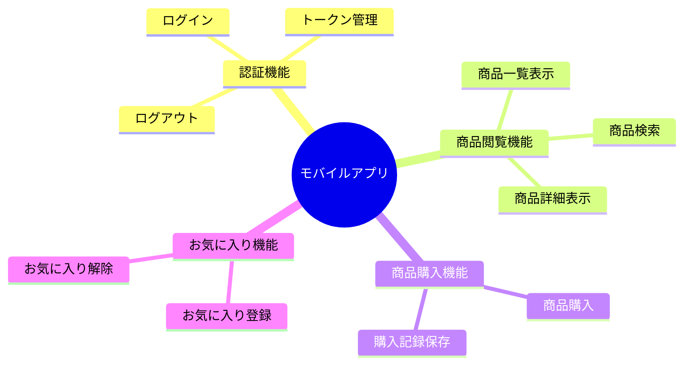
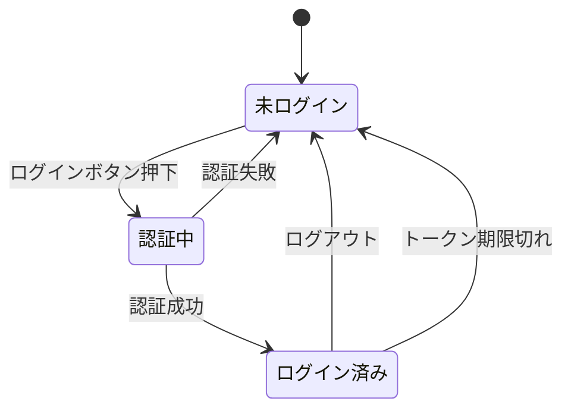
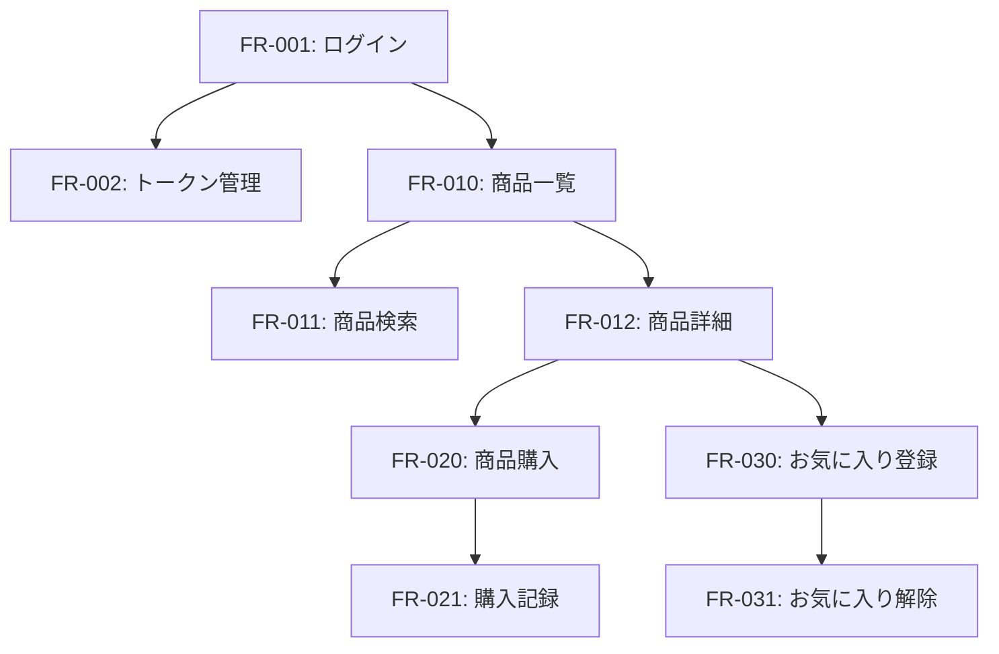

# mobile-app-system - モバイルアプリ機能要件

> 最終更新: 2025-01-08
> ステータス: Draft
> バージョン: 1.0

## 変更履歴

| バージョン | 日付 | 変更内容 | 著者 |
|-----------|------|---------|------|
| 1.0 | 2025-01-08 | 初版作成 | AI Agent |

---

## 1. モバイルアプリケーション機能要件概要

本ドキュメントでは、mobile-app-systemのモバイルアプリケーション機能要件を定義します。
エンドユーザーが利用するモバイルアプリの全機能を記載します。

### 1.1 機能分類



---

## 2. 認証機能

### 2.1 ユーザーログイン

#### FR-001: ユーザーログイン

**優先度**: 高  
**依存関係**: なし  
**関連BR**: BR-010, BR-011

**機能概要**:
ユーザーはID/パスワードでログインし、JWTトークンを取得する。

**詳細仕様**:

**入力**:
- ユーザーID（文字列、必須、4〜20文字）
- パスワード（文字列、必須、8〜50文字）

**処理**:
1. 入力バリデーションを実行
2. Mobile BFF経由でWeb APIに認証リクエスト
3. Web APIでユーザーID/パスワードを検証
4. 認証成功時、JWTトークンを生成
5. トークンをモバイルアプリに返却
6. アプリはトークンをセキュアストレージに保存

**出力**:
- 成功時: JWTトークン、ユーザー情報（ID、名前）
- 失敗時: エラーメッセージ

**バリデーションルール**:
| 項目 | ルール |
|------|-------|
| ユーザーID | 必須、4〜20文字、英数字のみ |
| パスワード | 必須、8〜50文字 |

**画面遷移**:
```
[ログイン画面]
    ↓ ログイン成功
[商品一覧画面]
    ↓ ログイン失敗
[ログイン画面]（エラーメッセージ表示）
```

**状態遷移**:


**非機能要件**:
- 応答時間: 2秒以内
- 同時接続数: 100ユーザー

**テストケース**:
- TC-001-01: 正しいID/パスワードでログイン成功
- TC-001-02: 誤ったパスワードでログイン失敗
- TC-001-03: 存在しないユーザーIDでログイン失敗
- TC-001-04: 空のID/パスワードでバリデーションエラー
- TC-001-05: 文字数制限違反でバリデーションエラー

---

#### FR-002: トークン管理

**優先度**: 高  
**依存関係**: FR-001  
**関連BR**: BR-011

**機能概要**:
取得したJWTトークンを安全に保管し、APIリクエスト時に自動付与する。

**詳細仕様**:

**処理**:
1. ログイン成功時、トークンをセキュアストレージに保存
2. 全API呼び出し時、Authorizationヘッダーにトークンを自動付与
3. トークン有効期限切れ検知時、ログイン画面に遷移
4. ログアウト時、トークンを削除

**トークン有効期限**:
- 有効期間: 24時間
- リフレッシュ機能: なし（再ログイン必要）

**セキュリティ要件**:
- iOS: Keychain に保存
- Android: EncryptedSharedPreferences に保存

**テストケース**:
- TC-002-01: トークン保存・読み込みが正常動作
- TC-002-02: トークン期限切れ時にログイン画面に遷移
- TC-002-03: ログアウト時にトークンが削除される

---

#### FR-003: ログアウト

**優先度**: 中  
**依存関係**: FR-001, FR-002  
**関連BR**: BR-011

**機能概要**:
ユーザーは任意のタイミングでログアウトできる。

**詳細仕様**:

**処理**:
1. ログアウトボタン押下
2. 確認ダイアログ表示（オプション）
3. ローカルストレージからトークン削除
4. ログイン画面に遷移

**画面遷移**:
```
[任意の画面]
    ↓ ログアウトボタン
[ログイン画面]
```

**テストケース**:
- TC-003-01: ログアウト後、トークンが削除される
- TC-003-02: ログアウト後、ログイン画面に遷移
- TC-003-03: ログアウト後、商品一覧にアクセスするとログイン画面に遷移

---

## 3. 商品閲覧機能

### 3.1 商品一覧表示

#### FR-010: 商品一覧表示

**優先度**: 高  
**依存関係**: FR-001（ログイン必須）  
**関連BR**: BR-020

**機能概要**:
ログイン後、全商品の一覧を表示する。

**詳細仕様**:

**入力**:
- なし（全件取得）

**処理**:
1. 画面表示時、商品一覧API呼び出し
2. Mobile BFF経由でWeb APIから商品データ取得
3. リスト形式で表示

**出力（1商品あたり）**:
- 商品ID
- 商品名
- 単価
- 商品画像URL（サムネイル）

**表示形式**:
- リストビュー（スクロール可能）
- 1行あたり1商品
- タップで詳細画面へ遷移

**ソート順**:
- デフォルト: 商品ID昇順
- 将来拡張: 名前順、単価順

**画面遷移**:
```
[ログイン画面]
    ↓ ログイン成功
[商品一覧画面]
    ↓ 商品タップ
[商品詳細画面]
```

**非機能要件**:
- 初回表示: 3秒以内
- データ件数: 最大1000件を想定
- スクロール: スムーズなスクロール動作

**エラーハンドリング**:
- ネットワークエラー: エラーメッセージ表示、リトライボタン表示
- タイムアウト: タイムアウトメッセージ表示
- データ0件: 「商品がありません」メッセージ表示

**テストケース**:
- TC-010-01: ログイン後、商品一覧が表示される
- TC-010-02: 商品タップで詳細画面に遷移
- TC-010-03: ネットワークエラー時、エラーメッセージ表示
- TC-010-04: データ0件時、適切なメッセージ表示

---

### 3.2 商品検索

#### FR-011: 商品検索

**優先度**: 高  
**依存関係**: FR-010  
**関連BR**: BR-021

**機能概要**:
商品名でキーワード検索し、該当商品のみ表示する。

**詳細仕様**:

**入力**:
- 検索キーワード（文字列、0〜50文字）

**処理**:
1. 検索ボックスにキーワード入力
2. 入力中または検索ボタン押下で検索API呼び出し
3. 部分一致検索（大文字小文字区別なし）
4. 該当商品のみ表示

**検索仕様**:
- 部分一致検索
- 大文字小文字を区別しない
- 全角半角を区別しない（オプション）
- 空文字の場合、全件表示

**表示**:
- 検索結果件数を表示
- 該当なしの場合、「該当する商品がありません」メッセージ

**UX考慮**:
- リアルタイム検索（入力ごとに検索）またはボタン押下検索
- 検索中はローディング表示
- 検索キーワードクリアボタン

**画面遷移**:
```
[商品一覧画面]
    ↓ 検索ボックスにキーワード入力
[商品一覧画面]（検索結果表示）
```

**テストケース**:
- TC-011-01: キーワード検索で該当商品のみ表示
- TC-011-02: 該当なしの場合、メッセージ表示
- TC-011-03: 空文字検索で全件表示
- TC-011-04: 大文字小文字混在で正しく検索

---

### 3.3 商品詳細表示

#### FR-012: 商品詳細表示

**優先度**: 高  
**依存関係**: FR-010  
**関連BR**: BR-022

**機能概要**:
商品一覧から選択した商品の詳細情報を表示する。

**詳細仕様**:

**入力**:
- 商品ID

**処理**:
1. 商品詳細API呼び出し
2. 商品情報とお気に入り状態を取得
3. 詳細情報を画面に表示

**出力**:
- 商品ID
- 商品名
- 単価
- 商品説明
- 商品画像URL（詳細画像）
- お気に入りボタン（機能フラグON時のみ）
- 購入ボタン

**表示レイアウト**:
```
┌─────────────────┐
│  商品画像       │
├─────────────────┤
│ 商品名          │
│ 単価: ¥xxx     │
│                 │
│ 商品説明        │
│                 │
│ [♡お気に入り]  │ ※フラグON時のみ
│                 │
│ [購入]          │
└─────────────────┘
```

**画面遷移**:
```
[商品一覧画面]
    ↓ 商品タップ
[商品詳細画面]
    ↓ 購入ボタン
[購入画面]
    ↓ 戻るボタン
[商品一覧画面]
```

**テストケース**:
- TC-012-01: 商品詳細情報が正しく表示される
- TC-012-02: 機能フラグOFFでお気に入りボタン非表示
- TC-012-03: 機能フラグONでお気に入りボタン表示
- TC-012-04: 存在しない商品IDでエラー表示

---

## 4. 商品購入機能

### 4.1 商品購入（100個単位）

#### FR-020: 商品購入（100個単位）

**優先度**: 高  
**依存関係**: FR-012  
**関連BR**: BR-030, BR-031, BR-032

**機能概要**:
商品を100個単位で購入する。

**詳細仕様**:

**入力**:
- 商品ID
- 購入個数（100の倍数）

**処理**:
1. 商品詳細画面で購入ボタンタップ
2. 購入個数選択画面表示
3. 個数選択（100, 200, 300, ... 9900）
4. 合計金額計算表示
5. 購入確定ボタンタップ
6. 購入API呼び出し
7. 購入記録をDB保存
8. 購入完了画面表示

**購入個数選択UI**:
- ドロップダウンまたはピッカー形式
- 選択肢: 100, 200, 300, ..., 9900（100刻み）
- デフォルト値: 100

**合計金額計算**:
```
合計金額 = 単価 × 購入個数
```

**バリデーションルール**:
| 項目 | ルール |
|------|-------|
| 購入個数 | 必須、100の倍数、100〜9900 |

**画面遷移**:
```
[商品詳細画面]
    ↓ 購入ボタン
[購入個数選択画面]
    ↓ 購入確定
[購入完了画面]
    ↓ 閉じる
[商品一覧画面]
```

**購入確定画面表示内容**:
```
┌─────────────────┐
│ 購入確認        │
├─────────────────┤
│ 商品名: xxx     │
│ 単価: ¥xxx     │
│ 個数: xxx個     │
│ 合計: ¥xxx,xxx │
│                 │
│ [キャンセル]    │
│ [購入確定]      │
└─────────────────┘
```

**購入完了画面表示内容**:
```
┌─────────────────┐
│ 購入完了        │
├─────────────────┤
│ ご購入ありがとう│
│ ございました    │
│                 │
│ [閉じる]        │
└─────────────────┘
```

**非機能要件**:
- 購入処理: 5秒以内
- 在庫チェック: なし（デモ用途）
- 決済処理: なし（デモ用途）

**テストケース**:
- TC-020-01: 100個購入が正常完了
- TC-020-02: 500個購入が正常完了
- TC-020-03: 合計金額が正しく計算される
- TC-020-04: 購入記録がDBに保存される
- TC-020-05: ネットワークエラー時、エラーメッセージ表示

---

#### FR-021: 購入記録保存

**優先度**: 高  
**依存関係**: FR-020  
**関連BR**: BR-031

**機能概要**:
購入情報をデータベースに記録する。

**詳細仕様**:

**保存データ**:
- 購入ID（自動生成、UUID）
- ユーザーID
- 商品ID
- 購入個数
- 単価（購入時点）
- 合計金額
- 購入日時（タイムスタンプ）

**処理**:
1. Web APIで購入レコード生成
2. DBにINSERT
3. トランザクション管理（失敗時はロールバック）

**テストケース**:
- TC-021-01: 購入データが正しく保存される
- TC-021-02: DB障害時、エラーが返される
- TC-021-03: トランザクションロールバックが動作する

---

## 5. お気に入り機能

### 5.1 お気に入り登録

#### FR-030: お気に入り登録

**優先度**: 中  
**依存関係**: FR-012  
**関連BR**: BR-040, BR-041

**機能概要**:
機能フラグがONのユーザーは商品をお気に入り登録できる。

**詳細仕様**:

**入力**:
- 商品ID

**処理**:
1. 商品詳細画面でお気に入りボタンタップ
2. お気に入り登録API呼び出し
3. DBにお気に入りレコード作成
4. ボタン状態を「お気に入り済み」に変更

**機能フラグ制御**:
- フラグOFF: お気に入りボタン非表示
- フラグON: お気に入りボタン表示

**ボタン状態**:
- 未登録: ♡（白抜きハート）
- 登録済み: ♥（塗りつぶしハート）

**画面遷移**:
```
[商品詳細画面]（未登録）
    ↓ お気に入りボタンタップ
[商品詳細画面]（登録済み）
```

**非機能要件**:
- 登録処理: 2秒以内
- 即座にUI反映

**テストケース**:
- TC-030-01: フラグONユーザーがお気に入り登録できる
- TC-030-02: フラグOFFユーザーにはボタンが表示されない
- TC-030-03: お気に入り状態がUIに反映される
- TC-030-04: 重複登録時はエラーとならず、既存データを維持

---

#### FR-031: お気に入り解除

**優先度**: 中  
**依存関係**: FR-030  
**関連BR**: BR-040, BR-041

**機能概要**:
登録済みのお気に入りを解除する。

**詳細仕様**:

**入力**:
- 商品ID

**処理**:
1. お気に入り済みの商品詳細画面でお気に入りボタンタップ
2. お気に入り解除API呼び出し
3. DBからお気に入りレコード削除
4. ボタン状態を「未登録」に変更

**画面遷移**:
```
[商品詳細画面]（登録済み）
    ↓ お気に入りボタンタップ
[商品詳細画面]（未登録）
```

**テストケース**:
- TC-031-01: お気に入り解除が正常動作
- TC-031-02: 解除後、ボタン状態が変わる
- TC-031-03: 未登録の状態で解除してもエラーとならない

---

## 6. 機能間の依存関係



## 7. 機能要件サマリー

### 7.1 優先度別機能数

| 優先度 | 機能数 |
|-------|--------|
| 高 | 7 |
| 中 | 3 |
| **合計** | **10** |

### 7.2 カテゴリ別機能数

| カテゴリ | 機能数 |
|---------|--------|
| 認証機能 | 3 |
| 商品閲覧機能 | 3 |
| 商品購入機能 | 2 |
| お気に入り機能 | 2 |
| **合計** | **10** |

---

**End of Document**
