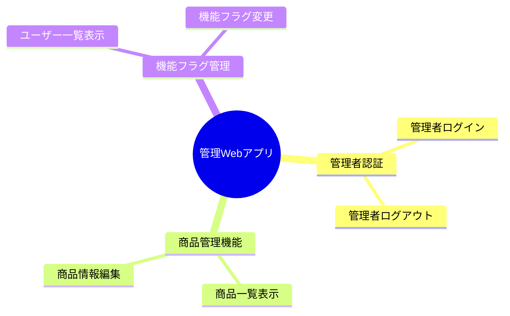
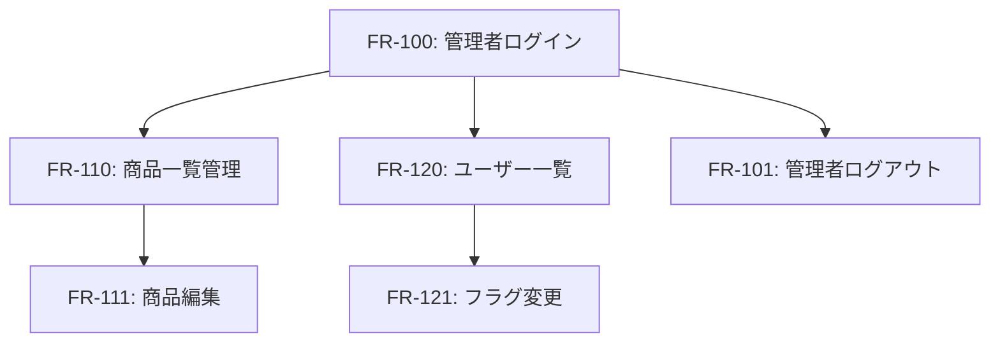

# mobile-app-system - 管理アプリ機能要件

> 最終更新: 2025-01-08
> ステータス: Draft
> バージョン: 1.0

## 変更履歴

| バージョン | 日付 | 変更内容 | 著者 |
|-----------|------|---------|------|
| 1.0 | 2025-01-08 | 初版作成 | AI Agent |

---

## 1. 管理Webアプリケーション機能要件概要

本ドキュメントでは、mobile-app-systemの管理Webアプリケーション機能要件を定義します。
管理者が利用する管理画面の全機能を記載します。

### 1.1 機能分類



---

## 2. 管理者認証

### 2.1 管理者ログイン

#### FR-100: 管理者ログイン

**優先度**: 高  
**依存関係**: なし  
**関連BR**: BR-050

**機能概要**:
管理者は専用のログイン画面からログインする。

**詳細仕様**:

**入力**:
- 管理者ID（文字列、必須、4〜20文字）
- パスワード（文字列、必須、8〜50文字）

**処理**:
1. 管理者ログイン画面で認証情報入力
2. Admin BFF経由でWeb APIに認証リクエスト
3. Web APIで管理者ID/パスワード検証
4. 認証成功時、管理者用JWTトークン生成
5. トークンをブラウザのlocalStorageに保存
6. 管理ダッシュボードに遷移

**出力**:
- 成功時: JWTトークン（管理者フラグ付き）、管理者情報
- 失敗時: エラーメッセージ

**JWTトークン内容**:
- 管理者ID
- 権限: admin
- 有効期限: 24時間

**画面遷移**:
```
[管理者ログイン画面]
    ↓ ログイン成功
[管理ダッシュボード]
    ↓ ログイン失敗
[管理者ログイン画面]（エラーメッセージ）
```

**非機能要件**:
- 応答時間: 2秒以内
- セッション: localStorageにトークン保存

**テストケース**:
- TC-100-01: 正しい認証情報でログイン成功
- TC-100-02: 誤った認証情報でログイン失敗
- TC-100-03: 管理者トークンが発行される
- TC-100-04: エンドユーザーの認証情報では管理者ログインできない

---

#### FR-101: 管理者ログアウト

**優先度**: 中  
**依存関係**: FR-100  
**関連BR**: BR-050

**機能概要**:
管理者はログアウトできる。

**詳細仕様**:

**処理**:
1. ログアウトボタンクリック
2. localStorageからトークン削除
3. ログイン画面に遷移

**テストケース**:
- TC-101-01: ログアウト後、トークンが削除される
- TC-101-02: ログアウト後、ログイン画面に遷移

---

## 3. 商品管理機能

### 3.1 商品一覧表示（管理画面）

#### FR-110: 商品一覧表示（管理画面）

**優先度**: 高  
**依存関係**: FR-100  
**関連BR**: BR-060

**機能概要**:
管理者は商品一覧を表示し、編集画面に遷移できる。

**詳細仕様**:

**処理**:
1. 商品管理メニュー選択
2. 商品一覧API呼び出し
3. テーブル形式で表示

**表示項目（1商品あたり）**:
- 商品ID
- 商品名
- 単価
- 編集ボタン

**表示形式**:
- テーブル（ソート可能）
- ページネーション（20件/ページ）

**画面遷移**:
```
[管理ダッシュボード]
    ↓ 商品管理メニュー
[商品一覧画面]
    ↓ 編集ボタン
[商品編集画面]
```

**テストケース**:
- TC-110-01: 商品一覧が表示される
- TC-110-02: 編集ボタンで編集画面に遷移

---

#### FR-111: 商品情報編集

**優先度**: 高  
**依存関係**: FR-110  
**関連BR**: BR-060

**機能概要**:
管理者は商品の名前と単価を編集できる。

**詳細仕様**:

**入力**:
- 商品ID（変更不可）
- 商品名（文字列、1〜100文字）
- 単価（整数、1以上）

**処理**:
1. 編集画面で商品名・単価を変更
2. 保存ボタンクリック
3. バリデーション実行
4. 商品更新API呼び出し
5. DBで商品情報更新
6. 商品一覧画面に戻る

**バリデーションルール**:
| 項目 | ルール |
|------|-------|
| 商品名 | 必須、1〜100文字 |
| 単価 | 必須、整数、1以上 |

**画面遷移**:
```
[商品一覧画面]
    ↓ 編集ボタン
[商品編集画面]
    ↓ 保存
[商品一覧画面]（更新反映）
    ↓ キャンセル
[商品一覧画面]（変更なし）
```

**編集画面レイアウト**:
```
┌─────────────────┐
│ 商品編集        │
├─────────────────┤
│ 商品ID: xxx     │
│ （変更不可）    │
│                 │
│ 商品名:         │
│ [          ]    │
│                 │
│ 単価:           │
│ [          ]円  │
│                 │
│ [キャンセル]    │
│ [保存]          │
└─────────────────┘
```

**非機能要件**:
- 更新処理: 2秒以内
- 即座にモバイルアプリに反映

**テストケース**:
- TC-111-01: 商品名を変更し保存できる
- TC-111-02: 単価を変更し保存できる
- TC-111-03: バリデーションエラーで保存できない
- TC-111-04: キャンセルで変更が破棄される
- TC-111-05: 更新後、モバイルアプリで新情報が表示される

---

## 4. 機能フラグ管理

### 4.1 ユーザー一覧表示（機能フラグ管理）

#### FR-120: ユーザー一覧表示（機能フラグ管理）

**優先度**: 高  
**依存関係**: FR-100  
**関連BR**: BR-070

**機能概要**:
管理者はユーザー一覧と各ユーザーの機能フラグ状態を表示する。

**詳細仕様**:

**処理**:
1. 機能フラグ管理メニュー選択
2. ユーザー一覧API呼び出し
3. テーブル形式で表示

**表示項目（1ユーザーあたり）**:
- ユーザーID
- ユーザー名
- お気に入り機能フラグ（ON/OFFトグル）

**表示形式**:
- テーブル
- ページネーション（50件/ページ）
- フラグはトグルスイッチ

**画面レイアウト**:
```
┌────────────────────────────────┐
│ 機能フラグ管理                 │
├────────┬─────────┬────────────┤
│ユーザーID│ユーザー名│お気に入り│
├────────┼─────────┼────────────┤
│ user001 │ 山田太郎  │ [ON]  OFF │
│ user002 │ 佐藤花子  │ ON  [OFF] │
│ ...     │ ...       │ ...       │
└────────┴─────────┴────────────┘
```

**テストケース**:
- TC-120-01: ユーザー一覧が表示される
- TC-120-02: 各ユーザーのフラグ状態が正しく表示される

---

#### FR-121: 機能フラグ変更

**優先度**: 高  
**依存関係**: FR-120  
**関連BR**: BR-070, BR-071

**機能概要**:
管理者はユーザー単位で機能フラグをON/OFFできる。

**詳細仕様**:

**入力**:
- ユーザーID
- 機能フラグID（お気に入り機能）
- フラグ値（ON/OFF）

**処理**:
1. トグルスイッチをクリック
2. 機能フラグ更新API呼び出し
3. DBでフラグ値更新
4. UI上でトグル状態変更
5. 成功通知表示

**画面遷移**:
```
[機能フラグ管理画面]
    ↓ トグルクリック
[機能フラグ管理画面]（フラグ状態更新）
```

**非機能要件**:
- 更新処理: 1秒以内
- 即座にモバイルアプリに反映（次回API呼び出し時）

**テストケース**:
- TC-121-01: フラグをONに変更できる
- TC-121-02: フラグをOFFに変更できる
- TC-121-03: 変更後、モバイルアプリで反映される
- TC-121-04: 複数ユーザーのフラグを変更できる
- TC-121-05: エラー時、元の状態に戻る

---

## 5. 機能間の依存関係



## 6. 機能要件サマリー

### 6.1 優先度別機能数

| 優先度 | 機能数 |
|-------|--------|
| 高 | 5 |
| 中 | 1 |
| **合計** | **6** |

### 6.2 カテゴリ別機能数

| カテゴリ | 機能数 |
|---------|--------|
| 管理者認証 | 2 |
| 商品管理機能 | 2 |
| 機能フラグ管理 | 2 |
| **合計** | **6** |

---

**End of Document**
