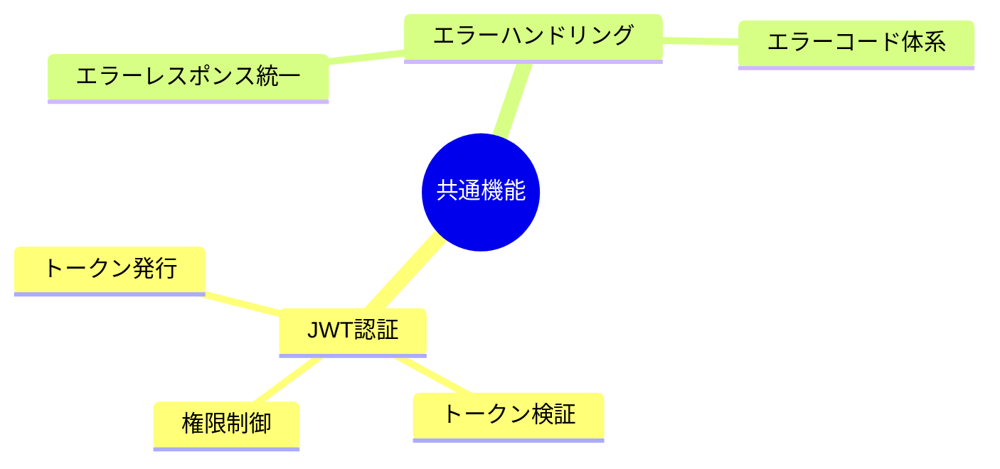
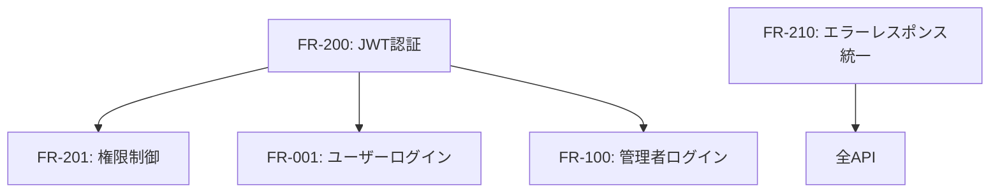
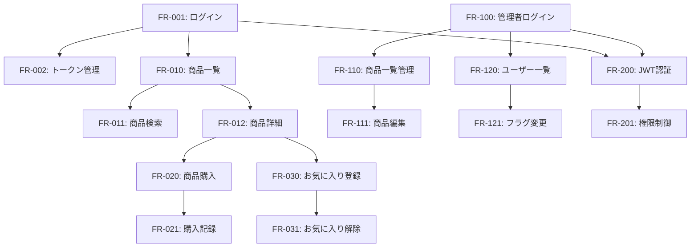

# mobile-app-system - 共通機能要件

> 最終更新: 2025-01-08
> ステータス: Draft
> バージョン: 1.0

## 変更履歴

| バージョン | 日付 | 変更内容 | 著者 |
|-----------|------|---------|------|
| 1.0 | 2025-01-08 | 初版作成 | AI Agent |

---

## 1. 共通機能要件概要

本ドキュメントでは、mobile-app-systemの共通機能要件を定義します。
モバイルアプリと管理Webアプリの両方で使用される共通機能を記載します。

### 1.1 機能分類



---

## 2. JWT認証

### 2.1 JWT認証

#### FR-200: JWT認証

**優先度**: 高  
**依存関係**: なし  
**関連BR**: BR-010, BR-050

**機能概要**:
全API呼び出しにJWT認証を適用する。

**詳細仕様**:

**トークン発行**:
1. ログイン成功時、JWTトークン生成
2. ペイロード:
   - ユーザーID
   - 権限（user/admin）
   - 発行日時
   - 有効期限

**トークン検証**:
1. API呼び出し時、Authorizationヘッダーからトークン抽出
2. トークンの署名検証
3. 有効期限確認
4. ユーザー情報抽出

**JWTペイロード構成**:
```json
{
  "sub": "ユーザーID",
  "loginId": "ログインID",
  "userType": "user | admin",
  "iat": 1704700800,
  "exp": 1704787200
}
```

**トークン構成**:
- アルゴリズム: HS256（HMAC with SHA-256）
- 署名鍵: 環境変数から取得
- ヘッダー形式: `Authorization: Bearer {TOKEN}`

**エラーハンドリング**:
- トークンなし: 401 Unauthorized
- トークン不正: 401 Unauthorized
- トークン期限切れ: 401 Unauthorized
- 権限不足: 403 Forbidden

**テストケース**:
- TC-200-01: 正しいトークンでAPI呼び出し成功
- TC-200-02: トークンなしで401エラー
- TC-200-03: 不正なトークンで401エラー
- TC-200-04: 期限切れトークンで401エラー

---

#### FR-201: 権限制御

**優先度**: 高  
**依存関係**: FR-200  
**関連BR**: なし

**機能概要**:
ユーザー種別に応じてAPIアクセスを制御する。

**詳細仕様**:

**権限種別**:
- **user**: エンドユーザー（モバイルアプリ）
- **admin**: 管理者（管理Webアプリ）

**アクセス制御ルール**:

| API種別 | user権限 | admin権限 |
|---------|---------|-----------|
| ログイン（user） | ✅ | ❌ |
| ログイン（admin） | ❌ | ✅ |
| 商品一覧取得 | ✅ | ✅ |
| 商品詳細取得 | ✅ | ✅ |
| 商品購入 | ✅ | ❌ |
| お気に入り登録 | ✅ | ❌ |
| 商品更新 | ❌ | ✅ |
| 機能フラグ管理 | ❌ | ✅ |

**権限チェック処理**:
1. JWTトークンから権限情報取得
2. 呼び出されたAPIの必要権限確認
3. 権限が一致しない場合、403エラー

**エラーレスポンス**:
- 権限不足: 403 Forbidden + エラーメッセージ

```json
{
  "error": {
    "code": "AUTH_003",
    "message": "この操作を実行する権限がありません"
  },
  "timestamp": "2025-01-08T12:00:00Z"
}
```

**テストケース**:
- TC-201-01: userトークンでユーザーAPI呼び出し成功
- TC-201-02: adminトークンで管理API呼び出し成功
- TC-201-03: userトークンで管理API呼び出しは403
- TC-201-04: adminトークンでユーザー専用API呼び出しは403

---

## 3. エラーハンドリング

### 3.1 エラーレスポンス統一

#### FR-210: エラーレスポンス統一

**優先度**: 高  
**依存関係**: なし  
**関連BR**: なし

**機能概要**:
全APIで統一されたエラーレスポンス形式を返却する。

**詳細仕様**:

**エラーレスポンス形式**:
```json
{
  "error": {
    "code": "ERROR_CODE",
    "message": "エラーメッセージ",
    "details": "詳細情報（オプション）"
  },
  "timestamp": "2025-01-08T12:00:00Z"
}
```

**エラーコード体系**:
詳細は `07-error-handling.md` を参照

**主要エラーコード例**:

| エラーコード | HTTPステータス | 説明 |
|------------|--------------|------|
| AUTH_001 | 401 | 認証失敗 |
| AUTH_002 | 401 | トークン不正・期限切れ |
| AUTH_003 | 403 | 権限不足 |
| PRODUCT_001 | 404 | 商品が見つからない |
| PURCHASE_001 | 400 | 購入個数不正 |
| FEATURE_001 | 403 | 機能フラグOFF |
| FAVORITE_001 | 400 | お気に入り重複 |
| SYSTEM_001 | 500 | サーバー内部エラー |

**エラーレスポンス例**:

**認証エラー**:
```json
{
  "error": {
    "code": "AUTH_001",
    "message": "ログインIDまたはパスワードが正しくありません"
  },
  "timestamp": "2025-01-08T12:00:00Z"
}
```

**バリデーションエラー**:
```json
{
  "error": {
    "code": "VALIDATION_001",
    "message": "入力値が不正です",
    "details": "購入個数は100の倍数である必要があります"
  },
  "timestamp": "2025-01-08T12:00:00Z"
}
```

**サーバーエラー**:
```json
{
  "error": {
    "code": "SYSTEM_001",
    "message": "サーバー内部エラーが発生しました",
    "details": "しばらく待ってから再度お試しください"
  },
  "timestamp": "2025-01-08T12:00:00Z"
}
```

**テストケース**:
- TC-210-01: 各エラーで統一形式のレスポンスが返る
- TC-210-02: エラーコードが正しい
- TC-210-03: エラーメッセージが日本語で表示される
- TC-210-04: timestampが正しいISO8601形式

---

## 4. 共通機能の依存関係



## 5. 機能要件サマリー

### 5.1 優先度別機能数

| 優先度 | 機能数 |
|-------|--------|
| 高 | 3 |
| **合計** | **3** |

### 5.2 カテゴリ別機能数

| カテゴリ | 機能数 |
|---------|--------|
| JWT認証 | 2 |
| エラーハンドリング | 1 |
| **合計** | **3** |

---

## 6. 全機能の依存関係図



---

**End of Document**
