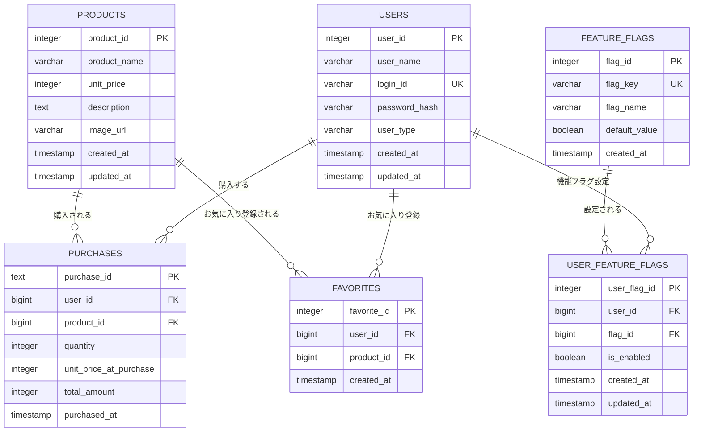

# mobile-app-system - データモデル

> 最終更新: 2025-01-08
> ステータス: Draft
> バージョン: 1.0

## 変更履歴

| バージョン | 日付 | 変更内容 | 著者 |
|-----------|------|---------|------|
| 1.0 | 2025-01-08 | 初版作成 | AI Agent |

---

## 1. データモデル概要

本ドキュメントでは、mobile-app-systemのデータモデルを定義します。
SQLiteデータベースに格納される全テーブルの構造、リレーションシップ、制約を記載します。

### 1.1 データベース情報

| 項目 | 内容 |
|------|------|
| DBMS | SQLite |
| データベース名 | mobile_app_db |
| 文字コード | UTF-8 |
| タイムゾーン | Asia/Tokyo (JST) |
| 接続プールサイズ | 1（SQLiteはシングルライター） |

## 2. ER図

### 2.1 全体ER図



## 3. テーブル定義

### 3.1 USERS（ユーザー）

**テーブル名**: `users`  
**用途**: エンドユーザーと管理者の情報を管理

**DR-001: ユーザーテーブル**

| 列名 | データ型 | NULL | デフォルト | 制約 | 説明 |
|------|---------|------|-----------|------|------|
| user_id | INTEGER PRIMARY KEY AUTOINCREMENT | NOT NULL | auto | PK | ユーザーID（主キー） |
| user_name | VARCHAR(100) | NOT NULL | - | - | ユーザー表示名 |
| login_id | VARCHAR(50) | NOT NULL | - | UNIQUE | ログインID |
| password_hash | VARCHAR(255) | NOT NULL | - | - | パスワードハッシュ（bcrypt） |
| user_type | VARCHAR(20) | NOT NULL | 'user' | CHECK | ユーザー種別（'user', 'admin'） |
| created_at | TIMESTAMP | NOT NULL | CURRENT_TIMESTAMP | - | 作成日時 |
| updated_at | TIMESTAMP | NOT NULL | CURRENT_TIMESTAMP | - | 更新日時 |

**インデックス**:
- PRIMARY KEY: `user_id`
- UNIQUE INDEX: `login_id`
- INDEX: `user_type`

**制約**:
```sql
CHECK (user_type IN ('user', 'admin'))
CHECK (LENGTH(login_id) >= 4 AND LENGTH(login_id) <= 20)
CHECK (LENGTH(user_name) >= 1 AND LENGTH(user_name) <= 100)
```

**サンプルデータ**:
```sql
-- エンドユーザー
INSERT INTO users (user_name, login_id, password_hash, user_type) 
VALUES 
  ('山田太郎', 'user001', '$2a$10$...', 'user'),
  ('佐藤花子', 'user002', '$2a$10$...', 'user');

-- 管理者
INSERT INTO users (user_name, login_id, password_hash, user_type) 
VALUES 
  ('管理者', 'admin001', '$2a$10$...', 'admin');
```

---

### 3.2 PRODUCTS（商品）

**テーブル名**: `products`  
**用途**: 商品情報を管理

**DR-002: 商品テーブル**

| 列名 | データ型 | NULL | デフォルト | 制約 | 説明 |
|------|---------|------|-----------|------|------|
| product_id | INTEGER PRIMARY KEY AUTOINCREMENT | NOT NULL | auto | PK | 商品ID（主キー） |
| product_name | VARCHAR(100) | NOT NULL | - | - | 商品名 |
| unit_price | INTEGER | NOT NULL | - | CHECK | 単価（円） |
| description | TEXT | NULL | - | - | 商品説明 |
| image_url | VARCHAR(500) | NULL | - | - | 商品画像URL |
| created_at | TIMESTAMP | NOT NULL | CURRENT_TIMESTAMP | - | 作成日時 |
| updated_at | TIMESTAMP | NOT NULL | CURRENT_TIMESTAMP | - | 更新日時 |

**インデックス**:
- PRIMARY KEY: `product_id`
- INDEX: `product_name` (部分一致検索用)

**制約**:
```sql
CHECK (unit_price >= 1)
CHECK (LENGTH(product_name) >= 1 AND LENGTH(product_name) <= 100)
```

**サンプルデータ**:
```sql
INSERT INTO products (product_name, unit_price, description, image_url) 
VALUES 
  ('商品A', 1000, '商品Aの説明文です', 'https://example.com/images/product_a.jpg'),
  ('商品B', 1500, '商品Bの説明文です', 'https://example.com/images/product_b.jpg'),
  ('商品C', 2000, '商品Cの説明文です', 'https://example.com/images/product_c.jpg');
```

---

### 3.3 PURCHASES（購入履歴）

**テーブル名**: `purchases`  
**用途**: 商品購入の履歴を管理

**DR-003: 購入履歴テーブル**

| 列名 | データ型 | NULL | デフォルト | 制約 | 説明 |
|------|---------|------|-----------|------|------|
| purchase_id | TEXT | NOT NULL | アプリケーション側でUUID生成 | PK | 購入ID（主キー） |
| user_id | BIGINT | NOT NULL | - | FK | ユーザーID |
| product_id | BIGINT | NOT NULL | - | FK | 商品ID |
| quantity | INTEGER | NOT NULL | - | CHECK | 購入個数 |
| unit_price_at_purchase | INTEGER | NOT NULL | - | CHECK | 購入時単価 |
| total_amount | INTEGER | NOT NULL | - | CHECK | 合計金額 |
| purchased_at | TIMESTAMP | NOT NULL | CURRENT_TIMESTAMP | - | 購入日時 |

**インデックス**:
- PRIMARY KEY: `purchase_id`
- INDEX: `user_id`
- INDEX: `product_id`
- INDEX: `purchased_at` (日時検索用)

**外部キー**:
```sql
FOREIGN KEY (user_id) REFERENCES users(user_id) ON DELETE RESTRICT
FOREIGN KEY (product_id) REFERENCES products(product_id) ON DELETE RESTRICT
```

**制約**:
```sql
CHECK (quantity > 0)
CHECK (quantity % 100 = 0)  -- 100の倍数
CHECK (unit_price_at_purchase >= 1)
CHECK (total_amount >= 1)
CHECK (total_amount = unit_price_at_purchase * quantity)  -- 整合性チェック
```

**トリガー**:
- `updated_at` 自動更新なし（履歴データのため）

**サンプルデータ**:
```sql
INSERT INTO purchases (user_id, product_id, quantity, unit_price_at_purchase, total_amount) 
VALUES 
  (1, 1, 100, 1000, 100000),
  (1, 2, 200, 1500, 300000),
  (2, 1, 300, 1000, 300000);
```

---

### 3.4 FAVORITES（お気に入り）

**テーブル名**: `favorites`  
**用途**: ユーザーのお気に入り商品を管理

**DR-004: お気に入りテーブル**

| 列名 | データ型 | NULL | デフォルト | 制約 | 説明 |
|------|---------|------|-----------|------|------|
| favorite_id | INTEGER PRIMARY KEY AUTOINCREMENT | NOT NULL | auto | PK | お気に入りID（主キー） |
| user_id | BIGINT | NOT NULL | - | FK | ユーザーID |
| product_id | BIGINT | NOT NULL | - | FK | 商品ID |
| created_at | TIMESTAMP | NOT NULL | CURRENT_TIMESTAMP | - | 登録日時 |

**インデックス**:
- PRIMARY KEY: `favorite_id`
- UNIQUE INDEX: `(user_id, product_id)` 複合ユニーク
- INDEX: `user_id`
- INDEX: `product_id`

**外部キー**:
```sql
FOREIGN KEY (user_id) REFERENCES users(user_id) ON DELETE CASCADE
FOREIGN KEY (product_id) REFERENCES products(product_id) ON DELETE CASCADE
```

**制約**:
```sql
UNIQUE (user_id, product_id)  -- 同じ商品を重複登録不可
```

**サンプルデータ**:
```sql
INSERT INTO favorites (user_id, product_id) 
VALUES 
  (1, 1),
  (1, 3),
  (2, 2);
```

---

### 3.5 FEATURE_FLAGS（機能フラグマスタ）

**テーブル名**: `feature_flags`  
**用途**: 機能フラグの定義を管理

**DR-005: 機能フラグマスタテーブル**

| 列名 | データ型 | NULL | デフォルト | 制約 | 説明 |
|------|---------|------|-----------|------|------|
| flag_id | INTEGER PRIMARY KEY AUTOINCREMENT | NOT NULL | auto | PK | フラグID（主キー） |
| flag_key | VARCHAR(50) | NOT NULL | - | UNIQUE | フラグキー（一意） |
| flag_name | VARCHAR(100) | NOT NULL | - | - | フラグ表示名 |
| default_value | BOOLEAN | NOT NULL | false | - | デフォルト値 |
| created_at | TIMESTAMP | NOT NULL | CURRENT_TIMESTAMP | - | 作成日時 |

**インデックス**:
- PRIMARY KEY: `flag_id`
- UNIQUE INDEX: `flag_key`

**サンプルデータ**:
```sql
INSERT INTO feature_flags (flag_key, flag_name, default_value) 
VALUES 
  ('favorite_feature', 'お気に入り機能', false);
```

---

### 3.6 USER_FEATURE_FLAGS（ユーザー別機能フラグ設定）

**テーブル名**: `user_feature_flags`  
**用途**: ユーザーごとの機能フラグ設定を管理

**DR-006: ユーザー別機能フラグテーブル**

| 列名 | データ型 | NULL | デフォルト | 制約 | 説明 |
|------|---------|------|-----------|------|------|
| user_flag_id | INTEGER PRIMARY KEY AUTOINCREMENT | NOT NULL | auto | PK | 設定ID（主キー） |
| user_id | BIGINT | NOT NULL | - | FK | ユーザーID |
| flag_id | BIGINT | NOT NULL | - | FK | フラグID |
| is_enabled | BOOLEAN | NOT NULL | false | - | 有効/無効 |
| created_at | TIMESTAMP | NOT NULL | CURRENT_TIMESTAMP | - | 作成日時 |
| updated_at | TIMESTAMP | NOT NULL | CURRENT_TIMESTAMP | - | 更新日時 |

**インデックス**:
- PRIMARY KEY: `user_flag_id`
- UNIQUE INDEX: `(user_id, flag_id)` 複合ユニーク
- INDEX: `user_id`
- INDEX: `flag_id`

**外部キー**:
```sql
FOREIGN KEY (user_id) REFERENCES users(user_id) ON DELETE CASCADE
FOREIGN KEY (flag_id) REFERENCES feature_flags(flag_id) ON DELETE CASCADE
```

**制約**:
```sql
UNIQUE (user_id, flag_id)  -- 同じユーザー・フラグの組み合わせは1レコードのみ
```

**サンプルデータ**:
```sql
-- user001はお気に入り機能ON、user002はOFF（デフォルト）
INSERT INTO user_feature_flags (user_id, flag_id, is_enabled) 
VALUES 
  (1, 1, true),
  (2, 1, false);
```

---

## 4. リレーションシップ詳細

### 4.1 USERS - PURCHASES (1:N)

- **リレーション**: 1ユーザー対多購入
- **結合**: `users.user_id = purchases.user_id`
- **削除時動作**: RESTRICT（ユーザー削除不可）
- **備考**: 購入履歴は保持する

### 4.2 USERS - FAVORITES (1:N)

- **リレーション**: 1ユーザー対多お気に入り
- **結合**: `users.user_id = favorites.user_id`
- **削除時動作**: CASCADE（ユーザー削除時、お気に入りも削除）
- **備考**: お気に入りはユーザーに紐づく

### 4.3 USERS - USER_FEATURE_FLAGS (1:N)

- **リレーション**: 1ユーザー対多機能フラグ設定
- **結合**: `users.user_id = user_feature_flags.user_id`
- **削除時動作**: CASCADE（ユーザー削除時、設定も削除）
- **備考**: デフォルト設定は不要（feature_flags.default_valueを使用）

### 4.4 PRODUCTS - PURCHASES (1:N)

- **リレーション**: 1商品対多購入
- **結合**: `products.product_id = purchases.product_id`
- **削除時動作**: RESTRICT（商品削除不可）
- **備考**: 購入履歴は保持する

### 4.5 PRODUCTS - FAVORITES (1:N)

- **リレーション**: 1商品対多お気に入り
- **結合**: `products.product_id = favorites.product_id`
- **削除時動作**: CASCADE（商品削除時、お気に入りも削除）
- **備考**: 商品削除は通常行わないが、削除時はお気に入りも削除

### 4.6 FEATURE_FLAGS - USER_FEATURE_FLAGS (1:N)

- **リレーション**: 1機能フラグ対多ユーザー設定
- **結合**: `feature_flags.flag_id = user_feature_flags.flag_id`
- **削除時動作**: CASCADE（フラグ削除時、設定も削除）
- **備考**: フラグの追加・削除は管理者が行う

## 5. データ整合性

### 5.1 トランザクション境界

| 操作 | トランザクション範囲 |
|------|------------------|
| ユーザーログイン | 単一SELECT（トランザクション不要） |
| 商品購入 | purchases テーブルへのINSERT |
| お気に入り登録 | favorites テーブルへのINSERT |
| お気に入り解除 | favorites テーブルからのDELETE |
| 商品情報更新 | products テーブルのUPDATE |
| 機能フラグ変更 | user_feature_flags テーブルのINSERT/UPDATE |

### 5.2 データ検証ルール

**DR-010: 購入時データ整合性**
```sql
-- 合計金額 = 単価 × 個数
CHECK (total_amount = unit_price_at_purchase * quantity)

-- 個数は100の倍数
CHECK (quantity % 100 = 0)
```

**DR-011: お気に入り重複防止**
```sql
-- 同じユーザー・商品の組み合わせは1レコードのみ
UNIQUE (user_id, product_id)
```

**DR-012: 機能フラグ重複防止**
```sql
-- 同じユーザー・フラグの組み合わせは1レコードのみ
UNIQUE (user_id, flag_id)
```

## 6. インデックス戦略

### 6.1 主要クエリとインデックス

| クエリ | 使用インデックス | 理由 |
|-------|---------------|------|
| ユーザーログイン | login_id (UNIQUE) | ログインIDで検索 |
| 商品一覧取得 | product_id (PK) | 主キースキャン |
| 商品検索 | product_name (INDEX) | 部分一致検索 |
| 商品詳細取得 | product_id (PK) | 主キー検索 |
| お気に入り取得 | (user_id, product_id) (UNIQUE) | 複合検索 |
| 購入履歴取得 | user_id (INDEX) | ユーザーIDで検索 |
| 機能フラグ取得 | (user_id, flag_id) (UNIQUE) | 複合検索 |

### 6.2 インデックスサマリー

| テーブル | インデックス数 | 種類 |
|---------|-------------|------|
| users | 3 | PK, UNIQUE, INDEX |
| products | 2 | PK, INDEX |
| purchases | 4 | PK, INDEX×3 |
| favorites | 4 | PK, UNIQUE, INDEX×2 |
| feature_flags | 2 | PK, UNIQUE |
| user_feature_flags | 4 | PK, UNIQUE, INDEX×2 |

## 7. データ型選択理由

| データ型 | 使用箇所 | 理由 |
|---------|---------|------|
| INTEGER AUTOINCREMENT | 主キー（ID） | 自動採番 |
| UUID | purchase_id | グローバル一意性、分散環境対応 |
| VARCHAR(n) | 文字列 | 可変長、最大長指定 |
| TEXT | 長文 | 可変長、長さ制限なし |
| INTEGER | 数値（金額、個数） | 整数のみ、十分な範囲 |
| BOOLEAN | フラグ | true/false |
| TIMESTAMP | 日時 | タイムゾーン付き日時 |

## 8. 初期化スクリプト

初期化スクリプトは `/database/init/` ディレクトリに配置します。

### 8.1 スクリプト実行順序

```
01_create_database.sql     -- データベース作成
02_create_tables.sql       -- テーブル作成
03_create_indexes.sql      -- インデックス作成
04_insert_master_data.sql  -- マスタデータ投入
05_insert_sample_data.sql  -- サンプルデータ投入
```

### 8.2 初期データ要件

| データ種別 | 件数 | 内容 |
|-----------|------|------|
| 管理者ユーザー | 1件 | admin001 / password123 |
| エンドユーザー | 10件 | user001-010 / password123 |
| 商品 | 20件 | 商品A-T、単価1000-20000円 |
| 機能フラグ | 1件 | お気に入り機能フラグ |
| お気に入り | 5件 | サンプルお気に入りデータ |
| 購入履歴 | 10件 | サンプル購入データ |

## 9. マイグレーション戦略

**DR-020: マイグレーション戦略**
- デモ用途のため、マイグレーションツールは使用しない
- スキーマ変更は初期化スクリプトを直接修正
- 本番運用時は Flyway 等のマイグレーションツール導入を推奨

---

**End of Document**
