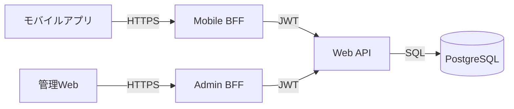

# mobile-app-system - API仕様

> 最終更新: 2025-01-08
> ステータス: Draft
> バージョン: 1.0

## 変更履歴

| バージョン | 日付 | 変更内容 | 著者 |
|-----------|------|---------|------|
| 1.0 | 2025-01-08 | 初版作成 | AI Agent |

---

## 1. API仕様概要

本ドキュメントでは、mobile-app-systemの全REST API仕様を定義します。

### 1.1 API構成



### 1.2 APIの種類

| API種別 | エンドポイント | 認証 | 権限 |
|---------|--------------|------|------|
| Mobile BFF API | `/api/mobile/*` | なし（Webへ委譲） | user |
| Admin BFF API | `/api/admin/*` | なし（Webへ委譲） | admin |
| Web API | `/api/v1/*` | JWT必須 | user/admin |

### 1.3 共通仕様

#### 1.3.1 ベースURL

| 環境 | Web API | Mobile BFF | Admin BFF |
|------|---------|-----------|-----------|
| 開発 | `http://localhost:8080` | `http://localhost:8081` | `http://localhost:8082` |
| 本番 | TBD | TBD | TBD |

#### 1.3.2 共通ヘッダー

**リクエストヘッダー**:
```http
Content-Type: application/json
Accept: application/json
Authorization: Bearer {JWT_TOKEN}  (認証必要な場合)
```

**レスポンスヘッダー**:
```http
Content-Type: application/json
```

#### 1.3.3 HTTPステータスコード

| ステータスコード | 意味 | 使用ケース |
|---------------|------|-----------|
| 200 OK | 成功 | GET, PUT, DELETE 成功 |
| 201 Created | 作成成功 | POST 成功 |
| 400 Bad Request | リクエスト不正 | バリデーションエラー |
| 401 Unauthorized | 認証失敗 | トークンなし、不正、期限切れ |
| 403 Forbidden | 権限不足 | 権限のないAPIへのアクセス |
| 404 Not Found | リソース不存在 | 存在しないID指定 |
| 500 Internal Server Error | サーバーエラー | 予期しないエラー |
| 503 Service Unavailable | サービス利用不可 | DB接続エラー等 |

#### 1.3.4 共通レスポンス形式

**成功時**:
```json
{
  "data": { /* データ */ },
  "timestamp": "2025-01-08T12:00:00Z"
}
```

**エラー時**:
```json
{
  "error": {
    "code": "ERROR_CODE",
    "message": "エラーメッセージ",
    "details": "詳細情報（オプション）"
  },
  "timestamp": "2025-01-08T12:00:00Z"
}
```

## 2. 認証API

### 2.1 エンドユーザーログイン

**API-001: エンドユーザーログイン**

#### エンドポイント
```
POST /api/v1/auth/login
```

#### 説明
エンドユーザーのログイン認証を行い、JWTトークンを発行する。

#### 権限
- なし（公開エンドポイント）

#### リクエスト

**Body**:
```json
{
  "loginId": "user001",
  "password": "password123"
}
```

**パラメータ**:
| フィールド | 型 | 必須 | 制約 | 説明 |
|-----------|----|----|-----|------|
| loginId | string | ✅ | 4-20文字 | ログインID |
| password | string | ✅ | 8-50文字 | パスワード |

#### レスポンス

**成功時 (200 OK)**:
```json
{
  "data": {
    "token": "eyJhbGciOiJIUzI1NiIsInR5cCI6IkpXVCJ9...",
    "tokenType": "Bearer",
    "expiresIn": 86400,
    "user": {
      "userId": 1,
      "userName": "山田太郎",
      "loginId": "user001",
      "userType": "user"
    }
  },
  "timestamp": "2025-01-08T12:00:00Z"
}
```

**エラー時 (401 Unauthorized)**:
```json
{
  "error": {
    "code": "AUTH_001",
    "message": "ログインIDまたはパスワードが正しくありません"
  },
  "timestamp": "2025-01-08T12:00:00Z"
}
```

#### JWTペイロード
```json
{
  "sub": "1",
  "loginId": "user001",
  "userType": "user",
  "iat": 1704700800,
  "exp": 1704787200
}
```

---

### 2.2 管理者ログイン

**API-002: 管理者ログイン**

#### エンドポイント
```
POST /api/v1/auth/admin/login
```

#### 説明
管理者のログイン認証を行い、管理者用JWTトークンを発行する。

#### 権限
- なし（公開エンドポイント）

#### リクエスト

**Body**:
```json
{
  "loginId": "admin001",
  "password": "adminpass123"
}
```

**パラメータ**:
| フィールド | 型 | 必須 | 制約 | 説明 |
|-----------|----|----|-----|------|
| loginId | string | ✅ | 4-20文字 | 管理者ログインID |
| password | string | ✅ | 8-50文字 | パスワード |

#### レスポンス

**成功時 (200 OK)**:
```json
{
  "data": {
    "token": "eyJhbGciOiJIUzI1NiIsInR5cCI6IkpXVCJ9...",
    "tokenType": "Bearer",
    "expiresIn": 86400,
    "admin": {
      "userId": 100,
      "userName": "管理者",
      "loginId": "admin001",
      "userType": "admin"
    }
  },
  "timestamp": "2025-01-08T12:00:00Z"
}
```

#### JWTペイロード
```json
{
  "sub": "100",
  "loginId": "admin001",
  "userType": "admin",
  "iat": 1704700800,
  "exp": 1704787200
}
```

---

## 3. 商品API

### 3.1 商品一覧取得

**API-010: 商品一覧取得**

#### エンドポイント
```
GET /api/v1/products
```

#### 説明
商品一覧を取得する。

#### 権限
- user または admin

#### リクエスト

**Headers**:
```
Authorization: Bearer {JWT_TOKEN}
```

**Query Parameters** (オプション):
| パラメータ | 型 | 必須 | デフォルト | 説明 |
|-----------|----|----|----------|------|
| page | integer | ❌ | 1 | ページ番号 |
| limit | integer | ❌ | 20 | 1ページあたりの件数 |
| sortBy | string | ❌ | productId | ソート項目 (productId, productName, unitPrice) |
| sortOrder | string | ❌ | asc | ソート順 (asc, desc) |

#### レスポンス

**成功時 (200 OK)**:
```json
{
  "data": {
    "products": [
      {
        "productId": 1,
        "productName": "商品A",
        "unitPrice": 1000,
        "description": "商品Aの説明文です",
        "imageUrl": "https://example.com/images/product_a.jpg"
      },
      {
        "productId": 2,
        "productName": "商品B",
        "unitPrice": 1500,
        "description": "商品Bの説明文です",
        "imageUrl": "https://example.com/images/product_b.jpg"
      }
    ],
    "pagination": {
      "currentPage": 1,
      "totalPages": 5,
      "totalItems": 100,
      "itemsPerPage": 20
    }
  },
  "timestamp": "2025-01-08T12:00:00Z"
}
```

---

### 3.2 商品検索

**API-011: 商品検索**

#### エンドポイント
```
GET /api/v1/products/search
```

#### 説明
商品名でキーワード検索を行う。

#### 権限
- user または admin

#### リクエスト

**Query Parameters**:
| パラメータ | 型 | 必須 | 制約 | 説明 |
|-----------|----|----|-----|------|
| keyword | string | ✅ | 1-50文字 | 検索キーワード |
| page | integer | ❌ | 1 | ページ番号 |
| limit | integer | ❌ | 20 | 1ページあたりの件数 |

**例**:
```
GET /api/v1/products/search?keyword=商品A
```

#### レスポンス

**成功時 (200 OK)**:
```json
{
  "data": {
    "products": [
      {
        "productId": 1,
        "productName": "商品A",
        "unitPrice": 1000,
        "description": "商品Aの説明文です",
        "imageUrl": "https://example.com/images/product_a.jpg"
      }
    ],
    "searchKeyword": "商品A",
    "pagination": {
      "currentPage": 1,
      "totalPages": 1,
      "totalItems": 1,
      "itemsPerPage": 20
    }
  },
  "timestamp": "2025-01-08T12:00:00Z"
}
```

**該当なし (200 OK)**:
```json
{
  "data": {
    "products": [],
    "searchKeyword": "存在しない商品",
    "pagination": {
      "currentPage": 1,
      "totalPages": 0,
      "totalItems": 0,
      "itemsPerPage": 20
    }
  },
  "timestamp": "2025-01-08T12:00:00Z"
}
```

---

### 3.3 商品詳細取得

**API-012: 商品詳細取得**

#### エンドポイント
```
GET /api/v1/products/{productId}
```

#### 説明
指定した商品の詳細情報を取得する。

#### 権限
- user または admin

#### リクエスト

**Path Parameters**:
| パラメータ | 型 | 必須 | 説明 |
|-----------|----|----|------|
| productId | integer | ✅ | 商品ID |

**例**:
```
GET /api/v1/products/1
```

#### レスポンス

**成功時 (200 OK)**:
```json
{
  "data": {
    "product": {
      "productId": 1,
      "productName": "商品A",
      "unitPrice": 1000,
      "description": "商品Aの説明文です。これは詳細な説明です。",
      "imageUrl": "https://example.com/images/product_a.jpg",
      "createdAt": "2025-01-01T00:00:00Z",
      "updatedAt": "2025-01-08T10:00:00Z"
    }
  },
  "timestamp": "2025-01-08T12:00:00Z"
}
```

**エラー時 (404 Not Found)**:
```json
{
  "error": {
    "code": "PRODUCT_001",
    "message": "商品が見つかりません"
  },
  "timestamp": "2025-01-08T12:00:00Z"
}
```

---

### 3.4 商品情報更新（管理者専用）

**API-013: 商品情報更新**

#### エンドポイント
```
PUT /api/v1/products/{productId}
```

#### 説明
商品の名前と単価を更新する（管理者専用）。

#### 権限
- admin のみ

#### リクエスト

**Path Parameters**:
| パラメータ | 型 | 必須 | 説明 |
|-----------|----|----|------|
| productId | integer | ✅ | 商品ID |

**Body**:
```json
{
  "productName": "商品A（改訂版）",
  "unitPrice": 1200,
  "description": "商品Aの新しい説明文です",
  "imageUrl": "https://example.com/images/product_a_v2.jpg"
}
```

**パラメータ**:
| フィールド | 型 | 必須 | 制約 | 説明 |
|-----------|----|----|-----|------|
| productName | string | ✅ | 1-100文字 | 商品名 |
| unitPrice | integer | ✅ | 1以上 | 単価（円） |
| description | string | ❌ | - | 商品説明 |
| imageUrl | string | ❌ | URL形式 | 商品画像URL |

#### レスポンス

**成功時 (200 OK)**:
```json
{
  "data": {
    "product": {
      "productId": 1,
      "productName": "商品A（改訂版）",
      "unitPrice": 1200,
      "description": "商品Aの新しい説明文です",
      "imageUrl": "https://example.com/images/product_a_v2.jpg",
      "updatedAt": "2025-01-08T12:00:00Z"
    }
  },
  "timestamp": "2025-01-08T12:00:00Z"
}
```

**エラー時 (403 Forbidden)**:
```json
{
  "error": {
    "code": "AUTH_003",
    "message": "この操作を実行する権限がありません"
  },
  "timestamp": "2025-01-08T12:00:00Z"
}
```

---

## 4. 購入API

### 4.1 商品購入

**API-020: 商品購入**

#### エンドポイント
```
POST /api/v1/purchases
```

#### 説明
商品を購入し、購入履歴を記録する。

#### 権限
- user のみ

#### リクエスト

**Body**:
```json
{
  "productId": 1,
  "quantity": 100
}
```

**パラメータ**:
| フィールド | 型 | 必須 | 制約 | 説明 |
|-----------|----|----|-----|------|
| productId | integer | ✅ | 存在する商品ID | 商品ID |
| quantity | integer | ✅ | 100の倍数、100-9900 | 購入個数 |

#### レスポンス

**成功時 (201 Created)**:
```json
{
  "data": {
    "purchase": {
      "purchaseId": "550e8400-e29b-41d4-a716-446655440000",
      "userId": 1,
      "productId": 1,
      "productName": "商品A",
      "quantity": 100,
      "unitPriceAtPurchase": 1000,
      "totalAmount": 100000,
      "purchasedAt": "2025-01-08T12:00:00Z"
    }
  },
  "timestamp": "2025-01-08T12:00:00Z"
}
```

**エラー時 (400 Bad Request)**:
```json
{
  "error": {
    "code": "PURCHASE_001",
    "message": "購入個数は100の倍数である必要があります"
  },
  "timestamp": "2025-01-08T12:00:00Z"
}
```

---

### 4.2 購入履歴取得

**API-021: 購入履歴取得**

#### エンドポイント
```
GET /api/v1/purchases
```

#### 説明
ログインユーザーの購入履歴を取得する。

#### 権限
- user のみ

#### リクエスト

**Query Parameters**:
| パラメータ | 型 | 必須 | デフォルト | 説明 |
|-----------|----|----|----------|------|
| page | integer | ❌ | 1 | ページ番号 |
| limit | integer | ❌ | 20 | 1ページあたりの件数 |

#### レスポンス

**成功時 (200 OK)**:
```json
{
  "data": {
    "purchases": [
      {
        "purchaseId": "550e8400-e29b-41d4-a716-446655440000",
        "productId": 1,
        "productName": "商品A",
        "quantity": 100,
        "unitPriceAtPurchase": 1000,
        "totalAmount": 100000,
        "purchasedAt": "2025-01-08T12:00:00Z"
      }
    ],
    "pagination": {
      "currentPage": 1,
      "totalPages": 3,
      "totalItems": 50,
      "itemsPerPage": 20
    }
  },
  "timestamp": "2025-01-08T12:00:00Z"
}
```

---

## 5. お気に入りAPI

### 5.1 お気に入り登録

**API-030: お気に入り登録**

#### エンドポイント
```
POST /api/v1/favorites
```

#### 説明
商品をお気に入りに登録する（機能フラグON時のみ）。

#### 権限
- user のみ
- お気に入り機能フラグがONのユーザーのみ

#### リクエスト

**Body**:
```json
{
  "productId": 1
}
```

**パラメータ**:
| フィールド | 型 | 必須 | 制約 | 説明 |
|-----------|----|----|-----|------|
| productId | integer | ✅ | 存在する商品ID | 商品ID |

#### レスポンス

**成功時 (201 Created)**:
```json
{
  "data": {
    "favorite": {
      "favoriteId": 1,
      "userId": 1,
      "productId": 1,
      "createdAt": "2025-01-08T12:00:00Z"
    }
  },
  "timestamp": "2025-01-08T12:00:00Z"
}
```

**エラー時 (403 Forbidden - 機能フラグOFF)**:
```json
{
  "error": {
    "code": "FEATURE_001",
    "message": "お気に入り機能は利用できません"
  },
  "timestamp": "2025-01-08T12:00:00Z"
}
```

**エラー時 (400 Bad Request - 重複登録)**:
```json
{
  "error": {
    "code": "FAVORITE_001",
    "message": "既にお気に入りに登録されています"
  },
  "timestamp": "2025-01-08T12:00:00Z"
}
```

---

### 5.2 お気に入り解除

**API-031: お気に入り解除**

#### エンドポイント
```
DELETE /api/v1/favorites/{productId}
```

#### 説明
お気に入りから商品を解除する。

#### 権限
- user のみ

#### リクエスト

**Path Parameters**:
| パラメータ | 型 | 必須 | 説明 |
|-----------|----|----|------|
| productId | integer | ✅ | 商品ID |

#### レスポンス

**成功時 (200 OK)**:
```json
{
  "data": {
    "message": "お気に入りを解除しました"
  },
  "timestamp": "2025-01-08T12:00:00Z"
}
```

---

### 5.3 お気に入り一覧取得

**API-032: お気に入り一覧取得**

#### エンドポイント
```
GET /api/v1/favorites
```

#### 説明
ログインユーザーのお気に入り商品一覧を取得する。

#### 権限
- user のみ

#### レスポンス

**成功時 (200 OK)**:
```json
{
  "data": {
    "favorites": [
      {
        "favoriteId": 1,
        "product": {
          "productId": 1,
          "productName": "商品A",
          "unitPrice": 1000,
          "imageUrl": "https://example.com/images/product_a.jpg"
        },
        "createdAt": "2025-01-08T12:00:00Z"
      }
    ]
  },
  "timestamp": "2025-01-08T12:00:00Z"
}
```

---

## 6. 機能フラグAPI

### 6.1 ユーザー機能フラグ取得

**API-040: ユーザー機能フラグ取得**

#### エンドポイント
```
GET /api/v1/feature-flags
```

#### 説明
ログインユーザーの機能フラグ設定を取得する。

#### 権限
- user のみ

#### レスポンス

**成功時 (200 OK)**:
```json
{
  "data": {
    "featureFlags": {
      "favoriteFeature": true
    }
  },
  "timestamp": "2025-01-08T12:00:00Z"
}
```

---

### 6.2 ユーザー一覧取得（機能フラグ管理）

**API-041: ユーザー一覧取得**

#### エンドポイント
```
GET /api/v1/admin/users
```

#### 説明
全ユーザーと各ユーザーの機能フラグ設定を取得する（管理者専用）。

#### 権限
- admin のみ

#### リクエスト

**Query Parameters**:
| パラメータ | 型 | 必須 | デフォルト | 説明 |
|-----------|----|----|----------|------|
| page | integer | ❌ | 1 | ページ番号 |
| limit | integer | ❌ | 50 | 1ページあたりの件数 |

#### レスポンス

**成功時 (200 OK)**:
```json
{
  "data": {
    "users": [
      {
        "userId": 1,
        "userName": "山田太郎",
        "loginId": "user001",
        "featureFlags": {
          "favoriteFeature": true
        }
      },
      {
        "userId": 2,
        "userName": "佐藤花子",
        "loginId": "user002",
        "featureFlags": {
          "favoriteFeature": false
        }
      }
    ],
    "pagination": {
      "currentPage": 1,
      "totalPages": 2,
      "totalItems": 100,
      "itemsPerPage": 50
    }
  },
  "timestamp": "2025-01-08T12:00:00Z"
}
```

---

### 6.3 機能フラグ変更

**API-042: 機能フラグ変更**

#### エンドポイント
```
PUT /api/v1/admin/users/{userId}/feature-flags/{flagKey}
```

#### 説明
ユーザーの機能フラグを変更する（管理者専用）。

#### 権限
- admin のみ

#### リクエスト

**Path Parameters**:
| パラメータ | 型 | 必須 | 説明 |
|-----------|----|----|------|
| userId | integer | ✅ | ユーザーID |
| flagKey | string | ✅ | フラグキー（例: favoriteFeature） |

**Body**:
```json
{
  "isEnabled": true
}
```

**パラメータ**:
| フィールド | 型 | 必須 | 制約 | 説明 |
|-----------|----|----|-----|------|
| isEnabled | boolean | ✅ | true/false | 有効/無効 |

#### レスポンス

**成功時 (200 OK)**:
```json
{
  "data": {
    "userId": 1,
    "flagKey": "favoriteFeature",
    "isEnabled": true,
    "updatedAt": "2025-01-08T12:00:00Z"
  },
  "timestamp": "2025-01-08T12:00:00Z"
}
```

---

## 7. BFF API仕様

### 7.1 Mobile BFF API

Mobile BFFは、モバイルアプリ専用のAPIで、Web APIを呼び出してレスポンスを返します。

**エンドポイントマッピング**:
| Mobile BFF | Web API |
|-----------|---------|
| `POST /api/mobile/login` | `POST /api/v1/auth/login` |
| `GET /api/mobile/products` | `GET /api/v1/products` |
| `GET /api/mobile/products/search` | `GET /api/v1/products/search` |
| `GET /api/mobile/products/{id}` | `GET /api/v1/products/{id}` |
| `POST /api/mobile/purchases` | `POST /api/v1/purchases` |
| `POST /api/mobile/favorites` | `POST /api/v1/favorites` |
| `DELETE /api/mobile/favorites/{id}` | `DELETE /api/v1/favorites/{id}` |
| `GET /api/mobile/favorites` | `GET /api/v1/favorites` |
| `GET /api/mobile/feature-flags` | `GET /api/v1/feature-flags` |

**役割**:
- Web APIへのリクエスト中継
- エラーハンドリング
- レスポンスのフォーマット調整（必要に応じて）

---

### 7.2 Admin BFF API

Admin BFFは、管理Webアプリ専用のAPIで、Web APIを呼び出してレスポンスを返します。

**エンドポイントマッピング**:
| Admin BFF | Web API |
|----------|---------|
| `POST /api/admin/login` | `POST /api/v1/auth/admin/login` |
| `GET /api/admin/products` | `GET /api/v1/products` |
| `PUT /api/admin/products/{id}` | `PUT /api/v1/products/{id}` |
| `GET /api/admin/users` | `GET /api/v1/admin/users` |
| `PUT /api/admin/users/{id}/flags/{key}` | `PUT /api/v1/admin/users/{id}/feature-flags/{key}` |

**役割**:
- Web APIへのリクエスト中継
- エラーハンドリング
- レスポンスのフォーマット調整（必要に応じて）

---

## 8. API一覧サマリー

### 8.1 エンドポイント一覧

| ID | メソッド | エンドポイント | 権限 | 説明 |
|----|---------|--------------|------|------|
| API-001 | POST | /api/v1/auth/login | なし | ユーザーログイン |
| API-002 | POST | /api/v1/auth/admin/login | なし | 管理者ログイン |
| API-010 | GET | /api/v1/products | user/admin | 商品一覧取得 |
| API-011 | GET | /api/v1/products/search | user/admin | 商品検索 |
| API-012 | GET | /api/v1/products/{id} | user/admin | 商品詳細取得 |
| API-013 | PUT | /api/v1/products/{id} | admin | 商品更新 |
| API-020 | POST | /api/v1/purchases | user | 商品購入 |
| API-021 | GET | /api/v1/purchases | user | 購入履歴取得 |
| API-030 | POST | /api/v1/favorites | user | お気に入り登録 |
| API-031 | DELETE | /api/v1/favorites/{id} | user | お気に入り解除 |
| API-032 | GET | /api/v1/favorites | user | お気に入り一覧 |
| API-040 | GET | /api/v1/feature-flags | user | 機能フラグ取得 |
| API-041 | GET | /api/v1/admin/users | admin | ユーザー一覧取得 |
| API-042 | PUT | /api/v1/admin/users/{id}/feature-flags/{key} | admin | 機能フラグ変更 |

**合計**: 14エンドポイント

---

**End of Document**
