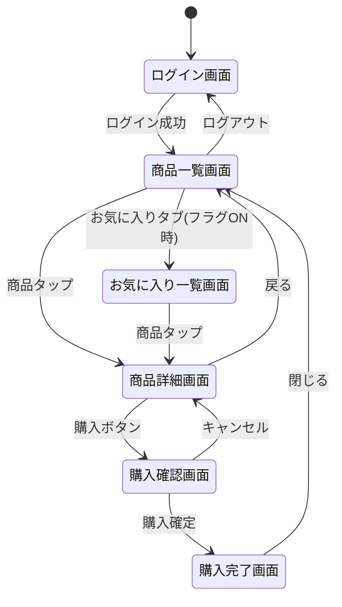
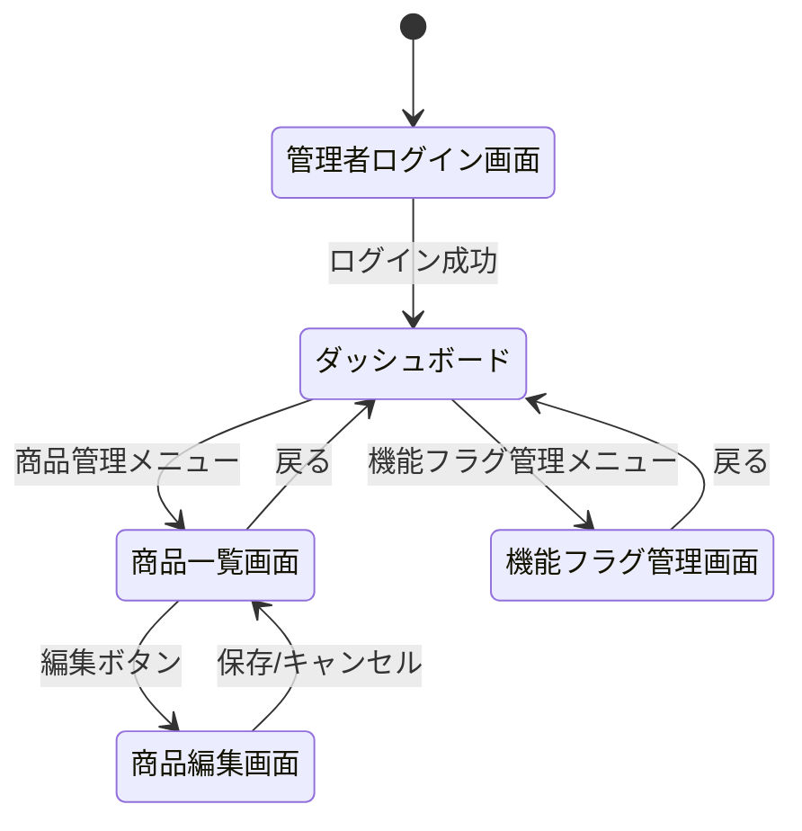

# mobile-app-system - UI/UX仕様

> 最終更新: 2025-01-08
> ステータス: Draft
> バージョン: 1.0

## 変更履歴

| バージョン | 日付 | 変更内容 | 著者 |
|-----------|------|---------|------|
| 1.0 | 2025-01-08 | 初版作成 | AI Agent |

---

## 1. UI/UX仕様概要

本ドキュメントでは、モバイルアプリと管理Webアプリの画面設計とユーザーエクスペリエンスを定義します。

## 2. モバイルアプリ UI/UX仕様

### 2.1 画面一覧

| 画面ID | 画面名 | 権限 | 説明 |
|-------|-------|------|------|
| UI-M-001 | ログイン画面 | なし | ログイン入力 |
| UI-M-002 | 商品一覧画面 | user | 商品リスト表示 |
| UI-M-003 | 商品詳細画面 | user | 商品詳細情報表示 |
| UI-M-004 | 購入確認画面 | user | 購入個数選択・確認 |
| UI-M-005 | 購入完了画面 | user | 購入完了メッセージ |
| UI-M-006 | お気に入り一覧画面 | user | お気に入り商品表示（機能フラグON時） |

### 2.2 画面遷移図



---

### 2.3 画面詳細仕様

#### UI-M-001: ログイン画面

**画面概要**:
ユーザーがログインIDとパスワードを入力してログインする。

**ワイヤーフレーム**:
```
┌──────────────────────────┐
│        ロゴマーク        │
│                          │
│    ログインID:           │
│    [_________________]   │
│                          │
│    パスワード:           │
│    [_________________]   │
│                          │
│    [ ログイン ]          │
│                          │
│    エラーメッセージ表示領域│
└──────────────────────────┘
```

**UI要素**:
| 要素 | 種類 | 必須 | バリデーション |
|------|------|------|--------------|
| ログインID入力欄 | テキスト | ✅ | 4-20文字 |
| パスワード入力欄 | パスワード | ✅ | 8-50文字 |
| ログインボタン | ボタン | ✅ | - |
| エラーメッセージ | テキスト | - | - |

**インタラクション**:
1. ユーザーがログインID、パスワードを入力
2. ログインボタンタップ
3. ローディング表示
4. 成功: 商品一覧画面へ遷移
5. 失敗: エラーメッセージ表示

**エラー表示**:
- 「ログインIDまたはパスワードが正しくありません」（赤文字）
- 「ネットワークエラーが発生しました」（赤文字）

**デザインガイドライン**:
- ロゴ: 中央揃え
- 入力欄: 幅80%、角丸
- ボタン: 幅80%、高さ50pt、プライマリカラー
- フォント: システムフォント

---

#### UI-M-002: 商品一覧画面

**画面概要**:
商品リストを表示し、検索・タップで詳細画面へ遷移する。

**ワイヤーフレーム**:
```
┌──────────────────────────┐
│  [商品] [お気に入り※]    │ ※フラグON時のみ
├──────────────────────────┤
│  [      検索欄      ] 🔍│
├──────────────────────────┤
│ 📷 商品A        ¥1,000   │
│    簡単な説明...         │
├──────────────────────────┤
│ 📷 商品B        ¥1,500   │
│    簡単な説明...         │
├──────────────────────────┤
│ 📷 商品C        ¥2,000   │
│    簡単な説明...         │
├──────────────────────────┤
│         ...              │
└──────────────────────────┘
 [ログアウト]
```

**UI要素**:
| 要素 | 種類 | 説明 |
|------|------|------|
| タブバー | タブ | 商品/お気に入り切替 |
| 検索バー | テキスト入力 | 商品名検索 |
| 商品リスト | リストビュー | スクロール可能 |
| 商品カード | カード | 画像、名前、単価表示 |
| ログアウトボタン | ボタン | ナビゲーションバー |

**商品カードレイアウト**:
- 左: 商品画像（サムネイル、80x80pt）
- 中央: 商品名（1行、省略表示）
- 右: 単価（右寄せ）
- 下: 簡単な説明（2行、省略表示）

**インタラクション**:
1. 画面表示時: 商品一覧API呼び出し
2. 検索バー入力: リアルタイム検索または検索ボタン
3. 商品カードタップ: 商品詳細画面へ遷移
4. お気に入りタブタップ: お気に入り一覧画面へ遷移（フラグON時のみ）
5. 下にスクロール: 次ページ読み込み（ページネーション）

**ローディング**:
- 初回表示: 画面中央にスピナー
- 検索時: 検索バー右にスピナー
- 次ページ読み込み: リスト下部にスピナー

**エラー表示**:
- ネットワークエラー: 画面中央に「エラーが発生しました」メッセージ + リトライボタン
- データ0件: 「商品がありません」メッセージ

---

#### UI-M-003: 商品詳細画面

**画面概要**:
選択した商品の詳細情報を表示し、購入・お気に入り操作を行う。

**ワイヤーフレーム**:
```
┌──────────────────────────┐
│  ←                        │
├──────────────────────────┤
│                          │
│    📷  商品画像          │
│      （大）              │
│                          │
├──────────────────────────┤
│  商品A                   │
│  ¥1,000 / 個             │
│                          │
│  ♡ お気に入り ※          │ ※フラグON時のみ
│                          │
│  商品の詳細説明文が      │
│  ここに表示されます。    │
│  複数行で...             │
│                          │
│                          │
│  [ 購入する ]            │
└──────────────────────────┘
```

**UI要素**:
| 要素 | 種類 | 説明 |
|------|------|------|
| 戻るボタン | ボタン | ナビゲーションバー左 |
| 商品画像 | 画像 | 全幅表示 |
| 商品名 | テキスト | 大きめフォント |
| 単価 | テキスト | 強調表示 |
| お気に入りボタン | トグルボタン | フラグON時のみ |
| 商品説明 | テキスト | スクロール可能 |
| 購入ボタン | ボタン | 固定位置（下部） |

**お気に入りボタン表示**:
- 機能フラグOFF: ボタン非表示
- 機能フラグON:
  - 未登録: ♡（白抜き） + 「お気に入り」
  - 登録済み: ♥（赤塗り） + 「お気に入り済み」

**インタラクション**:
1. 画面表示時: 商品詳細API呼び出し
2. お気に入りボタンタップ: 登録/解除トグル
3. 購入ボタンタップ: 購入確認画面へ遷移
4. 戻るボタンタップ: 商品一覧画面へ戻る

---

#### UI-M-004: 購入確認画面

**画面概要**:
購入個数を選択し、合計金額を確認して購入を確定する。

**ワイヤーフレーム**:
```
┌──────────────────────────┐
│       購入確認           │
├──────────────────────────┤
│                          │
│  商品名: 商品A           │
│  単価: ¥1,000            │
│                          │
│  購入個数:               │
│  [  ▼  100個  ]         │
│      (100, 200, 300...)  │
│                          │
│  合計: ¥100,000          │
│                          │
│  [ キャンセル ]          │
│  [ 購入確定 ]            │
│                          │
└──────────────────────────┘
```

**UI要素**:
| 要素 | 種類 | 説明 |
|------|------|------|
| 商品情報 | テキスト | 商品名、単価 |
| 個数選択 | ピッカー/ドロップダウン | 100刻み、100-9900 |
| 合計金額 | テキスト | 自動計算、強調表示 |
| キャンセルボタン | ボタン | セカンダリカラー |
| 購入確定ボタン | ボタン | プライマリカラー、強調 |

**インタラクション**:
1. 個数選択時: 合計金額をリアルタイム計算
2. 購入確定ボタンタップ: 購入API呼び出し → 購入完了画面へ
3. キャンセルボタンタップ: 商品詳細画面へ戻る

**購入確定時の処理**:
1. ローディング表示
2. 購入API呼び出し
3. 成功: 購入完了画面へ遷移
4. 失敗: エラーメッセージ表示（モーダル）

---

#### UI-M-005: 購入完了画面

**画面概要**:
購入完了メッセージを表示する。

**ワイヤーフレーム**:
```
┌──────────────────────────┐
│                          │
│         ✓                │
│                          │
│    購入完了しました      │
│                          │
│  ご購入ありがとう        │
│  ございました            │
│                          │
│                          │
│    [ 閉じる ]            │
│                          │
└──────────────────────────┘
```

**UI要素**:
| 要素 | 種類 | 説明 |
|------|------|------|
| 成功アイコン | アイコン | チェックマーク、緑色 |
| メッセージ | テキスト | 購入完了メッセージ |
| 閉じるボタン | ボタン | プライマリカラー |

**インタラクション**:
1. 閉じるボタンタップ: 商品一覧画面へ遷移

---

#### UI-M-006: お気に入り一覧画面

**画面概要**:
お気に入り登録した商品の一覧を表示する（機能フラグON時のみ）。

**ワイヤーフレーム**:
```
┌──────────────────────────┐
│  [商品] [お気に入り]     │
├──────────────────────────┤
│ 📷 商品A        ¥1,000   │
│    ♥                     │
├──────────────────────────┤
│ 📷 商品C        ¥2,000   │
│    ♥                     │
├──────────────────────────┤
│         ...              │
└──────────────────────────┘
```

**UI要素**:
- 商品一覧画面と同様のレイアウト
- お気に入りアイコン表示（♥）

**インタラクション**:
- 商品一覧画面と同様

---

## 3. 管理Webアプリ UI/UX仕様

### 3.1 画面一覧

| 画面ID | 画面名 | 権限 | 説明 |
|-------|-------|------|------|
| UI-A-001 | 管理者ログイン画面 | なし | 管理者ログイン |
| UI-A-002 | ダッシュボード | admin | メニュー選択 |
| UI-A-003 | 商品一覧画面 | admin | 商品リスト表示 |
| UI-A-004 | 商品編集画面 | admin | 商品情報編集 |
| UI-A-005 | 機能フラグ管理画面 | admin | ユーザー別フラグ設定 |

### 3.2 画面遷移図



---

### 3.3 画面詳細仕様

#### UI-A-001: 管理者ログイン画面

**画面概要**:
管理者がログインIDとパスワードを入力してログインする。

**ワイヤーフレーム**:
```
┌────────────────────────────────────┐
│                                    │
│         管理者ログイン             │
│                                    │
│    ログインID:                     │
│    [___________________________]   │
│                                    │
│    パスワード:                     │
│    [___________________________]   │
│                                    │
│         [ ログイン ]               │
│                                    │
│    エラーメッセージ表示領域        │
└────────────────────────────────────┘
```

**UI要素**:
モバイルアプリのログイン画面と同様

---

#### UI-A-002: ダッシュボード

**画面概要**:
管理機能のメニューを表示する。

**ワイヤーフレーム**:
```
┌────────────────────────────────────┐
│  管理者: admin001        [ログアウト]│
├────────────────────────────────────┤
│                                    │
│         管理ダッシュボード         │
│                                    │
│    ┌──────────────┐               │
│    │  商品管理    │               │
│    └──────────────┘               │
│                                    │
│    ┌──────────────┐               │
│    │機能フラグ管理│               │
│    └──────────────┘               │
│                                    │
└────────────────────────────────────┘
```

**UI要素**:
- ヘッダー: 管理者名、ログアウトボタン
- メニューカード: 商品管理、機能フラグ管理

---

#### UI-A-003: 商品一覧画面

**画面概要**:
全商品をテーブル形式で表示し、編集画面へ遷移する。

**ワイヤーフレーム**:
```
┌────────────────────────────────────┐
│  ← ダッシュボード                  │
├────────────────────────────────────┤
│         商品管理                   │
├────────────────────────────────────┤
│  ID | 商品名      | 単価  | 操作  │
│ ────┼─────────────┼───────┼────── │
│  1  | 商品A       | 1,000 | [編集]│
│  2  | 商品B       | 1,500 | [編集]│
│  3  | 商品C       | 2,000 | [編集]│
│ ... | ...         | ...   | ...   │
├────────────────────────────────────┤
│  < 前へ   1 / 5   次へ >          │
└────────────────────────────────────┘
```

**UI要素**:
| 要素 | 種類 | 説明 |
|------|------|------|
| テーブル | データテーブル | ソート可能 |
| 編集ボタン | ボタン | 各行に配置 |
| ページネーション | コントロール | 下部に配置 |

**テーブル列**:
- 商品ID: 数値、左寄せ
- 商品名: テキスト、左寄せ
- 単価: 数値、右寄せ、¥表記
- 操作: ボタン、中央寄せ

---

#### UI-A-004: 商品編集画面

**画面概要**:
商品の名前と単価を編集する。

**ワイヤーフレーム**:
```
┌────────────────────────────────────┐
│  ← 商品一覧                        │
├────────────────────────────────────┤
│         商品編集                   │
├────────────────────────────────────┤
│                                    │
│  商品ID: 1 (変更不可)              │
│                                    │
│  商品名:                           │
│  [________________________________]│
│                                    │
│  単価:                             │
│  [____________] 円                 │
│                                    │
│  商品説明:                         │
│  [________________________________]│
│  [________________________________]│
│  [________________________________]│
│                                    │
│  画像URL:                          │
│  [________________________________]│
│                                    │
│  [ キャンセル ]  [ 保存 ]         │
│                                    │
└────────────────────────────────────┘
```

**UI要素**:
| 要素 | 種類 | 必須 | バリデーション |
|------|------|------|--------------|
| 商品ID | テキスト（読み取り専用） | - | - |
| 商品名入力欄 | テキスト | ✅ | 1-100文字 |
| 単価入力欄 | 数値 | ✅ | 1以上 |
| 商品説明入力欄 | テキストエリア | ❌ | - |
| 画像URL入力欄 | テキスト | ❌ | URL形式 |
| キャンセルボタン | ボタン | - | - |
| 保存ボタン | ボタン | - | - |

**バリデーション**:
- リアルタイムバリデーション（入力中）
- 保存時バリデーション（サーバー側）
- エラー表示: 入力欄の下に赤文字

**インタラクション**:
1. 保存ボタンクリック: バリデーション → API呼び出し → 商品一覧へ戻る
2. キャンセルボタンクリック: 商品一覧へ戻る（確認ダイアログなし）

---

#### UI-A-005: 機能フラグ管理画面

**画面概要**:
ユーザー別に機能フラグをON/OFF設定する。

**ワイヤーフレーム**:
```
┌────────────────────────────────────┐
│  ← ダッシュボード                  │
├────────────────────────────────────┤
│       機能フラグ管理               │
├────────────────────────────────────┤
│  ID | ユーザー名 | ログインID |お気に入り│
│ ────┼───────────┼──────────┼─────────│
│  1  | 山田太郎   | user001   | [ON] OFF│
│  2  | 佐藤花子   | user002   | ON [OFF]│
│  3  | 鈴木一郎   | user003   | [ON] OFF│
│ ... | ...        | ...       | ...     │
├────────────────────────────────────┤
│  < 前へ   1 / 10   次へ >         │
└────────────────────────────────────┘
```

**UI要素**:
| 要素 | 種類 | 説明 |
|------|------|------|
| テーブル | データテーブル | - |
| トグルスイッチ | スイッチ | ON/OFF切替 |
| ページネーション | コントロール | 下部に配置 |

**トグルスイッチ**:
- ON: 緑色、右寄せ
- OFF: グレー、左寄せ
- クリックで即座に切り替わり、API呼び出し

**インタラクション**:
1. トグルクリック: API呼び出し → 成功時トースト通知
2. 失敗時: エラートースト表示、元の状態に戻す

---

## 4. デザインシステム

### 4.1 カラーパレット

**モバイルアプリ**:
| カラー | HEX | 用途 |
|--------|-----|------|
| プライマリ | #007AFF | ボタン、強調 |
| セカンダリ | #5856D6 | サブボタン |
| 成功 | #34C759 | 成功メッセージ |
| エラー | #FF3B30 | エラーメッセージ |
| 警告 | #FF9500 | 警告メッセージ |
| 背景 | #FFFFFF | 背景色 |
| テキスト | #000000 | 通常テキスト |
| セカンダリテキスト | #8E8E93 | 補足テキスト |

**管理Webアプリ**:
| カラー | HEX | 用途 |
|--------|-----|------|
| プライマリ | #1976D2 | ボタン、リンク |
| セカンダリ | #424242 | サブボタン |
| 成功 | #4CAF50 | 成功メッセージ |
| エラー | #F44336 | エラーメッセージ |
| 警告 | #FF9800 | 警告メッセージ |
| 背景 | #FAFAFA | 背景色 |
| テキスト | #212121 | 通常テキスト |
| セカンダリテキスト | #757575 | 補足テキスト |

### 4.2 タイポグラフィ

**モバイルアプリ**:
| 用途 | フォントサイズ | 太さ |
|------|--------------|------|
| 大見出し | 28pt | Bold |
| 中見出し | 20pt | Semibold |
| 小見出し | 17pt | Semibold |
| 本文 | 15pt | Regular |
| キャプション | 12pt | Regular |

**管理Webアプリ**:
| 用途 | フォントサイズ | 太さ |
|------|--------------|------|
| 大見出し | 32px | Bold |
| 中見出し | 24px | Semibold |
| 小見出し | 18px | Semibold |
| 本文 | 14px | Regular |
| キャプション | 12px | Regular |

### 4.3 スペーシング

- 基本単位: 8px/pt
- 小: 8px/pt
- 中: 16px/pt
- 大: 24px/pt
- 特大: 32px/pt

### 4.4 コンポーネント

**ボタン**:
- 高さ: 50pt (モバイル) / 40px (Web)
- 角丸: 8px/pt
- パディング: 16px/pt 左右

**入力欄**:
- 高さ: 50pt (モバイル) / 40px (Web)
- 角丸: 8px/pt
- ボーダー: 1px solid #E0E0E0

**カード**:
- 角丸: 12px/pt
- シャドウ: あり（軽め）
- パディング: 16px/pt

---

## 5. アクセシビリティ

### 5.1 基本要件

| 項目 | 要件 |
|------|------|
| コントラスト比 | 4.5:1以上（通常テキスト） |
| タッチターゲット | 最小44x44pt (iOS), 48x48dp (Android) |
| フォントスケーリング | システムフォントサイズ対応 |
| スクリーンリーダー | 重要な要素にラベル設定 |

### 5.2 除外事項（デモ用途）

- WCAG完全準拠
- 音声ナビゲーション対応
- 高コントラストモード対応

---

## 6. レスポンシブデザイン

### 6.1 モバイルアプリ

- **画面向き**: ポートレートのみ
- **対応解像度**: 各OSの標準解像度

### 6.2 管理Webアプリ

| ブレークポイント | 幅 | レイアウト |
|---------------|-------|----------|
| デスクトップ | ≥1280px | フル幅 |
| ラップトップ | 1024-1279px | 調整 |
| タブレット以下 | <1024px | 非対応 |

---

**End of Document**
