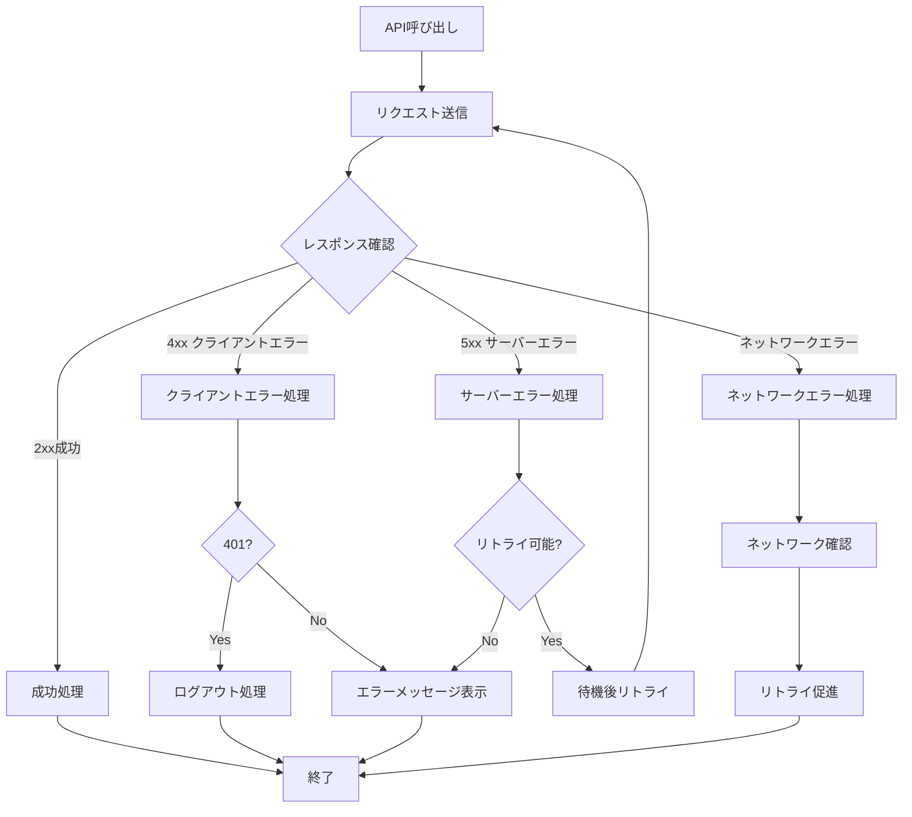
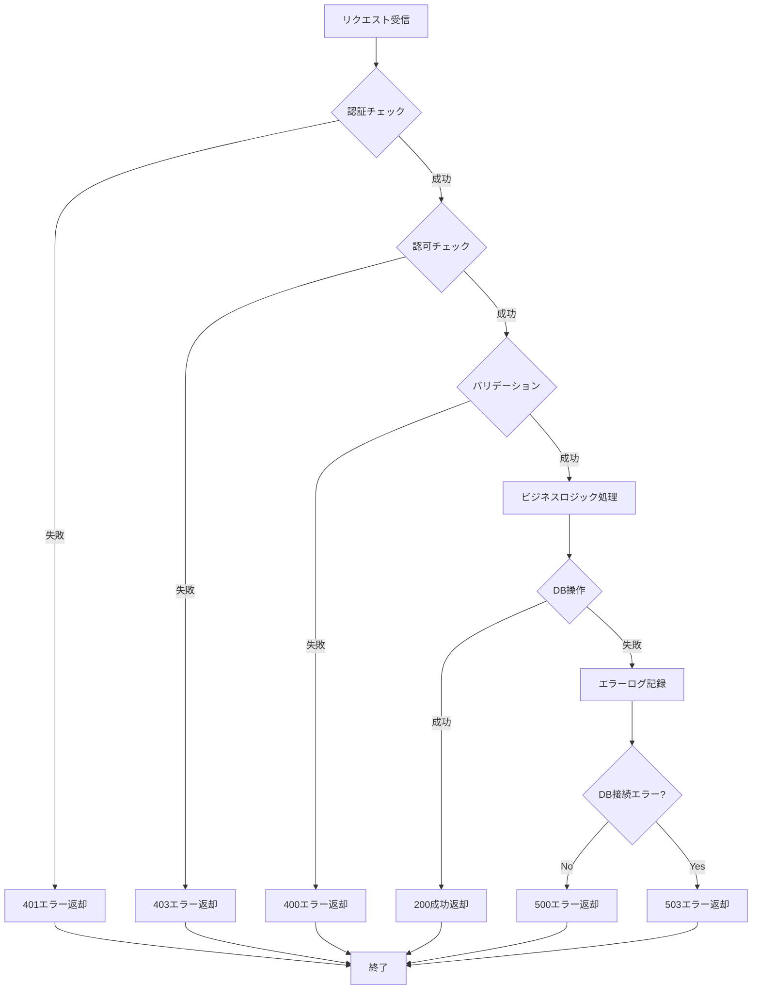

# mobile-app-system - エラーハンドリング仕様

> 最終更新: 2025-01-08
> ステータス: Draft
> バージョン: 1.0

## 変更履歴

| バージョン | 日付 | 変更内容 | 著者 |
|-----------|------|---------|------|
| 1.0 | 2025-01-08 | 初版作成 | AI Agent |

---

## 1. エラーハンドリング概要

本ドキュメントでは、mobile-app-systemの全エラーハンドリング仕様を定義します。
エラーコード体系、エラーメッセージ、エラー処理フロー、リトライ戦略を記載します。

## 2. エラーコード体系

### 2.1 エラーコードフォーマット

```
[カテゴリ]_[連番]
```

例: `AUTH_001`, `PRODUCT_001`, `PURCHASE_001`

### 2.2 エラーカテゴリ

| カテゴリ | プレフィックス | 説明 |
|---------|--------------|------|
| 認証エラー | AUTH | 認証・認可関連 |
| 商品エラー | PRODUCT | 商品関連 |
| 購入エラー | PURCHASE | 購入関連 |
| お気に入りエラー | FAVORITE | お気に入り関連 |
| 機能フラグエラー | FEATURE | 機能フラグ関連 |
| バリデーションエラー | VALIDATION | 入力検証エラー |
| システムエラー | SYSTEM | システム内部エラー |
| ネットワークエラー | NETWORK | 通信エラー |

---

## 3. エラーコード一覧

### 3.1 認証エラー (AUTH_xxx)

| エラーコード | HTTPステータス | メッセージ | 説明 | 対応 |
|------------|--------------|----------|------|------|
| AUTH_001 | 401 | ログインIDまたはパスワードが正しくありません | 認証失敗 | 再入力 |
| AUTH_002 | 401 | トークンが無効です | トークン不正 | 再ログイン |
| AUTH_003 | 403 | この操作を実行する権限がありません | 権限不足 | エラー表示 |
| AUTH_004 | 401 | トークンの有効期限が切れています | トークン期限切れ | 再ログイン |
| AUTH_005 | 401 | トークンが提供されていません | トークンなし | 再ログイン |

---

### 3.2 商品エラー (PRODUCT_xxx)

| エラーコード | HTTPステータス | メッセージ | 説明 | 対応 |
|------------|--------------|----------|------|------|
| PRODUCT_001 | 404 | 商品が見つかりません | 商品不存在 | エラー表示 |
| PRODUCT_002 | 400 | 商品名は1文字以上100文字以内で入力してください | バリデーションエラー | 再入力 |
| PRODUCT_003 | 400 | 単価は1円以上の整数で入力してください | バリデーションエラー | 再入力 |
| PRODUCT_004 | 500 | 商品情報の更新に失敗しました | 更新失敗 | リトライ |

---

### 3.3 購入エラー (PURCHASE_xxx)

| エラーコード | HTTPステータス | メッセージ | 説明 | 対応 |
|------------|--------------|----------|------|------|
| PURCHASE_001 | 400 | 購入個数は100の倍数である必要があります | 個数不正 | 再入力 |
| PURCHASE_002 | 400 | 購入個数は100個以上9900個以内で指定してください | 個数範囲外 | 再入力 |
| PURCHASE_003 | 404 | 指定された商品が見つかりません | 商品不存在 | エラー表示 |
| PURCHASE_004 | 500 | 購入処理に失敗しました | 購入失敗 | リトライ |

---

### 3.4 お気に入りエラー (FAVORITE_xxx)

| エラーコード | HTTPステータス | メッセージ | 説明 | 対応 |
|------------|--------------|----------|------|------|
| FAVORITE_001 | 400 | 既にお気に入りに登録されています | 重複登録 | エラー表示（軽微） |
| FAVORITE_002 | 404 | お気に入りが見つかりません | お気に入り不存在 | エラー表示 |
| FAVORITE_003 | 404 | 指定された商品が見つかりません | 商品不存在 | エラー表示 |
| FAVORITE_004 | 500 | お気に入りの登録に失敗しました | 登録失敗 | リトライ |
| FAVORITE_005 | 500 | お気に入りの解除に失敗しました | 解除失敗 | リトライ |

---

### 3.5 機能フラグエラー (FEATURE_xxx)

| エラーコード | HTTPステータス | メッセージ | 説明 | 対応 |
|------------|--------------|----------|------|------|
| FEATURE_001 | 403 | お気に入り機能は利用できません | 機能フラグOFF | エラー表示 |
| FEATURE_002 | 404 | 指定された機能フラグが見つかりません | フラグ不存在 | エラー表示 |
| FEATURE_003 | 500 | 機能フラグの更新に失敗しました | 更新失敗 | リトライ |

---

### 3.6 バリデーションエラー (VALIDATION_xxx)

| エラーコード | HTTPステータス | メッセージ | 説明 | 対応 |
|------------|--------------|----------|------|------|
| VALIDATION_001 | 400 | 必須項目が入力されていません | 必須チェック | 再入力 |
| VALIDATION_002 | 400 | 入力値の形式が正しくありません | 形式エラー | 再入力 |
| VALIDATION_003 | 400 | 入力値が許容範囲外です | 範囲エラー | 再入力 |
| VALIDATION_004 | 400 | リクエストボディが不正です | JSON不正 | 再リクエスト |

---

### 3.7 システムエラー (SYSTEM_xxx)

| エラーコード | HTTPステータス | メッセージ | 説明 | 対応 |
|------------|--------------|----------|------|------|
| SYSTEM_001 | 500 | システムエラーが発生しました | 予期しないエラー | リトライ |
| SYSTEM_002 | 503 | サービスが一時的に利用できません | サービス停止 | 時間を置いてリトライ |
| SYSTEM_003 | 503 | データベース接続に失敗しました | DB接続エラー | リトライ |
| SYSTEM_004 | 500 | データの整合性エラーが発生しました | データ整合性エラー | 管理者連絡 |

---

### 3.8 ネットワークエラー (NETWORK_xxx)

| エラーコード | HTTPステータス | メッセージ | 説明 | 対応 |
|------------|--------------|----------|------|------|
| NETWORK_001 | - | ネットワークに接続できません | 接続失敗 | 接続確認後リトライ |
| NETWORK_002 | 408 | リクエストがタイムアウトしました | タイムアウト | リトライ |
| NETWORK_003 | - | サーバーに接続できません | サーバー到達不可 | 時間を置いてリトライ |

---

## 4. エラーレスポンス形式

### 4.1 標準エラーレスポンス

```json
{
  "error": {
    "code": "ERROR_CODE",
    "message": "ユーザー向けエラーメッセージ",
    "details": "技術的な詳細情報（オプション）"
  },
  "timestamp": "2025-01-08T12:00:00Z"
}
```

### 4.2 バリデーションエラーレスポンス

複数のフィールドエラーがある場合:

```json
{
  "error": {
    "code": "VALIDATION_001",
    "message": "入力内容に誤りがあります",
    "fieldErrors": [
      {
        "field": "productName",
        "message": "商品名は1文字以上100文字以内で入力してください"
      },
      {
        "field": "unitPrice",
        "message": "単価は1円以上の整数で入力してください"
      }
    ]
  },
  "timestamp": "2025-01-08T12:00:00Z"
}
```

---

## 5. エラー処理フロー

### 5.1 クライアント側エラー処理フロー



### 5.2 サーバー側エラー処理フロー



---

## 6. リトライ戦略

### 6.1 自動リトライ対象

| エラー種別 | 自動リトライ | リトライ回数 | 待機時間 |
|-----------|------------|------------|---------|
| ネットワークエラー | ✅ | 3回 | 1秒 → 2秒 → 4秒（指数バックオフ） |
| タイムアウト | ✅ | 2回 | 2秒 → 4秒 |
| 503 サービス利用不可 | ✅ | 2回 | 3秒 → 6秒 |
| 500 サーバーエラー | ❌ | - | - |
| 4xx クライアントエラー | ❌ | - | - |

### 6.2 手動リトライ

以下のエラーは手動リトライボタンを表示:

- ネットワークエラー（自動リトライ失敗後）
- タイムアウト（自動リトライ失敗後）
- 500 サーバーエラー
- 503 サービス利用不可（自動リトライ失敗後）

### 6.3 リトライ実装例（疑似コード）

```java
public <T> T executeWithRetry(Supplier<T> apiCall, int maxRetries) {
    int attempt = 0;
    Exception lastException = null;
    
    while (attempt < maxRetries) {
        try {
            return apiCall.get();
        } catch (NetworkException | TimeoutException e) {
            lastException = e;
            attempt++;
            
            if (attempt < maxRetries) {
                long waitTime = (long) Math.pow(2, attempt - 1) * 1000; // 指数バックオフ
                Thread.sleep(waitTime);
            }
        }
    }
    
    throw new RetryExhaustedException("リトライ回数を超過しました", lastException);
}
```

---

## 7. エラーメッセージ表示

### 7.1 モバイルアプリでの表示

#### 7.1.1 トーストメッセージ

軽微なエラー（一時的な情報表示）:
- お気に入り重複登録
- 一時的なネットワークエラー

**表示仕様**:
- 位置: 画面下部
- 表示時間: 3秒
- スタイル: 背景灰色、白文字

#### 7.1.2 アラートダイアログ

重要なエラー（ユーザーの確認が必要）:
- 認証エラー
- 購入失敗
- システムエラー

**表示仕様**:
- モーダル表示
- タイトル: エラー種別
- メッセージ: エラー内容
- ボタン: OK、リトライ（該当する場合）

#### 7.1.3 インラインエラー

入力欄のバリデーションエラー:
- フィールド下に赤文字で表示
- リアルタイムバリデーション

---

### 7.2 管理Webアプリでの表示

#### 7.2.1 トースト通知

軽微なエラー、成功通知:
- 位置: 画面右上
- 表示時間: 5秒
- スタイル: エラー（赤）、成功（緑）、警告（オレンジ）

#### 7.2.2 モーダルダイアログ

重要なエラー:
- 認証エラー
- システムエラー

#### 7.2.3 インラインエラー

フォームバリデーションエラー:
- フィールド下に赤文字で表示

---

## 8. ログ出力

### 8.1 エラーログレベル

| ログレベル | 対象エラー | 出力内容 |
|----------|----------|---------|
| ERROR | 500, 503 | スタックトレース、リクエスト情報、ユーザーID |
| WARN | 401, 403, 404 | エラーコード、リクエスト情報、ユーザーID |
| INFO | 400 | エラーコード、バリデーションエラー内容 |

### 8.2 ログ出力項目

```json
{
  "timestamp": "2025-01-08T12:00:00Z",
  "level": "ERROR",
  "logger": "com.example.api.controller.ProductController",
  "message": "商品更新に失敗しました",
  "errorCode": "PRODUCT_004",
  "userId": 100,
  "requestId": "550e8400-e29b-41d4-a716-446655440000",
  "method": "PUT",
  "path": "/api/v1/products/1",
  "stackTrace": "..."
}
```

### 8.3 ログローテーション

- ファイルサイズ: 100MB
- 保持世代: 7世代
- 保持期間: 30日

---

## 9. エラー監視

### 9.1 監視項目（デモ用途では最小限）

| 項目 | 閾値 | アクション |
|------|------|----------|
| 500エラー発生率 | - | ログ記録のみ |
| 503エラー発生率 | - | ログ記録のみ |
| API応答時間 | - | ログ記録のみ |
| DB接続エラー | - | ログ記録のみ |

**注意**: デモ用途のため、アラート通知等は実装しない

---

## 10. エラーハンドリングベストプラクティス

### 10.1 開発時の注意事項

1. **ユーザーフレンドリーなメッセージ**
   - 技術用語を避ける
   - 具体的な対処方法を示す
   - 不安を与えない表現

2. **適切なHTTPステータスコード**
   - 認証: 401
   - 権限: 403
   - 不存在: 404
   - バリデーション: 400
   - サーバーエラー: 500

3. **詳細なログ記録**
   - エラー発生時刻
   - ユーザー情報
   - リクエスト情報
   - スタックトレース

4. **センシティブ情報の保護**
   - エラーメッセージにパスワード等を含めない
   - スタックトレースはログのみ（クライアントに返さない）

---

## 11. エラーメッセージ多言語対応（将来）

現在は日本語のみだが、将来的に多言語対応する場合:

```json
{
  "error": {
    "code": "AUTH_001",
    "message": {
      "ja": "ログインIDまたはパスワードが正しくありません",
      "en": "Login ID or password is incorrect"
    }
  }
}
```

---

## 12. エラーハンドリングテストケース

### 12.1 テストパターン

| テストケース | 期待結果 |
|------------|---------|
| 不正な認証情報でログイン | AUTH_001エラー返却 |
| トークンなしでAPI呼び出し | AUTH_005エラー返却 |
| 期限切れトークンでAPI呼び出し | AUTH_004エラー返却 |
| 存在しない商品ID指定 | PRODUCT_001エラー返却 |
| 不正な購入個数指定 | PURCHASE_001エラー返却 |
| DB接続失敗シミュレーション | SYSTEM_003エラー返却 |
| タイムアウトシミュレーション | NETWORK_002エラー返却 |
| 重複お気に入り登録 | FAVORITE_001エラー返却 |

詳細は `12-testing-strategy.md` を参照

---

**End of Document**
