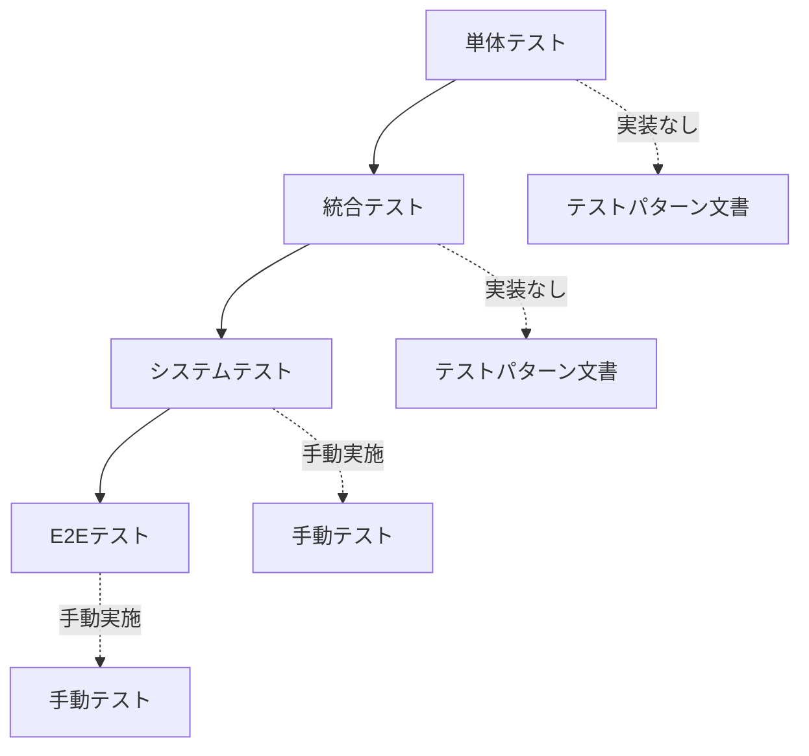

# mobile-app-system - テスト戦略

> 最終更新: 2025-01-08
> ステータス: Draft
> バージョン: 1.0

## 変更履歴

| バージョン | 日付 | 変更内容 | 著者 |
|-----------|------|---------|------|
| 1.0 | 2025-01-08 | 初版作成 | AI Agent |

---

## 1. テスト戦略概要

本ドキュメントでは、mobile-app-systemのテスト戦略とテストパターンを定義します。

**重要**: デモンストレーション用途のため、自動テストコードは実装しませんが、テストパターンはドキュメント化します。

### 1.1 テスト方針

| 項目 | 方針 |
|------|------|
| 自動テストコード | 実装しない（デモ用途） |
| テストパターン | ドキュメント化 ✅ |
| 手動テスト | 実施 ✅ |
| テスト仕様書 | 作成 ✅ |

---

## 2. テストレベル

### 2.1 テストレベル一覧



### 2.2 各テストレベルの詳細

| テストレベル | 目的 | 実装 | ドキュメント |
|------------|------|------|------------|
| 単体テスト | 個々のメソッド・クラスの動作確認 | ❌ | ✅ |
| 統合テスト | コンポーネント間の連携確認 | ❌ | ✅ |
| システムテスト | システム全体の動作確認 | 手動 | ✅ |
| E2Eテスト | エンドユーザー視点の動作確認 | 手動 | ✅ |

---

## 3. テストパターン

### 3.1 テストパターンの分類

| パターン | 説明 | 例 |
|---------|------|-----|
| 正常系 | 正しい入力での動作確認 | 正しいID/パスワードでログイン |
| 異常系 | 誤った入力での動作確認 | 誤ったパスワードでログイン |
| 境界値 | 境界値での動作確認 | 最小値（1円）、最大値（9900個） |
| 例外 | 例外発生時の動作確認 | ネットワークエラー時の挙動 |

---

## 4. 単体テストパターン

### 4.1 ユーティリティクラス

#### TS-UT-001: パスワードハッシュ化

**テスト対象**: `PasswordUtil.hashPassword()`

| テストケース | 入力 | 期待結果 |
|------------|------|---------|
| 正常系 | "password123" | bcryptハッシュが返される |
| 正常系 | 同じパスワードを2回 | 異なるハッシュが返される（ソルト効果） |
| 異常系 | null | 例外発生 |
| 異常系 | 空文字 | 例外発生 |

---

#### TS-UT-002: パスワード検証

**テスト対象**: `PasswordUtil.verifyPassword()`

| テストケース | 入力 | 期待結果 |
|------------|------|---------|
| 正常系 | 正しいパスワード、正しいハッシュ | true |
| 異常系 | 誤ったパスワード、正しいハッシュ | false |
| 異常系 | null、正しいハッシュ | false |

---

### 4.2 バリデーションクラス

#### TS-UT-010: 商品名バリデーション

**テスト対象**: 商品名のバリデーションロジック

| テストケース | 入力 | 期待結果 |
|------------|------|---------|
| 正常系 | "商品A"（1文字） | OK |
| 正常系 | "A" * 100（100文字） | OK |
| 異常系 | null | バリデーションエラー |
| 異常系 | ""（空文字） | バリデーションエラー |
| 異常系 | "A" * 101（101文字） | バリデーションエラー |

---

#### TS-UT-011: 単価バリデーション

**テスト対象**: 単価のバリデーションロジック

| テストケース | 入力 | 期待結果 |
|------------|------|---------|
| 正常系 | 1（最小値） | OK |
| 正常系 | 10000 | OK |
| 異常系 | null | バリデーションエラー |
| 異常系 | 0 | バリデーションエラー |
| 異常系 | -1 | バリデーションエラー |
| 異常系 | "abc"（文字列） | バリデーションエラー |

---

#### TS-UT-012: 購入個数バリデーション

**テスト対象**: 購入個数のバリデーションロジック

| テストケース | 入力 | 期待結果 |
|------------|------|---------|
| 正常系 | 100（最小値） | OK |
| 正常系 | 500（100の倍数） | OK |
| 正常系 | 9900（最大値） | OK |
| 異常系 | 99 | バリデーションエラー |
| 異常系 | 101 | バリデーションエラー |
| 異常系 | 10000（最大値超過） | バリデーションエラー |
| 異常系 | null | バリデーションエラー |
| 異常系 | 0 | バリデーションエラー |

---

### 4.3 ビジネスロジッククラス

#### TS-UT-020: 合計金額計算

**テスト対象**: 合計金額計算ロジック

| テストケース | 単価 | 個数 | 期待結果 |
|------------|-----|-----|---------|
| 正常系 | 1000 | 100 | 100000 |
| 正常系 | 1500 | 200 | 300000 |
| 境界値 | 1 | 100 | 100 |
| 境界値 | 9999 | 9900 | 98990100 |

---

#### TS-UT-021: JWT トークン生成

**テスト対象**: JWTトークン生成ロジック

| テストケース | 入力 | 期待結果 |
|------------|------|---------|
| 正常系（user） | userId=1, userType=user | 正しいペイロードのトークン |
| 正常系（admin） | userId=100, userType=admin | 正しいペイロードのトークン |
| 正常系 | 同じユーザーで2回生成 | 異なるトークン（iat異なる） |

---

#### TS-UT-022: JWT トークン検証

**テスト対象**: JWTトークン検証ロジック

| テストケース | 入力 | 期待結果 |
|------------|------|---------|
| 正常系 | 有効なトークン | ペイロード取得成功 |
| 異常系 | 不正なトークン | 例外発生（AUTH_002） |
| 異常系 | 期限切れトークン | 例外発生（AUTH_004） |
| 異常系 | null | 例外発生（AUTH_005） |
| 異常系 | 空文字 | 例外発生（AUTH_005） |

---

## 5. 統合テストパターン

### 5.1 API統合テスト

#### TS-IT-001: ログインAPI

**テスト対象**: POST /api/v1/auth/login

| テストケース | リクエスト | 期待結果 |
|------------|----------|---------|
| 正常系 | 正しいID/パスワード | 200 OK、トークン返却 |
| 異常系 | 誤ったパスワード | 401 Unauthorized、AUTH_001 |
| 異常系 | 存在しないユーザーID | 401 Unauthorized、AUTH_001 |
| 異常系 | ログインID未入力 | 400 Bad Request、VALIDATION_001 |
| 異常系 | パスワード未入力 | 400 Bad Request、VALIDATION_001 |

---

#### TS-IT-002: 商品一覧取得API

**テスト対象**: GET /api/v1/products

| テストケース | リクエスト | 期待結果 |
|------------|----------|---------|
| 正常系 | 有効なトークン | 200 OK、商品一覧返却 |
| 正常系 | ページネーション指定 | 200 OK、指定ページの商品返却 |
| 異常系 | トークンなし | 401 Unauthorized、AUTH_005 |
| 異常系 | 不正なトークン | 401 Unauthorized、AUTH_002 |
| 異常系 | 期限切れトークン | 401 Unauthorized、AUTH_004 |

---

#### TS-IT-003: 商品購入API

**テスト対象**: POST /api/v1/purchases

| テストケース | リクエスト | 期待結果 |
|------------|----------|---------|
| 正常系 | productId=1, quantity=100 | 201 Created、購入ID返却 |
| 正常系 | productId=1, quantity=500 | 201 Created、購入ID返却 |
| 異常系 | quantity=99（100の倍数でない） | 400 Bad Request、PURCHASE_001 |
| 異常系 | quantity=10000（範囲外） | 400 Bad Request、PURCHASE_002 |
| 異常系 | 存在しない商品ID | 404 Not Found、PURCHASE_003 |
| 異常系 | userトークンなし | 401 Unauthorized |
| 異常系 | adminトークンで実行 | 403 Forbidden、AUTH_003 |

---

#### TS-IT-004: お気に入り登録API

**テスト対象**: POST /api/v1/favorites

| テストケース | リクエスト | 期待結果 |
|------------|----------|---------|
| 正常系（フラグON） | productId=1、フラグONユーザー | 201 Created、お気に入りID返却 |
| 異常系（フラグOFF） | productId=1、フラグOFFユーザー | 403 Forbidden、FEATURE_001 |
| 異常系（重複） | 既にお気に入り済みの商品 | 400 Bad Request、FAVORITE_001 |
| 異常系 | 存在しない商品ID | 404 Not Found、FAVORITE_003 |

---

#### TS-IT-005: 商品更新API（管理者専用）

**テスト対象**: PUT /api/v1/products/{id}

| テストケース | リクエスト | 期待結果 |
|------------|----------|---------|
| 正常系 | adminトークン、正しいデータ | 200 OK、更新後データ返却 |
| 異常系 | userトークンで実行 | 403 Forbidden、AUTH_003 |
| 異常系 | 不正な商品名 | 400 Bad Request、VALIDATION_002 |
| 異常系 | 不正な単価 | 400 Bad Request、VALIDATION_003 |
| 異常系 | 存在しない商品ID | 404 Not Found、PRODUCT_001 |

---

### 5.2 データベース統合テスト

#### TS-IT-010: 購入データ保存

**テスト対象**: 購入処理のDB保存

| テストケース | 操作 | 期待結果 |
|------------|------|---------|
| 正常系 | 購入実行 | purchasesテーブルにレコード追加 |
| 正常系 | 合計金額の正確性 | total_amount = unit_price * quantity |
| 正常系 | 購入時単価の記録 | 購入時の単価が記録される |

---

#### TS-IT-011: お気に入り重複防止

**テスト対象**: お気に入りのユニーク制約

| テストケース | 操作 | 期待結果 |
|------------|------|---------|
| 正常系 | 初回お気に入り登録 | 成功 |
| 異常系 | 同じ商品を再登録 | DB制約エラーまたはアプリでエラー |

---

### 5.3 BFF統合テスト

#### TS-IT-020: Mobile BFF → Web API 連携

**テスト対象**: Mobile BFF経由のAPI呼び出し

| テストケース | 操作 | 期待結果 |
|------------|------|---------|
| 正常系 | Mobile BFFからログイン | Web APIが呼ばれ、トークン返却 |
| 正常系 | Mobile BFFから商品一覧取得 | Web APIが呼ばれ、商品一覧返却 |
| 異常系 | Web APIエラー時 | BFFが適切にエラーを返却 |

---

## 6. システムテストパターン

### 6.1 機能テスト

#### TS-ST-001: ユーザーログインからログアウトまで

**テストシナリオ**:
1. ログイン画面を開く
2. 正しいID/パスワードを入力
3. ログインボタンをタップ
4. 商品一覧画面が表示される
5. ログアウトボタンをタップ
6. ログイン画面に戻る

**期待結果**: 全ステップが正常に動作する

---

#### TS-ST-002: 商品検索から購入まで

**テストシナリオ**:
1. ログイン
2. 商品一覧画面で検索バーに「商品A」と入力
3. 検索結果に「商品A」が表示される
4. 「商品A」をタップ
5. 商品詳細画面が表示される
6. 購入ボタンをタップ
7. 購入個数を100個に設定
8. 合計金額が表示される
9. 購入確定ボタンをタップ
10. 購入完了画面が表示される

**期待結果**: 購入が正常に完了し、DBに記録される

---

#### TS-ST-003: お気に入り登録・解除（機能フラグON）

**テストシナリオ**:
1. フラグONのユーザーでログイン
2. 商品詳細画面を開く
3. お気に入りボタンが表示される
4. お気に入りボタンをタップ
5. ボタンが「お気に入り済み」に変わる
6. お気に入り一覧画面に商品が表示される
7. 再度お気に入りボタンをタップ
8. お気に入りが解除される

**期待結果**: お気に入り登録・解除が正常に動作する

---

#### TS-ST-004: 機能フラグによる表示制御

**テストシナリオ**:
1. フラグOFFのユーザーでログイン
2. 商品詳細画面を開く
3. お気に入りボタンが表示されない
4. 管理画面で当該ユーザーのフラグをONに変更
5. モバイルアプリで商品詳細画面を再表示
6. お気に入りボタンが表示される

**期待結果**: 機能フラグの変更が即座に反映される

---

#### TS-ST-005: 管理者による商品編集

**テストシナリオ**:
1. 管理者でログイン
2. 商品管理画面を開く
3. 商品Aの編集ボタンをクリック
4. 単価を1000円→1200円に変更
5. 保存ボタンをクリック
6. 商品一覧に戻り、単価が1200円に変更されている
7. モバイルアプリで商品Aを表示
8. 単価が1200円になっている

**期待結果**: 商品情報の変更が即座にモバイルアプリに反映される

---

### 6.2 非機能テスト

#### TS-ST-010: 応答時間テスト

| テストケース | 操作 | 目標時間 | 最大許容時間 |
|------------|------|---------|-------------|
| ログイン | ログインボタンタップ | 1秒 | 2秒 |
| 商品一覧表示 | 画面表示 | 2秒 | 3秒 |
| 商品検索 | 検索実行 | 1秒 | 2秒 |
| 商品購入 | 購入確定 | 3秒 | 5秒 |

**測定方法**: ストップウォッチまたはブラウザDevToolsのNetwork タブ

---

#### TS-ST-011: セキュリティテスト

| テストケース | 操作 | 期待結果 |
|------------|------|---------|
| トークンなしでAPI呼び出し | curlでトークンなし呼び出し | 401エラー |
| 不正なトークンでAPI呼び出し | 改ざんしたトークンで呼び出し | 401エラー |
| SQLインジェクション試行 | 検索に`' OR '1'='1`を入力 | エラーまたは無効化 |
| XSS試行 | 商品名に`<script>alert(1)</script>`を入力 | エスケープ表示 |

---

## 7. E2Eテストパターン

### 7.1 エンドユーザーシナリオ

#### TS-E2E-001: 初回ユーザー体験

**シナリオ**:
新規ユーザーがアプリをダウンロードして初めて購入するまで

1. アプリを起動
2. ログイン画面が表示される
3. ログイン
4. 商品一覧が表示される
5. 商品を検索
6. 商品詳細を閲覧
7. 購入を実行
8. 購入完了

**所要時間目標**: 5分以内

---

#### TS-E2E-002: リピーターユーザー体験

**シナリオ**:
既存ユーザーが再訪問して追加購入するまで

1. アプリを起動（ログイン状態保持）
2. 商品一覧が即座に表示される
3. お気に入りから商品を選択
4. 購入を実行
5. 購入完了

**所要時間目標**: 2分以内

---

### 7.2 管理者シナリオ

#### TS-E2E-010: 商品情報更新から確認まで

**シナリオ**:
管理者が商品情報を更新し、モバイルアプリで確認する

1. 管理画面にログイン
2. 商品管理画面を開く
3. 商品Aを編集
4. 単価を変更
5. 保存
6. モバイルアプリで商品Aを表示
7. 単価が更新されている

**所要時間目標**: 3分以内

---

#### TS-E2E-011: 機能フラグ変更から確認まで

**シナリオ**:
管理者が機能フラグを変更し、モバイルアプリで確認する

1. 管理画面にログイン
2. 機能フラグ管理画面を開く
3. user001のお気に入り機能をONに変更
4. モバイルアプリ（user001）で商品詳細を開く
5. お気に入りボタンが表示される

**所要時間目標**: 2分以内

---

## 8. テストデータ

### 8.1 テストユーザー

| ユーザーID | ログインID | パスワード | ユーザー種別 | お気に入りフラグ |
|-----------|-----------|-----------|------------|---------------|
| 1 | user001 | password123 | user | ON |
| 2 | user002 | password123 | user | OFF |
| 3 | user003 | password123 | user | ON |
| 100 | admin001 | adminpass123 | admin | - |

---

### 8.2 テスト商品

| 商品ID | 商品名 | 単価 | 説明 |
|-------|-------|------|------|
| 1 | 商品A | 1000 | 商品Aの説明文 |
| 2 | 商品B | 1500 | 商品Bの説明文 |
| 3 | 商品C | 2000 | 商品Cの説明文 |

---

## 9. テスト実施記録

### 9.1 テスト実施記録テンプレート

```markdown
## テスト実施記録

- **テスト日時**: 2025-01-XX XX:XX
- **テスト実施者**: XXX
- **環境**: 開発環境

### テスト結果サマリー

| テストID | テスト名 | 結果 | 備考 |
|---------|---------|------|------|
| TS-ST-001 | ログインからログアウト | ✅ PASS | - |
| TS-ST-002 | 商品検索から購入 | ❌ FAIL | 購入時にエラー発生 |
| ... | ... | ... | ... |

### 不具合リスト

| 不具合ID | 概要 | 再現手順 | 優先度 |
|---------|------|---------|-------|
| BUG-001 | 購入時にエラー発生 | 1. xxx 2. yyy | 高 |
```

---

## 10. テスト完了基準

### 10.1 システムテスト完了基準

- [ ] 全ての正常系テストケースがPASS
- [ ] 全ての主要異常系テストケースがPASS
- [ ] 致命的な不具合（重大度：高）が0件
- [ ] 応答時間が許容範囲内
- [ ] セキュリティテストがPASS

---

## 11. テスト環境

### 11.1 必要な環境

| 環境 | 内容 |
|------|------|
| Web API | 開発環境サーバー |
| Mobile BFF | 開発環境サーバー |
| Admin BFF | 開発環境サーバー |
| PostgreSQL | Dockerコンテナ |
| iOSシミュレータ | Xcode |
| Androidエミュレータ | Android Studio |
| Webブラウザ | Chrome最新版 |

---

## 12. テスト自動化（将来）

本システムではテスト自動化は実装しませんが、将来的に自動化する場合の推奨ツール:

| テスト種別 | 推奨ツール |
|-----------|----------|
| 単体テスト（Java） | JUnit 5, Mockito |
| 単体テスト（Swift） | XCTest |
| 単体テスト（JavaScript） | Jest, Vue Test Utils |
| API統合テスト | RestAssured, Postman |
| E2Eテスト（モバイル） | Appium |
| E2Eテスト（Web） | Cypress, Playwright |

---

**End of Document**
