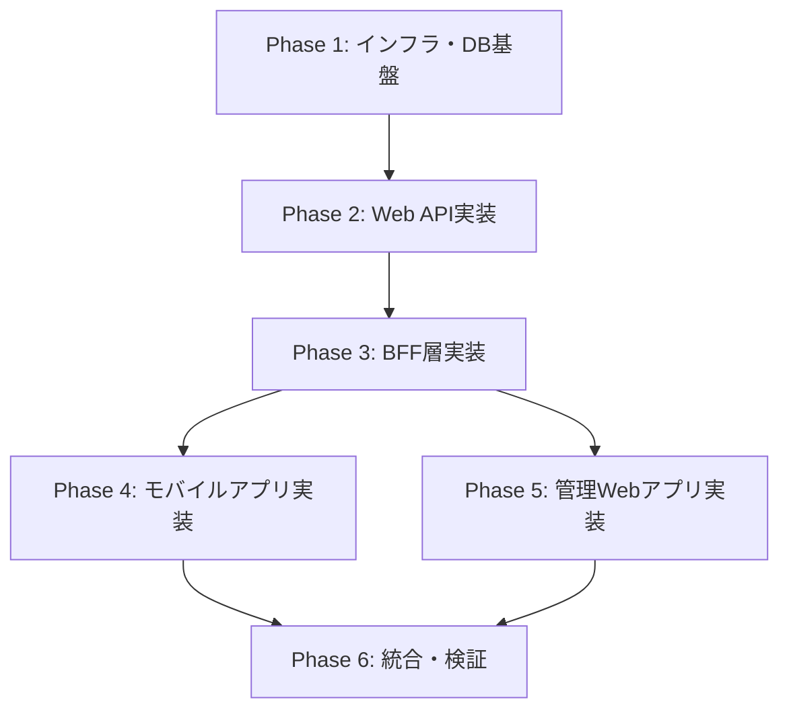

# mobile-app-system 開発計画

> 最終更新: 2025-01-08  
> ステータス: Draft  
> バージョン: 1.0

## 変更履歴

| バージョン | 日付 | 変更内容 | 著者 |
|-----------|------|---------|------|
| 1.0 | 2025-01-08 | 初版作成 | AI Agent |

---

## 1. 概要

本ドキュメントは、mobile-app-system の開発計画と全タスクの構造を定義します。
各タスクは**ビルド可能な単位**で構成され、依存関係に基づいた実行順序で段階的に実装します。

### 1.1 開発方針

- **段階的な実装**: データベース → Web API → BFF → クライアントの順で構築
- **ビルド検証**: 各タスク完了後にビルド・起動確認を実施
- **依存関係の最小化**: タスク間の依存を明確にし、並行開発を可能にする
- **デモ用途**: 自動テスト不要、手動テストで検証

### 1.2 システム構成

```
データ層: SQLite（ファイルベース）
    ↓
API層: Web API（Spring Boot）
    ↓
BFF層: Mobile BFF、Admin BFF（Spring Boot）
    ↓
クライアント層: iOS、Android、管理Web（Swift、Java、Vue.js）
```

---

## 2. フェーズ構成

開発を以下の6フェーズに分割します。

| フェーズ | 名称 | 期間（想定） | 成果物 |
|---------|------|-------------|--------|
| **Phase 1** | インフラ・データベース基盤 | 3日 | DB環境、初期データ |
| **Phase 2** | Web API実装 | 7日 | ビジネスロジック層 |
| **Phase 3** | BFF層実装 | 5日 | Mobile BFF、Admin BFF |
| **Phase 4** | モバイルアプリ実装 | 10日 | iOS、Android |
| **Phase 5** | 管理Webアプリ実装 | 5日 | Vue.js |
| **Phase 6** | 統合・検証 | 3日 | 全体動作確認 |
| **合計** | - | **33日** | - |

---

## 3. タスク一覧

### 3.1 Phase 1: インフラ・データベース基盤（8タスク）

| ID | タスク名 | 依存 | 規模 | 優先度 | 検証方法 |
|----|---------|------|------|--------|---------|
| task-001 | DevContainer環境構築 | - | S | High | コンテナ起動 |
| task-002 | SQLiteデータベース構築 | - | S | High | DB初期化・接続確認 |
| task-003 | データベーススキーマ作成 | task-002 | M | High | テーブル作成確認 |
| task-004 | 初期データ投入スクリプト作成 | task-003 | M | High | データ投入確認 |
| task-005 | Web APIプロジェクト雛形作成 | task-001 | S | High | ビルド成功 |
| task-006 | Mobile BFFプロジェクト雛形作成 | task-001 | S | High | ビルド成功 |
| task-007 | Admin BFFプロジェクト雛形作成 | task-001 | S | High | ビルド成功 |
| task-008 | DB接続確認（Web API） | task-005, task-004 | S | High | DB接続成功 |

**フェーズゴール**: 
- SQLiteデータベースが作成され、テーブル・初期データが投入されている
- Web API、2つのBFFプロジェクトがビルド可能

---

### 3.2 Phase 2: Web API実装（19タスク）

| ID | タスク名 | 依存 | 規模 | 優先度 | 検証方法 |
|----|---------|------|------|--------|---------|
| task-009 | JPA Entityクラス実装 | task-008 | M | High | ビルド成功 |
| task-010 | Repositoryインターフェース実装 | task-009 | S | High | ビルド成功 |
| task-011 | JWT認証基盤実装 | task-005 | M | High | トークン生成確認 |
| task-012 | Spring Security設定 | task-011 | M | High | 認証保護動作確認 |
| task-013 | 認証API実装（ログイン） | task-012 | M | High | ログインAPI動作 |
| task-014 | 商品取得API実装 | task-010, task-012 | M | High | GET /api/products |
| task-015 | 商品詳細取得API実装 | task-014 | S | High | GET /api/products/{id} |
| task-016 | 商品検索API実装 | task-014 | M | High | GET /api/products?search= |
| task-017 | 商品更新API実装（管理者） | task-014 | M | High | PUT /api/products/{id} |
| task-018 | 購入API実装 | task-010, task-012 | M | High | POST /api/purchases |
| task-019 | 購入記録保存処理 | task-018 | M | High | DBに購入データ保存 |
| task-020 | お気に入り取得API実装 | task-010, task-012 | M | Medium | GET /api/favorites |
| task-021 | お気に入り登録API実装 | task-020 | S | Medium | POST /api/favorites |
| task-022 | お気に入り解除API実装 | task-020 | S | Medium | DELETE /api/favorites/{id} |
| task-023 | 機能フラグマスタ取得API実装 | task-010, task-012 | M | High | GET /api/admin/feature-flags |
| task-024 | ユーザー別機能フラグ取得API実装 | task-023 | M | High | GET /api/admin/users/{id}/feature-flags |
| task-025 | ユーザー別機能フラグ更新API実装 | task-024 | M | High | PUT /api/admin/users/{id}/feature-flags |
| task-026 | 例外ハンドリング実装 | task-013 | M | High | エラーレスポンス統一 |
| task-027 | ログ設定 | task-005 | S | Medium | ログ出力確認 |

**フェーズゴール**: 
- 全Web APIエンドポイントが実装され、単独で動作確認可能
- 認証・認可が正しく動作
- Postman等で全APIをテスト可能

---

### 3.3 Phase 3: BFF層実装（12タスク）

| ID | タスク名 | 依存 | 規模 | 優先度 | 検証方法 |
|----|---------|------|------|--------|---------|
| task-028 | Mobile BFF: WebAPIクライアント実装 | task-006, task-013 | M | High | Web API呼び出し成功 |
| task-029 | Mobile BFF: 認証エンドポイント実装 | task-028 | M | High | POST /api/mobile/auth/login |
| task-030 | Mobile BFF: 商品一覧エンドポイント実装 | task-028 | M | High | GET /api/mobile/products |
| task-031 | Mobile BFF: 商品詳細エンドポイント実装 | task-030 | S | High | GET /api/mobile/products/{id} |
| task-032 | Mobile BFF: 商品検索エンドポイント実装 | task-030 | M | High | GET /api/mobile/products?search= |
| task-033 | Mobile BFF: 購入エンドポイント実装 | task-028 | M | High | POST /api/mobile/purchases |
| task-034 | Mobile BFF: お気に入りエンドポイント実装 | task-028 | M | Medium | CRUD /api/mobile/favorites |
| task-035 | Admin BFF: WebAPIクライアント実装 | task-007, task-013 | M | High | Web API呼び出し成功 |
| task-036 | Admin BFF: 認証エンドポイント実装 | task-035 | M | High | POST /api/admin/auth/login |
| task-037 | Admin BFF: 商品管理エンドポイント実装 | task-035 | M | High | GET/PUT /api/admin/products |
| task-038 | Admin BFF: ユーザー一覧エンドポイント実装 | task-035 | M | High | GET /api/admin/users |
| task-039 | Admin BFF: 機能フラグ管理エンドポイント実装 | task-035 | M | High | GET/PUT /api/admin/users/{id}/feature-flags |

**フェーズゴール**: 
- Mobile BFF、Admin BFFが独立起動可能
- 各BFFからWeb APIへの連携が正常動作
- Postman等で全BFFエンドポイントをテスト可能

---

### 3.4 Phase 4: モバイルアプリ実装（18タスク）

| ID | タスク名 | 依存 | 規模 | 優先度 | 検証方法 |
|----|---------|------|------|--------|---------|
| task-040 | iOSプロジェクト作成 | - | S | High | Xcodeビルド成功 |
| task-041 | iOS: APIクライアント実装 | task-040, task-029 | M | High | Mobile BFF接続成功 |
| task-042 | iOS: Keychainマネージャー実装 | task-040 | M | High | トークン保存確認 |
| task-043 | iOS: ログイン画面実装 | task-041, task-042 | M | High | ログイン動作確認 |
| task-044 | iOS: 商品一覧画面実装 | task-041 | M | High | 商品一覧表示 |
| task-045 | iOS: 商品検索機能実装 | task-044 | M | High | 検索動作確認 |
| task-046 | iOS: 商品詳細画面実装 | task-044 | M | High | 商品詳細表示 |
| task-047 | iOS: 商品購入機能実装 | task-046 | M | High | 購入処理動作確認 |
| task-048 | iOS: お気に入り機能実装 | task-046 | M | Medium | お気に入り登録・解除 |
| task-049 | Androidプロジェクト作成 | - | S | High | Gradle ビルド成功 |
| task-050 | Android: APIクライアント実装 | task-049, task-029 | M | High | Mobile BFF接続成功 |
| task-051 | Android: SecureStorageマネージャー実装 | task-049 | M | High | トークン保存確認 |
| task-052 | Android: ログイン画面実装 | task-050, task-051 | M | High | ログイン動作確認 |
| task-053 | Android: 商品一覧画面実装 | task-050 | M | High | 商品一覧表示 |
| task-054 | Android: 商品検索機能実装 | task-053 | M | High | 検索動作確認 |
| task-055 | Android: 商品詳細画面実装 | task-053 | M | High | 商品詳細表示 |
| task-056 | Android: 商品購入機能実装 | task-055 | M | High | 購入処理動作確認 |
| task-057 | Android: お気に入り機能実装 | task-055 | M | Medium | お気に入り登録・解除 |

**フェーズゴール**: 
- iOSアプリ、Androidアプリが実機またはシミュレータで動作
- 全機能（ログイン、商品閲覧、購入、お気に入り）が動作
- 機能フラグによるお気に入り表示制御が動作

---

### 3.5 Phase 5: 管理Webアプリ実装（12タスク）

| ID | タスク名 | 依存 | 規模 | 優先度 | 検証方法 |
|----|---------|------|------|--------|---------|
| task-058 | Vue.jsプロジェクト作成 | - | S | High | npm run dev成功 |
| task-059 | Vue: APIクライアント実装 | task-058, task-036 | M | High | Admin BFF接続成功 |
| task-060 | Vue: 認証ストア実装（Pinia） | task-059 | M | High | トークン管理確認 |
| task-061 | Vue: ルーター設定 | task-058 | S | High | ルーティング動作 |
| task-062 | Vue: ログイン画面実装 | task-059, task-060 | M | High | ログイン動作確認 |
| task-063 | Vue: 商品一覧画面実装 | task-059 | M | High | 商品一覧表示 |
| task-064 | Vue: 商品編集画面実装 | task-063 | M | High | 商品更新動作確認 |
| task-065 | Vue: ユーザー一覧画面実装 | task-059 | M | High | ユーザー一覧表示 |
| task-066 | Vue: 機能フラグ管理画面実装 | task-065 | M | High | フラグ更新動作確認 |
| task-067 | Vue: 共通コンポーネント実装 | task-058 | M | Medium | Header、Loading等 |
| task-068 | Vue: エラーハンドリング実装 | task-059 | M | High | エラー表示確認 |
| task-069 | Vue: UI整形 | task-062 | M | Medium | UI/UX確認 |

**フェーズゴール**: 
- 管理Webアプリが http://localhost:3000 で起動
- 全機能（ログイン、商品管理、機能フラグ管理）が動作
- 商品情報変更がモバイルアプリに反映されることを確認

---

### 3.6 Phase 6: 統合・検証（6タスク）

| ID | タスク名 | 依存 | 規模 | 優先度 | 検証方法 |
|----|---------|------|------|--------|---------|
| task-070 | 全コンポーネント統合テスト | すべて | L | High | 全体動作確認 |
| task-071 | 機能フラグシナリオテスト | task-070 | M | High | フラグON/OFF切替確認 |
| task-072 | 購入フローエンドツーエンドテスト | task-070 | M | High | 購入完了まで確認 |
| task-073 | ログイン・認証シナリオテスト | task-070 | M | High | 認証フロー確認 |
| task-074 | エラーシナリオテスト | task-070 | M | Medium | 各種エラー処理確認 |
| task-075 | デモ環境セットアップ手順書作成 | task-070 | M | High | 手順書作成 |

**フェーズゴール**: 
- 全システムが連携し、エンドツーエンドで動作
- 主要なシナリオが正常動作することを確認
- デモ実施可能な状態

---

## 4. 実行順序

### 4.1 依存関係グラフ



### 4.2 並行実行可能なタスク

以下のタスクグループは並行実行可能です。

**Phase 2内の並行実行**:
- task-014, task-018, task-020（商品・購入・お気に入りAPI）は一部並行可
- task-023, task-024, task-025（機能フラグAPI）は独立して実装可

**Phase 3内の並行実行**:
- Mobile BFF（task-028～034）とAdmin BFF（task-035～039）は並行実装可

**Phase 4/5の並行実行**:
- iOS（task-040～048）、Android（task-049～057）、Vue.js（task-058～069）は並行実装可

---

## 5. マイルストーン

| マイルストーン | 完了タスク | 成果物 | 確認方法 |
|-------------|-----------|--------|---------|
| **M1: インフラ完了** | task-001～008 | DB起動、プロジェクト雛形 | DB接続確認 |
| **M2: Web API完了** | task-009～027 | 全Web API | Postmanテスト |
| **M3: BFF完了** | task-028～039 | Mobile/Admin BFF | Postmanテスト |
| **M4: iOS完了** | task-040～048 | iOSアプリ | 実機動作確認 |
| **M5: Android完了** | task-049～057 | Androidアプリ | 実機動作確認 |
| **M6: 管理Web完了** | task-058～069 | 管理Webアプリ | ブラウザ動作確認 |
| **M7: デモ準備完了** | task-070～075 | 全システム統合 | デモシナリオ実施 |

---

## 6. リスク管理

### 6.1 技術的リスク

| リスク | 影響度 | 対策 | 担当タスク |
|-------|--------|------|----------|
| JWT認証実装の複雑性 | 中 | 標準ライブラリ使用、ADR参照 | task-011, task-012 |
| モバイル環境差異 | 中 | iOS/Android別タスク化 | Phase 4 |
| BFF-Web API間の連携 | 中 | 早期に基盤実装（WebAPIClient） | task-028, task-035 |
| 機能フラグ実装の複雑性 | 低 | シンプルな実装（お気に入りのみ） | task-023～025 |

### 6.2 スケジュールリスク

| リスク | 影響度 | 対策 |
|-------|--------|------|
| Phase 2の遅延 | 高 | タスク細分化、並行実行 |
| モバイル実装の遅延 | 中 | iOS/Androidを並行実装 |
| 統合時の不具合 | 中 | 各フェーズで単独動作確認徹底 |

---

## 7. 品質保証

### 7.1 各タスクの完了条件

すべてのタスクは以下の条件を満たすこと：

- [ ] **ビルド成功**: コンパイルエラーがない
- [ ] **起動確認**: アプリケーションが起動する
- [ ] **基本動作確認**: 実装した機能が動作する
- [ ] **受け入れ条件達成**: タスク詳細の受け入れ条件をすべて満たす

### 7.2 フェーズ完了条件

| フェーズ | 完了条件 |
|---------|---------|
| Phase 1 | DB起動、全プロジェクトビルド成功 |
| Phase 2 | 全Web APIがPostmanで動作確認完了 |
| Phase 3 | 全BFFがPostmanで動作確認完了 |
| Phase 4 | iOS/Androidが実機で全機能動作 |
| Phase 5 | 管理Webが全機能動作 |
| Phase 6 | エンドツーエンドシナリオテスト完了 |

---

## 8. 補足情報

### 8.1 開発環境

| コンポーネント | 環境 |
|--------------|------|
| データベース | SQLite（ファイルベース） |
| Web API / BFF | Spring Boot（DevContainer） |
| 管理Web | Vue.js（DevContainer） |
| iOS | Xcode（ローカル） |
| Android | Android Studio（ローカル） |

### 8.2 ドキュメント参照

| ドキュメント | パス |
|------------|------|
| 機能仕様書 | `/docs/specs/mobile-app-system/` |
| アーキテクチャ | `/docs/architecture/` |
| タスク詳細 | `/docs/specs/mobile-app-system/task-details/` |
| タスクリスト（JSON） | `/docs/specs/mobile-app-system/task-list.json` |

---

## 9. タスク規模の定義

| 規模 | 説明 | 目安時間 | 例 |
|-----|------|---------|---|
| **S** | 単純な設定やファイル作成 | 0.5～2時間 | 雛形作成、設定ファイル |
| **M** | 標準的な機能実装 | 2～6時間 | API実装、画面実装 |
| **L** | 複雑な機能や統合作業 | 6時間以上 | 統合テスト |

---

## 10. 次のステップ

1. 本ドキュメントをレビュー
2. `task-list.json` を確認
3. `task-details/task-001.md` から順次実装開始
4. 各タスク完了時に progress.json を更新

---

**End of Document**
