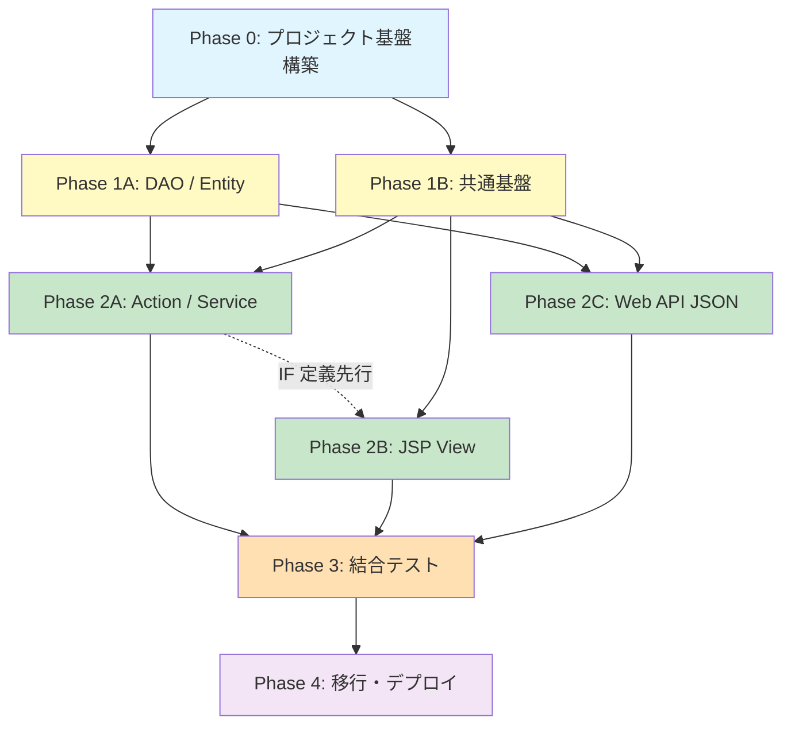

# 開発計画

## 1. フェーズ構成

全体を 5 フェーズに分割する。Phase 1A / 1B および Phase 2A / 2B / 2C は並行実装可能。

```
Phase 0: プロジェクト基盤構築
    │
    ├── Phase 1A: DAO 層・Entity 構築
    │
    └── Phase 1B: 共通基盤（認証・インターセプタ・例外処理）
         │
         ├── Phase 2A: 管理画面 — Action / Service 層
         │
         ├── Phase 2B: 管理画面 — JSP View 層
         │
         └── Phase 2C: Struts2 Web API（JSON）
              │
              Phase 3: 結合テスト・既存システムとの整合確認
              │
              Phase 4: 移行・デプロイ・admin-web / admin-bff 廃止
```

---

## 2. Phase 0 — プロジェクト基盤構築

**並行作業**: 不可（後続すべてのフェーズの前提）

| # | タスク | 詳細 | 成果物 |
|---|---|---|---|
| 0-1 | Maven プロジェクト作成 | WAR パッケージの Struts2 プロジェクトを `src/admin-struts/` に作成 | pom.xml, ディレクトリ構造 |
| 0-2 | JDK 1.7 ビルド環境構築 | JDK 1.7 のインストール、Maven の source/target を 1.7 に設定 | JDK 設定、ビルド確認 |
| 0-3 | 依存関係設定 | Struts2 2.3.37、SQLite JDBC、Jackson 2.4.x 等の依存関係を pom.xml に追加 | pom.xml 完成 |
| 0-4 | Struts2 基本設定 | struts.xml, web.xml の作成。Struts2 フィルタの設定 | struts.xml, web.xml |
| 0-5 | DB 接続設定 | DatabaseUtil の作成。SQLite コネクション取得・解放のユーティリティ | DatabaseUtil.java |
| 0-6 | Tomcat 7 動作確認 | WAR をデプロイして "Hello World" レベルの動作確認 | デプロイ手順書 |
| 0-7 | ログ設定 | SLF4J + Log4j の設定 | log4j.properties |
| 0-8 | DevContainer 構成変更 | JDK 7 の追加インストール、Tomcat 7 のインストール、ポートフォワード追加、VS Code 拡張の更新（詳細は「13. DevContainer 構成変更」を参照） | devcontainer.json, Dockerfile, docker-compose.yml 更新 |

**完了条件**: `mvn clean package` が成功し、DevContainer 内の Tomcat 7 上で空の Struts2 アプリが起動すること。

---

## 3. Phase 1A — DAO 層・Entity 構築

**並行作業**: Phase 1B と並行可能

| # | タスク | 詳細 | 成果物 |
|---|---|---|---|
| 1A-1 | Entity クラス作成 | User, Product, Purchase, Favorite, FeatureFlag, UserFeatureFlag, ProductPriceHistory の 7 クラス | entity/*.java |
| 1A-2 | BaseDao 作成 | コネクション管理、例外ラッピング、共通クエリ実行メソッド | BaseDao.java |
| 1A-3 | UserDao 作成 | findByLoginId, findById, findAll, countAll | UserDao.java |
| 1A-4 | ProductDao 作成 | findAll (ページネーション), findById, searchByKeyword, update, countAll | ProductDao.java |
| 1A-5 | PurchaseDao 作成 | create, findByUserId (ページネーション) | PurchaseDao.java |
| 1A-6 | FavoriteDao 作成 | findByUserId, create, deleteByUserIdAndProductId | FavoriteDao.java |
| 1A-7 | FeatureFlagDao 作成 | findAll, findByFlagKey | FeatureFlagDao.java |
| 1A-8 | UserFeatureFlagDao 作成 | findByUserId, findByUserIdAndFlagId, upsert | UserFeatureFlagDao.java |
| 1A-9 | ProductPriceHistoryDao 作成 | create, findByProductId | ProductPriceHistoryDao.java |
| 1A-10 | DAO 単体テスト | 各 DAO の CRUD 操作をテスト用 SQLite DB で検証 | dao/*Test.java |

**完了条件**: 全 DAO の JUnit テストがグリーンであること。

---

## 4. Phase 1B — 共通基盤

**並行作業**: Phase 1A と並行可能

| # | タスク | 詳細 | 成果物 |
|---|---|---|---|
| 1B-1 | PasswordUtil 作成 | jBCrypt を使用したパスワードハッシュ / 検証 | PasswordUtil.java |
| 1B-2 | JwtUtil 作成 | JJWT 0.6.0 を使った JWT 生成・検証（HS256） | JwtUtil.java |
| 1B-3 | AuthInterceptor 作成 | セッションベースのログインチェック（管理画面用） | AuthInterceptor.java |
| 1B-4 | JwtInterceptor 作成 | Bearer トークン検証（Web API 用） | JwtInterceptor.java |
| 1B-5 | CorsFilter 作成 | Web API 向け CORS ヘッダ設定 | CorsFilter.java |
| 1B-6 | 例外ハンドリング | 共通エラーページ（JSP）、API エラーレスポンス形式の統一 | error.jsp, ExceptionHandler |
| 1B-7 | Struts2 インターセプタスタック定義 | 管理画面用・API 用の 2 種類のインターセプタスタックを struts.xml に定義 | struts.xml 更新 |
| 1B-8 | 共通基盤テスト | PasswordUtil, JwtUtil の単体テスト | *Test.java |

**完了条件**: インターセプタが正しく動作し、認証/非認証のリクエストが適切にハンドリングされること。

---

## 5. Phase 2A — 管理画面 Action / Service 層

**並行作業**: Phase 2B, 2C と並行可能（Phase 1A, 1B 完了後）

| # | タスク | 詳細 | 成果物 |
|---|---|---|---|
| 2A-1 | AuthService 作成 | ログイン認証（loginId + password → セッション格納） | AuthService.java |
| 2A-2 | LoginAction / LogoutAction 作成 | ログイン・ログアウト処理。セッション管理 | LoginAction.java, LogoutAction.java |
| 2A-3 | ProductService 作成 | 商品一覧取得、商品詳細取得、商品更新（価格履歴記録含む） | ProductService.java |
| 2A-4 | ProductListAction 作成 | 商品一覧表示 + ページネーション | ProductListAction.java |
| 2A-5 | ProductDetailAction 作成 | 商品詳細表示（編集フォーム表示用） | ProductDetailAction.java |
| 2A-6 | ProductUpdateAction 作成 | 商品更新処理 + バリデーション | ProductUpdateAction.java |
| 2A-7 | UserService 作成 | ユーザー一覧取得 | UserService.java |
| 2A-8 | UserListAction 作成 | ユーザー一覧表示 + ページネーション | UserListAction.java |
| 2A-9 | FeatureFlagService 作成 | ユーザー別フラグ取得・更新 | FeatureFlagService.java |
| 2A-10 | FeatureFlagAction 作成 | フラグ一覧表示 + トグル更新 | FeatureFlagAction.java |
| 2A-11 | struts-admin.xml 作成 | 管理画面 Action マッピング定義 | struts-admin.xml |
| 2A-12 | Action / Service 単体テスト | 各 Action の入出力、Service のロジックを検証 | *Test.java |

**完了条件**: 全 Action が JSP なしで（結果コードの検証レベルで）正常動作すること。

---

## 6. Phase 2B — 管理画面 JSP View 層

**並行作業**: Phase 2A, 2C と並行可能（Action のインターフェース設計完了後）

| # | タスク | 詳細 | 成果物 |
|---|---|---|---|
| 2B-1 | 共通レイアウト作成 | ヘッダ・フッタ・ナビゲーションの共通 JSP | header.jsp, footer.jsp, layout.jsp |
| 2B-2 | CSS スタイルシート作成 | 現行 admin-web のデザインを可能な範囲で再現 | style.css |
| 2B-3 | login.jsp 作成 | ログインフォーム（バリデーションエラー表示付き） | login.jsp |
| 2B-4 | dashboard.jsp 作成 | メニューカード（商品管理・フラグ管理・ユーザー管理） | dashboard.jsp |
| 2B-5 | product/list.jsp 作成 | 商品一覧テーブル + ページネーション | product/list.jsp |
| 2B-6 | product/edit.jsp 作成 | 商品編集フォーム + バリデーションエラー表示 + 成功通知 | product/edit.jsp |
| 2B-7 | user/list.jsp 作成 | ユーザー一覧テーブル + ページネーション | user/list.jsp |
| 2B-8 | featureflag/list.jsp 作成 | フラグトグルUI + 通知表示 | featureflag/list.jsp |
| 2B-9 | error.jsp 作成 | 共通エラーページ（404, 500, 認証エラー） | error.jsp |
| 2B-10 | common.js 作成 | フォームバリデーション、確認ダイアログ等の共通 JavaScript | common.js |
| 2B-11 | View 表示確認 | Tomcat 上でブラウザから全画面遷移を確認 | テスト結果 |

**完了条件**: 全画面がブラウザで正常に表示され、フォーム送信・画面遷移が動作すること。

---

## 7. Phase 2C — Struts2 Web API（JSON）

**並行作業**: Phase 2A, 2B と並行可能（Phase 1A, 1B 完了後）

| # | タスク | 詳細 | 成果物 |
|---|---|---|---|
| 2C-1 | API 認証（Auth） | ログイン・ログアウト・トークンリフレッシュ・パスワード変更 API | ApiAuthAction.java |
| 2C-2 | API 商品（Product） | 一覧・検索・詳細・更新・価格履歴 API | ApiProductAction.java |
| 2C-3 | API 購入（Purchase） | 購入作成・購入履歴 API | ApiPurchaseAction.java |
| 2C-4 | API お気に入り（Favorite） | 一覧・追加・削除 API（フィーチャーフラグ連携） | ApiFavoriteAction.java |
| 2C-5 | API フィーチャーフラグ | ユーザーフラグ取得・管理者向けフラグ更新 API | ApiFeatureFlagAction.java |
| 2C-6 | API ヘルスチェック | /api/v1/health エンドポイント | ApiHealthAction.java |
| 2C-7 | struts-api.xml 作成 | Web API Action マッピング + JSON result type 定義 | struts-api.xml |
| 2C-8 | API レスポンス形式統一 | ApiResponse ラッパー、エラーレスポンスの統一 | ApiResponse.java |
| 2C-9 | API 単体テスト | 各 API Action の入出力を JUnit で検証 | *Test.java |
| 2C-10 | API 互換性テスト | 既存 web-api のレスポンスと Struts2 API のレスポンスを比較検証 | テスト結果 |

**完了条件**: 全 API エンドポイントが既存 web-api と同等の JSON レスポンスを返すこと。

---

## 8. Phase 3 — 結合テスト・整合確認

**並行作業**: 不可（Phase 2 すべて完了後）

| # | タスク | 詳細 | 成果物 |
|---|---|---|---|
| 3-1 | 管理画面 E2E テスト | ログイン → 各画面操作 → ログアウトの一連のフロー | テストシナリオ・結果 |
| 3-2 | Struts2 API 互換テスト | Mobile BFF から Struts2 API への接続テスト（ポート変更時） | テスト結果 |
| 3-3 | SQLite 同時アクセステスト | Struts2 アプリ + 既存 web-api の同時 DB アクセスでロック/データ整合性確認 | テスト結果 |
| 3-4 | セキュリティテスト | OGNL インジェクション対策、CSRF 対策、セッション管理の検証 | テスト結果 |
| 3-5 | パフォーマンステスト | ページネーション、同時リクエスト時のレスポンス確認 | テスト結果 |
| 3-6 | 不具合修正 | テストで検出された問題の修正 | 修正パッチ |

**完了条件**: 全テストシナリオがパスし、重大な不具合がないこと。

---

## 9. Phase 4 — 移行・デプロイ

| # | タスク | 詳細 | 成果物 |
|---|---|---|---|
| 4-1 | デプロイ手順書作成 | Tomcat 7 への WAR デプロイ手順、環境変数設定 | デプロイ手順書 |
| 4-2 | 起動スクリプト更新 | `scripts/start-all-services.sh` に Struts2 アプリの起動を追加 | スクリプト更新 |
| 4-3 | docker-compose.yml 更新 | Struts2 アプリコンテナの追加（必要に応じて） | docker-compose.yml 更新 |
| 4-4 | admin-web 廃止 | `src/admin-web/` の無効化（リポジトリには保持、起動対象から除外） | 起動スクリプト更新 |
| 4-5 | admin-bff 廃止 | `src/admin-bff/` の無効化 | 起動スクリプト更新 |
| 4-6 | copilot-instructions.md 更新 | プロジェクト概要のアーキテクチャ図を更新 | ドキュメント更新 |
| 4-7 | README.md 更新 | 新しいアーキテクチャの反映 | README.md |
| 4-8 | DevContainer 最終整理 | Admin Web（Node/npm）・Admin BFF 関連の設定除去。ポートラベル更新。postCreateCommand から不要な Admin Web 初期化を削除 | devcontainer.json 更新 |

---

## 10. タスクサマリー

| フェーズ | タスク数 | 並行可否 | 主な担当スキル |
|---|---|---|---|
| Phase 0: 基盤構築 | 8 | — | インフラ / ビルド |
| Phase 1A: DAO / Entity | 10 | ↔ Phase 1B | バックエンド |
| Phase 1B: 共通基盤 | 8 | ↔ Phase 1A | バックエンド |
| Phase 2A: Action / Service | 12 | ↔ Phase 2B, 2C | バックエンド |
| Phase 2B: JSP View | 11 | ↔ Phase 2A, 2C | フロントエンド |
| Phase 2C: Web API | 10 | ↔ Phase 2A, 2B | バックエンド |
| Phase 3: 結合テスト | 6 | — | QA / テスト |
| Phase 4: 移行・デプロイ | 8 | — | インフラ / 全員 |
| **合計** | **73** | | |

---

## 11. 依存関係フローチャート



## 13. DevContainer 構成変更

### 13.1 現行構成

現行の `.devcontainer/` は以下の構成で動作している：

| 項目 | 現行設定 |
|---|---|
| ベースイメージ | `mcr.microsoft.com/devcontainers/base:ubuntu-22.04` |
| Java | JDK 17（SDKMAN 経由、`ghcr.io/devcontainers/features/java:1`） |
| Node.js | 20.19（`ghcr.io/devcontainers/features/node:1`） |
| .NET | 10.0（`ghcr.io/devcontainers/features/dotnet:2`） |
| ビルドツール | Maven, Gradle（Java feature に付属） |
| DB ツール | sqlite3（Dockerfile で apt install） |
| フォワードポート | 8080 (Web API), 8081 (Mobile BFF), 8082 (Admin BFF), 5173 (Admin Web) |
| VS Code 拡張 | Java Pack, Spring Boot Dashboard, Spring Boot, ESLint, Prettier, Docker, Volar |
| postCreateCommand | SQLite DB 初期化（スキーマ + シードデータ） |

### 13.2 変更内容（Phase 0 — タスク 0-8）

#### 13.2.1 Dockerfile への追記

JDK 7 と Tomcat 7 を追加インストールする。既存の JDK 17 はそのまま維持する（Web API / Mobile BFF で引き続き使用）。

```dockerfile
# === 追加: JDK 7 (OpenJDK / Azul Zulu 7) ===
RUN apt-get update && export DEBIAN_FRONTEND=noninteractive \
    && apt-get -y install --no-install-recommends \
    openjdk-7-jdk \
    && apt-get clean \
    && rm -rf /var/lib/apt/lists/*
# ※ Ubuntu 22.04 のリポジトリに openjdk-7 がない場合は
#   Azul Zulu 7 APT リポジトリ追加、または手動ダウンロードで対応

# === 追加: Apache Tomcat 7 ===
ENV CATALINA_HOME=/opt/tomcat7
RUN mkdir -p ${CATALINA_HOME} \
    && curl -fsSL https://archive.apache.org/dist/tomcat/tomcat-7/v7.0.109/bin/apache-tomcat-7.0.109.tar.gz \
    | tar xz --strip-components=1 -C ${CATALINA_HOME} \
    && chmod +x ${CATALINA_HOME}/bin/*.sh
```

> **注意**: Ubuntu 22.04 の公式リポジトリには OpenJDK 7 が含まれない場合がある。その場合は Azul Zulu 7 の APT リポジトリを追加するか、SDKMAN で `sdk install java 7.0.352-zulu` 等を使用する。

#### 13.2.2 devcontainer.json の変更

```jsonc
{
  // --- 変更点 ---

  // (1) Java ランタイム設定に JDK 7 を追加
  "customizations": {
    "vscode": {
      "settings": {
        "java.configuration.runtimes": [
          {
            "name": "JavaSE-17",
            "path": "/usr/local/sdkman/candidates/java/current",
            "default": true
          },
          {
            "name": "JavaSE-1.7",
            "path": "/usr/lib/jvm/java-7-openjdk-amd64"
          }
        ]
      },
      // (2) VS Code 拡張の追加
      "extensions": [
        // ... 既存の拡張 ...
        "alexkrechik.cucumberautocomplete"  // JSP/XML サポート等、必要に応じて追加
      ]
    }
  },

  // (3) ポートフォワードの更新
  "forwardPorts": [8080, 8081, 8082, 5173, 8083],
  "portsAttributes": {
    // ... 既存 ...
    "8082": {
      "label": "Admin BFF / Struts2 Admin",  // ラベル変更
      "onAutoForward": "notify"
    },
    "8083": {
      "label": "Struts2 Admin (移行期間用)",   // 並行稼働用の予備ポート
      "onAutoForward": "notify"
    }
  },

  // (4) postCreateCommand の拡張
  "postCreateCommand": "mkdir -p /workspace/src/web-api/data && if [ ! -f /workspace/src/web-api/data/mobile_app.db ]; then sqlite3 /workspace/src/web-api/data/mobile_app.db < /workspace/src/database/schema/01_create_tables.sql && sqlite3 /workspace/src/web-api/data/mobile_app.db < /workspace/src/database/seeds/02_seed_data.sql && echo 'SQLite database initialized'; else echo 'SQLite database already exists'; fi && echo 'Setting up Tomcat 7...' && cp /opt/tomcat7/conf/server.xml /opt/tomcat7/conf/server.xml.bak && echo 'Dev Container is ready!'"
}
```

#### 13.2.3 docker-compose.yml の変更

```yaml
services:
  app:
    # ... 既存設定 ...
    ports:
      - "8080:8080"
      - "8081:8081"
      - "8082:8082"
      - "8083:8083"   # 追加: 移行期間の並行稼働用
      - "5173:5173"
    environment:
      - CATALINA_HOME=/opt/tomcat7            # 追加
      - JAVA7_HOME=/usr/lib/jvm/java-7-openjdk-amd64  # 追加
```

### 13.3 JDK 切替方式

同一 DevContainer 内で JDK 17（既存サービス）と JDK 7（Struts2 アプリ）を共存させる。

| コンポーネント | JDK | 切替方法 |
|---|---|---|
| Web API (Spring Boot) | 17 | デフォルト（SDKMAN の current） |
| Mobile BFF (Spring Boot) | 17 | デフォルト |
| Struts2 アプリ (Tomcat 7) | 7 | Tomcat の `setenv.sh` で `JAVA_HOME=$JAVA7_HOME` を指定 |
| Maven ビルド（Struts2 用） | 7 or 17 | `pom.xml` の `source/target=1.7` でクロスコンパイル。厳密には `JAVA_HOME` を切替 |

**Tomcat 7 の setenv.sh（新規作成）**:
```bash
#!/bin/bash
export JAVA_HOME="${JAVA7_HOME:-/usr/lib/jvm/java-7-openjdk-amd64}"
export CATALINA_PID="${CATALINA_HOME}/temp/catalina.pid"
```

### 13.4 変更内容（Phase 4 — タスク 4-8）

移行完了後、不要になった設定を整理する。

| 変更対象 | 内容 |
|---|---|
| `forwardPorts` | ポート 5173 の削除（Admin Web 廃止）、8083 の削除（並行稼働終了） |
| `portsAttributes` | 8082 のラベルを `"Struts2 Admin"` に変更。5173 / 8083 エントリの削除 |
| VS Code 拡張 | `Vue.volar` の削除（Vue 開発不要）。必要に応じて JSP/XML エディタ拡張を追加 |
| `postCreateCommand` | Tomcat 7 への WAR 自動デプロイ手順の追加（`mvn package` → `cp target/*.war $CATALINA_HOME/webapps/`） |
| Node.js feature | Admin Web 廃止後も Mobile アプリ開発ツールで使用する可能性があるため残置検討 |

---

## 12. クリティカルパス

最短経路は以下の通り：

```
Phase 0 → Phase 1A (並行 1B) → Phase 2A (並行 2B, 2C) → Phase 3 → Phase 4
```

Phase 1A と Phase 1B は並行可能なため、クリティカルパスは工数が大きい方（Phase 1A: DAO 10 タスク）となる。Phase 2 は 3 パスが並行可能だが、Phase 2A（Action/Service）が最大のため、クリティカルパスとなる。
