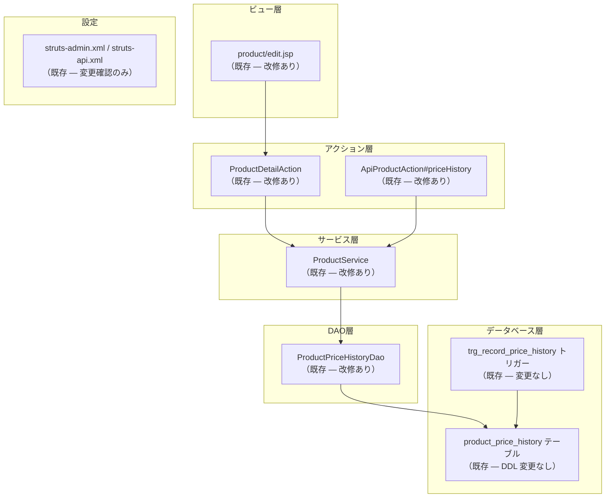

# 価格履歴機能 — 概要

## ドキュメント情報

| 項目             | 内容                                  |
| ---------------- | ------------------------------------- |
| プロジェクト名   | mobile-app-system                     |
| ドキュメント番号 | DES-PRICE-HIST-001                    |
| バージョン       | 1.0                                   |
| 作成日           | 2026年3月1日                          |
| ステータス       | Draft                                 |
| 設計書ソース     | `docs/excel/価格履歴機能_設計書.xlsx` |

## 機能概要

商品の**価格変更履歴**を記録・参照する機能を追加する。管理者が商品情報を更新し単価（`unit_price`）が変更された場合、変更前後の価格・変更日時・変更者・変更理由を `product_price_history` テーブルに自動記録する。

管理画面（admin-struts）では、商品編集画面に**価格履歴タブまたはセクション**を追加し、過去の価格変動を一覧表示できるようにする。

## 改修対象システム

`admin-struts`（Struts 2 + Spring + SQLite の管理者用 Web アプリケーション）

## 設計書構成（Excel シート）

| シート名       | 内容                                                                           |
| -------------- | ------------------------------------------------------------------------------ |
| 表紙           | ドキュメントメタ情報・承認欄・変更履歴                                         |
| テーブル定義書 | `product_price_history` テーブルの DDL・インデックス・外部キー・トリガー定義   |
| API仕様書      | 価格履歴取得 API（API-020）の仕様 — エンドポイント・パラメータ・レスポンス定義 |

## 改修範囲サマリ

## 後続ドキュメント

| ファイル                                                 | 内容                                            |
| -------------------------------------------------------- | ----------------------------------------------- |
| [01\_テーブル定義.md](01_テーブル定義.md)                | テーブル定義・DDL・トリガー・データ保持ポリシー |
| [02_API仕様.md](02_API仕様.md)                           | 価格履歴取得 API の詳細仕様                     |
| [03_admin-struts改修内容.md](03_admin-struts改修内容.md) | admin-struts の具体的な改修箇所と内容           |
