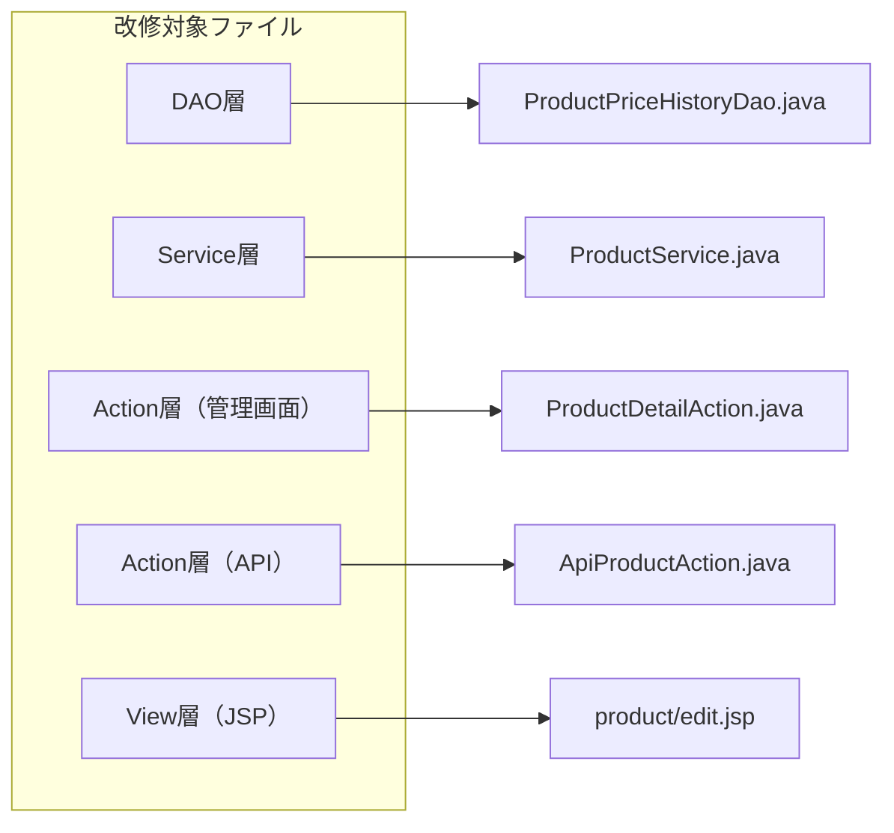

# 価格履歴機能 — admin-struts 改修内容

## 改修目的

設計書 `docs/excel/価格履歴機能_設計書.xlsx` に基づき、`admin-struts` の管理画面に価格履歴の表示機能を追加し、API にページネーション・日付フィルタ・レスポンス形式の改善を実施する。

## 改修一覧



---

## 改修 1: DAO 層 — `ProductPriceHistoryDao.java`

**ファイル**: `src/admin-struts/src/main/java/com/example/admin/dao/ProductPriceHistoryDao.java`

### 現状

- `create(ProductPriceHistory)` — 履歴レコードの登録
- `findByProductId(Long)` — 商品IDで全履歴を取得（降順）

### 改修内容

#### 1-1. ページネーション・日付範囲対応の検索メソッド追加

新しいメソッド `findByProductIdWithFilter` を追加する。

```java
/**
 * 商品IDで価格変更履歴を取得する（ページネーション・日付フィルタ対応）。
 *
 * @param productId 商品ID
 * @param startDate 検索開始日（ISO 8601形式, nullable）
 * @param endDate   検索終了日（ISO 8601形式, nullable）
 * @param offset    オフセット（0始まり）
 * @param limit     取得件数
 * @return 価格変更履歴リスト
 */
public List<ProductPriceHistory> findByProductIdWithFilter(
    Long productId, String startDate, String endDate, int offset, int limit)
    throws SQLException
```

- `startDate` / `endDate` が null の場合はフィルタリングしない
- SQL に `LIMIT ? OFFSET ?` を追加してページネーション対応
- `WHERE` 句に `changed_at >= ?` / `changed_at <= ?` の条件を動的に組み立てる

#### 1-2. 件数カウントメソッド追加

```java
/**
 * 条件に合致する価格変更履歴の件数を取得する。
 *
 * @param productId 商品ID
 * @param startDate 検索開始日（ISO 8601形式, nullable）
 * @param endDate   検索終了日（ISO 8601形式, nullable）
 * @return 件数
 */
public long countByProductIdWithFilter(Long productId, String startDate, String endDate)
    throws SQLException
```

- ページネーションの `totalItems` / `totalPages` 算出に使用

---

## 改修 2: Service 層 — `ProductService.java`

**ファイル**: `src/admin-struts/src/main/java/com/example/admin/service/ProductService.java`

### 現状

- `getPriceHistory(Long productId)` — 全履歴を返却

### 改修内容

#### 2-1. ページネーション対応の価格履歴取得メソッド追加

```java
/**
 * 商品の価格変更履歴をページネーション付きで取得する。
 *
 * @param productId 商品ID
 * @param startDate 検索開始日（nullable）
 * @param endDate   検索終了日（nullable）
 * @param page      ページ番号（1始まり）
 * @param limit     1ページあたりの件数
 * @return 価格変更履歴リスト
 */
public List<ProductPriceHistory> getPriceHistoryWithPagination(
    Long productId, String startDate, String endDate, int page, int limit)
```

#### 2-2. 件数取得メソッド追加

```java
/**
 * 条件に合致する価格変更履歴の件数を取得する。
 *
 * @param productId 商品ID
 * @param startDate 検索開始日（nullable）
 * @param endDate   検索終了日（nullable）
 * @return 件数
 */
public long getPriceHistoryCount(Long productId, String startDate, String endDate)
```

> **注**: 既存の `getPriceHistory(Long productId)` は管理画面（JSP）からの単純な呼び出しで引き続き使用可能。削除や変更は不要。

---

## 改修 3: Action 層（管理画面） — `ProductDetailAction.java`

**ファイル**: `src/admin-struts/src/main/java/com/example/admin/action/product/ProductDetailAction.java`

### 現状

- 商品IDを受け取り、`Product` エンティティを取得して編集フォームに表示
- 価格履歴の取得は行っていない

### 改修内容

#### 3-1. 価格履歴リストの取得・JSP への受け渡し

`execute()` メソッド内で、商品情報の取得後に価格変更履歴も取得し、JSP に渡す。

**追加フィールド**:

```java
/** 価格変更履歴一覧 */
private List<ProductPriceHistory> priceHistories;

public List<ProductPriceHistory> getPriceHistories() {
    return priceHistories;
}
```

**`execute()` メソッドへの追加**:

```java
// 既存: product = productService.getProductById(productId);
// 以降に追加
priceHistories = productService.getPriceHistory(productId);
```

> 管理画面の商品編集ページでは全件表示（ページネーションなし）とする。API のようなページネーション・日付フィルタは管理画面では不要。

---

## 改修 4: Action 層（API） — `ApiProductAction.java`

**ファイル**: `src/admin-struts/src/main/java/com/example/admin/api/product/ApiProductAction.java`

### 現状

`priceHistory()` メソッドが存在するが、以下の課題がある:

- ページネーション未対応（全件返却）
- 日付フィルタ未対応
- `changedBy` が ID のみ（設計書ではオブジェクト形式）

### 改修内容

#### 4-1. クエリパラメータの受け入れ

以下の入力パラメータフィールドと setter/getter を追加:

```java
private String startDate;
private String endDate;
private Integer page;
private Integer limit;
```

#### 4-2. `priceHistory()` メソッドの改修

1. **パラメータバリデーション**:
   - `productId` の必須チェック（既存）
   - 商品存在チェック（既存）
   - `startDate` / `endDate` の ISO 8601 形式チェック（不正な場合は `VAL_001` エラー）
   - `page` のデフォルト値 `1`、`limit` のデフォルト値 `20`（最大 `100`）
2. **ページネーション付き履歴取得**:
   - `productService.getPriceHistoryWithPagination()` を呼び出し
   - `productService.getPriceHistoryCount()` で件数取得
3. **レスポンス形式の変更**:
   - `changedBy` を `{ "userId": ..., "userName": ... }` オブジェクト形式に変更
   - `changedBy` が `0`（トリガーによる自動記録）の場合、`userName` は `"システム"` とする
   - `pagination` オブジェクトを追加（`currentPage`, `totalPages`, `totalItems`, `itemsPerPage`）

#### 4-3. ユーザー名解決

`changedBy`（ユーザーID）からユーザー名を取得する方法:

- **方策 A**: DAO の SQL で `users` テーブルを LEFT JOIN して `user_name` も取得する
- **方策 B**: Service 層でユーザーID一覧を収集し、`UserService` で一括取得する

**推奨**: 方策 A（DAO での JOIN）がクエリ回数を抑えられるため効率的。

`ProductPriceHistoryDao` に `user_name` を JOIN で取得する SQL を追加:

```sql
SELECT ph.*, u.user_name AS changed_by_name
FROM product_price_history ph
LEFT JOIN users u ON ph.changed_by = u.user_id
WHERE ph.product_id = ?
  AND (? IS NULL OR ph.changed_at >= ?)
  AND (? IS NULL OR ph.changed_at <= ?)
ORDER BY ph.changed_at DESC
LIMIT ? OFFSET ?
```

これに伴い、`ProductPriceHistory` エンティティに `changedByName` フィールドを追加する。

---

## 改修 5: Entity — `ProductPriceHistory.java`

**ファイル**: `src/admin-struts/src/main/java/com/example/admin/entity/ProductPriceHistory.java`

### 改修内容

JOIN で取得するユーザー名フィールドを追加:

```java
/** JOIN で取得する変更者ユーザー名 */
private String changedByName;

public String getChangedByName() {
    return changedByName;
}

public void setChangedByName(String changedByName) {
    this.changedByName = changedByName;
}
```

`ProductPriceHistoryDao` のカラムマッピングに追加:

```java
map.put("changed_by_name", "changedByName");
```

---

## 改修 6: View 層 — `product/edit.jsp`

**ファイル**: `src/admin-struts/src/main/webapp/WEB-INF/jsp/product/edit.jsp`

### 現状

商品編集フォーム（商品名・単価・説明・画像URL）のみで、価格履歴セクションは存在しない。

### 改修内容

商品編集フォームの下部に「価格履歴」セクションを追加する。

#### 6-1. 追加する HTML/JSP

```jsp
<%-- ===== 価格履歴セクション ===== --%>
<h3 class="mt-1">価格変更履歴</h3>

<s:if test="priceHistories != null && priceHistories.size() > 0">
    <table class="data-table">
        <thead>
            <tr>
                <th>変更日時</th>
                <th>変更前単価（円）</th>
                <th>変更後単価（円）</th>
                <th>変更理由</th>
            </tr>
        </thead>
        <tbody>
            <s:iterator value="priceHistories" var="history">
                <tr>
                    <td><s:property value="#history.changedAt"/></td>
                    <td><s:property value="#history.oldPrice"/></td>
                    <td><s:property value="#history.newPrice"/></td>
                    <td><s:property value="#history.changeReason" default="-"/></td>
                </tr>
            </s:iterator>
        </tbody>
    </table>
</s:if>
<s:else>
    <p>価格変更履歴はありません。</p>
</s:else>
```

#### 6-2. 挿入位置

`product/edit.jsp` 内の商品編集フォーム（`</s:form>` の `</div>` 閉じタグ）の後、`<jsp:include page="/WEB-INF/jsp/common/footer.jsp"/>` の前に挿入する。

---

## 改修 7: 設定ファイル確認

### struts-admin.xml

**対応不要**。`product-edit` アクションは既存の `ProductDetailAction` にマッピングされており、価格履歴はこのアクション内で取得するため、新たなアクションマッピングは不要。

### struts-api.xml

**対応不要**。`products-price-history` アクションは既にマッピング済み。

### applicationContext.xml

**対応不要**。`ProductPriceHistoryDao` は `@Repository` による自動スキャン、`ProductService` は `@Service` による自動スキャン対象。新しい Bean 定義の追加は不要。

---

## 改修影響範囲まとめ

| #   | ファイル                      | 改修種別                              | 内容                                                                                        |
| --- | ----------------------------- | ------------------------------------- | ------------------------------------------------------------------------------------------- |
| 1   | `ProductPriceHistoryDao.java` | メソッド追加                          | ページネーション・日付フィルタ対応メソッド、件数カウントメソッド、JOIN によるユーザー名取得 |
| 2   | `ProductService.java`         | メソッド追加                          | ページネーション対応メソッド、件数取得メソッド                                              |
| 3   | `ProductDetailAction.java`    | フィールド追加・`execute()` 修正      | 価格履歴リストの取得・JSP への受け渡し                                                      |
| 4   | `ApiProductAction.java`       | フィールド追加・`priceHistory()` 修正 | ページネーション・日付フィルタ・レスポンス形式の改修                                        |
| 5   | `ProductPriceHistory.java`    | フィールド追加                        | `changedByName` フィールド追加                                                              |
| 6   | `product/edit.jsp`            | セクション追加                        | 価格変更履歴テーブルの表示                                                                  |
| 7   | `struts-admin.xml`            | 変更なし                              | 既存マッピングで対応可能                                                                    |
| 8   | `struts-api.xml`              | 変更なし                              | 既存マッピングで対応可能                                                                    |
| 9   | `applicationContext.xml`      | 変更なし                              | 自動スキャンで対応可能                                                                      |

## 新規ファイル

なし（既存ファイルの改修のみ）

## 非機能要件・注意事項

1. **パフォーマンス**: `idx_price_hist_prod_changed`（product_id, changed_at 複合インデックス）が存在するため、ページネーション・日付フィルタのクエリは効率的に実行される。
2. **セキュリティ**: 管理画面はセッション認証（`AuthInterceptor`）、API は JWT 認証（`JwtInterceptor`）で保護されており、追加のセキュリティ対応は不要。
3. **互換性**: 既存の `getPriceHistory(Long)` メソッドは変更しないため、他の呼び出し元に影響なし。
4. **トリガーの `changed_by = 0` 問題**: 現行のトリガーでは変更者IDが `0` 固定。ログインユーザーの ID を記録するには、`ProductUpdateAction` で明示的に履歴レコードを挿入するフローへの変更が将来的に必要（本改修のスコープ外）。
